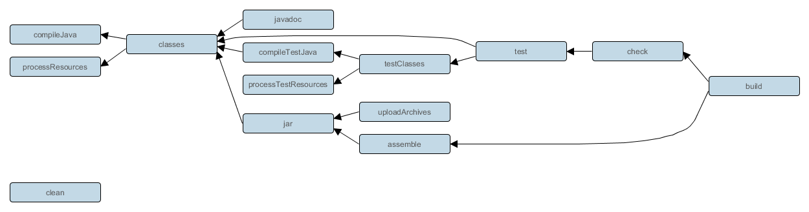

# Gradle 从入门到精通

Java 构建Gradle 逐渐出现在各个开源软件中，特别是Android平台。虽然工具无对错用的好即可，但是美帝亡我之心不死，从ANT（纯手动）到MAVEN（套餐模式）再到Gradle（半自动步枪），每一次都是赤裸裸的学习成本。为了跟上Google大爷的脚步，也只能委屈自己了。

本文将从几个方面介绍Gradle：

1. Groovy介绍
2. Gradle介绍
3. JavaWeb构建
4. Android构建

## Groovy

Groovy 是JVM上的一门语言，**兼容Java**，并且具有脚本语言的特性，相当于JAVA的扩展语言。这里将从这几方面介绍Groovy：

1. Groovy基础
2. 语法介绍

### Groovy基础

Groovy的安装比较简单，仅仅几步就完成了：

1. 下载JDK，和GDK（Groovy SDK）。
2. 配置JAVA_HOME,GROOVY_HOME,以及PATH指向bin中。
3. 测试是否安装Ok，可以输入 groovy -e "println 'hello groovy'" 测试

通常在使用Groovy的时候，一份API文档是相当重要的[GroovyAPI](http://docs.groovy-lang.org/latest/html/gapi/)。

比如说Groovy的所有对象都集成GroovyObject，通过查看API文档，就可以知道几个非常重要的方法：

这些方法都是比较重要的，涉及到动态语言的特性。如

> getProperty(String s) -> Groovy动态属性读取API
> setProperty(String s,Object o) -> Groovy动态属性设置API

通过这两个API，就可以在**运行时动态添加/读取属性**，并且也**加强了闭包作用域的动态性。**

### 语法介绍

Groovy 是一门兼容Java的语言，并且在Java的语言基础上添加了一些动态语言的特性。**Groovy可以看成是Java的扩展集合。**接下来，将会介绍一些Groovy特有的语法特性，这些特性在Gradle中大范围的被使用，了解这些语法，利于对Gradle的学习。

#### 变量

Groovy 支持类型推断，也就是定义变量的时候，不需要指定类型，统一使用**def**即可，如：

    def name = "DARKGEM";

当然也可以采用：

    String name = "Hello World";

来定义变量了。

#### 分号

**Groovy支持语句最后面不用添加分号(;)**

    def w1 = "Hello World";
    def w2 = "Hello World"

这两句语句是等价的。

#### 函数

##### 参数类型无需声明

在Groovy中，函数的参数也可以不定义它的类型，而是采用直接声明变量名即可，如：

    void say1(content){
        println content;
    }

    void say2(String content){
        println content;
    }

上面两个函数是等价的。

##### 返回类型无需指定

Groovy的函数，其实也不需要指定函数返回类型，通过**def**定义函数即可，如：

    def add(a,b){
        return a+b;
    }

    int add(a,b){
        return a + b
    }

它们是等价的

##### return语句

Groovy 的函数，其实也不需要return关键字，它会将最后一句的运行结果表达式，作为return的结果，如：

    def add(a,b){
        a + b
    }

    def add(a,b){
        return a + b
    }

它们是等价的。

##### 函数调用

Groovy中对函数的调用，有时候(至少存在一个参数)可以**省略括号**，这个特性使得Gradle脚本看起来更像是DSL了。如：

    println "NO () CALL"
    println("NO () CALL")

它们是等价的。

但是有时候，是不能省略括号的

    def func(){
        println 'i am function'
    }

    func()//success
    func//error

因为func函数没有参数，所以调用的时候，如果省略了括号，**则func会被认为是属性。**所以只能采用func()调用方式。

#### 注释

Groovy的注释和Java一样，支持 // 和 /\*\*/ 的写法,如：

    // 这是单行注视
    /**
        这
        是
        多
        行
        注
        释
    */

#### 字符串

Groovy 支持Java字符串，也支持**动态推断[$表达式]**，如：

	def name = 'DARKGEM'

	println 'I am $name'
	println "I am $name"
	println "I am ${name}"
	println "1 + 2 = ${1+2}"
	println '''
		SELECT
			*
		FROM
			T_USER
	'''
输出结果为：

#### 可空语法(optional)

在Java中，最讨厌的就是空指针的处理了，而groovy提供了比较优雅的判断空值的语句(?)，如：

    option?.call() -> 其中option可能是空指针对象

通过这种语句，就可以当option==null的时候，不进行调用call方法，避免抛出NullPointException。

#### 集合

在Groovy中，优化了对集合的操作，避免了一些比较丑陋的语法出现。

##### List

通过Groovy的语法特性，可以非常简单的对List进行初始化和操作

    def list = [1,2,3,"4"] //初始化为ArrayList对象，而非 Object[] 对象类型
    println list[3]  == '4' // 直接读取数组元素
    println list.join(",") == '1,2,3,4' // 支持join操作
    println list.count(2) == 1 // 统计List中数值为2的元素个数
    list[99] = '100' //直接赋值到第100的位置
    println list.size ==  100 // 此时List对象的元素为100个

##### Map

Groovy对Map类型，提供了非常简单易用的语法特性：

    def map = [:] //声明了map对象
    def map = [key1 : 'val1' , 'key2' : 'val2'] //初始化map对象
    println map.key1 == 'val1' // 读取key1元素
    println map["key1"] == 'val1' //读取key1元素,注意[]里面需要为字符串
    map.key1 = 'change val1' // 修改key1的元素
    map.key3 = 'val3' //添加新元素

如果一个函数的参数为Map类型，那么可以采用如下的方式调用：

    def func(Map m){
        println m
    }

    func key1:'val1', key2:'val2' //免去了() 以及[]

    func([key1:'val1',key2:'val2']) //完整的调用格式

##### Range

在Groovy中，支持Range类型，比如说

    1..3 // 1-3 
    1..<5 // 1-4

这种写法，通常和迭代合起来用。

#### 闭包

Groovy中最具有代表性的语法特性就是**闭包(closure)**，闭包在Groovy中是一等公民。通过闭包，我们可以省略很多代码。我们看一下闭包最基本的写法：

    def c = {
        println "it's closure"
    }
    c(); // it's closure

仅仅通过**{}**就编写出一个闭包，非常的方便。而闭包的语法结构为：

    {
        [param][,param]->code
    }

的格式。其中，**默认参数的关键字为it**。如：

    def c = {
        println it
    }
    c('hello') // hello

返回的结果和函数一样可以通过return指定，也可以默认采用最后一句表达式的运行结果。如：

    def c ={
        1 +2
    }
    def c = {
        return 1+2
    }

是等价的。

而闭包的调用，通常有三种方法：

1. closure(args); //调用了闭包对象的call方法
2. closure.call(args);  //调用闭包的call方法
3. **closure 'callMe'** //省略了括号，并且调用了闭包的call方法

而如果**函数的参数为闭包**的话，就形成了如下的语法格式：

    def func(Closure c){
        c()
    }

    func {
        println 'run closure'
    }

是不是和Gradle的脚本非常的类似。

#### 迭代

Groovy对迭代，提供了非常NB的支持，如：

    println '-------------list-----------'
    def list = [1,2,3,4]
    list.each {
        println it
    }
    println '-------------map--------------'
    def map = [k1:'v1',k2:'v2']
    map.each{k,v->
        println "$k:$v"
    }
    println '-----------number range------------'
    for(def i in 1..4){
        println i
    }
    println '-----------char range------------'
    for(def i in 'a'..'d'){
        println i
    }

运行结果：

#### Groovy类

Groovy是支持类的，并且还具有自己的特性：

1. 所有的属性/方法，默认为public访问属性
2. 所有的属性/方法，都可以通过**def**定义
3. 默认添加get/set方法，以及默认的构造函数

见一个类的声明：

	class DGM{
		def a
		def b
		//add
		def add(){
			println "a + b = ${a + b}"
		}
	}

	DGM rhs = new DGM(a:1,b:2) //初始化，注意不能省略括号
	rhs.add(); //调用方法
	println rhs.a //访问a属性，是通过内置函数getA()实现
	println rhs.getA() //访问内置函数getA

运行结果为：

**通过javap查看groovyc编译成字节码后的DGM.class文件**，可以看到默认的方法：

##### 对象调用

对象也可以像函数一样被调用 a();

	class A{
		public Object call(Object... args){
			println 'callMe'
		}
	}

	A a = new A()

	a()

运行结果：

##### 操作符重载

Groovy支持一个重要的特性就是操作符重载了，通过这个特性，可以非常方便的完成一些常用的操作，如List读取某个元素的数值等。**下面介绍leftShift(<<)的重载**：

    def list = [1,2,3,4]
    list << 5 //添加5到list中
    list << 6 //添加6到list中
    println list

运行结果为：

可以发现，**在gradle中经常出现task <<写法，其实就是重载了leftShift函数。**

##### 动态属性和delegate机制

Groovy是一门动态语言，它支持动态属性。

	class A{
		def prop = [:]

		void setProperty(String propertyName, Object newValue){
			prop[propertyName] = newValue
		}

		Object	getProperty(String propertyName){
			return prop[propertyName]
		}
	}

	A a = new A()
	a.a = 1;
	println a.a

运行截图：

可以发现：**通过重载GroovyObject#setProperty/getProperty就实现了动态属性的特性。这个特性在Gradle经常被使用。**

这个特性，结合闭包的delegate机制，就可以改变闭包的作用域。如：

	class A{
		def prop = [:]

		void setProperty(String propertyName, Object newValue){
			prop[propertyName] = newValue
		}

		Object	getProperty(String propertyName){
			return prop[propertyName]
		}
		def func (Closure c){
			c()
		}
	}

	def closure = {
		//运行函数
		func {
			println 'run closure'
		}
		//通过动态属性，设置新的属性
		newProperty = 'newValue'

	}
	//指向A对象
	closure.delegate = new A()
	//作用域优先采用delegate
	closure.setResolveStrategy Closure.DELEGATE_FIRST
	//运行
	closure()
	//读取闭包中设置的属性
	println closure.delegate.newProperty

运行结果：

**通过这种方法，Gradle就可以动态的加载插件/任务/配置属性，并且可以直接调用方法/属性。**

#### 调用语法

针对调用的语法：

    func('arg1','arg2') 

也可以省略括号（为函数的时候，参数需要多余一个）

    func '1','2'

若函数的时候没有参数，则需要添加括号

    func()

如果编写如下格式的语法，则认为是查询属性

    func //查询属性，而非调用

**这点和shell语法有极大的不同。**

groovy的处理调用方式如下：

1. 首先会提取func名称，查询当前作用域是否存在该名称的属性
2. 如果存在属性，则会调用该属性的call方法**（闭包，自定义类的call方法）**
3. 如果不存在属性，则会调用invokeMethod方法，查询到合适的方法，然后进行调用。
4. 如果都不存在，则抛出异常

### Groovy总结

三言两语，还是比较难全面的介绍Groovy语言的，但是通过上面这些语法特性，基本上可以让初学者能读通Gradle脚本了。如果要深入的使用Gradle，那么加强Groovy语言的学习也是有必要的。这里给几点意见：

1. 编写完Groovy脚本后，可以通过**groovyc**来编译，获取class文件，然后反编译(jd-gui/javap)查看groovy是如何转换为java语言的，加深的groovy语言的理解。

2. api手册不离手，多看看javadoc。

## Gradle

### 简介

>Gradle是一个基于Apache Ant和Apache Maven概念的项目自动化建构工具。它使用一种基于Groovy的特定领域语言(DSL)来声明项目设置，抛弃了基于XML的各种繁琐配置。

>面向Java应用为主。当前其支持的语言限于Java、Groovy和Scala，计划未来将支持更多的语言。

>**gradle对多工程的构建支持很出色，工程依赖是gradle的第一公民**

>BY 百度百科

### 安装和命令

#### 安装
Gradle的安装非常的简单，只需要如下几步既可以完成：

1. 下载JDK，配置好JAVA_HOME，以及添加bin到PATH中
2. 下载Gradle，配置好GRADLE_HOME,以及添加bin到PATH中
3. 测试Gradle是否安装成功，在CMD下输入 gradle -v 进行测试

运行截图：

#### 常用指令

1. gradle --help 查看支持的指令
2. gradle tasks [--all]查看可执行的任务
3. gradle projects 查看所有的项目
4. gradle dependencies 查看依赖
5. gradle ProjectA:TaskA 多项目，**注意使用冒号:**

**注意Gradle支持任务简写：**比如说存在两个任务 assembleDebug 和 assembleRelease， 我们不需要全部输入，只需要输入 gradle assD即可运行 assembleDebug 任务。

### 基本概念

Gradle 是一门基于Groovy语言的构建框架。gradle支持ant，maven构建方式，并且和ide能比较完美的整合。

#### Project Task概念

一个 Gradle 构建项目是由若干个project组成，而一个project是由若干个task组成。

**Project概念针对某一个构建项目**。一个Project包含了若干Task, 依赖关系，配置属性等。通常Project经过一系列过程后会产出构建成品，如jar，war等。**注意：Gradle允许项目依赖**

**而Task是属于Project的，通过一系列的Task组合，我们可以构建一个项目。**比如说：Project要输出一个jar，那么task一般有编译，打包等。通过组合task，完成了最终产出jar的构建。

任务之间通过**dependsOn**来决定构建依赖。比如说debug依赖classes任务，则调用gradle debug的时候，会**优先执行classes任务**。如下图：

通常我们说的**构建**，就是通过指定某一个项目下（多项目）的某个task（build）来执行一系列的构建task，最终获取想要的结果，如jar，war。

#### 项目结构

一个gradle项目的基本结构为：

##### 单项目结构

##### 多项目结构

**其中，setting.gradle 为: include 'ProjectA','ProjectB' 来指示包含的项目**

#### build.gradle 和 settings.gradle

build.gradle 文件是描述项目是如何构建的关键。通常这个文件描述了项目引用的插件（插件包含了某种特定类型的构建任务集合，如java，android），任务配置（源码位置，依赖关系），第三方仓库等信息。

settings.gradle 文件通常是描述项目中的一些基本配置，如通用的task，**在多项目构建中settings.gradle 还需要描述被包含的项目。**

#### 构建流程

gradle 的构建流程，一般会按照如下的过程：

1. 初始化阶段：初始化gralde运行环境。
2. 配置阶段：依次读取build.gradle等文件，然后运行它们。**注意：buildscript{}等会优先执行，即使在build.gradle最后面编写。**tips：通过Gradle的自定义语法解析器实现。
3. **计划执行阶段：此时已经获取了所有项目的依赖关系和task依赖关系，就可以生成执行路径图。**
4. 执行阶段：根据执行路径图，执行不同项目的task直到最后完成构建过程

**在各个阶段，我们可以通过Gradle提供的Hook API进行截取。如：gradle.taskGraph.whenReady**

### Hello World

现在，我们来实际编写一些gradle脚本，加深理解。

#### 创建脚本

首先，我们建立一个文件夹命名为gradle
然后，在目录下创建一个build.gradle的文件
最后，在build.gradle中输入：

	//定义hello这个任务
	task hello << {
		println 'Hello'
	}
        /**
            可以发现，上面的task，利用了操作符重载，其重载的API还是doLast。
            task hello {
                doLast{
                    println 'Hello'
                }
            }
        */
	//定义world任务，并且依赖hello任务
	task world(dependsOn:hello) <<{
		println 'World'
	}

#### 执行脚本

我们可以通过gradle tasks 查看所有被支持的任务，发现我们刚刚添加的任务已经出现在任务列表中了。
我们在gradle/目录下，执行** gradle world **命令，运行结果为：

#### 动态任务

gradle 支持动态任务，也就是说，我们可以在脚本运行的时候，定义任务：

	5.times {
		task "task$it" <<{
			println "$it"
		}
	}

运行命令 gradle tasks 查看所有的任务：

#### task自定义属性

我们可以在task中，添加一些我们自定义的属性

    task hello {
        ext {
            mark = 'darkgem'
        }
    }
    println hello.mark

运行结果：
    

这个实现的原理就是**Groovy的动态属性**。

#### 默认任务

我们可以指定gradle的默认任务，如：

	defaultTasks 'run'

	task compile <<{
		println 'compile...'
	}

	task run(dependsOn:compile) <<{
		println 'run....'
	}

这样子，我们直接输入 gradle 就直接执行 run task:

#### Hook API 使用

Gradle 在不同阶段准备完成后，会执行Hook API，让用户可以有机会修改某些流程或者配置等，比如说：

    task distribution << {
        println "We build the zip with version=$version"
    }
    task release(dependsOn: 'distribution') << {
        println 'We release now'
    }
    gradle.taskGraph.whenReady {taskGraph ->
        if (taskGraph.hasTask(release)) {
            version = '1.0'
        } else {
            version = '1.0-SNAPSHOT'
        }
    }

运行结果：

可以发现不同的任务，就出现了不同的执行结果。

#### 多项目

现在，来介绍一下多项目构建。目录结构为：

settings.gradle:

    include 'ProjectA','ProjectB'

ProjectA#build.gradle

	task taskA <<{
		println 'taskA'
	}

ProjectB#build.gradle

	task taskB <<{
		println 'taskB'
	}

执行gradle tasks -all 结果为：

#### task语法分析

我们可以发现，gradle 的task语法和之前我们介绍的groovy语法有些区别，如：

    task first<<{
	println 'first'
    }
    task hello(dependsOn:'first') {
        println 'hello'
    }

这种写法，使用groovy语法的标准，无法分析出task到底是什么东西。其实呢，gradle为了脚本写的好看，做了一些特别的工作。 上述的语句，在gradle分析脚本后，会转换为：

    task('first',{
        doLast{
            println 'hello'
        }
    })
    task('hello',{
        dependsOn 'first'
	println 'hello'
    });

这种格式。这样子，一切就真相大白了。**说白了就是gradle实现了自己的语法糖。**而通过后面的闭包，配置了这个task的属性，如依赖，后置处理等。**这个原理涉及到Groovy的delegate机制。**

### 依赖管理

#### repositories{}

通过 repositories{} 可以配置maven，ivy，local仓库。这样子，在dependencies{}声明的依赖就可以通过repositories{}中指定的仓库查询到具体的JAR资源。

#### configurations{}

configurations{} 记录着项目中各个分组（compile,runtime）的依赖信息。**这些依赖信息来自于：引用的插件，dependencies{第三方库},sourceSets{源码}，自定义配置，任务的构建产品（JAR）等。**如下是一个简单的自定义分组信息：

    configurations.create('myCompile')
    dependencies{
        myCompile fileTree('lib')
    }

这样子，我们就声明了一个名字为myCompile的依赖分组。

configurations{}主要的作用在于：

1. 项目编译的时候，需要依赖这个分组来获取指定的资源(JAR,XML，Java等)。
2. 多项目编译的时候，dependencies#configurationName project(path: ':projectA', configuration: 'someOtherConfiguration')，**默认configuration为default。**

注意：如compile，runtime 之类的configuration已经默认的被添加到java插件中，所以一般情况下不要使用这几种configuration。

#### dependencies{}

**在gradle中dependencies{}是一等公民**，它描述了configurations{}中分组依赖的第三方资源。我们可以把依赖简单的分成两大类：

1. gradle依赖：主要是gradle运行的时候，需要加载一些插件，如android等，此时需要配置它。

2. 项目编译/运行依赖：编译一个项目，通常需要依赖其他项目或者JAR。

##### gradle依赖

gradle依赖指定，通常在buildscript{}模块中声明，如果是一个多项目构建，则只需要在root目录下的build.gradle中添加gradle依赖即可。比如说，android gradle依赖支持：

	buildscript {
		repositories {
			mavenCentral()
		}
		dependencies {
			classpath 'com.android.tools.build:gradle:1.5.0'
		}
	}

这样子就配置好了gradle的运行依赖，在使用的时候，调用 apply plugin: 'android' 既可以引入android插件。

##### 项目依赖

在编译项目的时候，也经常出现依赖外部JAR，项目等情况。此时，我们只需要配置 dependencies 即可引入JAR。

	dependencies {
		//for dependencies found in artifact repositories you can use
		//the group:name:version notation
		compile 'commons-lang:commons-lang:2.6'
		testCompile 'org.mockito:mockito:1.9.0-rc1'

		//map-style notation:
		compile group: 'com.google.code.guice', name: 'guice', version: '1.0'

		//declaring arbitrary files as dependencies
		compile files('hibernate.jar', 'libs/spring.jar')

		//putting all jars from 'libs' onto compile classpath
		compile fileTree('libs')
		// dependencies project
		compile project(':someProject')
		//dependencies project and select configuration
		configurationName project(path: ':projectA', configuration: 'someOtherConfiguration')

	}

一个Java项目，通常依赖的关系如上图描述。值得注意的是，依赖仓库的JAR写法：

这种写法，和MAVEN一致。

### gradle脚本编写

在编写gradle脚本的时候，网上的配置有时候不能解决你手头的问题，所以我们需要求助于Gradle文档。

首先，我们需要理解，一个gradle脚本经过处理后其实最后就是一个Groovy的脚本，区别点为：

1. gradle脚本中task具有语法糖。
2. gradle脚本通过**groovy的delegate和动态属性**，实现了作用域为一条对象链，该对象链包括了Project，Java Plugin等。

理解了这两点，我们就基本上可以抱着API编写脚本了。下面将介绍gradle脚本如何和Gradle文档对应起来。

        build.gradle

        //此时作用域链为Project
        //调用 Project#apply(Map map) 方法
    	apply plugin: 'java' 
        /**
            语法糖 task('hello',{ 
                //此时，作用域链为Task
                doLast { // 调用Task#doLast方法
                    println 'hello'
                }
            })

        */
        task hello { 
            doLast{
                println 'hello'
            }
	}

翻阅Gradle的文档（DSL，Javadoc），我们可以查询到其他有用的API来支持我们的gradle编程。

### gradle总结

本小节大致的描述了一下gradle这个构建工具，并且和groovy语言做了一下对比。可以发现，gradle脚本就是groovy的脚本。

## JavaWeb构建

一个JavaWeb的项目构建和一个普通Java项目的构建最大的区别在于：**JavaWeb有固定的目录结构**。如图：

所以，我们只要把项目构建的结果class存放到classes/目录下，就是一个标准的JavaEE项目了。

接下来，我们来看看Gradle提供的Java plugin的任务流程:

可以发现，我们其实仅仅需要** classes task **即可完成对编译完成的class输出。

构建项目目录，该项目的目录类似eclipse提供的JavaEE目录结构：

而构建的脚本如下：

        //使用Java插件
	apply plugin: 'java'

	//配置编译选项
	compileJava {
                options.encoding = 'UTF-8'
                sourceCompatibility = "1.6"
                targetCompatibility = "1.6"
	}

	//配置源码信息
	sourceSets {
		main {
                        //指定main的源码输出位置
			output.resourcesDir = output.classesDir = 'WebContent/WEB-INF/classes/'
                        //源码目录
			java.srcDir('src')
                        //资源文件目录
			resources.srcDir('src')
		}
	}
	//配置依赖
	dependencies {
                //LIB依赖
		compile fileTree('WebContent/WEB-INF/lib/')
                //servlet api依赖
		compile fileTree('jetty/')
	}

	//动态生成任务
	({
		//属性配置和
		def props = [
				JDBC_CLASS_NAME  : ['com.mysql.jdbc.Driver', 'com.mysql.jdbc.Driver'],
				JDBC_URL         : ['jdbc:mysql://localhost:3306/test?useUnicode=true&amp;characterEncoding=UTF-8', 'jdbc:mysql://localhost:3306/test?useUnicode=true&amp;characterEncoding=UTF-8'],
				JDBC_USR         : ['root', 'root'],
				JDBC_PASSWD      : ['root', 'root'],
				JDBC_MAX_ACTIVE  : [10, 10],
				JDBC_INITIAL_SIZE: [1, 1],
				JDBC_MIN_IDLE    : [5, 5]
		]
		//动态生成任务的名称，注意 props里面的属性和这个序列对应
		['debug', 'release'].eachWithIndex { val, idx ->
			task "$val"(dependsOn: 'classes') << {
				//将配置信息，写入指定文件中
				Properties properties = new Properties()
				File file = new File(sourceSets.main.output.resourcesDir, 'project.properties')
				OutputStream fos = new FileOutputStream(file)
				props.each { key, value ->
					properties.setProperty(key, String.valueOf(value[idx]))
				}
				properties.store(fos, String.format("mode=%s", val));
			}
		}
	})();

通过这个脚本，我们可以构建出一个JAVAEE的项目，并且该脚本支持生产环境和测试环境不同配置的特点。而脚本中的API调用都来自于Gradle Java DSL Plugin的描述。

项目地址：[javaee-framework](http://git.oschina.net/darkgem/javaee-framework)

## Android构建

在 Google I/O 2013 大会上，发布了一款新的Android工具--Android Studio 以及 Gradle 后，eclipse 和 ant 逐渐被google 抛弃了。现在android小组的构建工具都采用gradle，并且它对应的插件目前版本已经2.0了。

### 构建Hello World

通过gradle构建android项目是非常简单的。首先创建项目：

>android create project  -n Demo -a MainActivity -k org.darkgem -v 1.5.0 -t android-15 -g -p .

这样子就创建了一个简单的android gradle 项目。

但是因为gradle的版本兼容性的问题，所以我们还需要修改一下**build.gradle**脚本:

        //gradle初始化的时候，需要加载的资源指定
	buildscript {
		repositories {
			mavenCentral()
		}
                //加载android gradle 插件JAR
		dependencies {
			classpath 'com.android.tools.build:gradle:1.5.0'
		}
	}
        //加载android 插件
	apply plugin: 'android'

	android {
                //配置android sdk版本
		compileSdkVersion 'android-15'
                //配置编译工具版本
		buildToolsVersion '23.0.2'
	}

然后我们运行指令**gradle build**，进行构建。结果发现异常：

可以发现，在运行task lint的时候，发生了异常，查看lint 报告：

可以发现，其实是因为local.properties文件中关于sdk.dir写法出现问题，我们修改一下就可以了：

    sdk.dir=D:\\Link\\android-sdk -> sdk.dir=D\:\\Link\\android-sdk

再次运行**gradle build**就可以执行成功了。其输出的apk在：

### 关于lint

android lint是一款静态代码检测工具，通过lint可以在编译期就可以发现许多问题，如调用太新的API等。这个检测是相当有必要的。所以不建议在脚本中添加：

    	android {
		lintOptions {
			abortOnError false
		}
	}

这会导致lint检测无效。

**值得注意的是：在Android Studio中，如果点击Debug按钮进行调试，是不会运行**task lint**的，所以需要用户手动的调用 task lint，使得在开发的时候，就知道问题出现在哪里。**

### sourceSets

gradle不像maven一样，源码和目录这些都是固定位置的，我们可以通过配置，修改默认位置：

	sourceSets{
		main.setRoot('app')
	}

这样子就把mian目录，从默认位置的 src/main/ 提取到了 app下面。还可以配置其他的一些文件和目录：

	sourceSets {
		main {
                        //mainifest文件
			manifest.srcFile 'AndroidManifest.xml'
                        //源码目录
			java.srcDirs = ['src']
                        //源码资源目录
			resources.srcDirs = ['src']
                        //aidl目录
			aidl.srcDirs = ['src']
                        //layout等资源目录
			res.srcDirs = ['res']
                        //assets目录
			assets.srcDirs = ['assets']
                        //SO文件目录
                        jniLibs.srcDirs = ['libs']
		}
	}

这样子，就讲该android项目的源码目录结构变成和eclipse一样了。

### 依赖管理

android gradle的依赖管理和java一样，只需要配置好 repositories{} 和 dependencies{} 即可。如：

	//配置仓库
	repositories {
		mavenCentral()
	}

	//配置依赖
	dependencies {
		//按照maven名称加载jar
		compile 'com.google.guava:guava:11.0.2'
		//加载目录下所有的jar
		compile fileTree(dir: 'libs', include: ['*.jar'])  //多个文件
	}

### 签名

android的构建必不可少的就是签名了，通过签名。一般签名分为两种：DEBUG 和 RELEASE ，所以一般只需要两种类型的签名即可:

	android{
		signingConfigs {
			debug {
				storeFile file("debug.keystore")
			}
			release {
				storeFile file("release.keystore")
				storePassword "darkgem"
				keyAlias "release"
				keyPassword "darkgem"
			}
		}
	        buildTypes {
                    //release类型配置
		    release { 
                        //指定使用哪个签名配置
			signingConfig signingConfigs.release
		    }
	        }
	}

值得注意的是DEBUG签名是固定格式的：

1. key-alias 必须为androiddebugkey
2. keystore 与key alias的密码必须为android

通常，我们只需要拷贝~/.android/debug.keystore 即可。

### 代码混淆

为了保护我们的代码，通常在发布版本的时候进行代码混淆处理：

	buildTypes {
		release {
			minifyEnabled true
			proguardFile 'proguard-project.txt'
		}
	}

这样子就在release的时候进行代码混淆了。

值得注意的是：

1. 编程中，不要使用JSON<->Object的变化，这非常容易导致混淆后，属性无法使用。
2. 混淆完成后，会出现mapping文件，我们需要保留它，在追踪异常的时候，通过它来寻找到真实代码错误点。

### 完整脚本

下面给出一个比较完成的脚本，充分的考虑的测试环境和发布环境配置等：

	//gradle初始化脚本
	buildscript {
		//第三方仓库
		repositories {
			mavenCentral()
		}
		//android gradle plugin 插件依赖
		dependencies {
			classpath 'com.android.tools.build:gradle:1.5.0'
		}
	}
	//使用android 插件
	apply plugin: 'android'

	android {
		//sdk 版本
		compileSdkVersion 'android-15'
		//构建工具版本
		buildToolsVersion '23.0.2'
		//源码配置
		sourceSets{
			main.setRoot('app')
		}
		//签名配置
		signingConfigs {
			debug {
				storeFile file("debug.keystore")
			}
			release {
				storeFile file("release.keystore")
				storePassword "darkgem"
				keyAlias "release"
				keyPassword "darkgem"
			}
		}
		//构建类型
		buildTypes {
			//测试版本
			debug{
				//测试版本对AndroidMainfest.xml 中关键字替换
				//UMENG
				manifestPlaceholders = [UMENG_APPKEY: "56947a48e0f55a0635002c3a", UMENG_CHANNEL : "DARKGEM"]
				//在 BuildConfig中，添加自定义的属性
				//BUILD CONFIG
				buildConfigField "String", "MAIN_API_URL", "\"http://darkgem.org/api/v1/\""
			}
			//发布版本
			release {
				//开启混淆处理
				minifyEnabled true
				//签名引用
				signingConfig signingConfigs.release
				//混淆文件
				proguardFile 'proguard-project.txt'
				//发布版本对AndroidMainfest.xml 中关键字替换
				//UMENG
				manifestPlaceholders = [UMENG_APPKEY: "56947a48e0f55a0635002c3a", UMENG_CHANNEL : "DARKGEM"]
				//在 BuildConfig中，添加自定义的属性
				//BUILD CONFIG
				buildConfigField "String", "MAIN_API_URL", "\"http://darkgem.org/api/v1/\""
			}
		}
		//javac 配置
		compileOptions {
			encoding 'UTF-8'
			sourceCompatibility JavaVersion.VERSION_1_6
			targetCompatibility JavaVersion.VERSION_1_6
		}
	}
	//依赖
	dependencies {
		compile fileTree(include: ['*.jar'], dir: 'app/libs/')
	}

项目地址：[android-framework](https://git.oschina.net/darkgem/android-framework)

### android多项目构建

现今，许多android开源项目都开始使用gradle进行构建了。特别是support-v7包中的View类。如果直接进行拷贝引入，你会发现非常的困难。此时，我们需要借助gradle多项目编译了。其方法和之前介绍的gradle多项目一样。

值得注意的点有：

1. 因为最新的support-v7包是用最新的sdk编译的，所以，如果你使用旧版本的sdk编译项目的话，可能出现资源文件无法解析之类错误。此时，你需要把sdk提供到最新即可。

2. 通常，我们只需要在root/build.gradle中引入android gradle插件依赖，不需要每一个build.gradle都引入一次android gradle plugin的依赖。

3. 多项目中，引入插件的时候，需要区分application和library。

## 总结

这篇文章断断续续的写了三天，算是把gradle基础概念学习了一遍。得到最重要的经验就是：多看文档。

## 参考

[GroovyAPI](http://docs.groovy-lang.org/latest/html/gapi/)

[精通 Groovy](http://www.ibm.com/developerworks/cn/education/java/j-groovy/j-groovy.html)

[groovy–运算符重载](http://www.cnblogs.com/rollenholt/archive/2013/10/02/3349047.html)

[gradle javadoc](https://docs.gradle.org/current/javadoc/) 

[gradle dsl](https://docs.gradle.org/current/dsl/) 

[gradle java plugin](https://docs.gradle.org/current/userguide/java_plugin.html)

[Gradle 使用指南](http://wiki.jikexueyuan.com/project/gradle/)

[深入理解Android之Gradle](http://blog.csdn.net/innost/article/details/48228651)

[使用Gradle构建Android项目](http://my.oschina.net/sammy1990/blog/268813?fromerr=wYavdSk9)

[android gradle dsl](http://google.github.io/android-gradle-dsl/current/)

[Gradle在大型Java项目上的应用](http://www.infoq.com/cn/articles/Gradle-application-in-large-Java-projects)