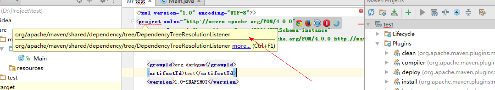
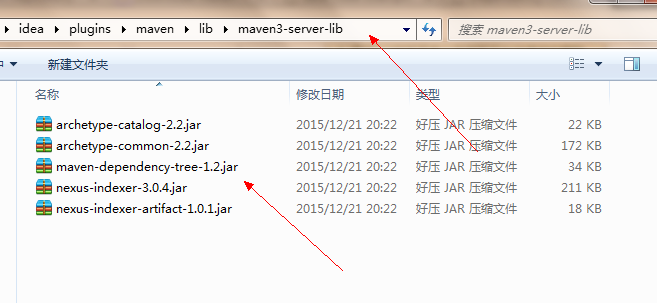
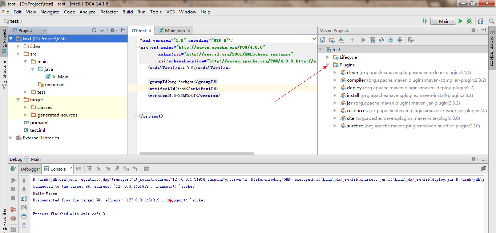

# IntelliJ IDEA 无法识别maven问题（解压版本）

今天，在使用idea的时候，发现maven无法被使用，报错`DependencyTreeResolutionListener`。
而安装版本的idea可以使用maven。非常的疑惑。问题如图：



非常的诡异。然后，我们查看idea的log(**位于用户目录/idea/搜索log关键字**)，看看是啥问题：

```

2016-03-22 23:59:08,554 [  16505]   INFO -      #org.jetbrains.idea.maven - org/apache/maven/shared/dependency/tree/DependencyTreeResolutionListener 
java.lang.NoClassDefFoundError: org/apache/maven/shared/dependency/tree/DependencyTreeResolutionListener
    at org.jetbrains.idea.maven.server.Maven30ServerEmbedderImpl.resolveProject(Maven30ServerEmbedderImpl.java:339)
    at sun.reflect.NativeMethodAccessorImpl.invoke0(Native Method)
    at sun.reflect.NativeMethodAccessorImpl.invoke(NativeMethodAccessorImpl.java:62)
    at sun.reflect.DelegatingMethodAccessorImpl.invoke(DelegatingMethodAccessorImpl.java:43)
    at java.lang.reflect.Method.invoke(Method.java:497)
    at sun.rmi.server.UnicastServerRef.dispatch(UnicastServerRef.java:323)
    at sun.rmi.transport.Transport$1.run(Transport.java:200)
    at sun.rmi.transport.Transport$1.run(Transport.java:197)
    at java.security.AccessController.doPrivileged(Native Method)
    at sun.rmi.transport.Transport.serviceCall(Transport.java:196)
    at sun.rmi.transport.tcp.TCPTransport.handleMessages(TCPTransport.java:568)
    at sun.rmi.transport.tcp.TCPTransport$ConnectionHandler.run0(TCPTransport.java:826)
    at sun.rmi.transport.tcp.TCPTransport$ConnectionHandler.lambda$run$256(TCPTransport.java:683)
    at java.security.AccessController.doPrivileged(Native Method)
    at sun.rmi.transport.tcp.TCPTransport$ConnectionHandler.run(TCPTransport.java:682)
    at java.util.concurrent.ThreadPoolExecutor.runWorker(ThreadPoolExecutor.java:1142)
    at java.util.concurrent.ThreadPoolExecutor$Worker.run(ThreadPoolExecutor.java:617)
    at java.lang.Thread.run(Thread.java:745)
Caused by: java.lang.ClassNotFoundException: org.apache.maven.shared.dependency.tree.DependencyTreeResolutionListener
    at java.net.URLClassLoader.findClass(URLClassLoader.java:381)
    at java.lang.ClassLoader.loadClass(ClassLoader.java:424)
    at sun.misc.Launcher$AppClassLoader.loadClass(Launcher.java:331)
    at java.lang.ClassLoader.loadClass(ClassLoader.java:357)
    ... 18 more
    
```

结果发现，是没有加载一个类。可能是因为安装版本的idea默认添加了这个类把。查查这个类到底是哪个jar的。

通过：`http://www.java2s.com/`一些常见的`java.lang.NoClassDefFoundError`异常JAR。

```

Files contained in maven-dependency-tree-2.0.jar: 
 
META-INF/DEPENDENCIES
META-INF/LICENSE
META-INF/MANIFEST.MF
META-INF/NOTICE
META-INF/maven/org.apache.maven.shared/maven-dependency-tree/pom.properties
META-INF/maven/org.apache.maven.shared/maven-dependency-tree/pom.xml
META-INF/plexus/components.xml
org.apache.maven.shared.dependency.graph.DependencyGraphBuilder.class
org.apache.maven.shared.dependency.graph.DependencyGraphBuilderException.class
org.apache.maven.shared.dependency.graph.DependencyNode.class
org.apache.maven.shared.dependency.graph.filter.AncestorOrSelfDependencyNodeFilter.class
org.apache.maven.shared.dependency.graph.filter.AndDependencyNodeFilter.class
org.apache.maven.shared.dependency.graph.filter.ArtifactDependencyNodeFilter.class
org.apache.maven.shared.dependency.graph.filter.DependencyNodeFilter.class
org.apache.maven.shared.dependency.graph.internal.DefaultDependencyGraphBuilder.class
org.apache.maven.shared.dependency.graph.internal.DefaultDependencyNode.class
org.apache.maven.shared.dependency.graph.internal.Maven2DependencyGraphBuilder.class
org.apache.maven.shared.dependency.graph.internal.Maven3DependencyGraphBuilder.class
org.apache.maven.shared.dependency.graph.traversal.BuildingDependencyNodeVisitor.class
org.apache.maven.shared.dependency.graph.traversal.CollectingDependencyNodeVisitor.class
org.apache.maven.shared.dependency.graph.traversal.DependencyNodeVisitor.class
org.apache.maven.shared.dependency.graph.traversal.FilteringDependencyNodeVisitor.class
org.apache.maven.shared.dependency.graph.traversal.SerializingDependencyNodeVisitor.class
org.apache.maven.shared.dependency.tree.DefaultDependencyTreeBuilder.class
org.apache.maven.shared.dependency.tree.DependencyNode.class
org.apache.maven.shared.dependency.tree.DependencyTree.class
org.apache.maven.shared.dependency.tree.DependencyTreeBuilder.class
org.apache.maven.shared.dependency.tree.DependencyTreeBuilderException.class
org.apache.maven.shared.dependency.tree.DependencyTreeInverseIterator.class
org.apache.maven.shared.dependency.tree.DependencyTreePreorderIterator.class
org.apache.maven.shared.dependency.tree.DependencyTreeResolutionListener.class
org.apache.maven.shared.dependency.tree.filter.AncestorOrSelfDependencyNodeFilter.class
org.apache.maven.shared.dependency.tree.filter.AndDependencyNodeFilter.class
org.apache.maven.shared.dependency.tree.filter.ArtifactDependencyNodeFilter.class
org.apache.maven.shared.dependency.tree.filter.DependencyNodeFilter.class
org.apache.maven.shared.dependency.tree.filter.StateDependencyNodeFilter.class
org.apache.maven.shared.dependency.tree.traversal.BuildingDependencyNodeVisitor.class
org.apache.maven.shared.dependency.tree.traversal.CollectingDependencyNodeVisitor.class
org.apache.maven.shared.dependency.tree.traversal.DependencyNodeVisitor.class
org.apache.maven.shared.dependency.tree.traversal.FilteringDependencyNodeVisitor.class
org.apache.maven.shared.dependency.tree.traversal.SerializingDependencyNodeVisitor.class

```

可以发现是一个叫做maven-dependency-tree的jar缺少。我们查询一下idea是否自带了这个jar：


可以发现，已经存在这个jar了。不过该JAR在`maven2-server-lib`这个目录下，而我们使用
的是maven3。所以，我们拷贝这个文件到`maven3-server-lib`目录下试试看：



重启IDEA，刷新MAVN，结果就OK了！



所以，解决IDEA无法识别MAVEN3依赖的方法为：

**拷贝\plugins\maven\lib\maven2-server-lib\maven-dependency-tree-1.2.jar到\plugins\maven\lib\maven3-server-lib\maven-dependency-tree-1.2.jar。**

