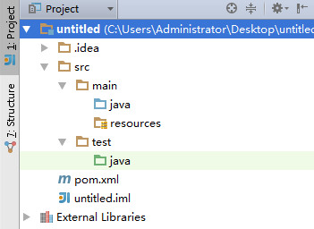

# JUnit

JJUnit是用于编写和运行可重复的自动化测试的开源测试框架， 这样可以保证我们的代码按预期工作。
JUnit可广泛用于工业和作为支架(从命令行)或IDE(如Eclipse)内单独的Java程序。

## 基础知识

JUnit的安装和使用都非常的简单。这里使用**IDEA+Maven**演示。

**创建项目**

使用Idea和Maven创建一个最简单的Java项目：



**添加JUnit4.x依赖**

```
    <dependencies>
        <dependency>
            <groupId>junit</groupId>
            <artifactId>junit</artifactId>
            <version>4.11</version>
        </dependency>
    </dependencies>
	
```

这样子，就算完成了JUnit的基本安装。

**例子**

```java

package app;

import org.junit.*;

import java.util.ArrayList;
import java.util.concurrent.atomic.AtomicInteger;

/**
 * 命名规则为：ClassNameTest
 */
public class AppTest {
    static final AtomicInteger count = new AtomicInteger(0);
    private ArrayList testList;

    /**
     * 每次运行@Test方法，都会实例化一个对象。
     */
    public AppTest() {
        System.out.println(String.format("CONSTRUCT CALL %d", count.incrementAndGet()));
    }

    /**
     * 指定一个静态方法，在所有@Test方法之前，执行一次。
     */
    @BeforeClass
    public static void onceExecutedBeforeAll() {
        System.out.println("@BeforeClass: onceExecutedBeforeAll");
    }

    /**
     * 指定一个静态方法，在所有@Test方法之后，执行一次。
     */
    @AfterClass
    public static void onceExecutedAfterAll() {
        System.out.println("@AfterClass: onceExecutedAfterAll");
    }

    /**
     * 在所有@Test方法之前执行
     */
    @Before
    public void executedBeforeEach() {
        testList = new ArrayList();
        System.out.println("@Before: executedBeforeEach");
    }

    /**
     * 在所有@Test方法之后执行
     */
    @After
    public void executedAfterEach() {
        testList.clear();
        System.out.println("@After: executedAfterEach");
    }

    /**
     * 命名规则：FunctionNameTest
     */
    @Test
    public void EmptyCollectionTest() {
        Assert.assertTrue(testList.isEmpty());
        System.out.println("@Test: EmptyArrayList");

    }

    /**
     * 命名规则：FunctionNameTest
     */
    @Test
    public void OneItemCollectionTest() {
        testList.add("oneItem");
        Assert.assertEquals(1, testList.size());
        System.out.println("@Test: OneItemArrayList");
    }

    /**
     * 忽略这个测试方法
     */
    @Ignore
    public void executionIgnoredTest() {
        System.out.println("@Ignore: This execution is ignored");
    }
}

```

上述是一个非常经典的例子，囊括了JUnit测试对象的**生命周期**。

**运行TestCase**

运行`TestCase`是非常方便的。现在几乎所有的主流IDE（Idea，Eclipse）都支持JUnit。以下是Idea的启动过程：


这样子就开启了调试模式运行`TestCase`。

**运行日志**

```
@BeforeClass: onceExecutedBeforeAll
CONSTRUCT CALL 1
@Before: executedBeforeEach
@Test: EmptyArrayList
@After: executedAfterEach
CONSTRUCT CALL 2
@Before: executedBeforeEach
@Test: OneItemArrayList
@After: executedAfterEach
@AfterClass: onceExecutedAfterAll
```

可以发现，JUnit的**生命周期**和注释保持一致。

## 扩展知识

### @RunWith

使用JUnit的时候，有时候，需要自定义启动器（Runner）。这时候，我们可以通过`@RunWith`注解，来指定当前`TestCase`的Runner。
我们经常使用如下的Runner：

* Suite : 测试套件
* Parameterized : 参数化测试
* SpringJUnit4ClassRunner : Spring针对JUnit4.x的测试框架

### JUnitCore

在没有IDE的情况下，我们可以借助`main函数`，来运行我们的`TestCase`：

```
package runner;

import app.AppTest;
import org.junit.runner.JUnitCore;
import org.junit.runner.Result;
import org.junit.runner.notification.Failure;

public class Main {
    public static void main(String[] args) {
        //通过JUnitCore指定，需要进行测试的TestCase
        Result result = JUnitCore.runClasses(AppTest.class);
        //搜集失败的测试用例信息
        for (Failure fail : result.getFailures()) {
            System.out.println(fail.toString());
        }
        //判断，单元测试是否全部通过
        if (result.wasSuccessful()) {
            System.out.println("All tests finished successfully...");
        }
    }
}

```

这样子，我们就可以通过命令行运行JUnit。

### Suite

在JUnit中，我们可以将几个`TestCase`合并在一起进行单元测试：


通过`@Suite.SuiteClasses()`将几个`TestCase`合并在一起，方便单元测试。

### 异常和超时

在某些情况下，我们需要测试`异常`和`超时`这两种情况。而这是通过`@Test.expected`和`@Test.timeout`来实现的。


```java

    /**
     * expected 期待获取的异常类型
     * timeout 测试用例超时时间
     * */
    @Test(expected = Exception.class, timeout = 1000)
    public void OneItemCollectionTest() throws Exception {
        Thread.sleep(500);
        System.out.println("@Test: OneItemArrayList");
    }
	
```

## Spring 整合


**依赖**

Spring提供了`spring-test`来支持JUnit的测试框架。引入依赖：

```
    <dependency>
        <groupId>org.springframework</groupId>
        <artifactId>spring-test</artifactId>
        <version>${spring-version}</version>
    </dependency>

```

**SpringTest**

**为了避免每个`TestCase`都添加@RunWith等注解，这里引入`SpringTest`方便`TestCase编写`**：

```java

//http://docs.spring.io/spring/docs/current/spring-framework-reference/htmlsingle/#testing

//Spring针对JUnit4.x的支持Runner
@RunWith(SpringJUnit4ClassRunner.class)
//Spring配置类
@ContextConfiguration(classes = {SpringConf.class})
//支持Spring MVC
@WebAppConfiguration
//默认回滚
@Rollback
//默认事务
@Transactional
public abstract class SpringTest {
    
    //Spring 上下文
    @Autowired
    private WebApplicationContext wac;
    //Spring MVC测试支持类
    private MockMvc mockMvc;


    @Before
    public void init() {
        //构造mockMvc
        //不知道为什么Spring小组，不提供MockMvc注解方式@Autowired方式初始化
        mockMvc = MockMvcBuilders.webAppContextSetup(wac).build();
    }
    
    //获取Spring MVC测试支持对象MockMvc
    public MockMvc getMockMvc() {
        return mockMvc;
    }
}

```

这样子，就定义了一个`测试基类`。具体的`TestCase`只需要**继承**这个测试基类即可。

**Spring MVC测试**

```

//继承测试基类
public class ArticleCtrlTest extends SpringTest {
    //路径
    final static String PATH = "/main/ArticleCtrl/";
    
    //支持@Autowired方式
    @Autowired
    ArticleIo articleIo;
    
    
    @Test
    public void getTest() throws Exception {
        final Article article = new Article(null, "测试数据", false);
        //插入一条数据
        articleIo.insert(article);
        //检测接口
        getMockMvc().perform(MockMvcRequestBuilders.post(PATH + "get").param("id", article.getId())).andDo(new ResultHandler() {
            @Override
            public void handle(MvcResult result) throws Exception {
                JSONObject ret = JSON.parseObject(result.getResponse().getContentAsString());
                //ok
                Assert.assertTrue(ret.getInteger("code") == 0);
                //check
                Assert.assertTrue(ret.getJSONObject("msg").getString("id").equals(article.getId()));
            }
        });
    }
    
}

```

以上，就是一个简单的Spring MVC测试用例。对于Dao或者Service测试就更加简单了。

注意：**getTest的事务会进行回滚操作，不会真正的写入数据库。**

**运行截图**


## 源码分析

每次调用@Test，都会新建对象

Spring ApplicationContext 对象复用


## 最佳实践

这里总结一下JUnit最佳实践：

1. 测试目标为：Dao，Service，Controller层。
2. 一个类，一个测试类；一个函数，一个测试函数；
3. 命名规则： ClassNameTest 和 FunctionNameTest。
4. 切勿@Test函数相互调用。
5. 合理使用测试基类（如：SpringTest）。
6. 覆盖率：业务类型>=60%，工具类型>=80%。

## 参考

* [JUnit教程](http://www.yiibai.com/junit/)
* [利用junit对springMVC的Controller进行测试](http://www.tuicool.com/articles/7rMziy)
* [Maven单元测试报告及测试覆盖率](http://www.cnblogs.com/qinpengming/archive/2016/02/28/5225380.html)


