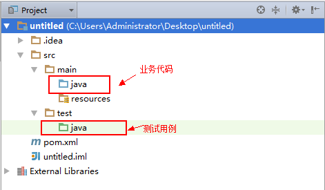
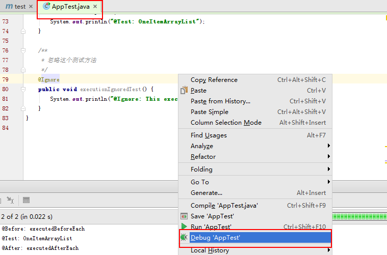
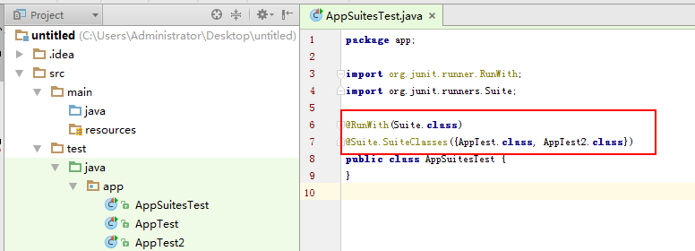
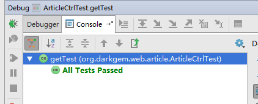

# JUnit

JUnit是用于编写和运行可重复的自动化测试的开源测试框架， 这样可以保证我们的代码按预期工作。
JUnit可广泛用于工业和作为支架(从命令行)或IDE(如Eclipse)内单独的Java程序。

## 基础知识

JUnit的安装和使用都非常的简单。这里使用**IDEA+Maven**演示。

**创建项目**

使用Idea和Maven创建一个最简单的Java项目：



注意：**`TestCase`需要在`src/test/java`下编写。**

**添加JUnit4.x依赖**

```
    <dependencies>
        <dependency>
            <groupId>junit</groupId>
            <artifactId>junit</artifactId>
            <version>4.11</version>
        </dependency>
    </dependencies>
	
```

这样子，就算完成了JUnit的基本安装。

**TestCase**

```java

package app;

import org.junit.*;

import java.util.ArrayList;
import java.util.concurrent.atomic.AtomicInteger;

/**
 * 命名规则为：ClassNameTest
 */
public class AppTest {
    static final AtomicInteger count = new AtomicInteger(0);
    private ArrayList testList;

    /**
     * 每次运行@Test方法，都会实例化一个对象。
     */
    public AppTest() {
        System.out.println(String.format("CONSTRUCT CALL %d", count.incrementAndGet()));
    }

    /**
     * 指定一个静态方法，在所有@Test方法之前，执行一次。
     */
    @BeforeClass
    public static void onceExecutedBeforeAll() {
        System.out.println("@BeforeClass: onceExecutedBeforeAll");
    }

    /**
     * 指定一个静态方法，在所有@Test方法之后，执行一次。
     */
    @AfterClass
    public static void onceExecutedAfterAll() {
        System.out.println("@AfterClass: onceExecutedAfterAll");
    }

    /**
     * 在所有@Test方法之前执行
     */
    @Before
    public void executedBeforeEach() {
        testList = new ArrayList();
        System.out.println("@Before: executedBeforeEach");
    }

    /**
     * 在所有@Test方法之后执行
     */
    @After
    public void executedAfterEach() {
        testList.clear();
        System.out.println("@After: executedAfterEach");
    }

    /**
     * 命名规则：FunctionNameTest
     */
    @Test
    public void EmptyCollectionTest() {
        Assert.assertTrue(testList.isEmpty());
        System.out.println("@Test: EmptyArrayList");

    }

    /**
     * 命名规则：FunctionNameTest
     */
    @Test
    public void OneItemCollectionTest() {
        testList.add("oneItem");
        Assert.assertEquals(1, testList.size());
        System.out.println("@Test: OneItemArrayList");
    }

    /**
     * 忽略这个测试方法
     */
    @Ignore
    public void executionIgnoredTest() {
        System.out.println("@Ignore: This execution is ignored");
    }
}

```

上述是一个非常经典的例子，囊括了JUnit测试对象的**生命周期**。

**运行TestCase**

运行`TestCase`是非常方便的。现在几乎所有的主流IDE（Idea，Eclipse）都支持JUnit。以下是Idea的启动过程：



这样子就开启了调试模式运行`TestCase`。

**运行日志**

```
@BeforeClass: onceExecutedBeforeAll
CONSTRUCT CALL 1
@Before: executedBeforeEach
@Test: EmptyArrayList
@After: executedAfterEach
CONSTRUCT CALL 2
@Before: executedBeforeEach
@Test: OneItemArrayList
@After: executedAfterEach
@AfterClass: onceExecutedAfterAll
```

可以发现，JUnit的**生命周期**和注释保持一致。

## 扩展知识

### @RunWith

使用JUnit的时候，有时候，需要自定义启动器（Runner）。这时候，我们可以通过`@RunWith`注解，来指定当前`TestCase`的Runner。
我们经常使用如下的Runner：

* BlockJUnit4ClassRunner: 默认Runner
* Suite : 测试套件
* Parameterized : 参数化测试
* SpringJUnit4ClassRunner : Spring针对JUnit4.x的测试框架

### JUnitCore

在没有IDE的情况下，我们可以借助`main函数`，来运行我们的`TestCase`：

```
package runner;

import app.AppTest;
import org.junit.runner.JUnitCore;
import org.junit.runner.Result;
import org.junit.runner.notification.Failure;

public class Main {
    public static void main(String[] args) {
        //通过JUnitCore指定，需要进行测试的TestCase
        Result result = JUnitCore.runClasses(AppTest.class);
        //搜集失败的测试用例信息
        for (Failure fail : result.getFailures()) {
            System.out.println(fail.toString());
        }
        //判断，单元测试是否全部通过
        if (result.wasSuccessful()) {
            System.out.println("All tests finished successfully...");
        }
    }
}

```

这样子，我们就可以通过命令行运行JUnit。

### Suite

在JUnit中，我们可以将几个`TestCase`合并在一起进行单元测试：



通过`@Suite.SuiteClasses()`将几个`TestCase`合并在一起，方便单元测试。

### 异常和超时

在某些情况下，我们需要测试`异常`和`超时`这两种情况。而这是通过`@Test.expected`和`@Test.timeout`来实现的。


```java

    /**
     * expected 期待获取的异常类型
     * timeout 测试用例超时时间
     * */
    @Test(expected = Exception.class, timeout = 1000)
    public void OneItemCollectionTest() throws Exception {
        Thread.sleep(500);
        System.out.println("@Test: OneItemArrayList");
    }
	
```

## Spring 整合


**依赖**

Spring提供了`spring-test`来支持JUnit的测试框架。引入依赖：

```
    <dependency>
        <groupId>org.springframework</groupId>
        <artifactId>spring-test</artifactId>
        <version>${spring-version}</version>
    </dependency>

```

**SpringTest**

**为了避免每个`TestCase`都添加@RunWith等注解，这里引入`SpringTest`方便`TestCase编写`**：

```java

//http://docs.spring.io/spring/docs/current/spring-framework-reference/htmlsingle/#testing

//Spring针对JUnit4.x的支持Runner
@RunWith(SpringJUnit4ClassRunner.class)
//Spring配置类
@ContextConfiguration(classes = {SpringConf.class})
//支持Spring MVC
@WebAppConfiguration
//默认回滚
@Rollback
//默认事务
@Transactional
public abstract class SpringTest {
    
    //Spring 上下文
    @Autowired
    private WebApplicationContext wac;
    //Spring MVC测试支持类
    private MockMvc mockMvc;


    @Before
    public void init() {
        //构造mockMvc
        //不知道为什么Spring小组，不提供MockMvc注解方式@Autowired方式初始化
        mockMvc = MockMvcBuilders.webAppContextSetup(wac).build();
    }
    
    //获取Spring MVC测试支持对象MockMvc
    public MockMvc getMockMvc() {
        return mockMvc;
    }
}

```

这样子，就定义了一个`测试基类`。具体的`TestCase`只需要**继承**这个测试基类即可。

**Spring MVC测试**

```

//继承测试基类
public class ArticleCtrlTest extends SpringTest {
    //路径
    final static String PATH = "/main/ArticleCtrl/";
    
    //支持@Autowired方式
    @Autowired
    ArticleIo articleIo;
    
    
    @Test
    public void getTest() throws Exception {
        final Article article = new Article(null, "测试数据", false);
        //插入一条数据
        articleIo.insert(article);
        //检测接口
        getMockMvc().perform(MockMvcRequestBuilders.post(PATH + "get").param("id", article.getId())).andDo(new ResultHandler() {
            @Override
            public void handle(MvcResult result) throws Exception {
                JSONObject ret = JSON.parseObject(result.getResponse().getContentAsString());
                //ok
                Assert.assertTrue(ret.getInteger("code") == 0);
                //check
                Assert.assertTrue(ret.getJSONObject("msg").getString("id").equals(article.getId()));
            }
        });
    }
    
}

```

以上，就是一个简单的Spring MVC测试用例。对于Dao或者Service测试就更加简单了。

注意：

1. getTest()的事务会进行**回滚操作**，不会真正的写入数据库。
2. Spring MVC 是通过模拟 "/" 路径的Servlet实现，**不支持web.xml中注册的Servlet测试**。

**运行截图**



项目地址：[java-fast-framework](https://github.com/darkfireworld/java-fast-framework.git)

## 执行流程

JUnit的测试流程大致如下：

1. 指定需要测试的`TestCase`。假如采用Maven构建，则默认为所有`/src/test/java/**Test`类。
2. JUnit加载`TestCase`的@RunWith指向的`Runner`。默认为：`BlockJUnit4ClassRunner`。注意：`Runner`的构造函数入参为`TestClass.class`
3. JUnit实例化`Runner`，然后调用`Runner#run(RunNotifier notifier)`方法，测试指定的`TestCase`。注意：Runner需要拥有一个`Runner(Class clz)`类型的构造函数。
4. `Runner`在测试过程中，通过`notifier`记录测试结果。
5. JUnit收集所有`TestCase`的执行结果，然后打印报告。

**注意：JUnit读取`TestCase`注解(@RunWith,@Test...)的时候，会遍历`TestCase`整个继承链。**

### BlockJUnit4ClassRunner

我们以`BlockJUnit4ClassRunner`这个Runner分析具体`Runner#run`的过程：

```java

ParentRunner:
    
    //对指定的TestCase进行检测
    @Override
    public void run(final RunNotifier notifier) {
        EachTestNotifier testNotifier = new EachTestNotifier(notifier,
                getDescription());
        try {
            //创造一个执行Block
            Statement statement = classBlock(notifier);
            //执行具体的Block
            statement.evaluate();
        } catch (AssumptionViolatedException e) {
            testNotifier.addFailedAssumption(e);
        } catch (StoppedByUserException e) {
            throw e;
        } catch (Throwable e) {
            testNotifier.addFailure(e);
        }
    }
    
ParentRunner:
    
    //创建执行Block
    protected Statement classBlock(final RunNotifier notifier) {
        //获取待执行的语句，BlockJUnit4ClassRunner 为执行所有@Test方法语句
        Statement statement = childrenInvoker(notifier);
        if (!areAllChildrenIgnored()) {
            //处理@BeforeClass
            statement = withBeforeClasses(statement);
            //处理@AfterClass
            statement = withAfterClasses(statement);
            //处理@ClassRule
            statement = withClassRules(statement);
        }
        return statement;
    }
    
ParentRunner:
    //构造一个通过Statement，这个Statement具体执行的时候，会调用runChildren方法。
    protected Statement childrenInvoker(final RunNotifier notifier) {
        return new Statement() {
            @Override
            public void evaluate() {
                //语句被调用执行的时候，会真正的执行函数
                runChildren(notifier);
            }
        };
    }
```

这样子，就完成了`Statement`的构造过程。然后我们再看一下刚刚创建出来的`Statement#evaluate`函数：

```java

ParentRunner:
    //构造一个通过Statement，这个Statement具体执行的时候，会调用runChildren方法。
    protected Statement childrenInvoker(final RunNotifier notifier) {
        return new Statement() {
            @Override
            public void evaluate() {
                //语句被调用执行的时候，会真正的执行函数
                runChildren(notifier);
            }
        };
    }

ParentRunner:
    //具体执行的过程
    private void runChildren(final RunNotifier notifier) {
        //获取当前的调度器，默认为主线程测试
        final RunnerScheduler currentScheduler = scheduler;
        try {
            //获取要测试的对象
            for (final T each : getFilteredChildren()) {
                currentScheduler.schedule(new Runnable() {
                    public void run() {
                        //进行刚刚给定的对象
                        ParentRunner.this.runChild(each, notifier);
                    }
                });
            }
        } finally {
            currentScheduler.finished();
        }
    }
    
```

上述的执行过程中，涉及到两个点：

* getFilteredChildren：获取待测试的对象集合
* runChild：进行具体的测试

我们，先看看`getFilteredChildren`方法：

```java

ParentRunner:
    //获取要执行的对象集合
    private Collection<T> getFilteredChildren() {
        if (filteredChildren == null) {
            synchronized (childrenLock) {
                if (filteredChildren == null) {
                    //通过getChildren方法，委托子类，然后获取具体要测试的对象信息
                    filteredChildren = Collections.unmodifiableCollection(getChildren());
                }
            }
        }
        return filteredChildren;
    }
    
BlockJUnit4ClassRunner:
    
    //父类ParentRunner#getChildren具体实现方法，用来搜集执行对象信息
    @Override
    protected List<FrameworkMethod> getChildren() {
        return computeTestMethods();
    }
    
BlockJUnit4ClassRunner:

    //搜索@Test方法信息
    protected List<FrameworkMethod> computeTestMethods() {
        //搜索@Test方法信息，包括所有的父类
        return getTestClass().getAnnotatedMethods(Test.class);
    }

```

这样子，就搜集了待测试的@Test方法对象集合。然后，我们在看看具体的测试`runChild`：

```java

BlockJUnit4ClassRunner:

    @Override
    protected void runChild(final FrameworkMethod method, RunNotifier notifier) {
        Description description = describeChild(method);
        //判断这个对象是否@Ignored
        if (isIgnored(method)) {
            notifier.fireTestIgnored(description);
        } else {
            //1. 根据这个对象，通过methodBlock创建执行Block
            //2. 执行这个Block
            runLeaf(methodBlock(method), description, notifier);
        }
    }
    
BlockJUnit4ClassRunner:

    //创建待执行的Block
    protected Statement methodBlock(FrameworkMethod method) {
        Object test;
        try {
            //构造一个新的对象！！
            //也就是说，一个@Test方法对应一个对象
            test = new ReflectiveCallable() {
                @Override
                protected Object runReflectiveCall() throws Throwable {
                    return createTest();
                }
            }.run();
        } catch (Throwable e) {
            return new Fail(e);
        }

        Statement statement = methodInvoker(method, test);
        //处理@Test#expected
        statement = possiblyExpectingExceptions(method, test, statement);
        //处理@Test#timeout
        statement = withPotentialTimeout(method, test, statement);
        //处理@Before
        statement = withBefores(method, test, statement);
        //处理@After
        statement = withAfters(method, test, statement);
        //处理@Rule
        statement = withRules(method, test, statement);
        return statement;
    }
    
BlockJUnit4ClassRunner:

    //执行刚刚创建的Block
    protected final void runLeaf(Statement statement, Description description,
            RunNotifier notifier) {
        EachTestNotifier eachNotifier = new EachTestNotifier(notifier, description);
        eachNotifier.fireTestStarted();
        try {
            //执行
            statement.evaluate();
        } catch (AssumptionViolatedException e) {
            eachNotifier.addFailedAssumption(e);
        } catch (Throwable e) {
            eachNotifier.addFailure(e);
        } finally {
            eachNotifier.fireTestFinished();
        }
    }
```

**注意：`BlockJUnit4ClassRunner#methodBlock`可以发现，每测试一个@Test方法，都会创建一个对象。**

到此，`BlockJUnit4ClassRunner#Runner#run(RunNotifier notifier)`的运行流程，就基本分析完毕了。

### SpringJUnit4ClassRunner

Spring 通过`SpringJUnit4ClassRunner`来支持JUnit。通过`SpringJUnit4ClassRunner`，我们可以实现如下特性：

1. ApplicationContext仅仅初始化一次。
2. SpringMVC 支持
3. @Autowired 支持
4. @Rollback 支持(需要`@Transactional`配合)

SpringJUnit4ClassRunner继承于BlockJUnit4ClassRunner类，通过`覆盖`父类方法，实现了上述特性：

1. **构造函数**：ApplicationContext仅仅初始化一次。
2. **methodBlock**：@Autowired ，@Rollback 等


## 最佳实践

这里总结一下JUnit最佳实践：

1. 一个类，一个测试类；一个函数，一个测试函数；
2. 命名规则： ClassNameTest 和 FunctionNameTest。
3. 切勿@Test函数相互调用。
4. 合理使用测试基类（如：SpringTest）。
5. 覆盖率：业务类型>=60%，工具类型>=80%。
6. 写入数据需要回滚，避免污染数据库。

## 参考

* [JUnit教程](http://www.yiibai.com/junit/)
* [利用junit对springMVC的Controller进行测试](http://www.tuicool.com/articles/7rMziy)
* [Maven单元测试报告及测试覆盖率](http://www.cnblogs.com/qinpengming/archive/2016/02/28/5225380.html)


