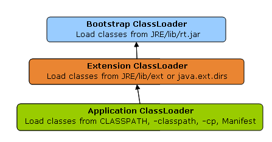

# Java ClassLoader

Java ClassLoader 是JVM对类加载的基础，通过研究ClassLoader，我们可以解惑 Tomcat 的多项目加载等机制。

## 什么是ClassLoader

ClassLoader 是JVM加载class对象的一个类，通过这个类，可以把class载入到JVM虚拟机中，形成可执行代码。

## 默认ClassLoader

一旦启动JVM虚拟机，就会默认加载几个ClassLoader，作为基础加载类型。其基本关系为：

### Bootstrap ClassLoader

该对象由C/C++实现，用于加载jre/lib下的所有JAR，**特别是rt.jar**。 之后，会初始化一个Launcher.java（sun.misc.Launcher）的对象，用于配置 ExtClassLoader和 AppClassLoader。

### ExtClassLoader

该对象主要是用于加载/jre/lib/ext/*.jar 的数据

### AppClassLoader

用于加载 系统环境变量中的classpath指向的jar 以及 -cp | -jar 指定的JAR包

### 线程上下文ClassLoader

在Launcher中，同时还会设置AppClassLoader作为线程上下文的ClassLoader。

如果不使用**Thread#setContextClassLoader修改对应线程的ClassLoader，那么会继承父线程的ClassLoader对象**

通过 线程上下文ClassLoader，可以非常方便的加载SPI内容，比如说JDBC。

## 双亲委派模型

Java中ClassLoader的加载采用了双亲委托机制，采用双亲委托机制加载类的时候采用如下的几个步骤：

1. 每个类加载器都有自己的加载缓存，当一个类被加载了以后就会放入缓存，等下次加载的时候就可以直接返回了。

2. 当前classLoader的缓存中没有找到被加载的类的时候，委托父类加载器去加载，父类加载器采用同样的策略，首先查看自己的缓存，然后委托父类的父类去加载，一直到bootstrp ClassLoader.

3. 当所有的父类加载器都没有加载的时候，再由当前的类加载器加载，并将其放入它自己的缓存中，以便下次有加载请求的时候直接返回。

所以，默认的加载class优先级为：BootstrapClassLoader-> ExtClassLoader ->AppClassLoader 。

## ClassLoader 空间命名机制

**空间命名**是指要确定某一个类，需要类的全限定名以及加载此类的ClassLoader来共同确定。公式为：

**FULL_CLASS_IN_JVM_ID = CLASS_LOADER_ID + CLASS_NAME**

也就是说即使两个类的全限定名是相同的，但是因为不同的 ClassLoader加载了此类，那么在JVM中它是不同的类。

## 自定义ClassLoader

我们可以通过编写ClassLoader，加载一些特殊位置的代码，比如说从网络上获取。下面来介绍一下如何自定义ClassLoader，查看ClassLoader，可以发现几个重要的API。

### loadClass

这个方法，包含了读取缓存，双亲委托的功能，如果想打破**双亲委托模型**，则需要重写该方法。

触发`loadClass`的条件：

1. 手动调用`loadClass`方法。
2. 处理类A中的依赖类B的时候`for new B()`
    1. JVM查询加载类A的ClassLoader的clz缓存，判断clz缓存中是否存在类B。
    2. clz缓存中存在类B，则直接返回类B。
    3. clz缓存中不存在类B，则调用`loadClass`进行加载类B。

注意：loadClass 会优先查询clz缓存。

### findClass

这个方式，就是通过className获取具体class的方法了。可以看到ClassLoader中

    protected Class<?> findClass(String name) throws ClassNotFoundException {
        throw new ClassNotFoundException(name);
    }

就直接抛出异常，如果想自定义ClassLoader，且**不想打破双亲委托模型**，那么只需要简单的重写该方法即可。

### defineClass

通过这个方法，就可以把二进制文件转换为JVM内部的Class对象，且这个方法**不能被重写**，也应该是唯一的入口。

>值得注意的是，即使你重写了ClassLoader，如果加载java.*的类，JVM会拒绝你，因为只能通过bootstrap加载java.* 的Class

## 常见的ClassLoader API

    // 通过当前类的类加载器加载（会执行初始化）
    Class.forName("二进制名称");
    Class.forName("二进制名称", true, this.getClass().getClassLoader());

    // 通过当前类的类加载器加载（不会执行初始化）
    Class.forName("二进制名称", false, this.getClass().getClassLoader());
    this.getClass().loadClass("二进制名称");

    // 通过系统类加载器加载（不会执行初始化）
    ClassLoader.getSystemClassLoader().loadClass("二进制名称");

    // 通过线程上下文类加载器加载（不会执行初始化）
    Thread.currentThread().getContextClassLoader().loadClass("二进制名称");

## new 关键字

为何会说道new关键字，因为new关键字，也是利用ClassLoader进行加载具体的类的！

### new使用的ClassLoader

经过深入的研究发现，**发现new的时候，采用的ClassLoader是关联到加载当前类的ClassLoader。**比如说：

    public class Test{
        public Test(){
            print();
        }
        public void print(){
            Runnable a = new Runnable(){
                void run(){
                    System.out.println("Hello World");
                }
            }
        }
    }

现在我们通过自定义的SelfClassLoader加载Test类，并且进行newInstance()。那么，在上述代码中，**new Runnable(){} 这个匿名类，也会通过自定义的SelfClassLoader加载**

### 跨ClassLoader引用

我们定义了一个接口(People)，被ClassLoader1加载，然后我们定义了一个具体的实现类，被ClassLoader2加载。

那么，我们是否可以使用 CL1#People p = (CL1#People)CL2#Man 来进行强制转换呢？根据ClassLoader的双亲委派模式，其实在实例化Man的时候，因为Man的接口来自于CL1#People，所以，这种转换是可以的，只要**ClassLoader2 的parent 是 ClassLoader1**

解决了这个问题，也就顺便的解决了TOMCAT 接口都是由COMMON ClassLoader进行加载Servlet API，而具体的Servlet实现由WebClassLoader 进行加载，并且它们的转换是没有问题的。

## 总结

通过了解ClassLoader，可以学习到JVM的类加载机制，在具体的工作中，可以利用这些特性，比较方便的解决一些 ClassNotFoundException， CAST 异常等问题。

## 参考

[深入探讨 Java 类加载器](https://www.ibm.com/developerworks/cn/java/j-lo-classloader/)

[Java魔法堂：类加载器入了个门](http://www.cnblogs.com/fsjohnhuang/p/4284515.html)

[Java Classloader机制解析](http://my.oschina.net/aminqiao/blog/262601?fromerr=kUMccno4)