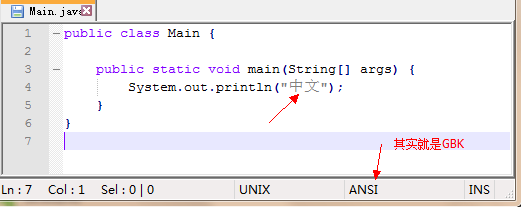

# Java class 编码

Java是一种跨平台的语言，这注定了JVM能适应各种平台的编码环境。当今只有UNICODE能包含各种文字，而UTF-8编码能解决大小端问题，**所以Java的class是采用UTF-8格式存储字符串的。**虽然JVM内部采用UTF-16编码表示字符串。

## javac

我们知道，java文件可以是各种编码，如GBK，UTF-8等等，但是**通过javac编译**后，产生的class文件都是UTF-8编码的。

可以发现，该Java文件是采用ASNI编码（GBK）的。我们**通过javac Main.java编译**，获取到class文件

通过使用UTF-8编码查看，就可以发现“中文”了。再使用**javap -verbose Main.class 查看:**

可以发现字符编码就是UTF-8编码。

值得注意的是，javac 有一个参数** -encoing **，这个参数指定了java文件是什么编码格式的，如果不指定则会采用**系统默认编码格式，如GBK**。

## console 

在控制台中，我们可以看到中文的输出，

但是，我们知道JVM中字符串是采用UTF-16编码的，console编码是**系统默认编码GBK**。可以推断，JVM调用println的时候，**会把UTF-16的JVM编码字符串转换为系统默认编码GBK**，使得输出中文结果能正确。