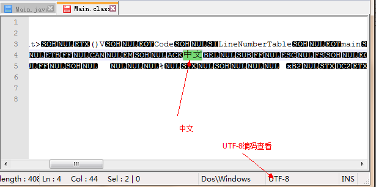
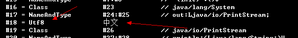

# Java 类定义

Java的类定义存在两种类型：静态类和动态类。

## 静态类

### 静态外部类

静态外部类指的是`java`文件中，最外层的类定义：

```java

Main.java

	// 需要存在一个和Main.java一致的静态外部类
	public class Main {

		public static void main(String[] args) {
			System.out.println("Main");
		}
	}
	
	class TopCls{
		
	}

```

静态外部类不需要添加`static`关键字进行修饰。

### 静态内部类

在静态外部类中，通过`static`关键字修饰的类，就是静态内部类：

```java

Main.java

	public class Main {

		public static void main(String[] args) {
			new StaticClass().println();
		}
		
		//静态内部类
		static class StaticClass {
			public void println() {
				System.out.println("Static Class");
			}
		}
	}
```

静态内部类，不需要依赖`Main`是否初始化，这点和`内部类`不同。而静态内部类的`Class.forName`引用为：

> Class.forName("Main$StaticClass");

## 动态类

### 成员内部类

这种内部类是最常见的，如：

```
	public class Main {

		public static void main(String[] args) {
			new Main().new Inner().println();
		}

		class Inner {
			private void println() {
				System.out.println("AAA");
			}
		}
	}
```

可以发现Inner就是一个简单的内部类，值得注意的是它的初始化，**需要优先初始化Main对象。**

### 匿名类

在Java中，特别是Android编程或者SWT编程，我们经常使用匿名类：

```
	public class Main {
		interface Callback{
			void ok();
		}
		public static void main(String[] args) {
			Callback callback = new Callback() {
				//构造代码区域
				{
					System.out.println("Build");
				}
				@Override
				public void ok() {
					System.out.println("OK");
				}
			};
			callback.ok();
		}
	}
```

通过匿名类，我们可以构造一个回调，而不用编写一个具体的类，好处就是内聚性强，不会出现莫名其妙的类被全局可见。
而缺点就是缺少了构造函数。当然我们可以通过一定的手段来伪造一个构造函数，**如 {} 代码块**。

### 局部内部类

在函数中，我们也可以创建一个类：

```
	public class Main {

		public static void main(String[] args) {
			class Inner {
				private void println() {
					System.out.println("AAA");
				}
			}
			new Inner().println();
		}
	}
```

是不是感觉非常的不可思议，其实这种方式和我们经常使用的匿名类其实是一个道理，仅仅是多了构造方法和类名。
因为该类的作用域为函数块，所以能避免污染全局空间。

# 访问属性

在java中我们使用private、protected、public和default来控制类中属性和函数的访问：

|           | 类内部| 本包    | 子类   |外部包 |
|-----------|-------|---------|--------|-------|
|public     |  √    | √	      |  √     |  √    |
|protected  |√	    |√	      |√	   | ×     |
|default    | √	    |√	      |×       |×      |
|private    | √	    |×	      |×	   |×      |


# Java Class Init

是不是大家都认为，Java的初始化就是调用`构造函数`？其实，Java类的初始化包括两个过程：

1. Load
2. New 

## Load

一个Java类是通过`ClassLoader`加载进入JVM虚拟机运行的，此时会：

1. 初始化所有`static 属性`
2. 调用`static block`代码块

一旦Class被加载进入虚拟机，则它的生命周期会跟随`ClassLoader`。

## New

当获取一个Object的时候，会发生如下过程：

1. 初始化类属性
2. 调用block代码块
3. 调用构造函数（子类->父类）

## 测试

如下是测试代码：

```java

public class App {
    //1
    static String STATIC_FIELD = "STATIC_FIELD";

    //2
    static {
        System.out.println(STATIC_FIELD);
    }

    //3
    String field = "field";

    //4
    {
        System.out.println(field);
    }

    public App() {
        System.out.println("construct");
    }

    public static void main(String[] args) {
        new App();
    }
}


```

运行结果：

```

STATIC_FIELD
field
construct

```

注意：这里的`类block`和`函数block`不同。`函数block`提供了一种可以`break`的作用域。

# Java class 编码

Java是一种跨平台的语言，这注定了JVM能适应各种平台的编码环境。当今只有UNICODE能包含各种文字，而UTF-8编码能解决大小端问题，
**所以Java的class是采用UTF-8格式存储字符串的。**虽然JVM内部采用UTF-16编码表示字符串。

## javac

我们知道，java文件可以是各种编码，如GBK，UTF-8等等，但是**通过javac编译**后，产生的class文件都是UTF-8编码的。


可以发现，该Java文件是采用ASNI编码（GBK）的。我们**通过javac Main.java编译**，获取到class文件



通过使用UTF-8编码查看，就可以发现“中文”了。再使用**javap -verbose Main.class 查看:**



可以发现字符编码就是UTF-8编码。

值得注意的是，javac 有一个参数** -encoing **，这个参数指定了java文件是什么编码格式的，
如果不指定则会采用**系统默认编码格式，如GBK**。

## console 

在控制台中，我们可以看到中文的输出，


但是，我们知道JVM中字符串是采用UTF-16编码的，console编码是**系统默认编码GBK**。可以推断，JVM调用println的时候，
**会把UTF-16的JVM编码字符串转换为系统默认编码GBK**，使得输出中文结果能正确。
