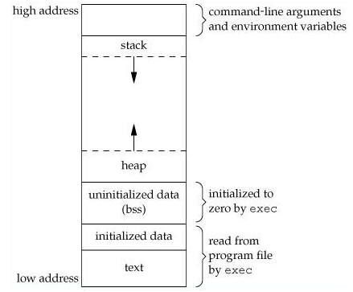
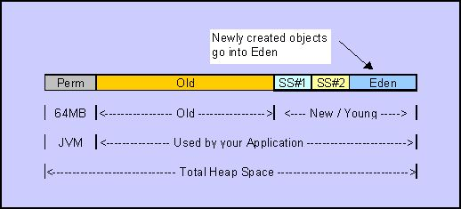
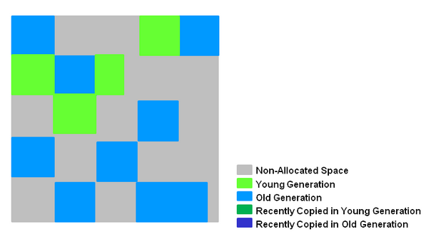

# Java内存-GC篇

> 从卡片机到使用内存，是一次计算机的跳跃，再从ASM到C/C++时代，是一次语言上的跳跃，从手动垃圾回收再到自动垃圾回收，这是码农的解放。

内存到底有什么作用？非常直接，内存的作用就是存储二进制数据！而二进制数据是什么？可以是一段声音，一段文本，一段运行的代码，可以是任何。通过**MAP操作**可以把现实和二进制联系起来，这些数据都可以存储于内存中。

## 汇编时代

在汇编的那个时代，变量一般都是固定在某个地址如0x1000表示开关是否打开。代码执行过程中，就是直接对指定位置的变量进行写入和读取。

## 模块化

随着项目越来越大，在项目中的出现了许多重复的代码，修改同一个问题，往往有时候需要翻遍整个项目的代码，维护的代码非常的高。那么我们有什么办法可以解决这个问题呢？人们提出了模块化设计的方法，来解决这个问题。当时出现了两种解决方案：

1. 宏
2. 函数

通过宏的方式，比较简单，但是在当时，内存是比较小的，大量的宏会造成内存浪费。而函数的方法，会遇到如下的问题：

1. 参数怎么传递
2. 数据怎么返回

### 方案1-固定内存地址

可能有各种方法解决比如说在**固定内存地址**设置参数和写入返回运算的结果。CPU运行到需要调用函数的代码的时候，运行过程为：

1. 把参数写在固定内存地址
2. JMP到函数位置
3. 函数使用固定内存地址的参数
4. 运算后，把结果写入固定内存地址
5. JMP到返回地址

这样子，貌似也就解决了函数调用的问题。

### 方案2-stack和heap模型

该模型相对于方案1，具有明显的优点：

1. 临时变量可以在函数退出的时候自动回收
2. 可以多次调用同一个方法

所以，后来计算机中，就广泛的使用了stack和heap的内存模型。

## 难搞定的Heap内存

在过去C/C++时代，程序员们一直在NULL Point 和 OOM 之间挣扎，后来出现了垃圾回收算法，大大的缓解了这种情况。

### malloc/free

在最原始的C/C++时代，我们是通过malloc来申请一块内存，通过free释放一块内存。

**代表：**

C/C++

**优点：**

纯手动操作，使得程序员开启上帝模式操作内存，性能可控。

**缺点：**

人都会犯错误，内存泄漏，空指针异常，segmentfault等等，都是满满的黑历史。

### reference counting

reference counting：在引用计数中，每一个对象负责维护对象所有引用的计数值。当一个新的引用指向对象时，引用计数器就递增，当去掉一个引用时，引用计数就递减。当引用计数到零时，该对象就将释放占有的资源。

**代表：**

IOS：Object-C

**优点：**

实现比较简单，而且释放内存的时间是可控的。

**缺点：**

无法处理循环引用的问题（可以通过WeakReference方法解决），并且代码中会出现满满的 **acquire ，release**。

### mark-sweep

标记-清除算法分为两个阶段：**标记(mark)和清除(sweep)**

**在标记阶段**：collector从static根对象开始进行遍历，对从mutator根对象可以访问到的对象都打上一个标识，一般是在对象的header中，将其记录为可达对象。

**而在清除阶段**：collector对堆内存(heap memory)从头到尾进行线性的遍历，如果发现某个对象没有标记为可达对象-通过读取对象的header信息，则就将其回收。

**代表：**

Java，Javascript

**优点：**

比较完美的解决了引用计数垃圾回收中的循环引用的问题，程序员无需关心free内存的问题。

**缺点**

引入了一个运行时，来帮助处理回收内存，并且在回收内存的时候，还会增加额外的性能消耗。并且在某些时候也还会发生**内存泄漏**的问题。

### 小结

内存管理是一个非常庞大的话题，从计算机诞生到至今，都还没有一个非常完美的解决方案。**现今的垃圾回收算法大部分都是上述的几种方式演变而来。**

## JVM 兴起

### final,finalize,finally

在Java语法中，会经常遇到**final,finalize,finally**三种类型的关键字，下面来介绍一下这三个关键字。

#### final 

**final关键字表示一个类，方法或者属性不能再次被修改。**

* final修饰的类的时候，这个类不允许被继承
* final修饰方法的时候，表示该方法不能被子类中的方法覆写@Override
* final修饰属性的时候，表示这个属性只能被赋值一次，之后不能再被修改。

#### finalize

在Java中提供了一种在对象**将要被GC回收**的时候进行其他资源（Socket，句柄等）的释放机制-finalize。

finalize工作的过程：

1. JVM 在GC的时候，发现一个对象是不可达，以及重写了finalize方法，并且之前没有执行过finalize方法，那么将该对象加入F-Queue中，否则直接进行垃圾回收。
2. F-Queue 上面的运行着低优先级线程，当发现Queue不为空，则依次执行Object#finalize方法。
3. 如果在Object#finalize方法中，该对象没有"复活"，则在不久后JVM再次GC的时候，会被回收。
4. 如果该对象被"复活"了，那么之后JVM GC这个对象的时候，不会再次调用finalize方法。

代码：

    package com.company;
    
    import java.util.HashSet;
    import java.util.Set;
    
    public class Main {
        static boolean done = false;
        static Set<Object> collect = new HashSet<>();
    
        public static void main(String[] args) throws Exception {
            new Object() {
                @Override
                protected void finalize() throws Throwable {
                    super.finalize();
                    System.out.println(this);
                    if (!done) {
                        collect.add(this);
                    }
                }
            };
            new Object() {
                @Override
                protected void finalize() throws Throwable {
                    super.finalize();
                    System.out.println(this);
                    if (!done) {
                        collect.add(this);
                    }
                }
            };
            System.out.println("FIRST GC BEGIN");
            System.gc();
            Thread.sleep(2000);
            //标记第一次GC过程
            done = true;
            //打印集合中存在的对象
            System.out.println("FIRST GC FINISH");
            for (Object o : collect) {
                System.out.println(o);
            }
            //清空
            collect.clear();
            System.out.println("SECOND GC BEGIN");
            //再次发生一次GC操作，检测 finalize 是否可以多次运行
            System.gc();
            //等待GC过程发生
            Thread.sleep(2000);
            System.out.println("FIRST GC DONE");
        }
    }

运行结果：

    FIRST GC BEGIN
    com.company.Main$2@4c7f09fa
    com.company.Main$1@42b8ee05
    FIRST GC FINISH
    com.company.Main$2@4c7f09fa
    com.company.Main$1@42b8ee05
    SECOND GC BEGIN
    FIRST GC DONE

finalize使用要点：

* Java中的finalize的调用具有不确定性，因为GC的时间是不确定的。
* 适用于释放本地对象(通过JNI创建的对象)，比如说：**Android中的Bitmap#finalize来释放底层资源。**
* 适用于作为确保某些非内存资源(如Socket、文件等)释放的一个补充，但是不能完全依赖。
* 因为GC发生的时间不确定，可能在发生GC的时候，一些非内存资源早已消耗光了。
* finalize仅仅只能执行一次，如果对象"复活"后，再次GC是不会执行这个方法的。

#### finally 

finally这个关键字是Java异常处理模型中的关键字，用于释放Socket等一定需要释放的资源或者对象。

    try {
        throw new Exception("我就是异常");
    } catch (Exception e) {
        e.printStackTrace();
    } finally {
        System.out.println("一定会运行到我");
    }

上面就是一个try-catch-finally的基本语句。

### java.lang.ref

在Java中提供了一套检测对象是否被GC的API：** SoftReference,WeakReference,PhantomReference以及ReferenceQueue。**

* **强引用：**通常情况下，我们都是用强引用来使用一个对象，比如说** Object o = new Object()** 中o就是对Object的一个强引用，而通过 **o = null**来切断强引用。

* **虚引用：**当 WeakReference 持有的对象不再强引用可达的时候，GC会将 WeakReference 持有的对象置空。

* **软引用：**当 SoftReference 持有的对象不再强引用可达的时候，仅仅当**JVM内存吃紧**的时候，GC会将 SoftReference 持有的对象置空。

* **幽灵引用：**对象没有实现finalize或者**GC之前调用过该对象的finalize方法**，当 PhantomReference  持有的对象不再强引用可达的时候，GC才会将 PhantomReference 持有的对象置空。

**注意：创建Reference的时候，关联了一个ReferenceQueue的话，那么当置空Reference持有的对象的时候，会将该Reference加入Queue中。**

#### 例子

**测试代码：**

    package com.company;
    
    import java.lang.ref.PhantomReference;
    import java.lang.ref.Reference;
    import java.lang.ref.ReferenceQueue;
    import java.lang.ref.WeakReference;
    
    public class Main {
        static Object hold = null;
    
        public static void main(String[] args) throws Exception {
            //测试 WeakReference
            {
                ReferenceQueue<Object> queue = new ReferenceQueue<>();
                Reference<Object> ref = new WeakReference<Object>(new Object() {
    
                    @Override
                    protected void finalize() throws Throwable {
                        super.finalize();
                        //表示运行了finalize函数
                        System.out.println("finalize");
                        //复活该对象
                        hold = this;
                    }
                }, queue);
                System.gc();
                // Thread.sleep(1000);
                //查看ref是否还持有对象，如果为 PhantomReference ，则永远get = null
                System.out.println(String.format("ref = %s", ref.get()));
                //查看被回收的对象是否进去了queue中
                System.out.println(String.format("queue poll = %s", queue.poll()));
                //再次deal object
                hold = null;
                System.gc();
                //Thread.sleep(1000);
                //查看ref是否还持有对象，如果为 PhantomReference ，则永远get = null
                System.out.println(String.format("ref = %s", ref.get()));
                //查看被回收的对象是否进去了queue中
                System.out.println(String.format("queue poll = %s", queue.poll()));
            }
            System.out.println("====================================================");
            //测试 PhantomReference
            {
                ReferenceQueue<Object> queue = new ReferenceQueue<>();
                Reference<Object> ref = new PhantomReference<>(new Object() {
    
                    @Override
                    protected void finalize() throws Throwable {
                        super.finalize();
                        //表示运行了finalize函数
                        System.out.println("finalize");
                        //复活该对象
                        hold = this;
                    }
                }, queue);
                System.gc();
                // Thread.sleep(1000);
                //查看ref是否还持有对象，如果为 PhantomReference ，则永远get = null
                System.out.println(String.format("ref = %s", ref.get()));
                //查看被回收的对象是否进去了queue中
                System.out.println(String.format("queue poll = %s", queue.poll()));
                //再次deal object
                hold = null;
                System.gc();
                //Thread.sleep(1000);
                //查看ref是否还持有对象，如果为 PhantomReference ，则永远get = null
                System.out.println(String.format("ref = %s", ref.get()));
                //查看被回收的对象是否进去了queue中
                System.out.println(String.format("queue poll = %s", queue.poll()));
            }
        }
    }

**运行结果：**

    finalize
    ref = null
    queue poll = java.lang.ref.WeakReference@5cad8086
    ref = null
    queue poll = null
    ====================================================
    finalize
    ref = null
    queue poll = null
    ref = null
    queue poll = java.lang.ref.PhantomReference@6e0be858

#### 使用场景

通过java.lang.ref 和GC检测对象的可达性，我们可以实现非内存资源的管理，比如说：

* WeakHashMap通过监听ReferenceQueue，实现回收Value的时候，同时回收对应的KEY
* OkHttp-ConnectionPool 通过WeakReference实现回收泄漏Socket的管理。

### JVM 垃圾回收器 

#### 分代垃圾回收器

Hotspot VM 提供的垃圾回收器是一个分代垃圾回收器（Generational GC），将内存划分
为不同的阶段，也就是说，不同的生命周期的对象放置在不同的地址池中。

这样的设计是基于弱年代假设（Weak Generational Hypothesis）：

* 越早分配的对象越容易失效；
* 老对象很少会引用新对象。

这种分代方式可以减少垃圾回收的停顿时间以及大范围对象的回收成本。Hotspot VM将其堆空间分
为三个分代空间：

* 年轻代（Young Generation）
    * Java应用在分配Java对象时，这些对象会被分配到年轻代堆空间中去
    * 这个空间大多是小对象并且会被频繁回收
    * 由于年轻代堆空间的垃圾回收会很频繁，因此其垃圾回收算法会更加重视回收效率
    * 通常使用 Copying GC算法
* 年老代（Old Generationn）
    * 年轻代堆空间的长期存活对象会转移到（也许是永久性转移）年老代堆空间
    * 这个堆空间通常比年轻代的堆空间大，并且其空间增长速度较缓
    * 由于大部分JVM堆空间都分配给了年老代，因此其垃圾回收算法需要更节省空间，此算法需要能够处理低垃圾密度的堆空间
    * 通常使用 Mark-Sweep GC算法
* 持久代（Permanent Generation）
    * 存放VM和Java类的元数据（metadata），以及interned字符串和类的静态变量

可以看到**JVM在不同的内存区域采用了不同的GC算法**，这主要是为了兼顾内存使用率和性能。

#### G1垃圾回收器

G1保留了分代的概念，但是代已经不是物理上连续区域，而是一个逻辑的概念。如图：

在理论上G1提供了更好的性能，但是在实际中，需要多多测试真实情况。

### 小结

WeakReference和SofterReference最大的区别在于SoftReference仅仅在内存紧张的时候进行回收，所以SoftReference比较适合做缓存。

WeakReference 和 PhantomReference 最大的区别在于PhantomReference仅仅当对象真正的不可达的时候进行置空，避免了对象在finalize函数中复活的情况，所以 PhantomReference 比较适合做生命周期的管理。

对于稀缺的资源（如JDBC连接，文件句柄等），我们最好以手动为主，以finalize或java.lang.ref为辅的方式进行管理，最大程度高效利用资源。

而对于JVM垃圾回收器，我们也需要了解它的工作原理，这样子才能方便我们进行JVM调优。

## 总结

内存管理是一个庞大的话题，有手动的管理，引用计数管理，GC方法等。在开发的时候，需要合理的选择，兼顾开发效率和性能。

## 参考
* [二进制](http://my.oschina.net/darkgem/blog/591441)
* [Java垃圾回收机制](http://www.jianshu.com/p/778dd3848196)
* [引用计数算法](http://www.jianshu.com/p/1d5fa7f6035c)
* [标记-清除算法](http://www.jianshu.com/p/b0f5d21fe031)
* [Java中的final](http://www.cnblogs.com/mengdd/archive/2012/12/26/2834711.html)
* [深入理解ReferenceQueue GC finalize Reference](http://zhang-xzhi-xjtu.iteye.com/blog/413159)
* [OkHttp3源码分析[复用连接池]](http://www.jianshu.com/p/92a61357164b)
* [JVM垃圾回收机制](http://www.importnew.com/1551.html)
* [JVM中的G1垃圾回收器](http://www.importnew.com/15311.html)