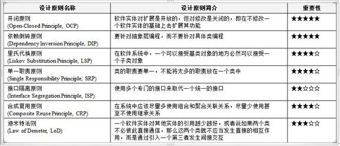

# KISS(Keep It Simple & Stupid)

> KISS(Keep It Simple & Stupid)：保持精简，并且看起来很“愚蠢”。

在软件开发中，一个系统会变得越来越庞大，**系统熵（复杂度）**会变得越来越大，导致我们越来越难以hold整个系统（智商问题¯\_(ツ)_/¯）。所以我们引入了**KISS原则**来使**系统熵(复杂度)**保持稳定的数值。

## 统一命名

一个好的统一命名风格，有利于系统的扩展和维护，**推荐驼峰命名法**。

## 使用静态语言

静态语言的合理使用，能最大程度的保证代码重构后的影藏问题，在编译期就可以fix。不过有些场合非常却不是这样子，比如说浏览器，Shell等。静态或者动态语言还是需要综合考量。

## 微服务架构设计

当系统变的越来越大的时候，我们不能简单的通过将单体架构运行在多个PC上做负载均衡来达到性能上的突破，而应该将整个集群看成一个系统，使用微服务的概念优化整体设计。

## 高内聚低耦合设计

### 高内聚

高内聚是指对程序中功能相近的点进行独立化, 如果两个模块之间的修改, 互不影响则说明模块之间是高内聚的。

高内聚意味可维护性，可重写性，因为模块对外部的依赖少（功能的完备性）。模块的内聚和其担当的职责成反比，即模块的职责越多，模块的内聚性越低。

如何划分出一个模块, 这就需要**关注点分离。**

### 低耦合

耦合是描述模块之间的依赖程度，如果一个模块的修改，都对另一个模块进行修改，则两模块之间是相互依赖耦合的，这种设计不是理想的设计。

低耦合是我们的设计目的，但是不存在没有耦合的程序。耦合是必须的，因为模块之间必须通信交互，不过可以**设计出依赖于不变或者不易变的接口**， 而不需要关注模块内的实现, 从而实现低耦合。

### 关注点分离

实现高内聚低耦合行之有效的方式：**关注点分离（SOC），将系统在不同层次[水平/垂直]上进行拆分, 形成功能不同没有重叠的模块。**

每个功能只关注一个方面（Aspect）保证模块之间功能没有或者尽量少的重复。

**模块化内部实现细节隐藏，只暴露必须的接口，使得模块之间依赖于抽象，达到稳定。**

分离关注点的思想存在于我们软件设计的各个领域。例如:

* 面向接口编程: 具体实现类的替换不影响上层业务逻辑
* 面向AOP编程: 把性能统计的代码都分离出来, 保证高内聚低耦合
* TCP/IP：TCP/IP是非常明显的**水平切分**模型，保证了互联网能运行在不同的介质上。IP层对应IP层，TCP层对应TCP层，使得逻辑上非常的清晰。**通过这种分层模型，在不修改TCP上层(如HTTP)和下层（如IP）的情况下，非常轻松简洁地实现了NET转换之类的TCP层小技巧**
* 前后端分离：在Web+App编程中，前后端分层是非常明显的**垂直切分**，两者仅仅通过RESTful API+JSON 交互，利于测试和扩张

通过对程序的关注点分离, 使得程序各个模块之间变得高内聚低耦合.

### 综合约束

在软件开发设计中, 高内聚低耦合原则的实现是还依赖于综合约束，且贯穿整个软件生命周期, 并且软件开发过程中切忌**过度设计**。

**综合约束：业务逻辑, 软件条件, 硬件条件, 性能指标, 语言, 具体编码环境等因素。**

### 面向对象设计

在面向对象的开发过程中，我们有一些软件设计上的原则：

通过这些原则我们可以非常方便的设计出**高内聚低耦合**的代码结构。

## 总结

**在开发过程中需要遵守KISS原则，使用一些方法/设计来达到降低系统熵，提高系统维护性的目的**。

## 参考

* [关注点分离之道](http://book.51cto.com/art/200801/64938.htm)
* [微服务架构会和分布式单体架构高度重合吗](http://www.infoq.com/cn/news/2016/02/services-distributed-monolith)
* [微服务架构成功之路](http://www.infoq.com/cn/news/2015/07/success-of-microservices)