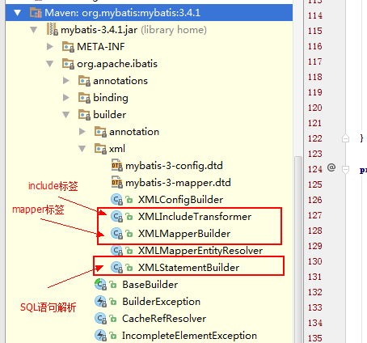
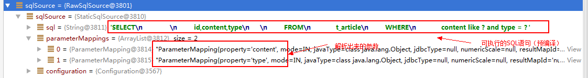
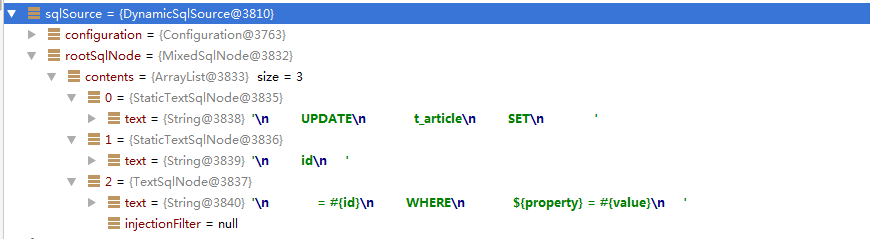
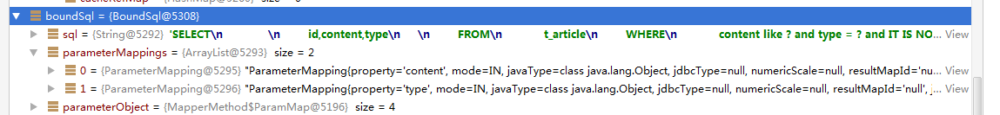
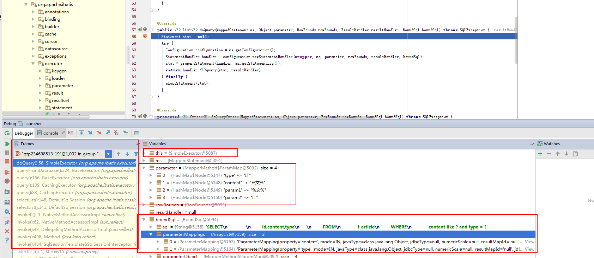
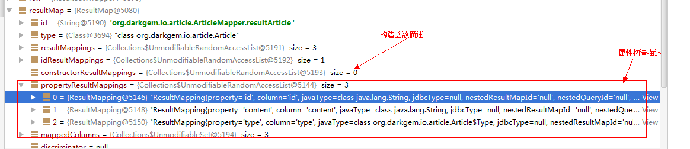
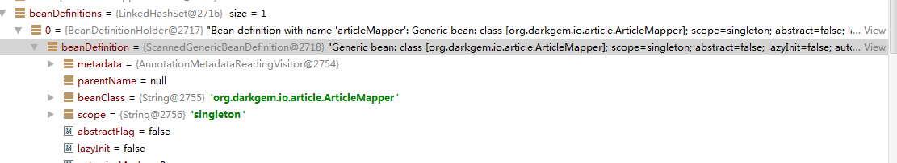

# 示例

MyBatis 是支持定制化 SQL、存储过程以及高级映射的优秀的持久层框架。MyBatis 避免了几乎所有的 JDBC 代码和手动设置参数以及获取结果集。
MyBatis 可以对配置和原生Map使用简单的 XML 或注解，将接口和 Java 的 POJOs(Plain Old Java Objects,普通的 Java对象)映射成数据库中的记录。


## 基础入门

### 项目结构

项目使用MVN构建，如下图：


### 安装

首先，我们先配置JAR依赖（MyBatis+MySQL+Log）：

```xml
<?xml version="1.0" encoding="UTF-8"?>
<project xmlns="http://maven.apache.org/POM/4.0.0"
         xmlns:xsi="http://www.w3.org/2001/XMLSchema-instance"
         xsi:schemaLocation="http://maven.apache.org/POM/4.0.0 http://maven.apache.org/xsd/maven-4.0.0.xsd">
    <modelVersion>4.0.0</modelVersion>

    <groupId>org.test</groupId>
    <artifactId>test</artifactId>
    <version>1.0-SNAPSHOT</version>
    <!--通用属性配置-->
    <properties>
        <mybatis-version>3.4.1</mybatis-version>
        <mysql-version>5.1.39</mysql-version>
        <slf4j-version>1.7.18</slf4j-version>
        <logback-version>1.1.7</logback-version>

    </properties>
    <dependencies>
        <!--mybatis-->
        <dependency>
            <groupId>org.mybatis</groupId>
            <artifactId>mybatis</artifactId>
            <version>3.4.1</version>
        </dependency>
        <!-- https://mvnrepository.com/artifact/mysql/mysql-connector-java -->
        <dependency>
            <groupId>mysql</groupId>
            <artifactId>mysql-connector-java</artifactId>
            <version>${mysql-version}</version>
        </dependency>
        <!--logback系列-->
        <dependency>
            <groupId>ch.qos.logback</groupId>
            <artifactId>logback-classic</artifactId>
            <version>${logback-version}</version>
        </dependency>
        <dependency>
            <groupId>ch.qos.logback</groupId>
            <artifactId>logback-core</artifactId>
            <version>${logback-version}</version>
        </dependency>
        <dependency>
            <groupId>ch.qos.logback</groupId>
            <artifactId>logback-access</artifactId>
            <version>${logback-version}</version>
        </dependency>

        <!--slf4j系列-->
        <dependency>
            <groupId>org.slf4j</groupId>
            <artifactId>jcl-over-slf4j</artifactId>
            <version>${slf4j-version}</version>
        </dependency>
        <dependency>
            <groupId>org.slf4j</groupId>
            <artifactId>log4j-over-slf4j</artifactId>
            <version>${slf4j-version}</version>
        </dependency>
        <dependency>
            <groupId>org.slf4j</groupId>
            <artifactId>jul-to-slf4j</artifactId>
            <version>${slf4j-version}</version>
        </dependency>
        <dependency>
            <groupId>org.slf4j</groupId>
            <artifactId>slf4j-api</artifactId>
            <version>${slf4j-version}</version>
        </dependency>
    </dependencies>

</project>
```

这样子，就完成了JAR的依赖配置。

### configuration

使用MyBatis 的时候，需要创建一个`configuration.xml`文件，主要是用来配置MyBatis的基础属性：

```xml
<?xml version="1.0" encoding="UTF-8" ?>
<!DOCTYPE configuration
        PUBLIC "-//mybatis.org//DTD Config 3.0//EN"
        "http://mybatis.org/dtd/mybatis-3-config.dtd">
<configuration>
    <!--基础配置-->
    <environments default="development">
        <environment id="development">
            <transactionManager type="JDBC"/>
            <dataSource type="POOLED">
                <property name="driver" value="com.mysql.jdbc.Driver"/>
                <property name="url" value="jdbc:mysql://localhost:3306/test?useUnicode=true&amp;characterEncoding=UTF-8"/>
                <property name="username" value="root"/>
                <property name="password" value="root"/>
            </dataSource>
        </environment>
    </environments>
    <!--扫描mapper目录-->
    <mappers>
        <package name="mapper"/>
    </mappers>
</configuration>

```

### Bean + Mapper

使用MyBatis的时候，需要编写Bean和Mapper，而Mapper是将数据库和Bean映射的描述：

```java

/**
 * Article.java
 */
package mapper;
public class Article {
    String id;
    String content;

    public String getId() {
        return id;
    }

    public void setId(String id) {
        this.id = id;
    }

    public String getContent() {
        return content;
    }

    public void setContent(String content) {
        this.content = content;
    }
}


/**
 * ArticleMapper.java
 */
package mapper;

import org.apache.ibatis.annotations.Results;
import org.apache.ibatis.annotations.Select;

import java.util.List;


public interface ArticleMapper {

    @Select("SELECT * FROM t_article")
    List<Article> selectAll();
}

```

而数据库的表结构为：


### 运行

运行如下代码：

```java

import mapper.Article;
import mapper.ArticleMapper;
import org.apache.ibatis.io.Resources;
import org.apache.ibatis.session.SqlSession;
import org.apache.ibatis.session.SqlSessionFactory;
import org.apache.ibatis.session.SqlSessionFactoryBuilder;

import java.io.InputStream;

/**
 * DO
 */
public class App {
    public static void main(String[] args) throws Exception {
        //读取配置
        String resource = "configuration.xml";
        InputStream inputStream = Resources.getResourceAsStream(resource);
        //构建SqlSessionFactory，全局唯一
        SqlSessionFactory sqlSessionFactory = new SqlSessionFactoryBuilder().build(inputStream);
        //打开一个会话，相当于JDBC连接，线程不安全
        SqlSession sqlSession = sqlSessionFactory.openSession();
        //获取一个Mapper
        ArticleMapper articleMapper = sqlSession.getMapper(ArticleMapper.class);
        //SELECT
        for (Article article : articleMapper.selectAll()) {
            System.out.println(String.format("ID=%s，CONTENT=%s", article.getId(), article.getContent()));
        }
    }
}

```
运行结果：

```
11:17:58.931 [main] DEBUG org.apache.ibatis.logging.LogFactory - Logging initialized using 'class org.apache.ibatis.logging.slf4j.Slf4jImpl' adapter.
11:17:59.045 [main] DEBUG org.apache.ibatis.datasource.pooled.PooledDataSource - PooledDataSource forcefully closed/removed all connections.
11:17:59.045 [main] DEBUG org.apache.ibatis.datasource.pooled.PooledDataSource - PooledDataSource forcefully closed/removed all connections.
11:17:59.046 [main] DEBUG org.apache.ibatis.datasource.pooled.PooledDataSource - PooledDataSource forcefully closed/removed all connections.
11:17:59.046 [main] DEBUG org.apache.ibatis.datasource.pooled.PooledDataSource - PooledDataSource forcefully closed/removed all connections.
11:17:59.053 [main] DEBUG org.apache.ibatis.io.VFS - Class not found: org.jboss.vfs.VFS
11:17:59.053 [main] DEBUG org.apache.ibatis.io.JBoss6VFS - JBoss 6 VFS API is not available in this environment.
11:17:59.054 [main] DEBUG org.apache.ibatis.io.VFS - Class not found: org.jboss.vfs.VirtualFile
11:17:59.055 [main] DEBUG org.apache.ibatis.io.VFS - VFS implementation org.apache.ibatis.io.JBoss6VFS is not valid in this environment.
11:17:59.055 [main] DEBUG org.apache.ibatis.io.VFS - Using VFS adapter org.apache.ibatis.io.DefaultVFS
11:17:59.056 [main] DEBUG org.apache.ibatis.io.DefaultVFS - Find JAR URL: file:/C:/Users/Administrator/Desktop/untitled/target/classes/mapper
11:17:59.056 [main] DEBUG org.apache.ibatis.io.DefaultVFS - Not a JAR: file:/C:/Users/Administrator/Desktop/untitled/target/classes/mapper
11:17:59.116 [main] DEBUG org.apache.ibatis.io.DefaultVFS - Reader entry: Article.class
11:17:59.116 [main] DEBUG org.apache.ibatis.io.DefaultVFS - Reader entry: ArticleMapper.class
11:17:59.116 [main] DEBUG org.apache.ibatis.io.DefaultVFS - Listing file:/C:/Users/Administrator/Desktop/untitled/target/classes/mapper
11:17:59.116 [main] DEBUG org.apache.ibatis.io.DefaultVFS - Find JAR URL: file:/C:/Users/Administrator/Desktop/untitled/target/classes/mapper/Article.class
11:17:59.116 [main] DEBUG org.apache.ibatis.io.DefaultVFS - Not a JAR: file:/C:/Users/Administrator/Desktop/untitled/target/classes/mapper/Article.class
11:17:59.117 [main] DEBUG org.apache.ibatis.io.DefaultVFS - Reader entry: ����   1 
11:17:59.117 [main] DEBUG org.apache.ibatis.io.DefaultVFS - Find JAR URL: file:/C:/Users/Administrator/Desktop/untitled/target/classes/mapper/ArticleMapper.class
11:17:59.117 [main] DEBUG org.apache.ibatis.io.DefaultVFS - Not a JAR: file:/C:/Users/Administrator/Desktop/untitled/target/classes/mapper/ArticleMapper.class
11:17:59.118 [main] DEBUG org.apache.ibatis.io.DefaultVFS - Reader entry: ����   1  
11:17:59.118 [main] DEBUG org.apache.ibatis.io.ResolverUtil - Checking to see if class mapper.Article matches criteria [is assignable to Object]
11:17:59.118 [main] DEBUG org.apache.ibatis.io.ResolverUtil - Checking to see if class mapper.ArticleMapper matches criteria [is assignable to Object]
11:17:59.178 [main] DEBUG org.apache.ibatis.transaction.jdbc.JdbcTransaction - Opening JDBC Connection
Mon Jul 18 11:17:59 CST 2016 WARN: Establishing SSL connection without server's identity verification is not recommended. According to MySQL 5.5.45+, 5.6.26+ and 5.7.6+ requirements SSL connection must be established by default if explicit option isn't set. For compliance with existing applications not using SSL the verifyServerCertificate property is set to 'false'. You need either to explicitly disable SSL by setting useSSL=false, or set useSSL=true and provide truststore for server certificate verification.
11:17:59.457 [main] DEBUG org.apache.ibatis.datasource.pooled.PooledDataSource - Created connection 1061804750.
11:17:59.457 [main] DEBUG org.apache.ibatis.transaction.jdbc.JdbcTransaction - Setting autocommit to false on JDBC Connection [com.mysql.jdbc.JDBC4Connection@3f49dace]
11:17:59.460 [main] DEBUG mapper.ArticleMapper.selectAll - ==>  Preparing: SELECT * FROM t_article 
11:17:59.504 [main] DEBUG mapper.ArticleMapper.selectAll - ==> Parameters: 
11:17:59.531 [main] DEBUG mapper.ArticleMapper.selectAll - <==      Total: 2

ID=1，CONTENT=文章1
ID=2，CONTENT=文章2

```

可以发现，已经成功的读取到数据库中的数据到JavaBean中了。

项目地址：[simple-mybatis-project](simple-mybatis-project.zip)

## Spring集成

在使用MyBatis的时候，通常是和Spring框架一起使用的。MyBatis和Spring的集成是非常方便的，只需要几个步骤即可。

### 项目结构


### 安装

首先，我们需要引入最新的mybatis-spring的jar包：

```
<!--mybatis-spring -->
<dependency>
    <groupId>org.mybatis</groupId>
    <artifactId>mybatis-spring</artifactId>
    <version>1.3.0</version>
</dependency>
```

### 配置

mybatis和spring集成的时候，我们就不需要MyBatis的配置文件(configuration.xmk)了，只需要在Spring
的配置文件中，引入MyBatis#SqlSessionFactorty的Bean配置即可，如下是比较完成的配置：

```
    <!--注意，这里还需要添加dataSource-->
    <!--事务性-->
    <bean id="transactionManager" class="org.springframework.jdbc.datasource.DataSourceTransactionManager">
        <property name="dataSource" ref="dataSource"/>
    </bean>
    <!--mybatis -->
    <bean id="sqlSessionFactory" class="org.mybatis.spring.SqlSessionFactoryBean">
        <!--注入dataSource-->
        <property name="dataSource" ref="dataSource" />
        <--扫描org.darkgem.io下面的所有TypeHandler-->
        <property name="typeHandlersPackage" value="org.darkgem.io"/>
    </bean>
    <!--mapper-scan-->
    <bean class="org.mybatis.spring.mapper.MapperScannerConfigurer">
        <!--扫描所有org.darkgem.io下面的Mapper接口-->
        <property name="basePackage" value="org.darkgem.io" />
    </bean>
```

这样子，就配置了MyBatis。

### Bean + Mapper

如下是MyBatis的Bean以及相应的Mapper和SQL Mapper：

```


/**
 * Article.java
 */
package org.darkgem.io.article;

public class Article {
    String id;
    String content;
    Type type;

    public Article(String id, String content, Type type) {
        this.id = id;
        this.content = content;
        this.type = type;
    }

    public String getId() {
        return id;
    }

    public void setId(String id) {
        this.id = id;
    }

    public String getContent() {
        return content;
    }

    public void setContent(String content) {
        this.content = content;
    }

    public Type getType() {
        return type;
    }

    public void setType(Type type) {
        this.type = type;
    }

    public enum Type {
        IT,
        LIFT;
    }
}


/**
 * ArticleMapper.java
 */

package org.darkgem.io.article;

import org.apache.ibatis.annotations.Param;
import org.apache.ibatis.type.JdbcType;
import org.apache.ibatis.type.MappedTypes;
import org.apache.ibatis.type.TypeHandler;

import java.sql.CallableStatement;
import java.sql.PreparedStatement;
import java.sql.ResultSet;
import java.sql.SQLException;
import java.util.List;


public interface ArticleMapper {

    List<Article> selectList(@Param("content") String content, @Param("type") Article.Type type);

    /**
     * 类型转换
     */
    @MappedTypes(Article.Type.class)
    class ArticleTypeHandler implements TypeHandler<Article.Type> {
        @Override
        public void setParameter(PreparedStatement ps, int i, Article.Type parameter, JdbcType jdbcType) throws SQLException {
            ps.setString(i, parameter.toString());
        }

        @Override
        public Article.Type getResult(ResultSet rs, String columnName) throws SQLException {
            return Article.Type.valueOf(rs.getString(columnName));
        }

        @Override
        public Article.Type getResult(ResultSet rs, int columnIndex) throws SQLException {
            return Article.Type.valueOf(rs.getString(columnIndex));
        }

        @Override
        public Article.Type getResult(CallableStatement cs, int columnIndex) throws SQLException {
            return Article.Type.valueOf(cs.getString(columnIndex));
        }
    }
}


<!--ArticleMapper.xml-->
<?xml version="1.0" encoding="UTF-8" ?>
<!DOCTYPE mapper
        PUBLIC "-//mybatis.org//DTD Mapper 3.0//EN"
        "http://mybatis.org/dtd/mybatis-3-mapper.dtd">
<mapper namespace="org.darkgem.io.article.ArticleMapper">

    <sql id="columns">
        id,content,type
    </sql>

    <resultMap id="resultArticle" type="org.darkgem.io.article.Article">
        <constructor>
            <idArg column="id" javaType="String"/>
            <arg column="content" javaType="String"/>
            <arg column="type" javaType="org.darkgem.io.article.Article$Type"/>
        </constructor>
    </resultMap>
    <select id="selectList" resultMap="resultArticle">
        SELECT
            <include refid="columns"/>
        FROM
            t_article
        WHERE
            content like #{content} and type = #{type}
    </select>
</mapper>


/**
 * ArticleIo.java
 */
package org.darkgem.io.article;

import org.springframework.beans.factory.annotation.Autowired;
import org.springframework.stereotype.Component;

import java.util.List;

@Component
public class ArticleIo {

    //这里直接引入Mapper进行调用，它是线程安全的
    @Autowired
    ArticleMapper articleMapper;

    public List<Article> selectList(String key, Article.Type type) {
        return articleMapper.selectList('%' + key + '%', type);
    }
}


```

注意，在`ArticleMapper.java`中，我们配置了关于Article中Type这个`枚举`类型的处理器。
通过TypeHandler，我们可以完成Java和Jdbc类型的转换。

### Controller

现在，来配置一下Spring MVC 调用MyBatis的代码：


```java

package org.darkgem.web.mvc.main;

import org.darkgem.io.article.Article;
import org.darkgem.io.article.ArticleIo;
import org.darkgem.web.support.handler.Token;
import org.darkgem.web.support.msg.Message;
import org.springframework.beans.factory.annotation.Autowired;
import org.springframework.stereotype.Controller;
import org.springframework.transaction.annotation.Transactional;
import org.springframework.web.bind.annotation.RequestMapping;

@Controller
@RequestMapping("/main/MainCtrl")
public class MainCtrl {
    @Autowired
    ArticleIo articleIo;

    @Transactional
    @RequestMapping("/ask")
    public Object ask(@Token String token) {
        return Message.okMessage(articleIo.selectList(token, Article.Type.IT));
    }
}

```

### 运行


截图：


日志：

```

2016-07-18 12:08:23.606 [qtp6566818-15] DEBUG o.s.web.servlet.DispatcherServlet - DispatcherServlet with name 'springMVC' processing GET request for [/main/MainCtrl/ask.do]
2016-07-18 12:08:23.607 [qtp6566818-15] DEBUG o.s.w.s.m.m.a.RequestMappingHandlerMapping - Looking up handler method for path /main/MainCtrl/ask.do
2016-07-18 12:08:23.608 [qtp6566818-15] DEBUG o.s.w.s.m.m.a.RequestMappingHandlerMapping - Returning handler method [public java.lang.Object org.darkgem.web.mvc.main.MainCtrl.ask(java.lang.String)]
2016-07-18 12:08:23.608 [qtp6566818-15] DEBUG o.s.b.f.s.DefaultListableBeanFactory - Returning cached instance of singleton bean 'mainCtrl'
2016-07-18 12:08:23.608 [qtp6566818-15] DEBUG o.s.web.servlet.DispatcherServlet - Last-Modified value for [/main/MainCtrl/ask.do] is: -1
2016-07-18 12:08:23.609 [qtp6566818-15] DEBUG o.s.j.d.DataSourceTransactionManager - Creating new transaction with name [org.darkgem.web.mvc.main.MainCtrl.ask]: PROPAGATION_REQUIRED,ISOLATION_DEFAULT; ''
2016-07-18 12:08:23.609 [qtp6566818-15] DEBUG druid.sql.Statement - {conn-10005, stmt-20007} created
2016-07-18 12:08:23.611 [qtp6566818-15] DEBUG druid.sql.Statement - {conn-10005, stmt-20007, rs-50007} query executed. 0.692501 millis. 
SELECT 'x'
2016-07-18 12:08:23.611 [qtp6566818-15] DEBUG druid.sql.ResultSet - {conn-10005, stmt-20007, rs-50007} open
2016-07-18 12:08:23.611 [qtp6566818-15] DEBUG druid.sql.ResultSet - {conn-10005, stmt-20007, rs-50007} Header: [x]
2016-07-18 12:08:23.611 [qtp6566818-15] DEBUG druid.sql.ResultSet - {conn-10005, stmt-20007, rs-50007} closed
2016-07-18 12:08:23.612 [qtp6566818-15] DEBUG druid.sql.Statement - {conn-10005, stmt-20007} closed
2016-07-18 12:08:23.612 [qtp6566818-15] DEBUG druid.sql.Connection - {conn-10005} pool-connect
2016-07-18 12:08:23.612 [qtp6566818-15] DEBUG o.s.j.d.DataSourceTransactionManager - Acquired Connection [com.alibaba.druid.proxy.jdbc.ConnectionProxyImpl@213795f2] for JDBC transaction
2016-07-18 12:08:23.612 [qtp6566818-15] DEBUG o.s.j.d.DataSourceTransactionManager - Switching JDBC Connection [com.alibaba.druid.proxy.jdbc.ConnectionProxyImpl@213795f2] to manual commit
2016-07-18 12:08:23.612 [qtp6566818-15] DEBUG druid.sql.Connection - {conn-10005} setAutoCommit false
2016-07-18 12:08:23.614 [qtp6566818-15] DEBUG org.mybatis.spring.SqlSessionUtils - Creating a new SqlSession
2016-07-18 12:08:23.614 [qtp6566818-15] DEBUG org.mybatis.spring.SqlSessionUtils - Registering transaction synchronization for SqlSession [org.apache.ibatis.session.defaults.DefaultSqlSession@669462bf]
2016-07-18 12:08:23.614 [qtp6566818-15] DEBUG o.m.s.t.SpringManagedTransaction - JDBC Connection [com.alibaba.druid.proxy.jdbc.ConnectionProxyImpl@213795f2] will be managed by Spring
2016-07-18 12:08:23.614 [qtp6566818-15] DEBUG o.d.i.a.ArticleMapper.selectList - ==>  Preparing: SELECT id,content,type FROM t_article WHERE content like ? and type = ? 
2016-07-18 12:08:23.615 [qtp6566818-15] DEBUG druid.sql.Statement - {conn-10005, pstmt-20008} created. 
SELECT
             
        id,content,type
     
        FROM
            t_article
        WHERE
            content like ? and type = ?
2016-07-18 12:08:23.615 [qtp6566818-15] DEBUG o.d.i.a.ArticleMapper.selectList - ==> Parameters: %1%(String), IT(String)
2016-07-18 12:08:23.615 [qtp6566818-15] DEBUG druid.sql.Statement - {conn-10005, pstmt-20008} Parameters : [%1%, IT]
2016-07-18 12:08:23.615 [qtp6566818-15] DEBUG druid.sql.Statement - {conn-10005, pstmt-20008} Types : [VARCHAR, VARCHAR]
2016-07-18 12:08:23.619 [qtp6566818-15] DEBUG druid.sql.Statement - {conn-10005, pstmt-20008} executed. 3.417743 millis. 
SELECT
             
        id,content,type
     
        FROM
            t_article
        WHERE
            content like ? and type = ?
2016-07-18 12:08:23.619 [qtp6566818-15] DEBUG druid.sql.ResultSet - {conn-10005, pstmt-20008, rs-50008} open
2016-07-18 12:08:23.619 [qtp6566818-15] DEBUG druid.sql.ResultSet - {conn-10005, pstmt-20008, rs-50008} Header: [id, content, type]
2016-07-18 12:08:23.619 [qtp6566818-15] DEBUG druid.sql.ResultSet - {conn-10005, pstmt-20008, rs-50008} Result: [1, 文章1, IT]
2016-07-18 12:08:23.620 [qtp6566818-15] DEBUG o.d.i.a.ArticleMapper.selectList - <==      Total: 1
2016-07-18 12:08:23.621 [qtp6566818-15] DEBUG druid.sql.ResultSet - {conn-10005, pstmt-20008, rs-50008} closed
2016-07-18 12:08:23.622 [qtp6566818-15] DEBUG druid.sql.Statement - {conn-10005, pstmt-20008} closed
2016-07-18 12:08:23.622 [qtp6566818-15] DEBUG org.mybatis.spring.SqlSessionUtils - Releasing transactional SqlSession [org.apache.ibatis.session.defaults.DefaultSqlSession@669462bf]
2016-07-18 12:08:23.622 [qtp6566818-15] DEBUG org.mybatis.spring.SqlSessionUtils - Transaction synchronization committing SqlSession [org.apache.ibatis.session.defaults.DefaultSqlSession@669462bf]
2016-07-18 12:08:23.622 [qtp6566818-15] DEBUG org.mybatis.spring.SqlSessionUtils - Transaction synchronization deregistering SqlSession [org.apache.ibatis.session.defaults.DefaultSqlSession@669462bf]
2016-07-18 12:08:23.622 [qtp6566818-15] DEBUG org.mybatis.spring.SqlSessionUtils - Transaction synchronization closing SqlSession [org.apache.ibatis.session.defaults.DefaultSqlSession@669462bf]
2016-07-18 12:08:23.622 [qtp6566818-15] DEBUG o.s.j.d.DataSourceTransactionManager - Initiating transaction commit
2016-07-18 12:08:23.622 [qtp6566818-15] DEBUG o.s.j.d.DataSourceTransactionManager - Committing JDBC transaction on Connection [com.alibaba.druid.proxy.jdbc.ConnectionProxyImpl@213795f2]
2016-07-18 12:08:23.624 [qtp6566818-15] DEBUG druid.sql.Connection - {conn-10005} commited
2016-07-18 12:08:23.624 [qtp6566818-15] DEBUG druid.sql.Connection - {conn-10005} setAutoCommit true
2016-07-18 12:08:23.625 [qtp6566818-15] DEBUG o.s.j.d.DataSourceTransactionManager - Releasing JDBC Connection [com.alibaba.druid.proxy.jdbc.ConnectionProxyImpl@213795f2] after transaction
2016-07-18 12:08:23.625 [qtp6566818-15] DEBUG o.s.jdbc.datasource.DataSourceUtils - Returning JDBC Connection to DataSource
2016-07-18 12:08:23.625 [qtp6566818-15] DEBUG druid.sql.Connection - {conn-10005} pool-recycle
2016-07-18 12:08:23.626 [qtp6566818-15] DEBUG o.s.w.s.v.ContentNegotiatingViewResolver - Requested media types are [text/html, application/xhtml+xml, image/webp, application/xml;q=0.9, */*;q=0.8] based on Accept header types and producible media types [*/*])
2016-07-18 12:08:23.627 [qtp6566818-15] DEBUG o.s.w.s.v.ContentNegotiatingViewResolver - Returning [com.alibaba.fastjson.support.spring.FastJsonJsonView: name 'com.alibaba.fastjson.support.spring.FastJsonJsonView#35aea049'] based on requested media type '*/*;q=0.8'
2016-07-18 12:08:23.627 [qtp6566818-15] DEBUG o.s.web.servlet.DispatcherServlet - Rendering view [com.alibaba.fastjson.support.spring.FastJsonJsonView: name 'com.alibaba.fastjson.support.spring.FastJsonJsonView#35aea049'] in DispatcherServlet with name 'springMVC'
2016-07-18 12:08:23.627 [qtp6566818-15] DEBUG o.s.web.servlet.DispatcherServlet - Successfully completed request


```

可以发现，MyBatis已经和Spring集成成功。

项目地址：[java-fast-framework](https://github.com/darkfireworld/java-fast-framework.git)

# 命名空间

在MyBatis中，Mapper强制使用命名空间。使用命名空间有利于隔离Mapper。

如下是一个`Mapper Interface + Mapper XML`的实践：

代码结构：


我们在`Mapper Interface` (ArticleMapper.java)中定义使用的API，以及参数名称：

```java
public interface ArticleMapper {

    List<Article> selectList(@Param("content") String content, @Param("type") Article.Type type);
}


```

而在`Mapper XML(`ArticleMapper.xml)中定义具体的SQL语句，注意该XML的命名需要
和`Mapper Interface`一致：

```xml

<?xml version="1.0" encoding="UTF-8" ?>
<!DOCTYPE mapper
        PUBLIC "-//mybatis.org//DTD Mapper 3.0//EN"
        "http://mybatis.org/dtd/mybatis-3-mapper.dtd">

<!--命名空间需要和ArticleMapper.java的限定名一致-->
<mapper namespace="org.darkgem.io.article.ArticleMapper">

    <sql id="columns">
        id,content
    </sql>

    <resultMap id="resultArticle" type="org.darkgem.io.article.Article">
        <constructor>
            <idArg column="id" javaType="String"/>
            <arg column="content" javaType="String"/>
        </constructor>
    </resultMap>
    <select id="selectList" resultMap="resultArticle">
        SELECT
            <include refid="columns"/>
        FROM
            t_article
        WHERE
            content like #{content}
    </select>
</mapper>

```

注意，Mapper元素的命名空间需要和ArticleMapper.class的限定名一致。

# 生命周期

在使用MyBatis的时候，我们需要关注各个关键组件的生命周期，这样子才能编写出线程安全的代码。

> `依赖注入框架(Spring)`可以创建线程安全的、基于事务的 SqlSession 和映射器（mapper）并将它们直接
> 注入到你的 bean 中，因此可以直接忽略它们的生命周期。如果对如何通过依赖注入框架来使
> 用 MyBatis 感兴趣可以研究一下 `MyBatis-Spring` 或 `MyBatis-Guice` 两个子项目。

## SqlSessionFactoryBuilder

这个类可以被实例化、使用和丢弃，一旦创建了 SqlSessionFactory，就不再需要它了。因此 
SqlSessionFactoryBuilder 实例的最佳范围是方法范围（也就是局部方法变量）。你可以重
用 SqlSessionFactoryBuilder 来创建多个 SqlSessionFactory 实例，但是最好还是不要让
其一直存在以保证所有的 XML 解析资源开放给更重要的事情。

## SqlSessionFactory

SqlSessionFactory 一旦被创建就应该在应用的运行期间一直存在，没有任何理由对它进行清除或重
建。使用 SqlSessionFactory 的最佳实践是在应用运行期间不要重复创建多次，多次重建 
SqlSessionFactory 被视为一种代码“坏味道（bad smell）”。因此 SqlSessionFactory 的最佳范围
是应用范围。有很多方法可以做到，最简单的就是使用单例模式或者静态单例模式。

## SqlSession

每个线程都应该有它自己的 SqlSession 实例。SqlSession 的实例不是线程安全的，因此是不能
被共享的，所以它的最佳的范围是请求或方法范围。绝对不能将 SqlSession 实例的引用放在一
个类的静态域，甚至一个类的实例变量也不行。也绝不能将 SqlSession 实例的引用放在任何类型
的管理范围中，比如 Serlvet 架构中的 HttpSession。如果你现在正在使用一种 Web 框架，要考
虑 SqlSession 放在一个和 HTTP 请求对象相似的范围中。换句话说，每次收到的 HTTP 请求，就
可以打开一个 SqlSession，返回一个响应，就关闭它。这个关闭操作是很重要的，你应该把这个
关闭操作放到 finally 块中以确保每次都能执行关闭。下面的示例就是一个确保 SqlSession 关闭
的标准模式：

```java

SqlSession session = sqlSessionFactory.openSession();
try {
  // do work
} finally {
  session.close();
}

```

在你的所有的代码中一致性地使用这种模式来保证所有数据库资源都能被正确地关闭。

## 映射器实例（Mapper Instances）

映射器是创建用来绑定映射语句的接口。映射器接口的实例是从 SqlSession 中获得的。因此从技术
层面讲，映射器实例的最大范围是和 SqlSession 相同的，因为它们都是从 SqlSession 里被请求
的。尽管如此，映射器实例的最佳范围是方法范围。也就是说，映射器实例应该在调用它们的方法
中被请求，用过之后即可废弃。并不需要显式地关闭映射器实例，尽管在整个请求范围
（request scope）保持映射器实例也不会有什么问题，但是很快你会发现，像 SqlSession 一样，
在这个范围上管理太多的资源的话会难于控制。所以要保持简单，最好把映射器放在方法范围
（method scope）内。下面的示例就展示了这个实践：

```java

SqlSession session = sqlSessionFactory.openSession();
try {
  BlogMapper mapper = session.getMapper(BlogMapper.class);
  // do work
} finally {
  session.close();
}

```


# 源码分析

## 初始化

本小节，将会梳理一下MyBatis的初始化过程中，几个重要的概念。

### SqlSessionFactory

MyBatis的初始化，就是为了构造一个`SqlSessionFactory`对象。这个对象可以通过XML或者Java代码进行构造：

**通过Java代码进行构造：**

```java
DataSource dataSource = BlogDataSourceFactory.getBlogDataSource();
TransactionFactory transactionFactory = new JdbcTransactionFactory();
Environment environment = new Environment("development", transactionFactory, dataSource);
Configuration configuration = new Configuration(environment);
configuration.addMapper(BlogMapper.class);
SqlSessionFactory sqlSessionFactory = new SqlSessionFactoryBuilder().build(configuration);

```

**通过XML构造`SqlSessionFactory`对象：**

运行代码：

```java

String resource = "org/mybatis/example/mybatis-config.xml";
InputStream inputStream = Resources.getResourceAsStream(resource);
sqlSessionFactory = new SqlSessionFactoryBuilder().build(inputStream);

```

配置文件 configuration.xml:

```xml

<?xml version="1.0" encoding="UTF-8" ?>
<!DOCTYPE configuration
  PUBLIC "-//mybatis.org//DTD Config 3.0//EN"
  "http://mybatis.org/dtd/mybatis-3-config.dtd">
<configuration>
  <environments default="development">
    <environment id="development">
      <transactionManager type="JDBC"/>
      <dataSource type="POOLED">
        <property name="driver" value="${driver}"/>
        <property name="url" value="${url}"/>
        <property name="username" value="${username}"/>
        <property name="password" value="${password}"/>
      </dataSource>
    </environment>
  </environments>
  <mappers>
    <mapper resource="org/mybatis/example/BlogMapper.xml"/>
  </mappers>
</configuration>

```

注意：使用`configuration.xml`配置的时候，**配置的属性要和DTD(/org/apache/ibatis/builder/xml/mybatis-3-mapper.dtd)顺序一致**，否则MyBatis会报错。


通过构造`SqlSessionFactory`对象，我们可以设置：

1. 基础功能(settings)：二级缓存`，`lazy load`...
2. 别名(typeAliases)
3. 类型处理器(typeHandlers)
4. 数据源和事务(environments)
5. 映射器(mappers)
6. ...

一般来说，一个应用中，只需要存在一个`SqlSessionFactory`单例就可以了。

### 别名

MyBatis使用别名的过程如下(`TypeAliasRegistry#resolveAlias`)：

1. Mapper.xml中给定TypeName='org.darkfireworld.Model'
2. MyBatis首先对比`typeAliasesMap`中是否存在`org.darkfireworld.model`这个别名[忽略大小写]所对应的Class。
3. 如果存在，则返回该Class，否则调用`Class.forName()`解析TypeName，然后获取具体的Class。

注意：如果为内部类，则需要使用`org.darkfireworld.Model$Type`引用。

当然，MyBatis已经预定义了一些比较常见的别名：`hashmap`,`list`,`int`...


### 数据源和事务

在运行demo的时候，我们通过`environments`标签可以配置一个简单的事务管理：

```

    <!--基础配置-->
    <environments default="development">
        <environment id="development">
            <transactionManager type="JDBC"/>
            <dataSource type="POOLED">
                <property name="driver" value="com.mysql.jdbc.Driver"/>
                <property name="url" value="jdbc:mysql://localhost:3306/test?useUnicode=true&amp;characterEncoding=UTF-8"/>
                <property name="username" value="root"/>
                <property name="password" value="root"/>
            </dataSource>
        </environment>
    </environments>
    
```

这个配置，对于运行demo来说，已经足够了。

### 类型处理器

无论是 MyBatis 在预处理语句（PreparedStatement）中设置一个参数时，还是从结果集中取出一个
值时， 都会用类型处理器将获取的值以合适的方式转换成 Java 类型。

通过`typeHandlers`，可以配置Java<->Jdbc类型转换器。所以，MyBatis调用`TypeHandler`的时机为：

1. SQL参数bind
2. resultMap参数处理。

在MyBatis已经预定义了一些`TypeHandler`：

1. Boolean
2. String
3. Integer
4. Long
5. Date
6. ...

基本上，常见的Java类型的Handler都已经有了。

注意：针对`枚举类型`，其实MyBatis也提供了默认的枚举处理器`EnumTypeHandler`，这个枚举处理器支持
Enum.name() 和 Enum.valueOf()转换。

有时候，我们也需要自定义一些`TypeHander`。首先，我们定一个`TypeHandler`：

```java

@MappedTypes(MyType.class)
public class MyTypeHandler implements TypeHandler<MyType> {

  @Override
  public void setNonNullParameter(PreparedStatement ps, int i, MyType parameter, JdbcType jdbcType) throws SQLException {
    ps.setString(i, parameter.toString());
  }

  @Override
  public MyType getNullableResult(ResultSet rs, String columnName) throws SQLException {
    return new MyType(rs.getString(columnName));
  }

  @Override
  public MyType getNullableResult(ResultSet rs, int columnIndex) throws SQLException {
    return new MyType(rs.getString(columnIndex));
  }

  @Override
  public MyType getNullableResult(CallableStatement cs, int columnIndex) throws SQLException {
    return new MyType(cs.getString(columnIndex));
  }
}

```

需要注意：

1. 类需要实现`TypeHandler`接口。
2. 需要添加注解`@MappedTypes`，表明对应Java中的类型。

然后，我们将这个Handler注册到MyBatis中：

```xml

<typeHandlers>
   <typeHandler handler="org.darkfireworld.MyTypeHandler"/>
</typeHandlers>

```

或者，通过扫描注册(推荐)：

```xml

<typeHandlers>
  <package name="org.darkfireworld"/>
</typeHandlers>

```

通过自定义`TypeHandler`，我们可以优雅的处理类型转换的问题，比如说：
`MySQL enum('TRUE','FALSE')<-> Java Boolean `的转换。


接下来，来分析一下`TypeHandlerRegistry`，这个TypeHandler注册类。`TypeHandlerRegistry`主要
实现了两个功能：

1. 注册具体的`TypeHandler`。
2. 通过JavaType和JdbcType获取具体的`TypeHandler`。

**注册流程如下(扫描报名类型)：**

```

scan-pack 
    |
register Class , which implements TypeHandler Interface
    |
read @MappedTypes ,if unset then set JavaType is null
    |
read @MappedJdbcTypes, if unset the set JdbcType is null
    |
register Instance to TYPE_HANDLER_MAP<JavaType,JdbcType>

```

所以，我们需要注意设置@MappedTypes属性，避免MyBatis在Java<->Jdbc转换的时候，
无法查询到相应的`TypeHandler`。

**获取具体的TypeHandler流程如下：**

```

private <T> TypeHandler<T> getTypeHandler(Type type, JdbcType jdbcType) {
    //读取TYPE_HANDLER_MAP中的handler，注意如果type=null，
    //则无法读取，因为根本不能注册null这个类型
    Map<JdbcType, TypeHandler<?>> jdbcHandlerMap = TYPE_HANDLER_MAP.get(type);
    TypeHandler<?> handler = null;
    if (jdbcHandlerMap != null) {
        //查询到存在JavaType指向的HandlerMaper，进一步确认支持的JdbcType
        handler = jdbcHandlerMap.get(jdbcType);
        if (handler == null) {
            handler = jdbcHandlerMap.get(null);
        }
        if (handler == null) {
            // #591
            handler = pickSoleHandler(jdbcHandlerMap);
        }
    }
    //如果无法查询到，则判断是否为枚举类型，如果是的话，则使用默认的枚举处理器处理。
    if (handler == null && type != null && type instanceof Class && Enum.class.isAssignableFrom((Class<?>) type)) {
        handler = new EnumTypeHandler((Class<?>) type);
    }
    // type drives generics here
    return (TypeHandler<T>) handler;
}
```

**注意：通过JavaType和JdbcType获取一个TypeHandler的时候，如果JavaType为enum，且`TypeHandlerRegistry`中没有注册相对应的`TypeHandler`，则会
返回`EnumTypeHandler((Class<?>) type)`。**

### Mapper

Mapper是MyBatis的关键概念，通过Mapper，可以将Java和Jdbc以及Sql结合起来。


关于Interface和Xml 类型的Mapper：

1. Mapper Interface 用于规范Java代码调用MyBatis语句。
2. Mapper Xml 是MyBatis的灵魂，而Mapper Interface 就是套在Mapper Xml外面的一层外壳。

Mapper的注册通常有如下几种方式：

1. `<mapper resource="org/mybatis/builder/AuthorMapper.xml"/>`，引入Mapper的XML。
2. `<mapper class="org.mybatis.builder.AuthorMapper"/>`，引入Mapper的Interface。
3. `<package name="org.mybatis.builder"/>`，注册某个包下所有的Mapper Interface。

通常，我们使用第三种，可以节约许多工作量。接下来，我们来讲解**方式三**是如何运行的。

首先，MyBatis根据配置，调用MapperRegistry#addMappers(String packageName, Class<?> superType)，
分析指定目录下，所有父类为某个对象的类型：

```java

  public void addMappers(String packageName, Class<?> superType) {
    ResolverUtil<Class<?>> resolverUtil = new ResolverUtil<Class<?>>();
    //解析，指定包下，所有父类为superType的类型
    resolverUtil.find(new ResolverUtil.IsA(superType), packageName);
    Set<Class<? extends Class<?>>> mapperSet = resolverUtil.getClasses();
    for (Class<?> mapperClass : mapperSet) {
      //注册这个类为Mapper
      addMapper(mapperClass);
    }
  }
```

如下是注册Mapper Interface到MyBatis中的代码：

```java

//只有接口类型，才能进行注册
if (type.isInterface()) {
  //判断之前是否已经注册过
  if (hasMapper(type)) {
    throw new BindingException("Type " + type + " is already known to the MapperRegistry.");
  }
  boolean loadCompleted = false;
  try {
    //构造一个给SqlSession.getMapper(Type.class)使用的代理类，放在knownMappers中。
    knownMappers.put(type, new MapperProxyFactory<T>(type));
    // It's important that the type is added before the parser is run
    // otherwise the binding may automatically be attempted by the
    // mapper parser. If the type is already known, it won't try.
    MapperAnnotationBuilder parser = new MapperAnnotationBuilder(config, type);
    //解析这个注解类型的Mapper
    parser.parse();
    loadCompleted = true;
  } finally {
    if (!loadCompleted) {
      knownMappers.remove(type);
    }
  }
}

```

注意：通过上述代码，可以发现，注册Mapper Interface仅仅构造一个该接口的代理类到`knownMappers`中。然后，**尝试加载**相应的SQL配置（Xml或者注解）。

接下来，就是具体的解析Mapper的过程：

```java

  public void parse() {
    String resource = type.toString();
    //判断是否已经解析过
    if (!configuration.isResourceLoaded(resource)) {
      //加载对象Mapper Interface的XML配置，然后解析它
      loadXmlResource();
      configuration.addLoadedResource(resource);
      //设置当前Mapper Interface的命名空间，然后给注解类型的SQL语句使用
      assistant.setCurrentNamespace(type.getName());
      parseCache();
      parseCacheRef();
      Method[] methods = type.getMethods();
      for (Method method : methods) {
        try {
          // issue #237
          if (!method.isBridge()) {
            // 解析，注解类型的SQL语句，如@Select,@Update...
            parseStatement(method);
          }
        } catch (IncompleteElementException e) {
          configuration.addIncompleteMethod(new MethodResolver(this, method));
        }
      }
    }
    parsePendingMethods();
  }

```

来看一下`loadXmlResource`方法，通过这个方法，将会加载Mapper Interface同名的Mapper XML（假设存在）：


```java

  // Spring may not know the real resource name so we check a flag
    // to prevent loading again a resource twice
    // this flag is set at XMLMapperBuilder#bindMapperForNamespace
    if (!configuration.isResourceLoaded("namespace:" + type.getName())) {
      
      //假设Mapper Interface限定名为org.darkfireworld.ArticleMapper
      //则会尝试加载org.darkfireworld.ArticleMapper.xml 这个Mapper文件
      //如果，不存在，则直接返回，如果存在，则对这个Mapper xml进行解析
      
      String xmlResource = type.getName().replace('.', '/') + ".xml";
      InputStream inputStream = null;
      try {
        inputStream = Resources.getResourceAsStream(type.getClassLoader(), xmlResource);
      } catch (IOException e) {
        // ignore, resource is not required
      }
      if (inputStream != null) {
        // 构造一个 XMLMapperBuilder 解析器，注意这里给定了该Mapper Xml的空间命名一定为 type.getName() 
        // 注意：这里的 inputStream 会被DOM解析器自动关闭。
        XMLMapperBuilder xmlParser = new XMLMapperBuilder(inputStream, assistant.getConfiguration(), xmlResource, configuration.getSqlFragments(), type.getName());
        //解析该Mapper Xml 文件，然后注册SQL语句到 configuration 中
        xmlParser.parse();
      }
    }

```

注意：通过上述代码可以看到：当加载一个Mapper Interface的时候，会尝试加载`限定名(Mapper Interface).xml`。
如果存在这个Xml，则限制给Xml指向的命名空间为`限定名(Mapper Interface)`。

我们再回过头来看一下，MyBatis如何解析注解类型的SQL，如：@Select，@Update：

```java

void parseStatement(Method method) {
    //读取方法类型
    Class<?> parameterTypeClass = getParameterType(method);
    LanguageDriver languageDriver = getLanguageDriver(method);
    //解析@Select,@Update等类型的SQL注解语句
    SqlSource sqlSource = getSqlSourceFromAnnotations(method, parameterTypeClass, languageDriver);
    //如果没有这种类型的注解，则跳过
    if (sqlSource != null) {
      //构造外部语句，类似于<select> ,<cache> 等
      ...
      // 注册到configuration的语句Map中
      assistant.addMappedStatement(...);
    }
  }

```

以上就是Mapper Interface 注册和Mapper Xml 解析的过程，而具体的XML如何解析可以查看`XMLMapperBuilder`进行分析。分析的结果分别保存在：

1. Mapper Interface的代理类，保存在`MapperRegistry#knownMappers`中，供`SqlSession#getMapper`调用
2. Mapper Xml 解析出来的SQL，缓存配置等信息，保存在`Configuration`中。

最佳实践：

1. 对于Java Bean，在Java内部使用**全属性构造器**进行构造，而MyBatis使用**无参数构造器+Set方法**构造。
2. Mapper Interface 和 Mapper Xml 放在一起，Interface定义接口，而Xml中定义具体的Sql语句
3. 对于Xml中，使用到的TypeName，如：org.darkfireworld.Model，最好不要使用别名，统一使用全限定名，方便之后重构。


## Mapper Xml 解析

使用MyBatis的时候，一般来说，我们都需要编写`Mapper Xml`。通过`Mapper Xml`实现了**Java <--> SQL <--> Jdbc** 的转换。这里来分析一下`Mapper Xml`的解析过程。



以上是几个重要的解析类：

1. XMLMapperBuilder:解析mapper标签
2. XMLStatementBuilder:解析SQL语句
3. XMLIncludeTransformer:解析include标签


首先，看一下最外层的<mapper>元素解析(XMLMapperBuilder.java):

```java

//1. 解析Mapper Xml
//2. 尝试加载相应命名空间下的Mapper Interface
public void parse() {
    if (!configuration.isResourceLoaded(resource)) {
      //解析 <mapper>标签
      configurationElement(parser.evalNode("/mapper"));
      configuration.addLoadedResource(resource);
      // 尝试注册相应空间命名下面的Mapper Interface
      bindMapperForNamespace();
    }
    ...
}

//解析各个元素，如 <cache>，<resultMap> ，<sql>
//解析核心的SQL语句，如<select>，<update>...
private void configurationElement(XNode context) {
    try {
      String namespace = context.getStringAttribute("namespace");
      if (namespace == null || namespace.equals("")) {
        throw new BuilderException("Mapper's namespace cannot be empty");
      }
      //解析命名空间
      builderAssistant.setCurrentNamespace(namespace);
      //解析cache-ref
      cacheRefElement(context.evalNode("cache-ref"));
      cacheElement(context.evalNode("cache"));
      parameterMapElement(context.evalNodes("/mapper/parameterMap"));
      resultMapElements(context.evalNodes("/mapper/resultMap"));
      //解析<sql>
      sqlElement(context.evalNodes("/mapper/sql"));
      //解析核心的SQL语句
      buildStatementFromContext(context.evalNodes("select|insert|update|delete"));
    } catch (Exception e) {
      throw new BuilderException("Error parsing Mapper XML. Cause: " + e, e);
    }
}

//解析具体<select>，<update>，标签中的内容
private void buildStatementFromContext(List<XNode> list) {
    if (configuration.getDatabaseId() != null) {
      buildStatementFromContext(list, configuration.getDatabaseId());
    }
    //解析具体的SQL语句
    buildStatementFromContext(list, null);
}

//通过 XMLStatementBuilder 解析 SQL语句
private void buildStatementFromContext(List<XNode> list, String requiredDatabaseId) {
    for (XNode context : list) {
      final XMLStatementBuilder statementParser = new XMLStatementBuilder(configuration, builderAssistant, context, requiredDatabaseId);
      try {
        //解析SQL语句
        statementParser.parseStatementNode();
      } catch (IncompleteElementException e) {
        configuration.addIncompleteStatement(statementParser);
      }
    }
}

```

可以看到，`XMLMapperBuilder`提供了mapper和其他顶级元素的解析，而通过`XMLStatementBuilder`解析select,update...等标签和SQL语句：

```java

/**
* 解析SQL语句
*/
public void parseStatementNode() {
    ...
    //<select> <update> 中的属性，如fetchSize,timeout,resultMap等
    Integer timeout = context.getIntAttribute("timeout");
    ...
    Class<?> parameterTypeClass = resolveClass(parameterType);
    String resultMap = context.getStringAttribute("resultMap");
    
    
    //解析具体的SQL语句，如果存在<include>等标签，则会剔除。
    SqlSource sqlSource = langDriver.createSqlSource(configuration, context, parameterTypeClass);
    String resultSets = context.getStringAttribute("resultSets");
    //主键解析
    String keyProperty = context.getStringAttribute("keyProperty");
    ...
    
    //将当前解析的语句，注册到 MyBatis的 Configuration 对象中。
    //以便通过 sqlSession.selectOne('statement',?) 调用
    builderAssistant.addMappedStatement(id, sqlSource, statementType, sqlCommandType,
        fetchSize, timeout, parameterMap, parameterTypeClass, resultMap, resultTypeClass,
        resultSetTypeEnum, flushCache, useCache, resultOrdered, 
        keyGenerator, keyProperty, keyColumn, databaseId, langDriver, resultSets);
  }

```

获取的`SqlSource`一般来说存在两种类型：

1. RawSqlSource：非动态SQL类型
2. DynamicSqlSource：动态SQL，比如说：存在if,where,${}等Token，需要给定参数后，才能确认最后执行的SQL

**RawSqlSource：**

```xml
    <sql id="columns">
        id,content,type
    </sql>
    
    <select id="selectList" resultMap="resultArticle">
        SELECT
            <include refid="columns"/>
        FROM
            t_article
        WHERE
            content like #{content} and type = #{type}
    </select>
    
```



上述的SQL语句，在构造SqlSource的时候，不需要生成动态SQL（if，where，${param}），则会直接构造出 `RawSqlSource`。

**DynamicSqlSource：**

```xml


    <!--占用符-通用字段-->
    <sql id="#id">
        ${item}
    </sql>
    <!--新增/插入一个分类-->
    <update id="merge">
        UPDATE
            t_article
        SET
            <include refid="#id">
                <!--include指向的sql语句中的${item}会被id替换-->
                <property name="item" value="id"/>
            </include>
            = #{id}
        WHERE
            ${property} = #{value}
    </update>


```



注意：<include>#<property> 会定义构造时候的上下文变量，用来替换指向<sql>语句中的${key}。可以查看`XMLIncludeTransformer`的源码。

上述的SQL语句，在构造SqlSource的时候，因为无法解析 ${property} 的数值，需要在参数中确定，所以构造了`DynamicSqlSource`对象。

无论是`RawSqlSource`还是`DynamicSqlSource`还是其他的`SqlSource`，最后都保存在`Configuration#mappedStatements`中。

**MappedStatement:**

一个完整的`MappedStatement`对象，它包括了如下信息：

1. SqlSource : XML 中SQL信息，以及相对应的参数配置信息。
2. resultMaps: 结果处理信息
3. id ：相当于命名空间+执行ID
4. statementType：语句的类型，如SELECT，UPDATE...


所以可以说，一个`MappedStatement`代表着XML中一句SQL语句信息。当然了，Mapper Xml 中还包含了一些其他信息，这些信息都保存在`Configuration`对象中。


## 执行

### Mapper Call

在使用MyBatis的时候，一般的，我们是通过Mapper Interface 调用 Mapper Xml中具体的语句的。首先，我们来看一下`SqlSession.getMapper(?)`执行过程：

```java

DefaultSqlSession:
  //获取一个Mapper
  public <T> T getMapper(Class<T> type) {
    return configuration.<T>getMapper(type, this);
  }
  
Configuration:
  //获取一个Mapper
  public <T> T getMapper(Class<T> type, SqlSession sqlSession) {
    //从mapperRegistry中，获取一个Mapper
    return mapperRegistry.getMapper(type, sqlSession);
  }  
  
MapperRegistry:

  @SuppressWarnings("unchecked")
  public <T> T getMapper(Class<T> type, SqlSession sqlSession) {
    //读取初始化MyBatis的时候，创建的 MapperProxyFactory 对象
    final MapperProxyFactory<T> mapperProxyFactory = (MapperProxyFactory<T>) knownMappers.get(type);
    if (mapperProxyFactory == null) {
      throw new BindingException("Type " + type + " is not known to the MapperRegistry.");
    }
    try {
      //新建一个Mapper代理
      return mapperProxyFactory.newInstance(sqlSession);
    } catch (Exception e) {
      throw new BindingException("Error getting mapper instance. Cause: " + e, e);
    }
  }
  
MapperProxyFactory:
  
  //创建关于 MapperInterface 的代理对象 MapperProxy
  @SuppressWarnings("unchecked")
  protected T newInstance(MapperProxy<T> mapperProxy) {
    return (T) Proxy.newProxyInstance(mapperInterface.getClassLoader(), new Class[] { mapperInterface }, mapperProxy);
  }
  
  //创建具体的MapperProxy对象
  public T newInstance(SqlSession sqlSession) {
    //注意 methodCache 是ConcurrentHashMap类型，是线程安全的
    final MapperProxy<T> mapperProxy = new MapperProxy<T>(sqlSession, mapperInterface, methodCache);
    return newInstance(mapperProxy);
  }
  
```

注意：Java的Proxy可以实现JVM接口的动态代理。所有的调用，都会被`InvocationHandler`的实现类拦截。

可以发现，通过在`配置阶段`生成的构造工厂 `MapperProxyFactory`（存放在knownMappers中），生成了一个绑定`SqlSession`的代理类`MapperProxy`。
之后所有的Mapper Interface调用，都会被`MapperProxy`拦截。


我们，可以看一下具体Mapper的代理对象：

```java

MapperProxy:

//如下
public class MapperProxy<T> implements InvocationHandler, Serializable {

  private static final long serialVersionUID = -6424540398559729838L;
  //绑定的sqlSession对象
  private final SqlSession sqlSession;
  //代理的Mapper Interface
  private final Class<T> mapperInterface;
  //方法缓存，避免多次生成
  private final Map<Method, MapperMethod> methodCache;

  public MapperProxy(SqlSession sqlSession, Class<T> mapperInterface, Map<Method, MapperMethod> methodCache) {
    this.sqlSession = sqlSession;
    this.mapperInterface = mapperInterface;
    this.methodCache = methodCache;
  }
  
  
  // 当调用Mapper中的方法的时候，其实就是调用invoke函数.
  @Override
  public Object invoke(Object proxy, Method method, Object[] args) throws Throwable {
    //如果方法输入Object对象，则直接调用。
    if (Object.class.equals(method.getDeclaringClass())) {
      try {
        return method.invoke(this, args);
      } catch (Throwable t) {
        throw ExceptionUtil.unwrapThrowable(t);
      }
    }
    //获取调用方法对应的SQL语句信息，比如说，select，sql 等
    final MapperMethod mapperMethod = cachedMapperMethod(method);
    //执行这个语句
    return mapperMethod.execute(sqlSession, args);
  }

  private MapperMethod cachedMapperMethod(Method method) {
    MapperMethod mapperMethod = methodCache.get(method);
    if (mapperMethod == null) {
      // 分析这个方法，对应的Mapper Xml 中的statement语句信息，如select，resultMap等
      mapperMethod = new MapperMethod(mapperInterface, method, sqlSession.getConfiguration());
      methodCache.put(method, mapperMethod);
    }
    return mapperMethod;
  }

}

```

当用户调用Mapper Interface中的某个函数的时候，都会经过代理类`MapperProxy#invoke`:

```java

// 当调用Mapper中的方法的时候，其实就是调用invoke函数.
  @Override
  public Object invoke(Object proxy, Method method, Object[] args) throws Throwable {
    //如果方法输入Object对象，则直接调用。
    if (Object.class.equals(method.getDeclaringClass())) {
      try {
        return method.invoke(this, args);
      } catch (Throwable t) {
        throw ExceptionUtil.unwrapThrowable(t);
      }
    }
    //获取调用方法对应的SQL语句信息，比如说，select，sql 等
    final MapperMethod mapperMethod = cachedMapperMethod(method);
    //执行sql语句调用
    return mapperMethod.execute(sqlSession, args);
  }

```

`MapperMethod`记录着这个Mapper Interface 方法相对应的Xml信息。通过`MapperMethod`实现了如下功能：

1. 搜集调用函数的参数。
2. 调用`Execute`执行相应的MyBatis Sql语句。
3. 返回合适的结果。

```java

MapperMethod：

//执行函数
public Object execute(SqlSession sqlSession, Object[] args) {
    Object result;
    //根据语句的类型 SELECT | UPDATE | DELETE | INSERT 选择具体的执行流程
    switch (command.getType()) {
      case INSERT: {
        //构造参数
    	Object param = method.convertArgsToSqlCommandParam(args);
        //执行结果
        result = rowCountResult(sqlSession.insert(command.getName(), param));
        break;
      }
      case UPDATE: {
        Object param = method.convertArgsToSqlCommandParam(args);
        result = rowCountResult(sqlSession.update(command.getName(), param));
        break;
      }
      case DELETE: {
        Object param = method.convertArgsToSqlCommandParam(args);
        result = rowCountResult(sqlSession.delete(command.getName(), param));
        break;
      }
      case SELECT:
        if (method.returnsVoid() && method.hasResultHandler()) {
          executeWithResultHandler(sqlSession, args);
          result = null;
        } else if (method.returnsMany()) {
          result = executeForMany(sqlSession, args);
        } else if (method.returnsMap()) {
          result = executeForMap(sqlSession, args);
        } else if (method.returnsCursor()) {
          result = executeForCursor(sqlSession, args);
        } else {
          Object param = method.convertArgsToSqlCommandParam(args);
          result = sqlSession.selectOne(command.getName(), param);
        }
        break;
      case FLUSH:
        result = sqlSession.flushStatements();
        break;
      default:
        throw new BindingException("Unknown execution method for: " + command.getName());
    }
    if (result == null && method.getReturnType().isPrimitive() && !method.returnsVoid()) {
      throw new BindingException("Mapper method '" + command.getName() 
          + " attempted to return null from a method with a primitive return type (" + method.getReturnType() + ").");
    }
    return result;
  }
  
MethodSignature：

  //构造调用的参数
  public Object convertArgsToSqlCommandParam(Object[] args) {
      return paramNameResolver.getNamedParams(args);
  }
```

通过`method#convertArgsToSqlCommandParam`可以构造出调用`Execute`的参数，那么重点在于`ParamNameResolver`这个类：

```java
//构造函数
public ParamNameResolver(Configuration config, Method method) {
    final Class<?>[] paramTypes = method.getParameterTypes();
    final Annotation[][] paramAnnotations = method.getParameterAnnotations();
    final SortedMap<Integer, String> map = new TreeMap<Integer, String>();
    int paramCount = paramAnnotations.length;
    // get names from @Param annotations
    for (int paramIndex = 0; paramIndex < paramCount; paramIndex++) {
      if (isSpecialParameter(paramTypes[paramIndex])) {
        // skip special parameters
        continue;
      }
      String name = null;
      //读取 @Param注解信息
      for (Annotation annotation : paramAnnotations[paramIndex]) {
        if (annotation instanceof Param) {
          hasParamAnnotation = true;
          name = ((Param) annotation).value();
          break;
        }
      }
      if (name == null) {
        // @Param was not specified.
        if (config.isUseActualParamName()) {
          name = getActualParamName(method, paramIndex);
        }
        if (name == null) {
          // use the parameter index as the name ("0", "1", ...)
          // gcode issue #71
          name = String.valueOf(map.size());
        }
      }
      map.put(paramIndex, name);
    }
    names = Collections.unmodifiableSortedMap(map);
  }

//生成调用参数
public Object getNamedParams(Object[] args) {
    final int paramCount = names.size();
    //如果没有参数，则返回null
    if (args == null || paramCount == 0) {
      return null;
      //如果仅仅只有一个参数，则直接返回
    } else if (!hasParamAnnotation && paramCount == 1) {
      return args[names.firstKey()];
    } else {
      //构造HashMap类型的参数
      final Map<String, Object> param = new ParamMap<Object>();
      int i = 0;
      for (Map.Entry<Integer, String> entry : names.entrySet()) {
        //添加相应解析的参数名称->@Param
        param.put(entry.getValue(), args[entry.getKey()]);
        // add generic param names (param1, param2, ...)
        //添加默认的参数类型 param1,param2....
        final String genericParamName = GENERIC_NAME_PREFIX + String.valueOf(i + 1);
        // ensure not to overwrite parameter named with @Param
        if (!names.containsValue(genericParamName)) {
          param.put(genericParamName, args[entry.getKey()]);
        }
        i++;
      }
      return param;
    }
}
```

通过上述的代码，可见`ParamNameResolver`有如下特性：

1. 构造`ParamNameResolver`的时候，会解析**@Param**注解
2. 如果没有参数，则返回null，如果仅仅只有一个参数且没有添加@Param注解，则直接返回。否则使用HashMap记录参数信息。
3. 默认添加 **param1，param2 ... paramN** 参数信息到HashMap中。

**Mapper Interface相当于一层sqlSession的Java壳：**

1. 它封装了调用的参数和执行返回的结果。
2. 它会调用 (Mapper Interface + Method).getName()为ID的MyBatis SQL语句。

### Execute

**Execute**是MyBatis具体执行SQL的对象：

```java

/**
 * @author Clinton Begin
 */
public interface Executor {

  ResultHandler NO_RESULT_HANDLER = null;
  // update delete insert
  int update(MappedStatement ms, Object parameter) throws SQLException;
  // select
  <E> List<E> query(MappedStatement ms, Object parameter, RowBounds rowBounds, ResultHandler resultHandler, CacheKey cacheKey, BoundSql boundSql) throws SQLException;
  
  ...
  // commit
  void commit(boolean required) throws SQLException;
  //rollback
  void rollback(boolean required) throws SQLException;
  ...
}

```

可以看到 `Executor`对象一些基本的功能：update，query，commit，rollback等，相当于Jdbc的Connection。

注意：通过API可以发现MyBatis中SQL语句可以分为两类：

1. **update[UPDATE,INSERT,DELETE]：一旦调用，则Session Cache会失效。**
2. **query[SELECT]: 优先查询Session Cache，如果没有命中，则查询数据库。**

所以，在定义Mapper 中的SQL的时候，只需要区分 SELECT 和 UPDATE 即可。

我们来看一下Execute.query的过程：

```java

  public <E> List<E> query(MappedStatement ms, Object parameter, RowBounds rowBounds, ResultHandler resultHandler) throws SQLException {
    //获取一个可以执行的SQL以及相应参数和resultMap信息。
    BoundSql boundSql = ms.getBoundSql(parameter);
    //创建一个CacheKey
    CacheKey key = createCacheKey(ms, parameter, rowBounds, boundSql);
    //执行具体查询任务
    return query(ms, parameter, rowBounds, resultHandler, key, boundSql);
 }
 
```

#### getBoundSql

通过`ms.getBoundSql`是为了获取一个可以执行的SQL以及相应参数和resultMap信息。

```java
MappedStatement:

  public BoundSql getBoundSql(Object parameterObject) {
    //因为有些SQL需要依赖参数，动态生成，所以需要添加参数
    BoundSql boundSql = sqlSource.getBoundSql(parameterObject);
    ...
    return boundSql;
  }
  
```

对于`RawSqlSource`没有什么好解释的，因为它在创建对象的时候，就已经解析完成了。而`DynamicSqlSource`需要依赖具体的参数进行创建`BoundSql`：

```java
  @Override
  public BoundSql getBoundSql(Object parameterObject) {
    //创建包含参数上下文，提供给<if> ， ${} 等动态SQL使用
    DynamicContext context = new DynamicContext(configuration, parameterObject);
    //解析语法树，然后将解析完成的SQL树绑定到到context上
    rootSqlNode.apply(context);
    //构造一个Sql解析器
    SqlSourceBuilder sqlSourceParser = new SqlSourceBuilder(configuration);
    Class<?> parameterType = parameterObject == null ? Object.class : parameterObject.getClass();
    //创建一个SqlSource类型。
    SqlSource sqlSource = sqlSourceParser.parse(context.getSql(), parameterType, context.getBindings());
    //构建一个BoundSql
    BoundSql boundSql = sqlSource.getBoundSql(parameterObject);
    for (Map.Entry<String, Object> entry : context.getBindings().entrySet()) {
      boundSql.setAdditionalParameter(entry.getKey(), entry.getValue());
    }
    return boundSql;
  }

```

`DynamicSqlSource`获取SqlSource的流程基本上为：

1. 通过参数，创建一个包含参数的上下文（对${}进行替换的时候，会使用String.valueOf(param)，生成String类型的字段）
2. 将SqlNode树Apply到上下文
3. 通过解析出来的SqlSource获取BoundSql（嵌套动态SQL语句？）

如图，就是一个简单的 BoundSql 对象：



**注意：${} 表示动态SQL占用符，而#{}表示一个参数占用符。**

#### query

如下是query的代码：


```java
  
  //之前分析过的代码
  public <E> List<E> query(MappedStatement ms, Object parameter, RowBounds rowBounds, ResultHandler resultHandler) throws SQLException {
    //获取一个可以执行的SQL以及相应参数和resultMap信息。
    BoundSql boundSql = ms.getBoundSql(parameter);
    //创建一个CacheKey
    CacheKey key = createCacheKey(ms, parameter, rowBounds, boundSql);
    //执行具体查询任务
    return query(ms, parameter, rowBounds, resultHandler, key, boundSql);
 }
 
 // 添加了cache支持
  public <E> List<E> query(MappedStatement ms, Object parameter, RowBounds rowBounds, ResultHandler resultHandler, CacheKey key, BoundSql boundSql) throws SQLException {
    ErrorContext.instance().resource(ms.getResource()).activity("executing a query").object(ms.getId());
    if (closed) {
      throw new ExecutorException("Executor was closed.");
    }
    if (queryStack == 0 && ms.isFlushCacheRequired()) {
      clearLocalCache();
    }
    List<E> list;
    try {
      queryStack++;
      //查询缓存
      list = resultHandler == null ? (List<E>) localCache.getObject(key) : null;
      if (list != null) {
        handleLocallyCachedOutputParameters(ms, key, parameter, boundSql);
      } else {
        //查询数据库
        list = queryFromDatabase(ms, parameter, rowBounds, resultHandler, key, boundSql);
      }
    } finally {
      queryStack--;
    }
    if (queryStack == 0) {
      for (DeferredLoad deferredLoad : deferredLoads) {
        deferredLoad.load();
      }
      // issue #601
      deferredLoads.clear();
      if (configuration.getLocalCacheScope() == LocalCacheScope.STATEMENT) {
        //如果缓存级别是语句级别的，则清空缓存
        // issue #482
        clearLocalCache();
      }
    }
    return list;
  }
```

这里再提醒一下，各个参数的来源：

1. MappedStatement ms : 根据 (Mapper Interface + Method).getName() 获取的执行语句，它包含了SqlSource，ResultMaps等信息
2. Object parameter: 给定执行的参数，如果套用Mapper Interface接口，则通过代理类整理成HashMap或者Bean。
3. BoundSql boundSql: 通过MappedStatement#SqlSource构造出来的BoundSql，这个对象包含了执行SQL以及参数配置等信息。

query基本的流程：

1. 准备待执行的BoundSql对象
2. 查询Session Cache是否命中
3. 如果没有命中，则查询数据库
4. 如果MyBatis配置的缓存级别是`STATEMENT`级别，则清空Session Cache。

那么重点就在`queryFromDatabase`这个函数中了:

```java

  private <E> List<E> queryFromDatabase(MappedStatement ms, Object parameter, RowBounds rowBounds, ResultHandler resultHandler, CacheKey key, BoundSql boundSql) throws SQLException {
    List<E> list;
    localCache.putObject(key, EXECUTION_PLACEHOLDER);
    try {
      list = doQuery(ms, parameter, rowBounds, resultHandler, boundSql);
    } finally {
      localCache.removeObject(key);
    }
    localCache.putObject(key, list);
    if (ms.getStatementType() == StatementType.CALLABLE) {
      localOutputParameterCache.putObject(key, parameter);
    }
    return list;
  }
  
```

可见`queryFromDatabase`并没有执行具体的查询功能，而是添加了**缓存的管理**。而 `doQuery`是一个抽象方法，我们打一下断点看看具体执行情况：



可见，这里使用了`SimpleExecutor`这个执行器：

```java

  @Override
  public <E> List<E> doQuery(MappedStatement ms, Object parameter, RowBounds rowBounds, ResultHandler resultHandler, BoundSql boundSql) throws SQLException {
    Statement stmt = null;
    try {
      Configuration configuration = ms.getConfiguration();
      //根据执行的类型 STATEMENT PREPARED CALLABLE 获取一个handler，一般来说，我们获取到预处理语句类型的Handler
      StatementHandler handler = configuration.newStatementHandler(wrapper, ms, parameter, rowBounds, resultHandler, boundSql);
      //根据handler，获取一个stmt执行语句
      stmt = prepareStatement(handler, ms.getStatementLog());
      //执行查询，并且获取结果
      return handler.<E>query(stmt, resultHandler);
    } finally {
      closeStatement(stmt);
    }
  }
  
```

注意：默认的MyBatis配置获取的 `StatementHandler` 其实为 `PreparedStatement` 类型的Handler。接下来分析，都是基于`PreparedStatement`类型的Handler进行分析。

我们来看一下 `prepareStatement` 方法：

```java

 //获取一个连接
 protected Connection getConnection(Log statementLog) throws SQLException {
    //从当前事务中获取一个连接
    Connection connection = transaction.getConnection();
    if (statementLog.isDebugEnabled()) {
      return ConnectionLogger.newInstance(connection, statementLog, queryStack);
    } else {
      return connection;
    }
  }
  // 准备待执行sql语句
  private Statement prepareStatement(StatementHandler handler, Log statementLog) throws SQLException {
    Statement stmt;
    //获取一个连接
    Connection connection = getConnection(statementLog);
    //构造出执行的语句
    stmt = handler.prepare(connection, transaction.getTimeout());
    //参数处理
    handler.parameterize(stmt);
    return stmt;
  }

```

可见`prepareStatement`主要做了：

1. 从当前事务中获取一个连接
2. 从获取的连接中，构造出执行的SQL语句
3. 填写参数到SQL语句中

我们在看看`parameterize`方法：

```java
DefaultParameterHandler:

  //根据传入的参数类型和Jdbc类型，设置合适的参数到 PreparedStatement 语句中
  @Override
  public void setParameters(PreparedStatement ps) {
    ErrorContext.instance().activity("setting parameters").object(mappedStatement.getParameterMap().getId());
    //Sql语句自带的参数信息，如JavaType,JdbcType,TypeHandler,propertyName...
    List<ParameterMapping> parameterMappings = boundSql.getParameterMappings();
    if (parameterMappings != null) {
      for (int i = 0; i < parameterMappings.size(); i++) {
        ParameterMapping parameterMapping = parameterMappings.get(i);
        if (parameterMapping.getMode() != ParameterMode.OUT) {
          Object value;
          String propertyName = parameterMapping.getProperty();
          ...
          
          //构造一个MetaObject对象，相当于HashMap->{argName:argValue} 格式
          //从 MetaObject对象中，获取SQL语句指定的属性名#{propertyName}对应的Value
          MetaObject metaObject = configuration.newMetaObject(parameterObject);
          value = metaObject.getValue(propertyName);
          ...
          //一般来说，如果在MyBatis的SQL中，没有指定参数的类型，如#{age,javaType=int,jdbcType=NUMERIC,typeHandler=MyTypeHandler}
          //则会使用默认java.lang.Object的TypeHandler类型
          //这个TypeHandler会拿着参数类型，去TypeHandlerRegister中查询对应类型的TypeHandler
          TypeHandler typeHandler = parameterMapping.getTypeHandler();
          ...
          typeHandler.setParameter(ps, i + 1, value, jdbcType);
          ...
        }
      }
    }
  }

```

参数处理的流程如下，主要依赖**BoundSql**对象：

1. 获取BoundSql#parameterMappings，这个Map描述了SQL参数的信息，如：JavaType，JdbcType，TypeHandler，propertyName。
2. 创建`MetaObject`对象包装请求的参数，以便获取SQL参数指定的 `propertyName` 。如果是Object则读取相应的Object#propertyName，如果是HashMap，则通过Map.get(propertyName)获取数值。
3. 调用parameterMapping#TypeHandler进行设置Value到SQL语句中。如果TypeHandler为java.lang.Object类型，则需要根据Value类型，从 TypeHandlerRegister中获取具体的TypeHandler。

这样子，就完成了对SQL Statement的参数设置。

以上，就是MyBatis执行查询过程中，对查询语句的处理流程。而接下来，再看看执行和结果处理的流程，**回到`doQuery`**：

```java

  @Override
  public <E> List<E> doQuery(MappedStatement ms, Object parameter, RowBounds rowBounds, ResultHandler resultHandler, BoundSql boundSql) throws SQLException {
    Statement stmt = null;
    try {
      Configuration configuration = ms.getConfiguration();
      StatementHandler handler = configuration.newStatementHandler(wrapper, ms, parameter, rowBounds, resultHandler, boundSql);
      stmt = prepareStatement(handler, ms.getStatementLog());
      //执行SQL语句，并且整理结果
      return handler.<E>query(stmt, resultHandler);
    } finally {
      closeStatement(stmt);
    }
  }


```

查看`query`代码的代码：


```java

RoutingStatementHandler:

  @Override
  public <E> List<E> query(Statement statement, ResultHandler resultHandler) throws SQLException {
    //ps语句类型的代理
    return delegate.<E>query(statement, resultHandler);
  }
  
PreparedStatementHandler:

  //具体 Ps语句执行的Handler
  @Override
  public <E> List<E> query(Statement statement, ResultHandler resultHandler) throws SQLException {
    PreparedStatement ps = (PreparedStatement) statement;
    //执行SQL
    ps.execute();
    //结果处理
    return resultSetHandler.<E> handleResultSets(ps);
  }

```

`query`涉及到两个过程：

1. 执行JDBC查询
2. 处理JDBC查询返回的结果。

因为Jdbc查询的过程和原生的一致，这里就不进行查看了，重点关注 `handleResultSets`处理结果。

一般来说，结果处理都使用默认的结果处理器`DefaultResultSetHandler`，通过它，可以完成返回结果集到Java对象的转换。

首先看看单行数据的对象的构建过程：

```java

// 按照行来处理返回的结果对象
  private Object getRowValue(ResultSetWrapper rsw, ResultMap resultMap) throws SQLException {
    final ResultLoaderMap lazyLoader = new ResultLoaderMap();
    //根据 resultMap#constructor构造一个对象，如果没有constructor标签，则使用默认构造函数
    Object resultObject = createResultObject(rsw, resultMap, lazyLoader, null);
    if (resultObject != null && !hasTypeHandlerForResultObject(rsw, resultMap.getType())) {
      final MetaObject metaObject = configuration.newMetaObject(resultObject);
      boolean foundValues = !resultMap.getConstructorResultMappings().isEmpty();
      if (shouldApplyAutomaticMappings(resultMap, false)) {
        foundValues = applyAutomaticMappings(rsw, resultMap, metaObject, null) || foundValues;
      }
      //根据resultMap#result，设置对象的属性
      foundValues = applyPropertyMappings(rsw, resultMap, metaObject, lazyLoader, null) || foundValues;
      foundValues = lazyLoader.size() > 0 || foundValues;
      resultObject = foundValues ? resultObject : null;
      return resultObject;
    }
    return resultObject;
  }

```

而给定的MappedStatement#ResultMaps包含结果处理的所有信息：



注意：如果**select#resultType='int'**，则**resultMap#type=java.lang.Integer**。

构造对象流程：

1. **createResultObject**根据`resultMap#type`属性，创建一个对象。
    1. 如果mybatis中存在`resultMap#type`指向的**TypeHandler**，则直接使用该TypeHandler进行构造（包括设置属性）。
    2. 否则，则创建一个Object（使用**默认构造函数**或者resultMap指定的构造函数创建Object）。
2. 通过**applyPropertyMappings**方法，设置对象的具体属性。

注意：

1. 构造对象的过程中，也同样会涉及到`TypeHandler`的处理，处理的基本逻辑和参数设置的逻辑一样。
2. 因为**构造函数**无法获取类型信息，所以，需要强制在 resultMap#constructor#arg 中指定type属性。

最佳实践：

1. 尽量通过MyBatis通过JavaType查询TypeHandler，避免手动指定。
2. MyBatis中使用无参数构造函数+setProperty 方式构造对象(避免指定Type属性)，而在Java中，通过全参数构造对象。

#### 执行流程总结


一下是MyBatis执行流程的大致描述：

1. 从Configuration对象中，读取指定ID对应的MappedStatement语句。
2. 给定调用参数，然后对MappedStatement#SqlSource进行处理（动态Sql），获取boundSql。
2. 通过boundSql，获取一个执行语句，一般为 `PreparedStatement`。
4. 通过boundSql，配置执行语句的参数信息。（涉及TypeHandler处理）
5. 执行SQL语句
6. 通过MappedStatement#ResultMaps，处理执行的结果。（涉及TypeHandler处理）

通过了解执行过程，有助于我们了解MyBatis缓存，动态SQL，TypeHandler等机制。

## Spring

### 配置

通常MyBatis会和Spring一起使用。通过`mybatis-spring`组件，就可以非常方便的和Spring整合。通用配置如下：

```xml

    <!--dataSource-->
    <bean id="dataSource" class="..."/>
    <!--事务性-->
    <bean id="transactionManager" class="org.springframework.jdbc.datasource.DataSourceTransactionManager">
        <property name="dataSource" ref="dataSource"/>
    </bean>
    <!--mybatis -->
    <bean id="sqlSessionFactory" class="org.mybatis.spring.SqlSessionFactoryBean">
        <property name="dataSource" ref="dataSource" />
        <property name="typeHandlersPackage" value="org.darkgem.io"/>
    </bean>
    <!--mapper-->
    <bean class="org.mybatis.spring.mapper.MapperScannerConfigurer">
        <property name="basePackage" value="org.darkgem.io" />
    </bean>

```

这样子，MyBatis就和Spring整合在一起了。

**SqlSessionFactoryBean：**

`SqlSessionFactoryBean`这个类是用来配置MyBatis的`SqlSessionFactory`的。我们可以通过`SqlSessionFactoryBean`配置：

1. dataSource：数据源，必须
2. typeAliases：别名，可选
3. typeHandlers：类型转换器（可以设置package name）：可选
4. ....

这个类，相当于`configuration.xml`。


**MapperScannerConfigurer：**

在Spring中，我们通常使用

```java

@Autowired
ArticleMapper articleMapper;

```

来注入一个`MyBatis Mapper Interface`对象，然后进行调用。

通过配置`MapperScannerConfigurer`，我们可以扫描某个目录下所有的Mapper接口。然后注册到Spring容器中，使得这些
Mapper可以通过`@Autowired`注入。

如下是实现扫描包，然后注册`Mapper Interface`到Spring容器的代码：

```java

  @Override
  public void postProcessBeanDefinitionRegistry(BeanDefinitionRegistry registry) {
    if (this.processPropertyPlaceHolders) {
      processPropertyPlaceHolders();
    }
    //定义了一个Scanner，扫描指定目录下的Mapper Interface
    ClassPathMapperScanner scanner = new ClassPathMapperScanner(registry);
    scanner.setAddToConfig(this.addToConfig);
    scanner.setAnnotationClass(this.annotationClass);
    scanner.setMarkerInterface(this.markerInterface);
    scanner.setSqlSessionFactory(this.sqlSessionFactory);
    scanner.setSqlSessionTemplate(this.sqlSessionTemplate);
    scanner.setSqlSessionFactoryBeanName(this.sqlSessionFactoryBeanName);
    scanner.setSqlSessionTemplateBeanName(this.sqlSessionTemplateBeanName);
    scanner.setResourceLoader(this.applicationContext);
    scanner.setBeanNameGenerator(this.nameGenerator);
    scanner.registerFilters();
    scanner.scan(StringUtils.tokenizeToStringArray(this.basePackage, ConfigurableApplicationContext.CONFIG_LOCATION_DELIMITERS));
  }
  
```

当Spring加载`MapperScannerConfigurer`这个Bean后，容器搜集Bean结束后，会调用实现`BeanDefinitionRegistryPostProcessor`后处理器（MapperScannerConfigurer）

注意：如果仅仅指定package，则该扫描器会加载这个包下面所有的Interface。

然后，我们看一下扫描器，检测到一个Mapper Interface后的处理动作：

```java

private void processBeanDefinitions(Set<BeanDefinitionHolder> beanDefinitions) {
    GenericBeanDefinition definition;
    for (BeanDefinitionHolder holder : beanDefinitions) {
      
      //获取这个扫描到的Bean的基础属性，类似<bean id="package.typeName">
      definition = (GenericBeanDefinition) holder.getBeanDefinition();

      if (logger.isDebugEnabled()) {
        logger.debug("Creating MapperFactoryBean with name '" + holder.getBeanName() 
          + "' and '" + definition.getBeanClassName() + "' mapperInterface");
      }

      // the mapper interface is the original class of the bean
      // but, the actual class of the bean is MapperFactoryBean
      
      //设置具体对应Mapper Class的构造函数的参数类型
      definition.getConstructorArgumentValues().addGenericArgumentValue(definition.getBeanClassName()); // issue #59
      //设置这个Bean具体对应的class，这个实现类，其实是一个代理
      definition.setBeanClass(this.mapperFactoryBean.getClass());

      ....

      if (!explicitFactoryUsed) {
        if (logger.isDebugEnabled()) {
          logger.debug("Enabling autowire by type for MapperFactoryBean with name '" + holder.getBeanName() + "'.");
        }
        definition.setAutowireMode(AbstractBeanDefinition.AUTOWIRE_BY_TYPE);
      }
    }
  }

```

可以发现这里的`BeanDefinitionHolder`其实就是对应的`Mapper Interface`：



然后，通过设置该Bean的class='org.mybatis.spring.mapper.MapperFactoryBean' 以及构造函数='definition.getBeanClassName()'，
就完成了该Mapper Bean的构造，然后就添加到容器中去了。

我们再看看`MapperFactoryBean`代码：

```java

public class MapperFactoryBean<T> extends SqlSessionDaoSupport implements FactoryBean<T> {

  private Class<T> mapperInterface;

  private boolean addToConfig = true;

  public MapperFactoryBean() {
    //intentionally empty 
  }
  
  //扫描器工作完成后，通过
  //definition.getConstructorArgumentValues().addGenericArgumentValue(definition.getBeanClassName()); issue #59
  //定义的构造函数，主要用途是注入 该bean的 mapperInterface.
  public MapperFactoryBean(Class<T> mapperInterface) {
    this.mapperInterface = mapperInterface;
  }

  //初始化该Mapper
  @Override
  protected void checkDaoConfig() {
    super.checkDaoConfig();

    notNull(this.mapperInterface, "Property 'mapperInterface' is required");

    Configuration configuration = getSqlSession().getConfiguration();
    if (this.addToConfig && !configuration.hasMapper(this.mapperInterface)) {
      try {
        //通过MyBaits解析该Mapper
        configuration.addMapper(this.mapperInterface);
      } catch (Exception e) {
        logger.error("Error while adding the mapper '" + this.mapperInterface + "' to configuration.", e);
        throw new IllegalArgumentException(e);
      } finally {
        ErrorContext.instance().reset();
      }
    }
  }

  /**
   * {@inheritDoc}
   */
  @Override
  public T getObject() throws Exception {
    //getSqlSession = SqlSessionTemplate对象，这个对象是线程安全的。
    return getSqlSession().getMapper(this.mapperInterface);
  }
  
  ...
}

```

可以发现`MapperFactoryBean`是一个工厂类`FactoryBean`，最后获取的Bean对象，其实是通过`MapperFactoryBean#getObject()`获取的。

通过`SqlSessionFactoryBean`和`MapperScannerConfigurer`两个类，我们非常方便的整合MyBatis到Spring中了。


### SqlSessionTemplate

通常，我们在Spring中使用MyBatis的时候，一般都是通过 `SqlSessionTemplate` 或者 `Mapper` 来使用MyBatis的功能的，而`Mapper`其实也是
依赖`SqlSessionTemplate`对象（见Spring-Mapper初始化）。我们来看一下 `SqlSessionTemplate` 的源代码：

```java
public class SqlSessionTemplate implements SqlSession, DisposableBean {

  private final SqlSessionFactory sqlSessionFactory;

  private final ExecutorType executorType;

  private final SqlSession sqlSessionProxy;

  private final PersistenceExceptionTranslator exceptionTranslator;

  ...
  
  //构造函数
  public SqlSessionTemplate(SqlSessionFactory sqlSessionFactory, ExecutorType executorType,
      PersistenceExceptionTranslator exceptionTranslator) {

    notNull(sqlSessionFactory, "Property 'sqlSessionFactory' is required");
    notNull(executorType, "Property 'executorType' is required");

    this.sqlSessionFactory = sqlSessionFactory;
    this.executorType = executorType;
    this.exceptionTranslator = exceptionTranslator;
    //代理类
    this.sqlSessionProxy = (SqlSession) newProxyInstance(
        SqlSessionFactory.class.getClassLoader(),
        new Class[] { SqlSession.class },
        new SqlSessionInterceptor());
  }

  ...
  @Override
  public <E> List<E> selectList(String statement, Object parameter) {
    return this.sqlSessionProxy.<E> selectList(statement, parameter);
  }
  ...

  @Override
  public int update(String statement, Object parameter) {
    return this.sqlSessionProxy.update(statement, parameter);
  }

  ...

  @Override
  public <T> T getMapper(Class<T> type) {
    return getConfiguration().getMapper(type, this);
  }


  @Override
  public void commit() {
    throw new UnsupportedOperationException("Manual commit is not allowed over a Spring managed SqlSession");
  }
  ...

  //执行代理
  private class SqlSessionInterceptor implements InvocationHandler {
    @Override
    public Object invoke(Object proxy, Method method, Object[] args) throws Throwable {
      //获取一个当前线程，当前事务的sqlSession，一般为DefaultSqlSession类型。
      SqlSession sqlSession = getSqlSession(
          SqlSessionTemplate.this.sqlSessionFactory,
          SqlSessionTemplate.this.executorType,
          SqlSessionTemplate.this.exceptionTranslator);
      try {
        //执行
        Object result = method.invoke(sqlSession, args);
        ...
        return result;
      } catch (Throwable t) {
        ...
      }
      ...
    }
  }

}


```

`SqlSessionTemplate`对象主要实现了两个功能：

1. 因为`SqlSessionTemplate`是SqlSession的子类，所以它实现了getMapper方法，且给定的sqlSession就是`SqlSessionTemplate`对象。
2. SqlSessionTemplate 通过拦截器，拦截了**select，update，insert，delete**等API的调用，转发给**当前线程事务**的`DefaultSqlSession`，而这个对象被Spring 事务管理器管理。

通过`getSqlSession`这个方法，将`SqlSessionTemplate`委托为Spring的事务管理器进行管理，从而获得了如下的功能：

1. @Transactional注解：这个特性应该是Spring 3.x 最具有吸引力的特性了。
2. 线程安全：SqlSession是通过Spring事务管理器中资源管理器进行管理，所以具有了线程安全的特性。
3. 兼容Spring事务：通过`SpringManagedTransaction`事务管理器，兼容了Spring原有的事务，如：打开JDBC连接，commit，rollback等操作。

## 参考

* [mybatis](http://www.mybatis.org/mybatis-3/zh/index.html)
* [mybatis-spring](http://www.mybatis.org/spring/zh/index.html)
