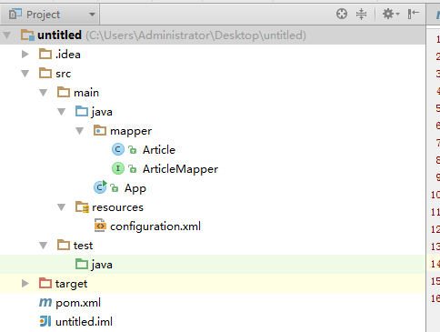
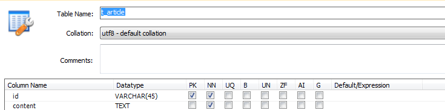
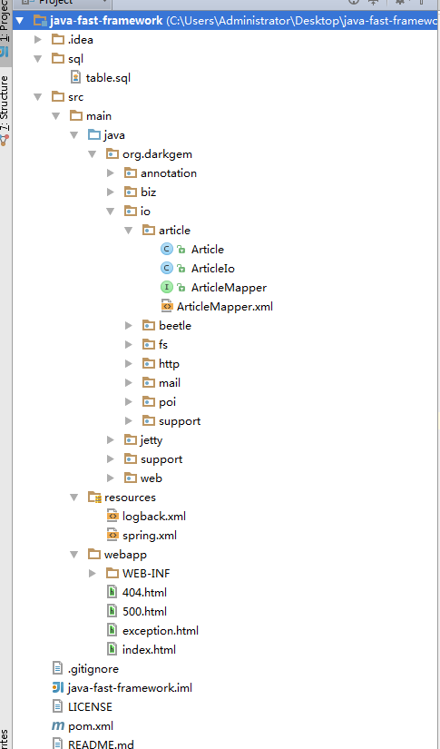
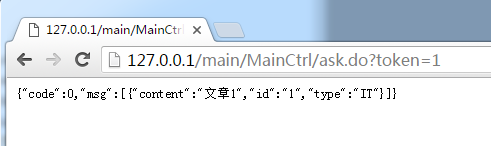
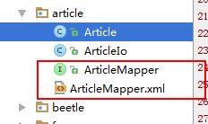

# 示例

MyBatis 是支持定制化 SQL、存储过程以及高级映射的优秀的持久层框架。MyBatis 避免了几乎所有的 JDBC 代码和手动设置参数以及获取结果集。
MyBatis 可以对配置和原生Map使用简单的 XML 或注解，将接口和 Java 的 POJOs(Plain Old Java Objects,普通的 Java对象)映射成数据库中的记录。


## 基础入门

### 项目结构

项目使用MVN构建，如下图：



### 安装

首先，我们先配置JAR依赖（MyBatis+MySQL+Log）：

```xml
<?xml version="1.0" encoding="UTF-8"?>
<project xmlns="http://maven.apache.org/POM/4.0.0"
         xmlns:xsi="http://www.w3.org/2001/XMLSchema-instance"
         xsi:schemaLocation="http://maven.apache.org/POM/4.0.0 http://maven.apache.org/xsd/maven-4.0.0.xsd">
    <modelVersion>4.0.0</modelVersion>

    <groupId>org.test</groupId>
    <artifactId>test</artifactId>
    <version>1.0-SNAPSHOT</version>
    <!--通用属性配置-->
    <properties>
        <mybatis-version>3.4.1</mybatis-version>
        <mysql-version>5.1.39</mysql-version>
        <slf4j-version>1.7.18</slf4j-version>
        <logback-version>1.1.7</logback-version>

    </properties>
    <dependencies>
        <!--mybatis-->
        <dependency>
            <groupId>org.mybatis</groupId>
            <artifactId>mybatis</artifactId>
            <version>3.4.1</version>
        </dependency>
        <!-- https://mvnrepository.com/artifact/mysql/mysql-connector-java -->
        <dependency>
            <groupId>mysql</groupId>
            <artifactId>mysql-connector-java</artifactId>
            <version>${mysql-version}</version>
        </dependency>
        <!--logback系列-->
        <dependency>
            <groupId>ch.qos.logback</groupId>
            <artifactId>logback-classic</artifactId>
            <version>${logback-version}</version>
        </dependency>
        <dependency>
            <groupId>ch.qos.logback</groupId>
            <artifactId>logback-core</artifactId>
            <version>${logback-version}</version>
        </dependency>
        <dependency>
            <groupId>ch.qos.logback</groupId>
            <artifactId>logback-access</artifactId>
            <version>${logback-version}</version>
        </dependency>

        <!--slf4j系列-->
        <dependency>
            <groupId>org.slf4j</groupId>
            <artifactId>jcl-over-slf4j</artifactId>
            <version>${slf4j-version}</version>
        </dependency>
        <dependency>
            <groupId>org.slf4j</groupId>
            <artifactId>log4j-over-slf4j</artifactId>
            <version>${slf4j-version}</version>
        </dependency>
        <dependency>
            <groupId>org.slf4j</groupId>
            <artifactId>jul-to-slf4j</artifactId>
            <version>${slf4j-version}</version>
        </dependency>
        <dependency>
            <groupId>org.slf4j</groupId>
            <artifactId>slf4j-api</artifactId>
            <version>${slf4j-version}</version>
        </dependency>
    </dependencies>

</project>
```

这样子，就完成了JAR的依赖配置。

### configuration

使用MyBatis 的时候，需要创建一个`configuration.xml`文件，主要是用来配置MyBatis的基础属性：

```xml
<?xml version="1.0" encoding="UTF-8" ?>
<!DOCTYPE configuration
        PUBLIC "-//mybatis.org//DTD Config 3.0//EN"
        "http://mybatis.org/dtd/mybatis-3-config.dtd">
<configuration>
    <!--基础配置-->
    <environments default="development">
        <environment id="development">
            <transactionManager type="JDBC"/>
            <dataSource type="POOLED">
                <property name="driver" value="com.mysql.jdbc.Driver"/>
                <property name="url" value="jdbc:mysql://localhost:3306/test?useUnicode=true&amp;characterEncoding=UTF-8"/>
                <property name="username" value="root"/>
                <property name="password" value="root"/>
            </dataSource>
        </environment>
    </environments>
    <!--扫描mapper目录-->
    <mappers>
        <package name="mapper"/>
    </mappers>
</configuration>

```

### Bean + Mapper

使用MyBatis的时候，需要编写Bean和Mapper，而Mapper是将数据库和Bean映射的描述：

```java

/**
 * Article.java
 */
package mapper;
public class Article {
    String id;
    String content;

    public String getId() {
        return id;
    }

    public void setId(String id) {
        this.id = id;
    }

    public String getContent() {
        return content;
    }

    public void setContent(String content) {
        this.content = content;
    }
}


/**
 * ArticleMapper.java
 */
package mapper;

import org.apache.ibatis.annotations.Results;
import org.apache.ibatis.annotations.Select;

import java.util.List;


public interface ArticleMapper {

    @Select("SELECT * FROM t_article")
    List<Article> selectAll();
}

```

而数据库的表结构为：



### 运行

运行如下代码：

```java

import mapper.Article;
import mapper.ArticleMapper;
import org.apache.ibatis.io.Resources;
import org.apache.ibatis.session.SqlSession;
import org.apache.ibatis.session.SqlSessionFactory;
import org.apache.ibatis.session.SqlSessionFactoryBuilder;

import java.io.InputStream;

/**
 * DO
 */
public class App {
    public static void main(String[] args) throws Exception {
        //读取配置
        String resource = "configuration.xml";
        InputStream inputStream = Resources.getResourceAsStream(resource);
        //构建SqlSessionFactory，全局唯一
        SqlSessionFactory sqlSessionFactory = new SqlSessionFactoryBuilder().build(inputStream);
        //打开一个会话，相当于JDBC连接，线程不安全
        SqlSession sqlSession = sqlSessionFactory.openSession();
        //获取一个Mapper
        ArticleMapper articleMapper = sqlSession.getMapper(ArticleMapper.class);
        //SELECT
        for (Article article : articleMapper.selectAll()) {
            System.out.println(String.format("ID=%s，CONTENT=%s", article.getId(), article.getContent()));
        }
    }
}

```
运行结果：

```
11:17:58.931 [main] DEBUG org.apache.ibatis.logging.LogFactory - Logging initialized using 'class org.apache.ibatis.logging.slf4j.Slf4jImpl' adapter.
11:17:59.045 [main] DEBUG org.apache.ibatis.datasource.pooled.PooledDataSource - PooledDataSource forcefully closed/removed all connections.
11:17:59.045 [main] DEBUG org.apache.ibatis.datasource.pooled.PooledDataSource - PooledDataSource forcefully closed/removed all connections.
11:17:59.046 [main] DEBUG org.apache.ibatis.datasource.pooled.PooledDataSource - PooledDataSource forcefully closed/removed all connections.
11:17:59.046 [main] DEBUG org.apache.ibatis.datasource.pooled.PooledDataSource - PooledDataSource forcefully closed/removed all connections.
11:17:59.053 [main] DEBUG org.apache.ibatis.io.VFS - Class not found: org.jboss.vfs.VFS
11:17:59.053 [main] DEBUG org.apache.ibatis.io.JBoss6VFS - JBoss 6 VFS API is not available in this environment.
11:17:59.054 [main] DEBUG org.apache.ibatis.io.VFS - Class not found: org.jboss.vfs.VirtualFile
11:17:59.055 [main] DEBUG org.apache.ibatis.io.VFS - VFS implementation org.apache.ibatis.io.JBoss6VFS is not valid in this environment.
11:17:59.055 [main] DEBUG org.apache.ibatis.io.VFS - Using VFS adapter org.apache.ibatis.io.DefaultVFS
11:17:59.056 [main] DEBUG org.apache.ibatis.io.DefaultVFS - Find JAR URL: file:/C:/Users/Administrator/Desktop/untitled/target/classes/mapper
11:17:59.056 [main] DEBUG org.apache.ibatis.io.DefaultVFS - Not a JAR: file:/C:/Users/Administrator/Desktop/untitled/target/classes/mapper
11:17:59.116 [main] DEBUG org.apache.ibatis.io.DefaultVFS - Reader entry: Article.class
11:17:59.116 [main] DEBUG org.apache.ibatis.io.DefaultVFS - Reader entry: ArticleMapper.class
11:17:59.116 [main] DEBUG org.apache.ibatis.io.DefaultVFS - Listing file:/C:/Users/Administrator/Desktop/untitled/target/classes/mapper
11:17:59.116 [main] DEBUG org.apache.ibatis.io.DefaultVFS - Find JAR URL: file:/C:/Users/Administrator/Desktop/untitled/target/classes/mapper/Article.class
11:17:59.116 [main] DEBUG org.apache.ibatis.io.DefaultVFS - Not a JAR: file:/C:/Users/Administrator/Desktop/untitled/target/classes/mapper/Article.class
11:17:59.117 [main] DEBUG org.apache.ibatis.io.DefaultVFS - Reader entry: ����   1 
11:17:59.117 [main] DEBUG org.apache.ibatis.io.DefaultVFS - Find JAR URL: file:/C:/Users/Administrator/Desktop/untitled/target/classes/mapper/ArticleMapper.class
11:17:59.117 [main] DEBUG org.apache.ibatis.io.DefaultVFS - Not a JAR: file:/C:/Users/Administrator/Desktop/untitled/target/classes/mapper/ArticleMapper.class
11:17:59.118 [main] DEBUG org.apache.ibatis.io.DefaultVFS - Reader entry: ����   1  
11:17:59.118 [main] DEBUG org.apache.ibatis.io.ResolverUtil - Checking to see if class mapper.Article matches criteria [is assignable to Object]
11:17:59.118 [main] DEBUG org.apache.ibatis.io.ResolverUtil - Checking to see if class mapper.ArticleMapper matches criteria [is assignable to Object]
11:17:59.178 [main] DEBUG org.apache.ibatis.transaction.jdbc.JdbcTransaction - Opening JDBC Connection
Mon Jul 18 11:17:59 CST 2016 WARN: Establishing SSL connection without server's identity verification is not recommended. According to MySQL 5.5.45+, 5.6.26+ and 5.7.6+ requirements SSL connection must be established by default if explicit option isn't set. For compliance with existing applications not using SSL the verifyServerCertificate property is set to 'false'. You need either to explicitly disable SSL by setting useSSL=false, or set useSSL=true and provide truststore for server certificate verification.
11:17:59.457 [main] DEBUG org.apache.ibatis.datasource.pooled.PooledDataSource - Created connection 1061804750.
11:17:59.457 [main] DEBUG org.apache.ibatis.transaction.jdbc.JdbcTransaction - Setting autocommit to false on JDBC Connection [com.mysql.jdbc.JDBC4Connection@3f49dace]
11:17:59.460 [main] DEBUG mapper.ArticleMapper.selectAll - ==>  Preparing: SELECT * FROM t_article 
11:17:59.504 [main] DEBUG mapper.ArticleMapper.selectAll - ==> Parameters: 
11:17:59.531 [main] DEBUG mapper.ArticleMapper.selectAll - <==      Total: 2

ID=1，CONTENT=文章1
ID=2，CONTENT=文章2

```

可以发现，已经成功的读取到数据库中的数据到JavaBean中了。

项目地址：[simple-mybatis-project](simple-mybatis-project.zip)

## Spring集成

在使用MyBatis的时候，通常是和Spring框架一起使用的。MyBatis和Spring的集成是非常方便的，只需要几个步骤即可。

### 项目结构



### 安装

首先，我们需要引入最新的mybatis-spring的jar包：

```
<!--mybatis-spring -->
<dependency>
    <groupId>org.mybatis</groupId>
    <artifactId>mybatis-spring</artifactId>
    <version>1.3.0</version>
</dependency>
```

### 配置

mybatis和spring集成的时候，我们就不需要MyBatis的配置文件(configuration.xmk)了，只需要在Spring
的配置文件中，引入MyBatis#SqlSessionFactorty的Bean配置即可，如下是比较完成的配置：

```
    <!--注意，这里还需要添加dataSource-->
    <!--事务性-->
    <bean id="transactionManager" class="org.springframework.jdbc.datasource.DataSourceTransactionManager">
        <property name="dataSource" ref="dataSource"/>
    </bean>
    <!--mybatis -->
    <bean id="sqlSessionFactory" class="org.mybatis.spring.SqlSessionFactoryBean">
        <!--注入dataSource-->
        <property name="dataSource" ref="dataSource" />
        <--扫描org.darkgem.io下面的所有TypeHandler-->
        <property name="typeHandlersPackage" value="org.darkgem.io"/>
    </bean>
    <!--mapper-scan-->
    <bean class="org.mybatis.spring.mapper.MapperScannerConfigurer">
        <!--扫描所有org.darkgem.io下面的Mapper接口-->
        <property name="basePackage" value="org.darkgem.io" />
    </bean>
```

这样子，就配置了MyBatis。

### Bean + Mapper

如下是MyBatis的Bean以及相应的Mapper和SQL Mapper：

```


/**
 * Article.java
 */
package org.darkgem.io.article;

public class Article {
    String id;
    String content;
    Type type;

    public Article(String id, String content, Type type) {
        this.id = id;
        this.content = content;
        this.type = type;
    }

    public String getId() {
        return id;
    }

    public void setId(String id) {
        this.id = id;
    }

    public String getContent() {
        return content;
    }

    public void setContent(String content) {
        this.content = content;
    }

    public Type getType() {
        return type;
    }

    public void setType(Type type) {
        this.type = type;
    }

    public enum Type {
        IT,
        LIFT;
    }
}


/**
 * ArticleMapper.java
 */

package org.darkgem.io.article;

import org.apache.ibatis.annotations.Param;
import org.apache.ibatis.type.JdbcType;
import org.apache.ibatis.type.MappedTypes;
import org.apache.ibatis.type.TypeHandler;

import java.sql.CallableStatement;
import java.sql.PreparedStatement;
import java.sql.ResultSet;
import java.sql.SQLException;
import java.util.List;


public interface ArticleMapper {

    List<Article> selectList(@Param("content") String content, @Param("type") Article.Type type);

    /**
     * 类型转换
     */
    @MappedTypes(Article.Type.class)
    class ArticleTypeHandler implements TypeHandler<Article.Type> {
        @Override
        public void setParameter(PreparedStatement ps, int i, Article.Type parameter, JdbcType jdbcType) throws SQLException {
            ps.setString(i, parameter.toString());
        }

        @Override
        public Article.Type getResult(ResultSet rs, String columnName) throws SQLException {
            return Article.Type.valueOf(rs.getString(columnName));
        }

        @Override
        public Article.Type getResult(ResultSet rs, int columnIndex) throws SQLException {
            return Article.Type.valueOf(rs.getString(columnIndex));
        }

        @Override
        public Article.Type getResult(CallableStatement cs, int columnIndex) throws SQLException {
            return Article.Type.valueOf(cs.getString(columnIndex));
        }
    }
}


<!--ArticleMapper.xml-->
<?xml version="1.0" encoding="UTF-8" ?>
<!DOCTYPE mapper
        PUBLIC "-//mybatis.org//DTD Mapper 3.0//EN"
        "http://mybatis.org/dtd/mybatis-3-mapper.dtd">
<mapper namespace="org.darkgem.io.article.ArticleMapper">

    <sql id="columns">
        id,content,type
    </sql>

    <resultMap id="resultArticle" type="org.darkgem.io.article.Article">
        <constructor>
            <idArg column="id" javaType="String"/>
            <arg column="content" javaType="String"/>
            <arg column="type" javaType="org.darkgem.io.article.Article$Type"/>
        </constructor>
    </resultMap>
    <select id="selectList" resultMap="resultArticle">
        SELECT
            <include refid="columns"/>
        FROM
            t_article
        WHERE
            content like #{content} and type = #{type}
    </select>
</mapper>


/**
 * ArticleIo.java
 */
package org.darkgem.io.article;

import org.springframework.beans.factory.annotation.Autowired;
import org.springframework.stereotype.Component;

import java.util.List;

@Component
public class ArticleIo {

    //这里直接引入Mapper进行调用，它是线程安全的
    @Autowired
    ArticleMapper articleMapper;

    public List<Article> selectList(String key, Article.Type type) {
        return articleMapper.selectList('%' + key + '%', type);
    }
}


```

注意，在`ArticleMapper.java`中，我们配置了关于Article中Type这个`枚举`类型的处理器。
通过TypeHandler，我们可以完成Java和Jdbc类型的转换。

### Controller

现在，来配置一下Spring MVC 调用MyBatis的代码：


```java

package org.darkgem.web.mvc.main;

import org.darkgem.io.article.Article;
import org.darkgem.io.article.ArticleIo;
import org.darkgem.web.support.handler.Token;
import org.darkgem.web.support.msg.Message;
import org.springframework.beans.factory.annotation.Autowired;
import org.springframework.stereotype.Controller;
import org.springframework.transaction.annotation.Transactional;
import org.springframework.web.bind.annotation.RequestMapping;

@Controller
@RequestMapping("/main/MainCtrl")
public class MainCtrl {
    @Autowired
    ArticleIo articleIo;

    @Transactional
    @RequestMapping("/ask")
    public Object ask(@Token String token) {
        return Message.okMessage(articleIo.selectList(token, Article.Type.IT));
    }
}

```

### 运行


截图：



日志：

```

2016-07-18 12:08:23.606 [qtp6566818-15] DEBUG o.s.web.servlet.DispatcherServlet - DispatcherServlet with name 'springMVC' processing GET request for [/main/MainCtrl/ask.do]
2016-07-18 12:08:23.607 [qtp6566818-15] DEBUG o.s.w.s.m.m.a.RequestMappingHandlerMapping - Looking up handler method for path /main/MainCtrl/ask.do
2016-07-18 12:08:23.608 [qtp6566818-15] DEBUG o.s.w.s.m.m.a.RequestMappingHandlerMapping - Returning handler method [public java.lang.Object org.darkgem.web.mvc.main.MainCtrl.ask(java.lang.String)]
2016-07-18 12:08:23.608 [qtp6566818-15] DEBUG o.s.b.f.s.DefaultListableBeanFactory - Returning cached instance of singleton bean 'mainCtrl'
2016-07-18 12:08:23.608 [qtp6566818-15] DEBUG o.s.web.servlet.DispatcherServlet - Last-Modified value for [/main/MainCtrl/ask.do] is: -1
2016-07-18 12:08:23.609 [qtp6566818-15] DEBUG o.s.j.d.DataSourceTransactionManager - Creating new transaction with name [org.darkgem.web.mvc.main.MainCtrl.ask]: PROPAGATION_REQUIRED,ISOLATION_DEFAULT; ''
2016-07-18 12:08:23.609 [qtp6566818-15] DEBUG druid.sql.Statement - {conn-10005, stmt-20007} created
2016-07-18 12:08:23.611 [qtp6566818-15] DEBUG druid.sql.Statement - {conn-10005, stmt-20007, rs-50007} query executed. 0.692501 millis. 
SELECT 'x'
2016-07-18 12:08:23.611 [qtp6566818-15] DEBUG druid.sql.ResultSet - {conn-10005, stmt-20007, rs-50007} open
2016-07-18 12:08:23.611 [qtp6566818-15] DEBUG druid.sql.ResultSet - {conn-10005, stmt-20007, rs-50007} Header: [x]
2016-07-18 12:08:23.611 [qtp6566818-15] DEBUG druid.sql.ResultSet - {conn-10005, stmt-20007, rs-50007} closed
2016-07-18 12:08:23.612 [qtp6566818-15] DEBUG druid.sql.Statement - {conn-10005, stmt-20007} closed
2016-07-18 12:08:23.612 [qtp6566818-15] DEBUG druid.sql.Connection - {conn-10005} pool-connect
2016-07-18 12:08:23.612 [qtp6566818-15] DEBUG o.s.j.d.DataSourceTransactionManager - Acquired Connection [com.alibaba.druid.proxy.jdbc.ConnectionProxyImpl@213795f2] for JDBC transaction
2016-07-18 12:08:23.612 [qtp6566818-15] DEBUG o.s.j.d.DataSourceTransactionManager - Switching JDBC Connection [com.alibaba.druid.proxy.jdbc.ConnectionProxyImpl@213795f2] to manual commit
2016-07-18 12:08:23.612 [qtp6566818-15] DEBUG druid.sql.Connection - {conn-10005} setAutoCommit false
2016-07-18 12:08:23.614 [qtp6566818-15] DEBUG org.mybatis.spring.SqlSessionUtils - Creating a new SqlSession
2016-07-18 12:08:23.614 [qtp6566818-15] DEBUG org.mybatis.spring.SqlSessionUtils - Registering transaction synchronization for SqlSession [org.apache.ibatis.session.defaults.DefaultSqlSession@669462bf]
2016-07-18 12:08:23.614 [qtp6566818-15] DEBUG o.m.s.t.SpringManagedTransaction - JDBC Connection [com.alibaba.druid.proxy.jdbc.ConnectionProxyImpl@213795f2] will be managed by Spring
2016-07-18 12:08:23.614 [qtp6566818-15] DEBUG o.d.i.a.ArticleMapper.selectList - ==>  Preparing: SELECT id,content,type FROM t_article WHERE content like ? and type = ? 
2016-07-18 12:08:23.615 [qtp6566818-15] DEBUG druid.sql.Statement - {conn-10005, pstmt-20008} created. 
SELECT
             
        id,content,type
     
        FROM
            t_article
        WHERE
            content like ? and type = ?
2016-07-18 12:08:23.615 [qtp6566818-15] DEBUG o.d.i.a.ArticleMapper.selectList - ==> Parameters: %1%(String), IT(String)
2016-07-18 12:08:23.615 [qtp6566818-15] DEBUG druid.sql.Statement - {conn-10005, pstmt-20008} Parameters : [%1%, IT]
2016-07-18 12:08:23.615 [qtp6566818-15] DEBUG druid.sql.Statement - {conn-10005, pstmt-20008} Types : [VARCHAR, VARCHAR]
2016-07-18 12:08:23.619 [qtp6566818-15] DEBUG druid.sql.Statement - {conn-10005, pstmt-20008} executed. 3.417743 millis. 
SELECT
             
        id,content,type
     
        FROM
            t_article
        WHERE
            content like ? and type = ?
2016-07-18 12:08:23.619 [qtp6566818-15] DEBUG druid.sql.ResultSet - {conn-10005, pstmt-20008, rs-50008} open
2016-07-18 12:08:23.619 [qtp6566818-15] DEBUG druid.sql.ResultSet - {conn-10005, pstmt-20008, rs-50008} Header: [id, content, type]
2016-07-18 12:08:23.619 [qtp6566818-15] DEBUG druid.sql.ResultSet - {conn-10005, pstmt-20008, rs-50008} Result: [1, 文章1, IT]
2016-07-18 12:08:23.620 [qtp6566818-15] DEBUG o.d.i.a.ArticleMapper.selectList - <==      Total: 1
2016-07-18 12:08:23.621 [qtp6566818-15] DEBUG druid.sql.ResultSet - {conn-10005, pstmt-20008, rs-50008} closed
2016-07-18 12:08:23.622 [qtp6566818-15] DEBUG druid.sql.Statement - {conn-10005, pstmt-20008} closed
2016-07-18 12:08:23.622 [qtp6566818-15] DEBUG org.mybatis.spring.SqlSessionUtils - Releasing transactional SqlSession [org.apache.ibatis.session.defaults.DefaultSqlSession@669462bf]
2016-07-18 12:08:23.622 [qtp6566818-15] DEBUG org.mybatis.spring.SqlSessionUtils - Transaction synchronization committing SqlSession [org.apache.ibatis.session.defaults.DefaultSqlSession@669462bf]
2016-07-18 12:08:23.622 [qtp6566818-15] DEBUG org.mybatis.spring.SqlSessionUtils - Transaction synchronization deregistering SqlSession [org.apache.ibatis.session.defaults.DefaultSqlSession@669462bf]
2016-07-18 12:08:23.622 [qtp6566818-15] DEBUG org.mybatis.spring.SqlSessionUtils - Transaction synchronization closing SqlSession [org.apache.ibatis.session.defaults.DefaultSqlSession@669462bf]
2016-07-18 12:08:23.622 [qtp6566818-15] DEBUG o.s.j.d.DataSourceTransactionManager - Initiating transaction commit
2016-07-18 12:08:23.622 [qtp6566818-15] DEBUG o.s.j.d.DataSourceTransactionManager - Committing JDBC transaction on Connection [com.alibaba.druid.proxy.jdbc.ConnectionProxyImpl@213795f2]
2016-07-18 12:08:23.624 [qtp6566818-15] DEBUG druid.sql.Connection - {conn-10005} commited
2016-07-18 12:08:23.624 [qtp6566818-15] DEBUG druid.sql.Connection - {conn-10005} setAutoCommit true
2016-07-18 12:08:23.625 [qtp6566818-15] DEBUG o.s.j.d.DataSourceTransactionManager - Releasing JDBC Connection [com.alibaba.druid.proxy.jdbc.ConnectionProxyImpl@213795f2] after transaction
2016-07-18 12:08:23.625 [qtp6566818-15] DEBUG o.s.jdbc.datasource.DataSourceUtils - Returning JDBC Connection to DataSource
2016-07-18 12:08:23.625 [qtp6566818-15] DEBUG druid.sql.Connection - {conn-10005} pool-recycle
2016-07-18 12:08:23.626 [qtp6566818-15] DEBUG o.s.w.s.v.ContentNegotiatingViewResolver - Requested media types are [text/html, application/xhtml+xml, image/webp, application/xml;q=0.9, */*;q=0.8] based on Accept header types and producible media types [*/*])
2016-07-18 12:08:23.627 [qtp6566818-15] DEBUG o.s.w.s.v.ContentNegotiatingViewResolver - Returning [com.alibaba.fastjson.support.spring.FastJsonJsonView: name 'com.alibaba.fastjson.support.spring.FastJsonJsonView#35aea049'] based on requested media type '*/*;q=0.8'
2016-07-18 12:08:23.627 [qtp6566818-15] DEBUG o.s.web.servlet.DispatcherServlet - Rendering view [com.alibaba.fastjson.support.spring.FastJsonJsonView: name 'com.alibaba.fastjson.support.spring.FastJsonJsonView#35aea049'] in DispatcherServlet with name 'springMVC'
2016-07-18 12:08:23.627 [qtp6566818-15] DEBUG o.s.web.servlet.DispatcherServlet - Successfully completed request


```

可以发现，MyBatis已经和Spring集成成功。

项目地址：[java-fast-framework](https://github.com/darkfireworld/java-fast-framework.git)

# 命名空间

通过Mapper#namespace属性，我们可以定一个Mapper的命名空间。命名控件的好处有很多，比如说：ID隔离等。

如下是一个`Mapper Interface + Mapper XML`的实践：

代码结构：



我们在`Mapper Interface` (ArticleMapper.java)中定义使用的API，以及参数名称：

```java
public interface ArticleMapper {

    List<Article> selectList(@Param("content") String content, @Param("type") Article.Type type);
}


```

而在`Mapper XML(`ArticleMapper.xml)中定义具体的SQL语句，注意该XML的命名需要
和`Mapper Interface`一致：

```xml

<?xml version="1.0" encoding="UTF-8" ?>
<!DOCTYPE mapper
        PUBLIC "-//mybatis.org//DTD Mapper 3.0//EN"
        "http://mybatis.org/dtd/mybatis-3-mapper.dtd">

<!--命名空间需要和ArticleMapper.java的限定名一致-->
<mapper namespace="org.darkgem.io.article.ArticleMapper">

    <sql id="columns">
        id,content
    </sql>

    <resultMap id="resultArticle" type="org.darkgem.io.article.Article">
        <constructor>
            <idArg column="id" javaType="String"/>
            <arg column="content" javaType="String"/>
        </constructor>
    </resultMap>
    <select id="selectList" resultMap="resultArticle">
        SELECT
            <include refid="columns"/>
        FROM
            t_article
        WHERE
            content like #{content}
    </select>
</mapper>

```

注意，Mapper元素的命名空间需要和ArticleMapper.class的限定名一致。

# 生命周期

在使用MyBatis的时候，我们需要关注各个关键组件的生命周期，这样子才能编写出线程安全的代码。

> `依赖注入框架`可以创建线程安全的、基于事务的 SqlSession 和映射器（mapper）并将它们直接
> 注入到你的 bean 中，因此可以直接忽略它们的生命周期。如果对如何通过依赖注入框架来使
> 用 MyBatis 感兴趣可以研究一下 `MyBatis-Spring` 或 `MyBatis-Guice` 两个子项目。

## SqlSessionFactoryBuilder

这个类可以被实例化、使用和丢弃，一旦创建了 SqlSessionFactory，就不再需要它了。因此 
SqlSessionFactoryBuilder 实例的最佳范围是方法范围（也就是局部方法变量）。你可以重
用 SqlSessionFactoryBuilder 来创建多个 SqlSessionFactory 实例，但是最好还是不要让
其一直存在以保证所有的 XML 解析资源开放给更重要的事情。

## SqlSessionFactory

SqlSessionFactory 一旦被创建就应该在应用的运行期间一直存在，没有任何理由对它进行清除或重
建。使用 SqlSessionFactory 的最佳实践是在应用运行期间不要重复创建多次，多次重建 
SqlSessionFactory 被视为一种代码“坏味道（bad smell）”。因此 SqlSessionFactory 的最佳范围
是应用范围。有很多方法可以做到，最简单的就是使用单例模式或者静态单例模式。

## SqlSession

每个线程都应该有它自己的 SqlSession 实例。SqlSession 的实例不是线程安全的，因此是不能
被共享的，所以它的最佳的范围是请求或方法范围。绝对不能将 SqlSession 实例的引用放在一
个类的静态域，甚至一个类的实例变量也不行。也绝不能将 SqlSession 实例的引用放在任何类型
的管理范围中，比如 Serlvet 架构中的 HttpSession。如果你现在正在使用一种 Web 框架，要考
虑 SqlSession 放在一个和 HTTP 请求对象相似的范围中。换句话说，每次收到的 HTTP 请求，就
可以打开一个 SqlSession，返回一个响应，就关闭它。这个关闭操作是很重要的，你应该把这个
关闭操作放到 finally 块中以确保每次都能执行关闭。下面的示例就是一个确保 SqlSession 关闭
的标准模式：

```java

SqlSession session = sqlSessionFactory.openSession();
try {
  // do work
} finally {
  session.close();
}

```

在你的所有的代码中一致性地使用这种模式来保证所有数据库资源都能被正确地关闭。

## 映射器实例（Mapper Instances）

映射器是创建用来绑定映射语句的接口。映射器接口的实例是从 SqlSession 中获得的。因此从技术
层面讲，映射器实例的最大范围是和 SqlSession 相同的，因为它们都是从 SqlSession 里被请求
的。尽管如此，映射器实例的最佳范围是方法范围。也就是说，映射器实例应该在调用它们的方法
中被请求，用过之后即可废弃。并不需要显式地关闭映射器实例，尽管在整个请求范围
（request scope）保持映射器实例也不会有什么问题，但是很快你会发现，像 SqlSession 一样，
在这个范围上管理太多的资源的话会难于控制。所以要保持简单，最好把映射器放在方法范围
（method scope）内。下面的示例就展示了这个实践：

```java

SqlSession session = sqlSessionFactory.openSession();
try {
  BlogMapper mapper = session.getMapper(BlogMapper.class);
  // do work
} finally {
  session.close();
}

```


# 源码分析

## Initialization

本小节，将会梳理一下MyBatis的初始化过程中，几个重要的阶段：

1. Configuare
2. TypeHandler
3. Mapper

### Configuare

MyBatis可以通过`XML`或者`Java代码`配置`SqlSessionFactory`这个核心对象。

使用`configuration.xml`配置的时候，配置各个属性的顺序要和

```
<!ELEMENT configuration (properties?, settings?, typeAliases?, typeHandlers?, objectFactory?, objectWrapperFactory?, reflectorFactory?, plugins?, environments?, databaseIdProvider?, mappers?)>

```

保持一致，否则MyBatis会报错。

#### properties(定义属性)

配置文件中，预定义一些属性，然后通过`${}`引用这些属性。

#### settings(基础设置)

配置mybatis的基本功能，比如说`二级缓存`，`lazy load`...

#### typeAliases (别名配置)

MyBatis使用别名的过程如下：

1. Mapper.xml中给定Type='org.darkfireworld.Model'
2. MyBatis首先对比`typeAliasesMap`中是否存在`org.darkfireworld.model`这个别名[忽略大小写]。
3. 如果存在，则返回。否则调用`Class.forName()`解析。

注意：如果为内部类，则需要使用`org.darkfireworld.Model$Type`引用。

当然，MyBatis已经预定义了一些比较常见的别名：`hashmap`,`list`,`int`...


#### typeHandlers(类型处理器)

无论是 MyBatis 在预处理语句（PreparedStatement）中设置一个参数时，还是从结果集中取出一个
值时， 都会用类型处理器将获取的值以合适的方式转换成 Java 类型。

通过`typeHandlers`，可以配置Java<->Jdbc类型转换器。MyBatis已经预定义了一些`TypeHandler`：

1. Boolean
2. String
3. Integer
4. Long
5. Date

基本上，常见的Java类型的Handler都已经有了。

但是有时候，我们也需要自定义一些`TypeHander`。首先，我们定一个`TypeHandler`：

```java

@MappedTypes(MyType.class)
public class MyTypeHandler implements TypeHandler<MyType> {

  @Override
  public void setNonNullParameter(PreparedStatement ps, int i, MyType parameter, JdbcType jdbcType) throws SQLException {
    ps.setString(i, parameter.toString());
  }

  @Override
  public MyType getNullableResult(ResultSet rs, String columnName) throws SQLException {
    return new MyType(rs.getString(columnName));
  }

  @Override
  public MyType getNullableResult(ResultSet rs, int columnIndex) throws SQLException {
    return new MyType(rs.getString(columnIndex));
  }

  @Override
  public MyType getNullableResult(CallableStatement cs, int columnIndex) throws SQLException {
    return new MyType(cs.getString(columnIndex));
  }
}

```

需要注意：

1. 类需要实现`TypeHandler`接口。
2. 需要添加注解`@MappedTypes`，表明对应Java中的类型。

然后，我们将这个Handler注册到MyBatis中：

```xml

<typeHandlers>
   <typeHandler handler="org.darkfireworld.MyTypeHandler"/>
</typeHandlers>

```

或者，通过扫描注册(推荐)：

```xml

<typeHandlers>
  <package name="org.darkfireworld"/>
</typeHandlers>

```

这样子，MyBatis在处理`MyType`的时候，就可以通过`MyTypeHandler`处理参数或者结果了。


#### environments(环境配置)

通过`environments`标签，我们可以配置MyBatis的事务和数据源。

一般来说，运行demo的配置，这样子就够了：

```xml

    <!--基础配置-->
    <environments default="development">
        <environment id="development">
            <transactionManager type="JDBC"/>
            <dataSource type="POOLED">
                <property name="driver" value="com.mysql.jdbc.Driver"/>
                <property name="url" value="jdbc:mysql://localhost:3306/test?useUnicode=true&amp;characterEncoding=UTF-8"/>
                <property name="username" value="root"/>
                <property name="password" value="root"/>
            </dataSource>
        </environment>
    </environments>
    
```


#### mappers(映射器)

Mapper是MyBatis的关键概念，通过Mapper，可以将Java和Jdbc以及Sql结合起来。Mapper的注册通常有如下几种方式：

1. `<mapper resource="org/mybatis/builder/AuthorMapper.xml"/>`，引入Mapper的XML。
2. `<mapper class="org.mybatis.builder.AuthorMapper"/>`，引入Mapper的Interface。
3. `<package name="org.mybatis.builder"/>`，注册某个包下所有的Mapper Interface。

通常，我们使用第三种，可以节约许多工作量。

### TypeHandler


handler process : scan package ，touch ALL Handler implements TypeHandler ，获取 该类的 @MappedTypes 以及@MappedJdbcTypes 属性，注册到TypeHandlerRegister中.

mybatis-mysql: boolean  tinyint(1) 0 : 1 可以自定义


### Mapper

init process: <mapper> -> package name -> register interface + interface.class.getName().xml（namespace一定要为 interface.class.getName ）  + 注解

全部type 需要添加限定名，在重构的时候，能快速定位。

最佳实践：
    Java内部使用全属性构造器，MyBatis使用无参数构造器+set

### Spring

spring mybatis mapper 自动注入，如何提前注册所有的mapper bean到spring中 -> postProcessBeanDefinitionRegistry？


Mapper 依赖sqlSession，所以生命周期和sqlSession一样，但是mybatis-spring的sqlSession是通过拦截器，获取当前事务的sqlSession。所以不必担心线程安全的问题。(SqlSessionTemplate)


## Execute

mybatis 执行sql过程：
    0. 初始化所有的sql语句（加载xml的时候）
    1. 通过参数构造作用域
    2. 解析最初的sql语句（具有${}和#{}信息）
        1. 遇到${}的时候，使用当前作用域中的属性(Object.toString())替换
        2. 遇到<bind>，<include>#property-><sql> ，向当前作用域添加这个属性数值
        3. 遇到#{}的时候，将当前这个参数加入到调用`参数列表`中。
    3. 获取PreparedStatement，执行sql (SELECT * FROM id = ? 格式)，然后准备调用的参数
        1. 读取`参数列表`
        2. 使用MyBatis中的handlerType处理类型数值，然后设置到  PreparedStatement 中
    4. 执行sql
    5. 获取执行结果，然后构造JavaBean By resultMap


### getMapper

getMapper process : 调用getMapper->获取一个代理对象->调用的时候，获取方法名，然后调用 type.class + method 的 sql记录（来自于xml或者注解）本质上来说，还是和xml方式一样，就是外面套了一层壳

Mapper param deal process : 单个参数，直接处理。 多个参数 采用hashMap传递参数，参数bind，默认 param1 param2 ，或者 1 2 3 | 如果指定 @Param，则采用指定的名称 + param1 param2 。


### Sql Build

### 参数绑定

### 缓存
mybatis 缓存刷新机制：遇到insert update delete 则刷新所有的缓存
### 执行

### 结果处理

## Transactional

### JDBC

### Spring

sqlSessionTemplate jdbcTemplate 混合使用的事务问题？


## 参考

* [mybatis](http://www.mybatis.org/mybatis-3/zh/index.html)
* [mybatis-spring](http://www.mybatis.org/spring/zh/index.html)
