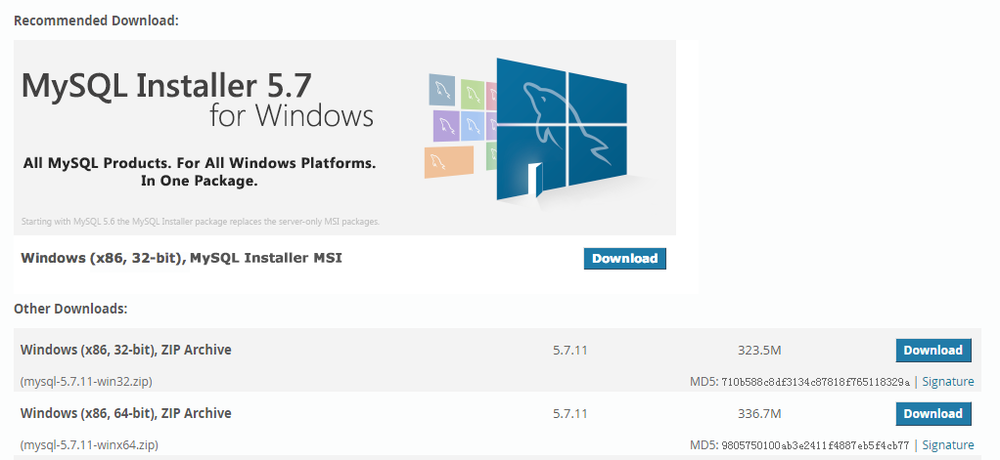
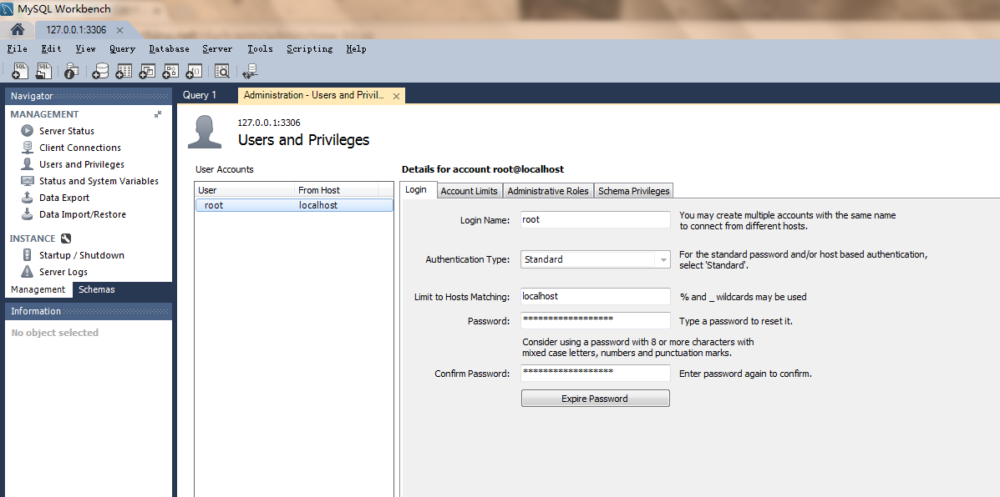
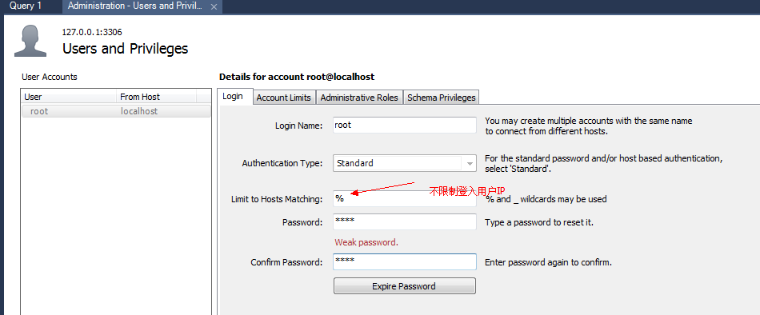
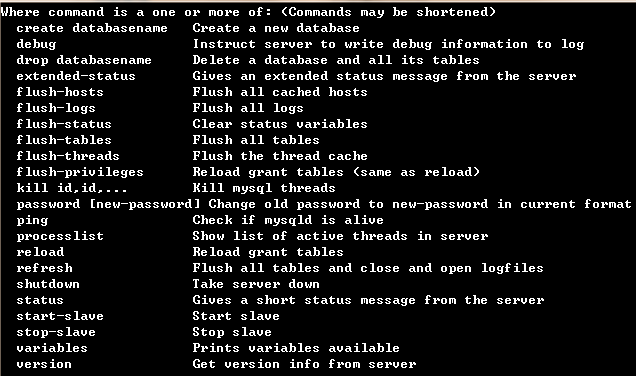
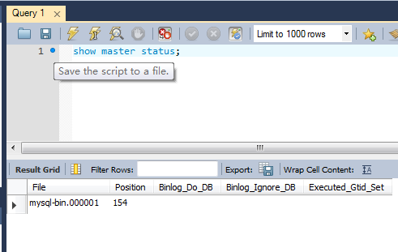
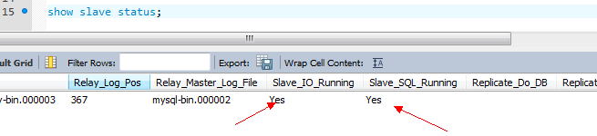
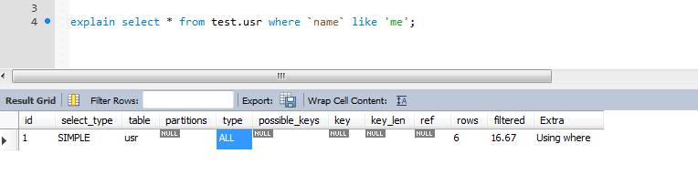
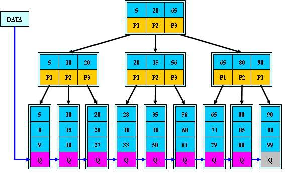
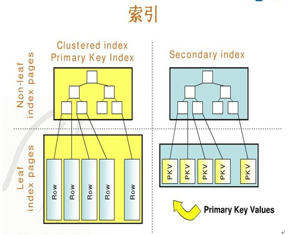
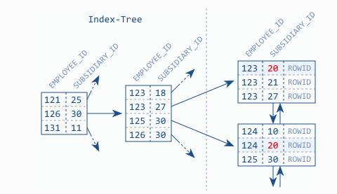

# MySQL指南

> The world's most popular open source database

## MySQL安装

### 下载

首先去mysql.com下载最新的GPL版本。现在最新的是MySQL5.7，本文也将在5.7的版本上做实验。

### 解压

### 配置

我们查看一下MySQL启动的时候，默认查询的配置文件路径：

> mysqld --verbose --help > log

可以得出默认的路径为：

Default options are read from the following files in the given order:

* C:\Windows\my.ini 
* C:\Windows\my.cnf 
* C:\my.ini 
* C:\my.cnf 
* C:\Users\Administrator\Desktop\mysql-5.7.11-winx64\my.ini
* C:\Users\Administrator\Desktop\mysql-5.7.11-winx64\my.cnf 

所以，我们在**MYSQL_HOME(C:\Users\Administrator\Desktop\mysql-5.7.11-winx64\)**目录下，建立一个** my.cnf **文件，这个文件就是mysqld使用的默认配置文件了。当然，你可以在启动mysqld的时候，手动指定。

	[mysqld]

	# mysql服务端默认监听(listen on)的TCP/IP端口
	port=3306

	# 基准路径，其他路径都相对于这个路径
	basedir=C:\\Users\\Administrator\\Desktop\\mysql-5.7.11-winx64\\

	# mysql数据库文件所在目录
	datadir=C:\\Users\\Administrator\\Desktop\\mysql-5.7.11-winx64\\data\\

	#(表名大小写敏感1 忽略大小写,2 大小写敏感)
	lower_case_table_names=2 

	# mysql服务器支持的最大并发连接数（用户数）。
	#但总会预留其中的一个连接给管理员使用超级权限登录，
	#即使连接数目达到最大限制。如果设置得过小而用户比
	#较多，会经常出现“Too many connections”错误。
	max-connections=100 

	# 创建新表时将使用的默认存储引擎
	default-storage-engine=InnoDB 

	#服务端编码
	character-set-server=utf8

	[mysql]

	#mysql编码
	default-character-set=utf8

	[client]

	#客户端编码
	default-character-set=utf8

这样子，就指定了默认的mysql配置，并且指定了mysql的数据库目录文件夹在**MYSQL_HOME\data**下面。

### 初始化数据库

现在，我们来初始化一个只能本地登入，帐号为root，且密码为空的数据库

> mysqld --initialize-insecure 

此时，会发现出现了一个data目录。

### 开启mysql

使用命令

> mysqld 

既可以启动mysql

### 修改权限

可以发现，默认root用户限制了只能本地登入

我们修改一下

**注意： % 代表不限制IP访问地址。**

### mysqladmin

通过mysqladmin，我们可以实现数据库的关闭，主从配置等：

这里，我们来关闭一下mysqld：

> mysqladmin -h127.0.0.1 -P3306 -uroot -proot shutdown 

到此，我们mysql的基本安装可以完成了。

## MySQL REPLICATION

MySQl REPLICATION 提供了一种异步的把数据从一个MySQL实例（MASTER）复制到另一个MySQl 实例的机制。通过这种技术能有效的解决单点数据库查询压力的问题，并且通过中间件（如MyCat，LVS）还可以构建高可用MySQL集群。

实现整个复制操作主要由三个进程：

* Master IO 进程
* Slave IO 进程
* Salve RELAY 进程

复制的基本过程如下：

1. Slave上面的IO进程连接上Master，并请求从指定日志文件的指定位置（或者从最开始的日志）之后的日志内容。

2. Master接收到来自Slave的IO进程的请求后，通过负责复制的IO进程根据请求信息读取指定日志指定位置之后的日志信息，返回给Slave 的IO进程。

3. Slave的IO进程接收到信息后，将接收到的日志内容依次添加到Slave端的**relay-log**文件的最末端，并将读取到的Master端的bin-log的文件名和位置记录到**master-info**文件中。

4. Slave的Sql进程检测到relay-log中新增加了内容后，会马上解析relay-log的内容成为在Master端真实执行时候的那些可执行的内容并在自身执行。

**注意：如果要把一个MySQL实例同时为slave和master那么需要添加 log-slave-updates = 1**

### 基本流程

#### Master

配置文件：

	[mysqld]
	#通常使用ip最后一位
	server-id=1
	#开启log-bin功能
	log-bin=mysql-bin
	#bind mysql端口在网卡上，默认在127.0.0.1
	bind-address=0.0.0.0
	#master和slave同实例功能
	log-slave-updates=1 

重启mysql：

> mysqladmin -h127.0.0.1 -P3306 -uroot -p shutdown

> start mysqld

建立复制帐号：

> GRANT REPLICATION SLAVE,REPLICATION CLIENT ON *.* TO copy@'%' IDENTIFIED BY 'copy';

查看Master状态是否Ok：

> show master status;

**注意：需要记录Master的File和Position位置，Slave需要通过这两个属性配置同步的起点。**

#### Slave

配置文件：

	[mysqld]
	#通常使用ip最后一位
	server-id=2
	#开启log-bin功能
	log-bin=mysql-bin
	#bind mysql端口在网卡上，默认在127.0.0.1
	bind-address=0.0.0.0
	#master和slave同实例功能
	log-slave-updates=1 

重启mysql：

> mysqladmin -h127.0.0.1 -P4001 -uroot -p shutdown

> start mysqld

如果之前开启了slave功能，则需要先停止掉：

> stop slave;

配置Slave同步起点：

	CHANGE MASTER TO 
	MASTER_HOST='127.0.0.1', 
	MASTER_PORT=3306, 
	MASTER_USER='copy',
	MASTER_PASSWORD='copy',
	MASTER_LOG_FILE='mysql-bin.000001',
	MASTER_LOG_POS=154;

**注意：MASTER_LOG_FILE和MASTER_LOG_POS对应Master中的file位置和postion参数**

开启slave:

> start slave;

查看同步状态：

show slave status;

只有当查询到如下状态的时候，才表示配置成功：

1. Slave_IO_State: Waiting for master to send event
2. Slave_IO_Running:yes
3. Slave_SQL_Running: yes

#### 重要文件

在MySQL复制中，主要使用到如下几个文件：

* mysql-bin.00000x # Master上写入的SQL信息，也就是具体的bin-log
* mysql-bin.index # 记录着Master上面有多少个bin-log

* relay-bin.00000x # 记录着Slave从Master拷贝过来具体需要执行的SQL信息
* relay-bin.index # 记录着Slave从Master拷贝过来relay-bin.000000x的索引信息

* relay-log.info # 记录着Slave从Master拷贝过来需要执行SQL的基本信息
* master.info # 记录着Slave指向Master的帐号，同步位置等信息。

**注意：bin-log.00000x的生成时机为：MySQL启动，调用FLUSH指令等。**

#### 常用命令

* show master status; 查看master状态
* show slave status; 查看slave状态
* stop slave; 关闭复制功能
* start slave; 开启复制功能
* show status; 查看mysql运行状态

### 数据一致性

MySQL要实现复制功能的时候，首先需要保证**两个MySQL实例的数据是一致的**。通常的做法是：

1. 锁定MASTER MySQL的数据库：**flush tables with read lock;** 。这样子，MASTER就只能执行SELECT权限。

2. dump/copy master数据库到slave，注意如果直接copy master数据库，需要修改数据库中的**auto.cnf**文件中的uuid。

3. 设置slave指向master最新的File和postion。

4. 开启slave复制功能。

5. 解锁Master数据库： **unlock tables**。

当然，还有其他方法。比如说，拷贝一台原本就是Slave实例，那么不需要锁住Master主机：

1. 关闭slave的同步功能：**stop slave**

2. dump/copy slave的数据库到新的slave中，注意如果直接copy slave数据库，需要修改数据库中的**auto.cnf**文件中的uuid。

3. **配置新的slave的postion和原先的slave的postion一致**

4. 开启两台slave的复制功能。

**注意：如果出现Slave停机时间过长，而无法和Master保持一致的时候，需要特别注意数据一致性的问题**

### MySQL集群

在实际业务中，单机MySQL往往是不能应付高并发的业务系统的，所以我们会采用构建MySQL集群来应付访问流。通常实现的方法有两种：

* 客户端：不存在单节点性能压力，但是实现比较困难，维护性差。
* 中间件：维护性好，投入比较大。

一般来说，我们都采用中间件的方式来完成MySQL集群的搭建。而比较流行的就是**MyCat**了，通过MyCat，我们可以快速的实现如下的功能：

* 读写分离
* HA
* 分库分表

通过使用MyCat，客户端可以像连接一个MySQL一样使用数据库，避免了程序开发人员对对数据库的了解。

## SQL优化

### Sql执行过程

> select DISTINCT msg from t1,t2 left join t3 on t1.uid = t3.id where t1.name = 'aaa%' group by group_part haveing sum(money) > 10 order by name limit 0,10;

的执行过程如下:

1. FROM：对FROM子句中的前两个表执行笛卡尔积(Cartesian product)(交叉联接)，生成虚拟表VT1
2. ON：对VT1应用ON筛选器。只有那些使<join_condition>为真的行才被插入VT2.
3. OUTER(JOIN)： 如果指定了OUTER JOIN(相对对于CROSS JOIN 或INNER JOIN),保留表（preserved table：左外部联接把左表标记为保留表，右外部联接把右表标记为保留表，完全外部联接把两个表都标记为保留表）中未找到匹配的行将作为外部行添加到 VT2,生成VT3.如果FROM子句包含两个以上的表，则对上一个联接生成的结果表和下一个表重复执行步骤1到步骤3，直到处理完所有的表为止。
4. WHERE：对VT3应用WHERE筛选器。只有使<where_condition>为true的行才被插入VT4.
5. GROUP BY：按GROUP BY子句中的列列表对VT4中的行分组，生成VT5.
CUBE|ROLLUP：把超组(Suppergroups)插入VT5,生成VT6.
6. HAVING：对VT6应用HAVING筛选器。只有使<having_condition>为true的组才会被插入VT7.
7. SELECT：处理SELECT列表，产生VT8.
8. DISTINCT：将重复的行从VT8中移除，产生VT9.
9. ORDER BY：将VT9中的行按ORDER BY 子句中的列列表排序，生成游标(VC10).
10. LIMIT：从VC10的开始处选择指定数量或比例的行，生成表VT11,并返回调用者。

### 慢SQL分析

在实际项目中，对于SQL的监控是非常重要的。配置如下：

	#慢查询日志
	slow-query-log    
	#慢查询超时配置(秒)
	long-query-time = 2
	#慢查询存储位置
	#slow-query-log-file=D:\\Link\\mysql\\log\\slow.log 

然后通过mysqldumpslow 或者 mysqlsla 来分析slow.log就可以知道哪些SQL运行缓慢。

### EXPLAIN 

MySQL提供了explain功能，通过它，我们可以快速的分析出SQL运行的具体过程，从而对症下药。如：

> explain select * from usr where name like 'me'

就可以获取到执行的过程：

而具体各个字段的含义为：

|列				|含义|
|---------------|----|
|id				|列表示执行顺序,id 越大,越先执行,id 相同,由上至下执行|
|select_type	|SIMPLE:不包含子查询或者union, SUBQUERY:子查询, PRIMARY:子查询上层,DERIVED:From 中包含子查询, 结果放在临时表中|
|table			|显示这一行的数据是关于哪张表的|
|type			|这是重要的列，显示连接使用了何种类型。从最好到最差的连接类型为const、eq_reg、ref、range、index和ALL|
|possible_keys	|显示可能应用在这张表中的索引。|
|key			|实际使用的索引。如果为NULL，则没有使用索引。|
|key_len		|使用的索引的长度。在不损失精确性的情况下，长度越短越好|
|ref			|显示索引的哪一列被使用了，如果可能的话，是一个常数|
|rows			|MySQL认为必须检查的用来返回请求数据的行数|
|Extra			|关于MYSQL如何解析查询的额外信息, 比如说: Using temporary->使用临时表, 需要优化 ,Using filesort->进行排序, 需要优化|

通过explain，我们可以非常清晰的知道sql该如何优化。

### NULL 和 NOT NULL

尽量避免NULL，应该指定列为NOT NULL，除非你想存储NULL。在MySQL中，含有空值的列很难进行查询优化，因为它们使得索引、索引的统计信息以及比较运算更加复杂。你应该用0、一个特殊的值或者一个空串代替空值。

### 批量更新

如果一个事务中出现多个更新(UPDATE | DELETE | INSERT) 那么 就需要考虑采用JDBC的批量更新API, 来使得mysql可以在一次操作大批量的更新操作, 从而节约时间.

有时候, 因为更新过多, 导致锁住表的时间过长, 所以我们可以考虑采用多次执行sql的方式, 来减少锁住表的时间。

### ENUM

在设计表的时候，通常可以使用ENUM来替代INT或者VARCHAR类型，因为ENUM语义更加清晰，并且占用空间和INT差不多。

### SELECT *

SQL中尽量避免使用 SELECT * ，而应该指出具体的字段，减轻网卡的压力。

### LIMIT 1

对于查询, 有时候我们仅仅需要1或几条数据, 这时候, 我们需要添加LIMIT标志, 表示查询到指定数量后, 就停止查询. 有时候(一般为无条件查询时), 我们需要添加ORDER BY, 来使得MYSQL通过LIMIT N 减少查询。

### JOIN

编写SQL的时候，应该避免多表JOIN操作，尽量将JOIN操作放在应用层来完成。

### 索引使用

* WHERE 和 ORDER BY 尽量使用索引字段

* 尽量避免使用 != 或者  <> 语句

* 尽量避免OR语句中出现没有索引的列，因为MySQL会放弃使用索引，而进行全表搜索。

* 对于连续数值，尽量使用between 替代in

* like语句 '%abc%' 会导致全表扫描，而应该采用 like 'abc%'这种格式，如果一定需要 '%abc%'可以考虑使用**全文索引**。

* 组合索引<a,b>在使用的时候，一定要按照次序，如 WHERE a =1 AND b = 1 或则 WHERE a =1 。

* 合理使用**索引合并**特性，减少组合索引的使用。

* 尽量避免搜索字段进行**表达式/函数**运算,如 SELECT id FROM t WHERE num/2 =100 , SELECT id FROM t WHERE substring(name,1,3) = 1

* 索引不能滥用，因为INSERT,UPDATE,DELETE都需要对索引进行修改。

## InnoDB引擎

InnoDB算是MySQL现在使用最多的数据库引擎了，我们来介绍一下这个引擎。

### B+TREE

B+的特性：

1. 所有关键字都出现在叶子结点的链表中（稠密索引），且链表中的关键字恰好
是有序的;
2. 不可能在非叶子结点命中;
3. 非叶子结点相当于是叶子结点的索引（稀疏索引），叶子结点相当于是存储
（关键字）数据的数据层;
4. 更适合文件索引系统;

### InnoDB 索引结构

InnoDB 的索引是B+TREE 的一个实现, 它采用** 主键索引 + 二级索引 **的方式来完成数据记录的索引.

* **主键索引:** 每一张表必须拥有一个主键索引, 因为InnoDB是通过该索引来管理具体的数据行的, 而数据表行锁也是基于主键索引来实现的.
* **二级索引:** 通过二级索引可以获得叶节点上的主键，然后再通过主键值找到数据行的数据叶，再通过数据叶中的Page Directory找到数据行。
复合索引也是基于二级索引来完成的, 模型结构为

### InnoDB索引与加锁

InnoDB支持MVCC,在MVCC并发控制中，读操作可以分成两类：**快照读 (snapshot read)**与**当前读 (current read)。**

* **快照读:** 读取的是记录的可见版本 (有可能是历史版本)，不用加锁。比如说SELECT(简单).
* **当前读:** 读取的是记录的最新版本，并且，当前读返回的记录，都会加上锁，保证其他事务不会再并发修改这条记录. 
比如说:** FOR UPDATE ,DELETE, INSERT , UPDATE**. 所以索引对于InnoDB非常重要,因为它可以让查询(CUD)锁更少的数据行, 从而减少被锁定的数据行。

例如: 存在一张表{ id, count, cls}, 现在需要对某个 cls 进行count++操作.

> update table set count= count+1 where cls = 1;

如果不使用索引, 则因为查询 cls = 1的数据行的时候会对数据行加锁, 而可能导致全表加锁状态.
如果使用索引, 则枷锁的数据行将仅仅限制在 cls=1的行, 大大加强了并发.

## MySQL常用配置

	[mysqld]
	# mysql服务端默认监听(listen on)的TCP/IP端口
	port=3306 
	# 基准路径，其他路径都相对于这个路径
	basedir=D:\\Link\\mysql\\ 
	# mysql数据库文件所在目录
	datadir=D:\\Link\\mysql\\data\\ 
	#(表名大小写敏感1 忽略大小写,2 大小写敏感)
	lower_case_table_names=2 
	# 创建新表时将使用的默认存储引擎
	default-storage-engine=InnoDB
	#错误日志
	#log-error=D:\\Link\\mysql\\log\\error.log 
	#慢查询日志
	slow-query-log	
	#慢查询超时配置(秒)
	long-query-time = 2
	#慢查询存储位置
	#slow-query-log-file=D:\\Link\\mysql\\log\\slow.log 

	#当前服务器ID，通常为IP最后段位
	server-id=1
	#日志名称
	log-bin=mysql-bin
	#日志保留天数
	expire-logs-days=5
	#log-bin跟随slave更新
	log-slave-updates=1

	# mysql服务器支持的最大并发连接数（用户数）。
	#但总会预留其中的一个连接给管理员使用超级权限登录，
	#即使连接数目达到最大限制。如果设置得过小而用户比
	#较多，会经常出现“Too many connections”错误。
	max-connections=100 

	#MySQL端口绑定地址,如果还是连接不上，可以查看一下是否是防火墙的问题
	bind-address=0.0.0.0

	#服务端编码
	character-set-server=utf8 
	[mysql] #mysql
	default-character-set=utf8
	[client] #client
	default-character-set=utf8

当然，可以通过命令来查看所有可用的配置：

> mysqld --verbose --help 

**注意：为了避免乱码，JDBC URL 通常为 jdbc:mysql://localhost:3306/test?useUnicode=true&amp;characterEncoding=UTF-8**

## 参考

* [mysql主从复制](http://369369.blog.51cto.com/319630/790921/)

* [Mycat 数据库分库分表中间件](http://mycat.io/)

* [MySQL索引背后的数据结构及算法原理](http://blog.jobbole.com/24006/)

* [理解MySQL——索引与优化](http://www.cnblogs.com/hustcat/archive/2009/10/28/1591648.html)

* [comparison-of-full-text-search-engine-lucene-sphinx-postgresql-mysql](http://stackoverflow.com/questions/737275/comparison-of-full-text-search-engine-lucene-sphinx-postgresql-mysql)

* [数据库SQL优化大总结之 百万级数据库优化方案](http://database.51cto.com/art/201407/445934.htm)

* [mysql索引合并:一条sql可以使用多个索引](http://www.tuicool.com/articles/eyURR3r)

* [MyCat](http://mycat.io)

* [MyCat PDF](http://mycat.io/document/Mycat_V1.6.0.pdf)