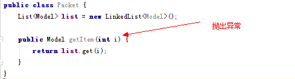

# ProGuard混淆后丢失泛型信息

在APP发布的时候，发现混淆后的APK无法运行，抛出了`JSONObject Cant CAST TO Model` 
的异常。而在测试版本中，却完全正常的运行。

看代码，完全不可能会出现`CAST异常`的地方出现了异常。

使用`javap -verbose` 对比了一下混淆后的Packet.class和未混淆的版本，发现`混淆后
的版本缺少了Model类信息`，并且调试的时候也发现list中存放的类型为JSONObject。

所以可以认为`混淆后的Packet.class#list缺少了具体的Model泛型信息`，导致FastJson
处理{list:[{name:"AAA"}]}直接变成JSONArray赋值给了list属性。

google，google，只用在ProGuard配置文件需要添加` -keepattributes Signature `属性才
能将具体的泛型信息保留下来。

