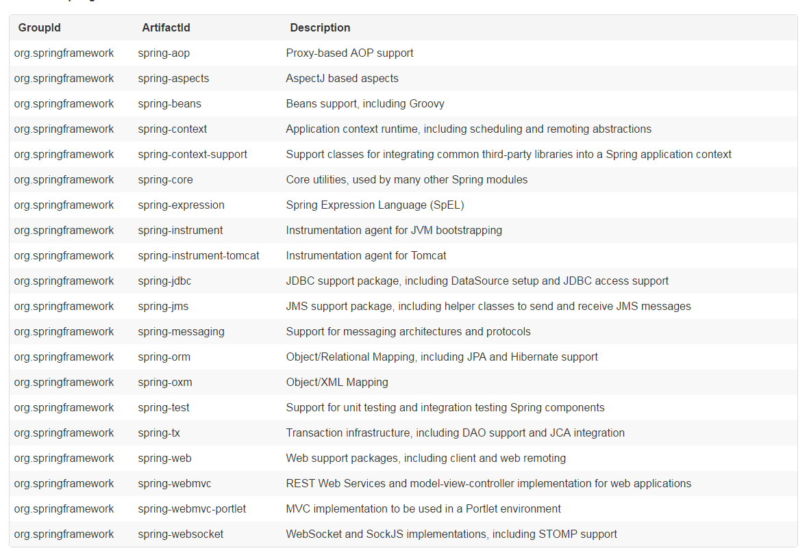
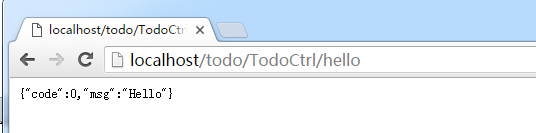
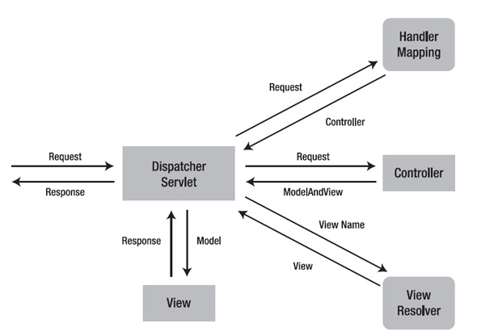

# Spring

## Mvc

### 例子

**依赖：**



首先，我们需要引入上述的JAR包，以及一些相关联的JAR，如：

* log4j
* jetty

这样子，就完成了Spring Jar的引入。

**web.xml**

```xml

   <!-- UTF-8 编码-->
    <filter>
        <filter-name>encodingFilter</filter-name>
        <filter-class>org.springframework.web.filter.CharacterEncodingFilter</filter-class>
        <init-param>
            <param-name>encoding</param-name>
            <param-value>UTF-8</param-value>
        </init-param>
        <init-param>
            <param-name>forceEncoding</param-name>
            <param-value>true</param-value>
        </init-param>
    </filter>
    <filter-mapping>
        <filter-name>encodingFilter</filter-name>
        <url-pattern>/*</url-pattern>
    </filter-mapping>

    <!--Spring MVC-->
    <servlet>
        <servlet-name>springMVC</servlet-name>
        <servlet-class>org.springframework.web.servlet.DispatcherServlet</servlet-class>
        <init-param>
            <param-name>contextClass</param-name>
            <!--使用注解方式的WebApplicationContext容器-->
            <param-value>org.springframework.web.context.support.AnnotationConfigWebApplicationContext</param-value>
        </init-param>
        <init-param>
            <!--指定Spring注解配置类-->
            <param-name>contextConfigLocation</param-name>
            <param-value>org.darkgem.SpringConf</param-value>
        </init-param>
        <!--项目不支持直接的ASYNC-->
        <async-supported>false</async-supported>
        <load-on-startup>1</load-on-startup>
    </servlet>
    
    <!--拦截所有请求-->
    <servlet-mapping>
        <servlet-name>springMVC</servlet-name>
        <url-pattern>/*</url-pattern>
    </servlet-mapping>

    <!--index 配置-->
    <welcome-file-list>
        <welcome-file>/index.html</welcome-file>
    </welcome-file-list>

    <!--error-page 配置-->
    <error-page>
        <exception-type>java.lang.Exception</exception-type>
        <location>/exception.html</location>
    </error-page>
    <error-page>
        <error-code>404</error-code>
        <location>/404.html</location>
    </error-page>
    <error-page>
        <error-code>500</error-code>
        <location>/500.html</location>
    </error-page>

```

在`web.xml`中，我们配置了：

1. 添加支持UTF-8的字符过滤器
2. 添加`DispatcherServlet`
3. 异常/404/500 等页面

容器在启动后，会加载和初始化`DispatcherServlet`这个Servlet类。而**Spring容器**的初始化就是通过`DispatcherServlet`实现的。

注意：UTF-8字符过滤器会**智能**的处理`charset=utf-8`的设置。

**Spring配置：**

```java

@Configuration
@PropertySource("classpath:project.properties")
@EnableAspectJAutoProxy(proxyTargetClass = true)
@ComponentScan("org.darkgem")
public class SpringConf {
    static Logger logger = LoggerFactory.getLogger(SpringConf.class);


    /**
     * Spring MVC 配置
     */
    @Component
    // 开启Spring Mvc
    @EnableWebMvc
    // Spring Mvc 配置器，当然，也可以不通过这个Adapter配置
    static class SpringMvcConf extends WebMvcConfigurerAdapter {

        // 配置默认ServletHandler
        @Override
        public void configureDefaultServletHandling(DefaultServletHandlerConfigurer configurer) {
            configurer.enable();
        }

        // 配置视图渲染
        @Override
        public void configureViewResolvers(ViewResolverRegistry registry) {
            registry.order(1);

            FastJsonJsonView fastJsonJsonView = new FastJsonJsonView();
            fastJsonJsonView.setExtractValueFromSingleKeyModel(true);

            registry.enableContentNegotiation(fastJsonJsonView);

        }
    }
}
```

在上述注解式配置中，通过`SpringMvcConf`配置了SpringMvc组件：

1. 默认ServlerHandler处理
2. JSON渲染器

**Ctrl：**


```java

@Controller
@RequestMapping("/todo/TodoCtrl")
public class TodoCtrl {

    @RequestMapping("/hello")
    public Message hello() {
        return Message.okMessage("Hello");
    }
}


```

上述，是一个简单的Ctrl控制器，用于返回Hello字符串。

**测试：**

我们通过Jetty启动容器，然后通过浏览器测试：



可以发现，我们的Spring Mvc已经正常工作了。

### 基础组件

#### 异常处理

### 处理流程



### 总结

## 参考

* [HTTP 基础与变迁](https://segmentfault.com/a/1190000006689489)
* [HTTP 缓存的四种风味与缓存策略](https://segmentfault.com/a/1190000006689795)
* [Spring MVC 入门示例讲解](http://www.importnew.com/15141.html)
* [SpringMVC系列之主要组件](http://www.cnblogs.com/xujian2014/p/5435471.html)
