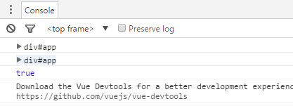
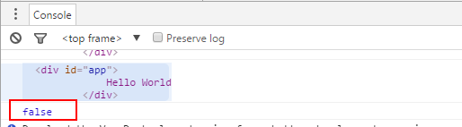
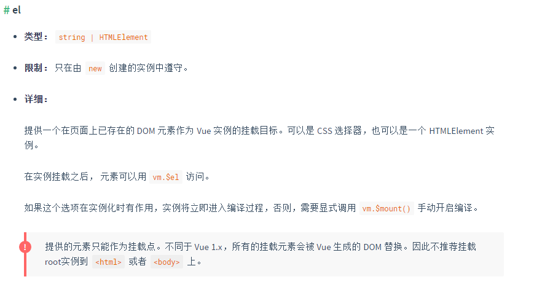

# Vue 1.x->2.x diff

## 初始化

Vue 1.x 版本初始化对挂载节点的影响：

```javascript

<html>
	<head>
		<script src="http://cdn.bootcss.com/vue/1.0.24/vue.js"></script>
	</head>
	<body>
		<div id="app">	
			{{message}}
		</div>
		<script>
			var oldEl = document.getElementById('app');
			console.log(oldEl);
			var app = new Vue({
				el:'#app',
				data:{
					message:"Hello World"
				}
			});
			var newEl = document.getElementById('app');
			console.log(newEl);
			
			console.log(newEl == oldEl)
		</script>	
	</body>
	
</html>

```

运行结果:




Vue 2.x 版本初始化对挂载节点的影响：


```javascript

<html>
	<head>
		<script src="http://cdn.bootcss.com/vue/2.1.10/vue.js"></script>
	</head>
	<body>
		<div id="app">	
			{{message}}
		</div>
		<script>
			var oldEl = document.getElementById('app');
			console.log(oldEl);
			var app = new Vue({
				el:'#app',
				data:{
					message:"Hello World"
				}
			});
			var newEl = document.getElementById('app');
			console.log(newEl);
			
			console.log(newEl == oldEl)
		</script>	
	</body>
	
</html>

```

运行结果:



看一下官方文档：



