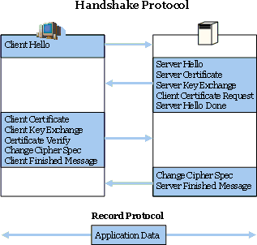

# Web信息安全

在当今的互联网时代，信息安全问题经常发生，如何保证信息的安全成为开发者不得不面对的问题。

## CIA

信息安全的CIA原则，大致阐述了实践信息安全的几个基本原则：

1. **保密性（Confidentiality）**：确保信息在存储、使用、传输过程中不会泄漏给非授权用户或实体。

2. **完整性（Integrity）**：确保信息在存储、使用、传输过程中不会被非授权用户篡改，同时还要防止授权用户对系统及信息进行不恰当的篡改，保持信息内、外部表示的一致性。

3. **可用性（Availability）**：确保授权用户或实体对信息及资源的正常使用不会被异常拒绝，允许其可靠而及时地访问信息及资源。

## 套路

在Web时代，信息安全通常需要考虑如下几个方面：

1. **传输过程**：被窃听，被篡改，被重放等（`中间人攻击`等）
2. **接入过程**：双方身份认证，操作数据(参数)认证，流量控制等（`越权攻击`，`SQL注入`，`DDos攻击`等）
3. **存储/服务过程**：数据和应用需要多地灾容，避免天灾人祸。

## 防护

### 身份验证

当访问一个具有权限的接口的时候，服务器需要验证访问者的身份，而如何鉴定访问者的身份呢？ 通常的情况下，我们会使用密码，指纹，证书，验证码，TOKEN 等手段来验证一个用户的真实身份。在这个背后，隐藏着一个问题：为什么密码，指纹，TOKEN，可以验证访问者的身份？为了回答这个问题，我们可以发现一个共性，**就是这些信息（密码，指纹，TOKEN）只有访问者知道，他人不知道，所以回答正确，就能验证访问者的身份。这样子就可以验证访问者的身份了。**当然如果被第三人知道了，那么就GG 思密达了。

#### TOKEN的使用

关于TOKEN，就不得不说移动端的崛起，在2008年之前，基本上提供的服务都是基于Web的，通过SESSION + COOKIE来完成，然而到了后来，移动端开始崛起。开发者遇到这COOKIE不好用，跨服务器访问资源等等问题。为了解决这个问题，出现了OAuth2.0的标准，通过这个标准，基本上可以解决移动端身份验证的问题。这里简述一下通常移动端TOKEN使用的场景：

1. APP 打开，跳出验证页面，输入用户名 和 密码
2. 服务器进行验证，验证通过，返回TOKEN作为给APP
3. APP使用TOKEN访问服务器的资源。

而TOKEN具体是什么？通常情况下，它对移动端来说就是一段随机数字。当然，对于服务器，可以通过对称加密的算法在TOKEN上做一些特别的设计，如加入用户名之类的。

### HTTPS

HTTPS 可以算是现今信息安全的基石之一了，采用SSL进行传输数据。如下是HTTPS 的基本过程图解：

大致的阶段为：

1. 客户端发起请求
2. 服务器响应请求，给定自己的公钥（可能被第三方CA加密过）
3. 客户端验证公钥（如果被第三方CA加密过，则使用CA的公钥进行解密，`并且验证域名是否一致`）
4. 客户端通过验证公钥，选择一套对称加密算法，生成 密钥，并且使用服务器的公钥进行加密
5. 服务器使用自己的私钥，解密对称加密的密钥
6. 客户端 和 服务器 使用对称密钥进行信息交换

HTTPS协议能防护大部分的网络攻击，在构建Web站点的时候，建议对关键资源进行HTTPS协议传输。

## 总结

**最佳实践：不信任任何数据。**

## 参考

* [理解OAuth 2.0](http://www.ruanyifeng.com/blog/2014/05/oauth_2_0.html)
* [SSL/TLS协议运行机制的概述](http://www.ruanyifeng.com/blog/2014/02/ssl_tls.html)
* [HTTPS连接的前几毫秒发生了什么](http://blog.jobbole.com/48369/)