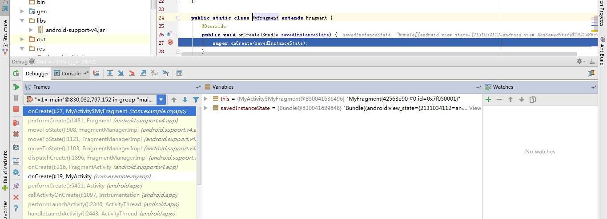

# Android LMK

大家都知道，Android App在退出页面的时候，是不会杀死进程的，这就可能导致Memory不足。
为了在移动设备上运行Android系统，必然有一套完整的杀死进程的机制，称为LMK机制。

通过阅读本文，可以了解Android LMK机制，从而避免App被频繁的杀死，以及一些开发中会遇到
的问题。

# LMK 机制

为了空出足够的内存供前台进程使用，Android会定时进行CHECK进程树，然后杀死优先级别不高
的进程。而进程的优先级别是按照属性**oom_adj**来判断的。oom_adj数值越低，越不会被杀死。

oom_adj的数字大致为这几种：

* ro.FOREGROUND_APP_ADJ(0)      ：前台进程，正在活动的Activity或者使用startForeground的Service
* ro.VISIBLE_APP_ADJ(1)         ：可见进程，不可操作的Activity，但是可见
* ro.SECONDARY_SERVER_ADJ(2)    ：拥有后台服务器的进程
* ro.HIDDEN_APP_MIN_ADJ(7)      ：Activity没有完全退出，直接采用 moveTaskToBack 到HOME的进程？？
* ro.CONTENT_PROVIDER_ADJ(14)   ：内容提供进程
* ro.EMPTY_APP_ADJ(15)          ：空进程

可以发现，oom_adj的定义和我们学习过的android教材定义（进程优先级）是一样的。当系统的
内存不足的时候，那么就会杀死发送**KILL SIGNAL**， 杀死一些优先级别低的进程，用来提供足
够的内存给前台进程使用

# 防止App被杀死

防止App被系统杀死，主要是为了Service能正常的运行提供服务，如音乐播放，PUSH服务等。
这时候，就需要一些手段来完成这个目标。

1. Service 使用**startForeground** ，设置自己的优先级为前台进程，这样子，就不会被杀死。
2. 若Application被LMK杀死，那么归属于这个Application的Service当然也不能幸免。但是AMS
进程会监听KILL SIGNAL，如果被杀死的Application中存**在onStartCommand返回START_STICKY**
的Service，则AMS会过一段时间后，自动启动该Service（不一定会启动成功）。
3.Service放在另外一个进程中，避免占用内存过多，导致优先被杀死。
4. 当前页面处于MainActivity的时候，**重写onBackPressed()->使用moveTaskToBack(true)**来完
成切换到HOME，避免MainActivity被回收，从而提高优先级。
5.监听系统广播，如 BOOT_COMPLETED,ACTION_TIME_TICK 等。但是这种方法越来越不可靠。

当然，还有一些其他方法，但是在Android系统越来越完善的情况下，利用API不提供的方法
（如漏洞，Native）来保证Service运行的方式越来越不可靠，所以建议还是采用Android系
统提供的方式，来保证Service的长时间运行。

# 重启问题

当Application被杀死后，重新启动Application会发生一些特殊的情况，比如说，会莫名其妙
的读取到空指针之类的（建议用**原生系统测试**，因为现在第三方ROM可能会做了这些优化）。

## Activity

如果一个App，在后台运行的时候，超过30min，就可能会被Android杀死，用来释放内存，给其他App
使用。这时候进入App，会遇到奇怪的问题。

上图描述了App被杀死，对于Activity的处理流程。结合(android-destroying-activities-killing-processes)[http://stackoverflow.com/questions/14375720/android-destroying-activities-killing-processes]
，在android杀死进程后，再次进入App，在不同的版本有不同的情况。

1. **android2.3之前**，会直接从MainActivity进入
2. **android2.3之后**，会从最后的Activity进入onCreate方法，然后进行还原。
还原依赖onSaveInstanceState（）方法保存的数据，并且点击back按钮，也是类似的。
也就是所，会重建整个之间的Activity栈，并且都是从onCreate进入。 

情况2，会引发其他问题，比如说，在Application中的全局数据之类的，会导致读取空指针
的问题。

**所以，通常的做法就是，如果Activity初始化onCreate()的时候，检测到Application等依赖
数据没有初始化，则直接杀死进程重启。**

下面有这面文章介绍了如何模拟进程被杀死的情况：(how-to-simulate-android-killing-my-process)[http://stackoverflow.com/questions/11365301/how-to-simulate-android-killing-my-process/]

## 关于FragmentActivity

这里再提一下，FragmentActivity在被杀死的情况下，还原的情况。在点击HOME后，Activity
会调用onSaveInstanceState（）方法保存当前Fragment状态，用于重建FragmentActivity使
用。这时候，就会造成一个问题，会重建的时候，出现重叠的Fragment，这并不是我们想要
的结果。

如图，App崩溃后，点击ICON进入App后，在FragmentActivity的onCreate方法中，重建了之前
通过onSaveInstanceState()保存的Frament，并且调用Fragment中的onCreate方法。这时候，
极其容易出现空指针的错误。特别是getActivity() 会获取到null，因为这时候没有
调用onAttach（）。

所以，需要重写onSaveInstanceState()方法，让它不调用 super.onSaveInstanceState()方法，这样子，
就不会保存点击HOME的时候Fragment的状态。

# 定制ROM问题

许多Andorid的ROM都被第三方厂商定制过，导致出现许多标准Android上未发现的电池管理。

## 自启动

魅族flyme 4.5.7 和 MIUI 7 有一个自启动管理，如果你的APP不在列表中，那么极其容易
被KILL 回收内存。而一旦加入白名单，那么，系统将允许你在休眠后保留在后台，并且侧
滑杀死App是无效或自动重启

## MIUI “神隐模式”

只有白名单的App才能在后台访问网络以及其他资源，这会导致即使你的App在白名单中，
也无法正常的使用推送服务。当然微信，QQ，之类的已经默认是白名单了。但是，这对
我们普通App的话，会导致推送不及时的问题，需要逐个的测试各个定制ROM，才能保证
我们的APP不被定制ROM杀死了也不知道是什么情况。

