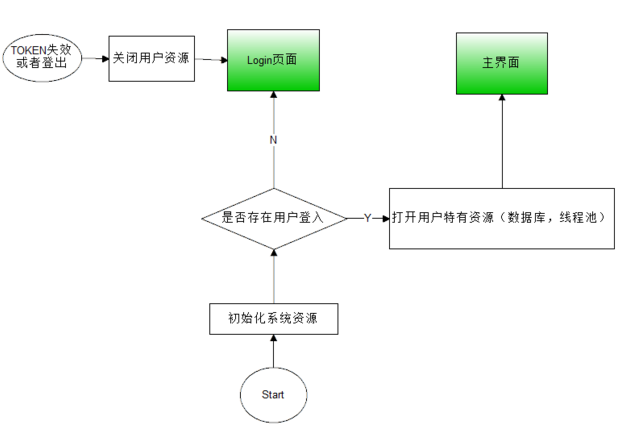
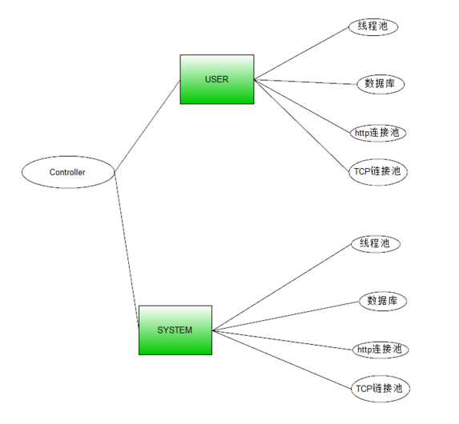

# android Login设计

## 流程图

**注意，登出的时候需要关闭用户资源。如果不关闭的话，就会导致后台服务一直接收退出用户的消息等情况发生。**

## 资源

## 登出

对于APP来说，完全退出是一项非常基本的功能，但是，这个功能要实现的比较好，也是比较困难的。

最麻烦的地方就是：**帐号切换了，但是还存在子进程或者子线程在运行上一个用户业务，导致完成的业务数据写入当前切换成功的用户数据库中。**如果拥有推送进程的话，那么还需要notify推送进程关闭，避免杀死Service进程又自重启。

通常的做法是关闭所有服务，杀死所有的进程，然后重启。如下是一段比较完善的代码：

	/**
	 * 重启App
	 */
	static public void killApp(Context context, boolean restart) {
		//重启
		if (restart) {
			Intent intent = new Intent(context, MyActivity.class);
			intent.addFlags(Intent.FLAG_ACTIVITY_NEW_TASK);
			context.startActivity(intent);
		}
	  
		//停止后台 service
		try {
			//读取所有的SERVICE信息
			PackageInfo packageInfo = context.getPackageManager().getPackageInfo(context.getPackageName(), PackageManager.GET_SERVICES);
			if (packageInfo != null && packageInfo.services != null) {
				for (ServiceInfo serviceInfo : packageInfo.services) {
					try {
						Class cls = Class.forName(serviceInfo.name);
						context.stopService(new Intent(context, cls));
					} catch (ClassNotFoundException e) {
					}
				}
			}
		} catch (Exception e) {
			Log.e(MyActivity.class.getName(), e.getMessage(), e);
		}
		//杀死所有进程
		try {
			Set<String> processNameSet = new HashSet<String>();
			//读取 所有的Process
			{
				//读取Activity
				{
					PackageInfo packageInfo = context.getPackageManager().getPackageInfo(context.getPackageName(), PackageManager.GET_ACTIVITIES);
					if (packageInfo != null && packageInfo.activities != null) {
						for (ActivityInfo activityInfo : packageInfo.activities) {
							processNameSet.add(activityInfo.processName);
						}
					}
				}
				//读取Service
				{
					PackageInfo packageInfo = context.getPackageManager().getPackageInfo(context.getPackageName(), PackageManager.GET_SERVICES);
					if (packageInfo != null && packageInfo.services != null) {
						for (ServiceInfo serviceInfo : packageInfo.services) {
							processNameSet.add(serviceInfo.processName);
						}
					}
				}
				//读取 RECEIVERS
				{
					PackageInfo packageInfo = context.getPackageManager().getPackageInfo(context.getPackageName(), PackageManager.GET_RECEIVERS);
					if (packageInfo != null && packageInfo.receivers != null) {
						for (ActivityInfo activityInfo : packageInfo.receivers) {
							processNameSet.add(activityInfo.processName);
						}
					}
				}
				//读取 PROVIDERS
				{
					PackageInfo packageInfo = context.getPackageManager().getPackageInfo(context.getPackageName(), PackageManager.GET_PROVIDERS);
					if (packageInfo != null && packageInfo.providers != null) {
						for (ProviderInfo providerInfo : packageInfo.providers) {
							processNameSet.add(providerInfo.processName);
						}
					}
				}
			}
			//关闭所有进程
			{
				int myPid = android.os.Process.myPid();
				ActivityManager mActivityManager = (ActivityManager) context.getSystemService(Context.ACTIVITY_SERVICE);
				Iterator iterator = mActivityManager.getRunningAppProcesses().iterator();
				while (iterator.hasNext()) {
					ActivityManager.RunningAppProcessInfo appProcess = (ActivityManager.RunningAppProcessInfo) iterator.next();
					if (processNameSet.contains(appProcess.processName)) {
						//先KILL其他进程
						if (appProcess.pid != myPid) {
							android.os.Process.killProcess(appProcess.pid);
						}
					}
				}
				//杀死自己
				android.os.Process.killProcess(myPid);
			}
		} catch (Exception e) {
			Log.e(MyActivity.class.getName(),e.getMessage(),e);
			throw new RuntimeException(e);
		}
	}

 核心思想是：

1. 发送重启自己到主Activity事件到AMS
2. **读取AndroidManifest.xml 中所有Service信息，调用stopService进行关闭，避免重启Service**
3. 杀死所有AndroidManifest.xml process 指向的进程，除了自己
4. 杀死自己

这样子就能完全退出app了，值得一提的是网上出现 restartPackage, killBackgroundProcesses 貌似在5.1上都不可行。当然，上面的代码测试环境，也是5.1了。

**当然了，体验比较好的就是依次释放用户资源（线程池，数据库，后台Service等）。不过该方法实现起来比较困难。**

## 总结

在用户的登入登出设计中，登入的时候需要注意用户是否之前登入过，而登出设计需要考虑TOKEN失效以及主动退出的问题。而登出设计的时候，还需要考虑关于个人资源（线程池，数据库，后台任务等）关闭的问题。

## 参考

* [kill源码地址](http://git.oschina.net/darkgem/KillApplication)