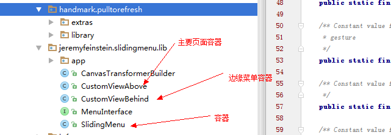
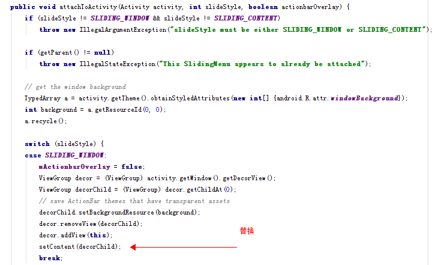
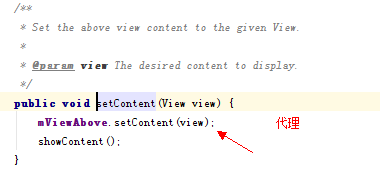
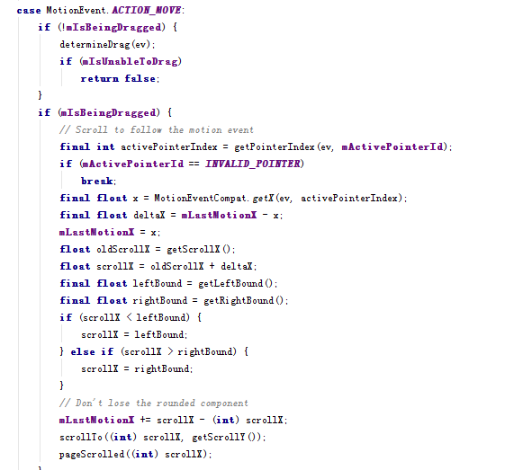
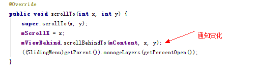

# Android SlidingMenu 

SlidingMenu 是github上hot android 开源控件之一。现来简要的分析一下SlidingMenu实现分析。[SlideMenu](https://github.com/jfeinstein10/SlidingMenu)

## 基本类介绍

* SlidingMenu：用于控制Menu和Content页面的容器。
* CustomViewBehind：存放菜单的容器
* CustomViewAbove：存放主要页面的容器，核心类，基本上滑动操作都在这个类中实现。

## 偷天换日

SlidingMenu#attachToActivity() 函数是使得SlidingMenu进行开始工作的函数。
核心代码如下：

是的，它将RootView的第一个子View进行替换，使用自己作为父容器。这样子，
就完成了加入Menu到ViewTree的操作，并且注意setContent函数：

是的，使用CustomViewAbove mViewAbove代理的**真正的页面**。So，可以联想，
CustomViewBehind也代理了Menu部分。

## 屏幕事件处理

通过搜索，可以发现在SlidingMenu和CustomViewBehind中，并没有对onTouchEvent进行扩展，
虽然SldingMenu是父容器。而查询**CustomViewAbove#onTouchEvent**可以发现长长的代码。So，
基本上可以确定滑动菜单处理的代码基本在这里。滑动核心代码如下
(**MotionEvent.ACTION_MOVE事件**)：

长长的一串代码，我也没有搞清楚怎么算的，大致意思就是算出显示Menu的X，**也就是scrollX
的距离，最后通过scrollTo 函数，完成了滚动的过程。**

## 神奇的ScrollTo

**CustomViewAbove#scollTo**是重写了父方法，加入了自定义的内容，就是通知菜单部分：
“哥们，你出来把！”。

