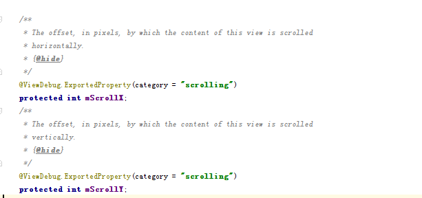
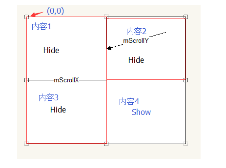
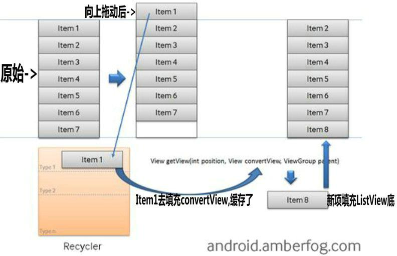

# Android View 滚动机制

在Android中，如果出现需要展示的内容超过屏幕的大小，通常我们会使用ScrollView和ListView来解决。本文将介绍这两种方法的原理。

## ScrollView

我们先看看mScrollX/mScrollY在代码中的注释：

mScrollX/mScrollY相对这个View的内容（文字，图片，子View）垂直/水平的像素偏移。如下图：

在设置mScrollX / mScrollY后，就可以滚动到指定的“内容"，而mScrollX/mScrollY 就是将内容原点（0，0）进行偏移的数值。

而这种内容大小以及偏移是如何发生的？在ViewGroup中，存在一个API drawChild（），这个函数主要完成对子View的空间大小的限制以及偏移，见如下的描述：

	protected boolean drawChild(Canvas canvas, View child, long drawingTime) {
		boolean more = false;
		//获取子View的空间大小
		final int cl = child.mLeft;
		final int ct = child.mTop;
		final int cr = child.mRight;
		final int cb = child.mBottom;
		//通知子View进行判断是否完成滚动，这里就是通过Scroller代码实现滚动的关键点
		child.computeScroll();
		//获取最新的偏移量
		final int sx = child.mScrollX;
		final int sy = child.mScrollY;
		//创建一个还原点
		final int restoreTo = canvas.save();
		//偏移，通过这个API，实现了scroll对内容偏移, 先把内容的原点进行偏移到负数区域
		canvas.translate(cl - sx, ct - sy);
		//剪切，因为之前有一个translate操作，所有剪切出来的空间就是父View给定的可见区域
		//所以如果子View填充Canvas的内容超出给定的空间，也不会显示出来
		canvas.clipRect(sx, sy, sx + (cr - cl), sy + (cb - ct));
		//让子View进行绘图，注意子View不用处理Scroll属性，既可以实现内容偏移
		child.draw(canvas);
		//还原
		canvas.restoreToCount(restoreTo);
		return more;
	}

**通过设置canvas的可见区域以及偏移平移坐标原点（0，0），就可以完成在固定大小内通过滚动显示被覆盖的部分。**

## ListView

ListView和ScrollView有很大的区别：ListView仅仅需要几个View既可以实现滚动效果，而ScrollView需要全部的View。我们来看一下ListView缓存机制：

**所以ListView的滚动效果是通过替换ViewGroup上的子View来实现的。**

## 总结

在android中，为了实现滚动效果，通常有两种方式：

* 通过scrollTo实现
* 通过替换ViewGroup上的子View实现

而ScrollView和ListView就是这两种实现的代表了。