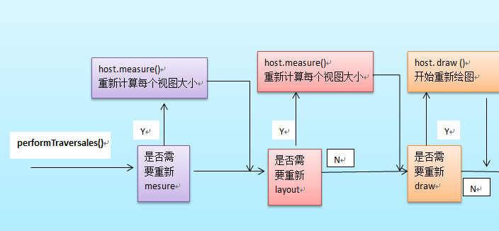

# View 绘图流程

## API 和 Displayer

View -> Draw -> Canvas -> C API -> OpCode Byte -> IO -> GPU CARD -> Electronic signal -> Displayer

Android提供了一套View机制，封装好了需要控件，只需要修改一下属性，**既可以控制draw的过程，从而实现想要的UI效果**。

## View 绘图流程

关于三个阶段的简单描述：

1. measure：预估计ViewTree的各个View的占用空间，**一个View可能重复多次这个方法。**
2. layout：确定ViewTree中各个View所处的空间位置，包括width，height，left，top，right，bottom。
3. draw：使用RootViewImpl中的一个**canvas = surface.lockCanvas(dirty)**对象作为画布，然ViewTree上所有的View都在这个Canvas上进行画图。

## 总结

通过Android提供的View机制，我们就可以实现大部分UI需求，当然了一些复杂的UI需要另寻方法，比如说：游戏，电影之类。