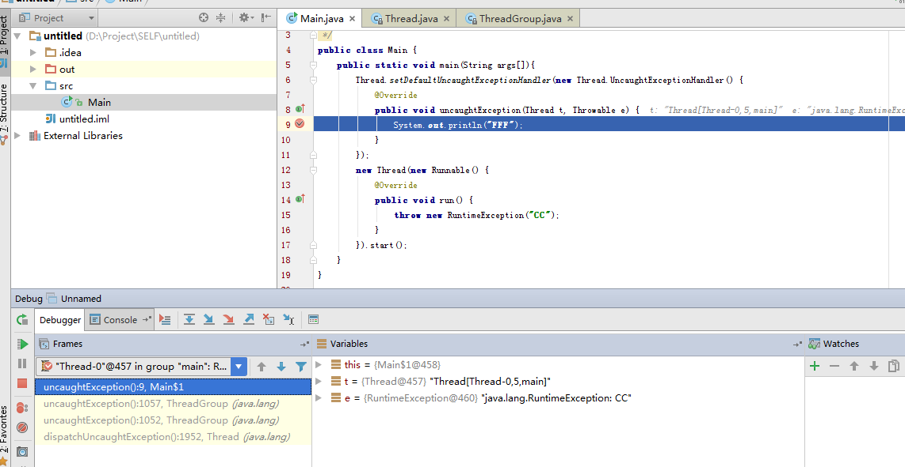

# Android Crash 

在开发中，会遇到crash问题，一般来说，crash发生在java层，但是，有时候会发生在其他层面上。大致，Android Crash 大致有三类：

1. Java uncatch exception
2. ANR crash
3. Native crash

## Java全局异常处理

通过Thread.setDefaultUncaughtExceptionHandler我们可以指定一个默认的全局异常处理器，该处理器由**JVM发现UNCATCH EXCEPTION 的时候调用**

	public class Main {
		public static void main(String args[]){
			Thread.setDefaultUncaughtExceptionHandler(new Thread.UncaughtExceptionHandler() {
				@Override
				public void uncaughtException(Thread t, Throwable e) {
					System.out.println("FFF");
				}
			});
			new Thread(new Runnable() {
				@Override
				public void run() {
					throw new RuntimeException("CC");
				}
			}).start();
		}
	}

堆栈图：

堆栈的ROOT方法：

	/**
	* Dispatch an uncaught exception to the handler. This method is
	* intended to be called only by the JVM.
	*/
	private void dispatchUncaughtException(Throwable e) {
		getUncaughtExceptionHandler().uncaughtException(this, e);
	}

## ANR crash

ANR 产生的原因主要是UI线程被卡住太长时间了，其大部分是因为网络访问引起的，幸好4.0以后，就不支持在UI线程访问网络了。

ANR 一旦发生，通常会在Logcat中刷出问题，但是，如果该APP已经发布了，就无法通过logcat查看到崩溃日志了。

幸好，我们可以通过**/data/anr/traces.txt** 来读取**最后一次ANR日志**。 具体可以参考[ANR](http://rayleeya.iteye.com/blog/1955657)文章。

## Native crash

因为性能的问题，Android中的游戏开发等，通常使用native（C语言）开发，因为脱离了JVM环境，所以一旦发生crash，错误就比较难以定位，我们需要借助操作系统的力量进行crash日志收集。

### DEBUG

如果正在开发APP中，及时发现问题，那么可以通过 ndk-stack 来查看崩溃位置[ndk-stack使用](http://www.cnblogs.com/xitang/p/4189793.html)

### RELEASE

麻烦的问题就是在于，如果APP发布了，就不能通过logcat来获取崩溃日志了。此时，只能借助于Android依赖的系统来完成日志捕获的功能。大部分Android系统是依赖Linux系统，所以，只用通过Linux对原生程序崩溃的处理方法，就可以完成日志的捕获。

在Linux 中，通常采用**信号**来捕获各种异常状态的，所以只需要注册一个我们的信号量监听器就可以完成对崩溃事件的监听。然后，利用参数info可以获取崩溃stack位置，最后通过回溯stack，就可以打印出崩溃点的C栈了。

具体可以参考[善用backtrace解决大问题](http://blog.chinaunix.net/uid-14833587-id-76555.html)，也可以直接采用 **google breakpad **开源项目解决这个问题。

## 总结

经过上述分析，可以发现Android平台的崩溃点还是比较多的，对于ANR和Native crash 的日志收集还是比较困难的。 通过TX Bugly 可以直接Hold住这些问题，看介绍是这样子的。对于TX Bugly的原理，个人认为应该和本文描述类似，希望有大牛能解密。

对于应用的crash情况，相信各个平台都有相对应的一套机制来帮助程序员定位异常点。