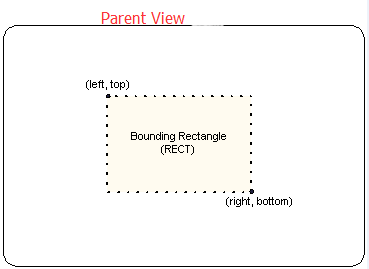
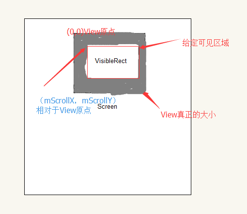
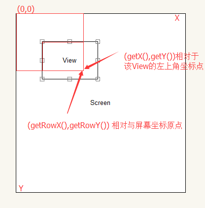

# Android 坐标系

## left top right bottom

android view 的left top right bottom 是相对parent view的空间数据：

FROM:[what-does-top-left-right-and-bottom-mean-in-android-rect-object](http://stackoverflow.com/questions/22589322/what-does-top-left-right-and-bottom-mean-in-android-rect-object)

## View XY API

View 中存在一些描述自己位置的API如：

|API                   |DESC                        |
|----------------------|----------------------------|
|getX() 　　　　　　　 |获取相对与父View的左上角偏移|
|getY() 　　　　　　　 |获取相对与父View的左上角偏移|
|getLocationOnScreen() |获得相对与屏幕原点的偏移    |
|getLocationInWindow() |获取相对与当前Window的偏移  |

## View Rect API

View 中存在一些描述它自己占用的空间的API:

|API                     |DESC                              |
|------------------------|----------------------------------|
|getLocalVisibleRect() 　|返回当前View占用的可见区域大小    |
|getGlobalVisibleRect () |获取当前整个ViewTree可见区域的大小|

## Window API

* getWindow().getDecorView().getWindowVisibleDisplayFrame(frame) : 获取整个屏幕的坐标，其中有效部分是App的主体内容，包含标题栏
* getWindowManager().getDefaultDisplay() : 获取物理屏幕的大小

## View mScrollX mScrollY 

View的 mScrollX 和 mScrollY 是相对于View的坐标原点偏移量：

## MotionEvent 坐标

在View中，如果实现了如下接口，那么就可以处理**触摸事件**：

> public boolean onTouchEvent(MotionEvent event); 

因为不同的事件在MotionEvent中有不同的id，因此可以根据 

> **event.getAction() & MotionEvent.ACTION_MASK **

的结果来判断是何种事件，事件类型：

* MotionEvent.ACTION_DOWN：在第一个点被按下时触发
* MotionEvent.ACTION_UP:当屏幕上唯一的点被放开时触发
* MotionEvent.ACTION_POINTER_DOWN:当屏幕上已经有一个点被按住，此时再按下其他点时触发。
* MotionEvent.ACTION_POINTER_UP:当屏幕上有多个点被按住，松开其中一个点时触发（即非最后一个点被放开时）。
* MotionEvent.ACTION_MOVE：当有点在屏幕上移动时触发。值得注意的是，由于它的灵敏度很高，而我们的手指又不可能完全静止（即使我们感觉不到移动，但其实我们的手指也在不停地抖动），所以实际的情况是，基本上只要有点在屏幕上，此事件就会一直不停地被触发

坐标说明：

## 总结

通过认识View的坐标系，我们可以更加深入的使用Android 提供的View机制。