# Android性能优化

## 性能篇

在Android性能调优中，主要使用**自带的monitor工具（之前的TraceView）**。 这个工具非常NB，可以看内存变化，热点代码分析，线程查看等功能。界面如图：

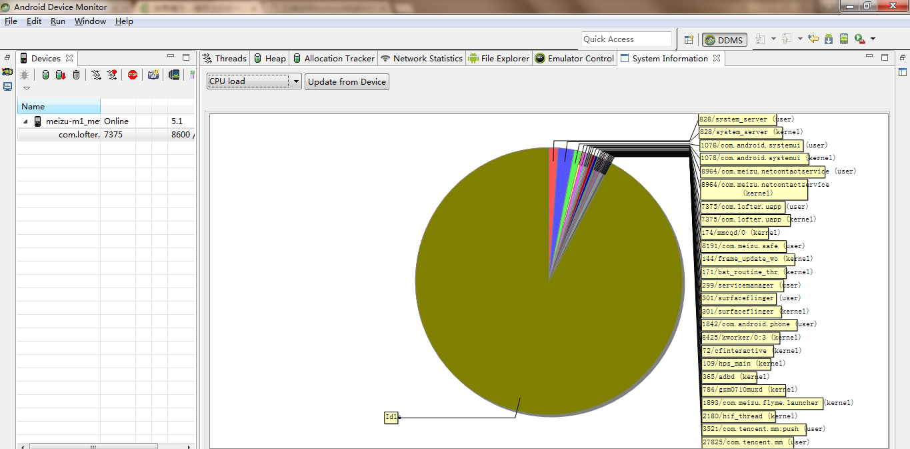

我们着重使用热点代码分析功能。

### 采集性能日志

首先选中需要被监控的应用，然后打开开关，开关如下：

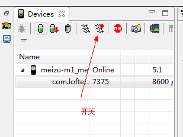

选择第二个选项 Trace based profiling：

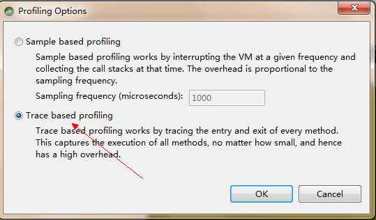

然后，在使用APP 5秒左右的时间，时间不要过长，避免无法分析重点。之后**需要点击关闭按钮**，最后生成日志。

### 性能日志分析

通过采集，我们可以获取到性能的报告图：

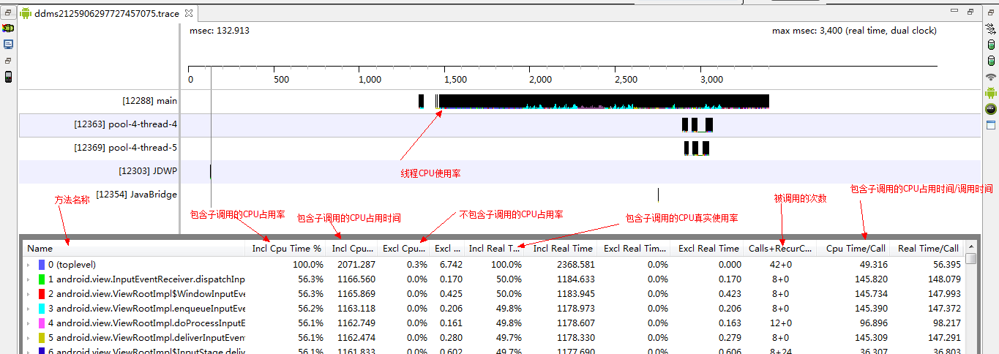

#### incl 和 excl

可以看到 incl 和 excl 在日志报告中，其实这两个词的含义很简单：

	void main(){
		
		//todo
		Thread.sleep(100);
		//call
		callA();
		//call
		callB();
		//todo
		Thread.sleep(100);
	}

* incl 表示main函数整体运行的时间，包括调用callA和callB
* excl 表示仅仅main函数运行的时间，不包括callA和callB，所以仅仅是Thread.sleep(100) * 2

#### cpu time 和 read time

我们来看一下图片：

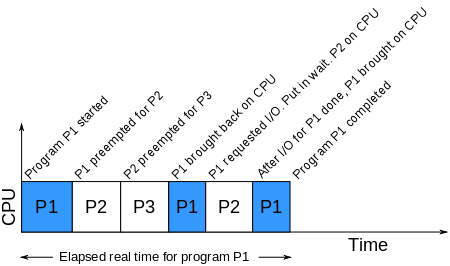

我们知道，在多线程的情况下，CPU不可能被一个线程一直占用着，所以会发生上下文切换。即一个函数运行完成的时间(Real Time)和它真正占用CPU的时间(CPU　Time)是的关系为：**raal time > cpu time。**

#### 如何分析日志

读懂检测报告的**各个指标**很重要，然后结合实际情况，进行分析热点代码。最重要的属性就是** CPU Time / Call ** ，通过这个属性，可以知道函数每次调用的时间。而通过**Calls + RecurCalls/Total**可以查看调用次数最多的热点代码。

通过**下面的find可以过滤掉JDK，Android API，**仅仅关注项目内的调用。PS：不知道是不是我的SDK有问题，find功能一直无法使用。

## 内存篇

monitor 也支持内存监控，可以通过monitor来查看是否内存泄漏。

### 监控内存变化

我们可以通过monitor来查看内存实时变化，从而判断是否内存泄漏了：

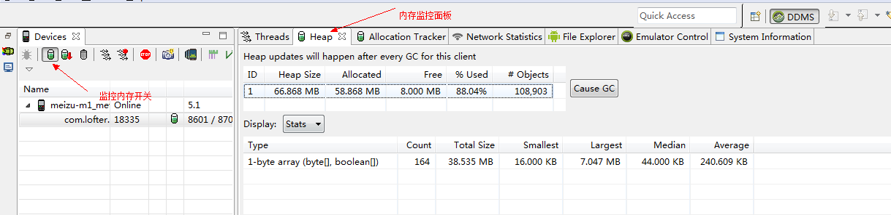

在使用APP的过程中，可以非常明显的感觉到内存增长后，即使调用**Cause GC**无法释放内存，那么恭喜你内存泄漏了。

### 内存泄漏

什么是内存泄漏？其实就是JVM的垃圾回收无法释放一些不被使用的对象，如bitmap已经不需要显示了，但是还挂在ROOT可达图谱上。

而如何找出这些忘记斩断关系的对象呢？通常，我们使用Eclipse Memory Analyse(MAT)来分析内存泄漏的情况。

#### 获取内存泄漏文件

为了分析内存泄漏点，我们需要DUMP APP的内存。

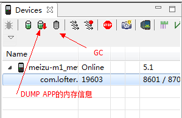

在DUMP之前我们需要**调用一下Cause GC 按钮，**回收掉所有可以回收的对象，减少分析点。

经过几秒后，我们就获得了一个DUMP下来的内存文件：

#### 转换.hprof

因为直接dump下来的hprof文件还是不能使用的，我们需要使用android自带的工具进行转换，才能被mat识别：

    hprof-conv m1.hprof m1-ok.hprof

这样子，MAT就能识别了。

#### 使用MAT

使用MAT打开hprof文件：

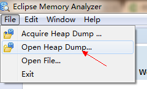

选中hprof文件, 然后打开界面为：

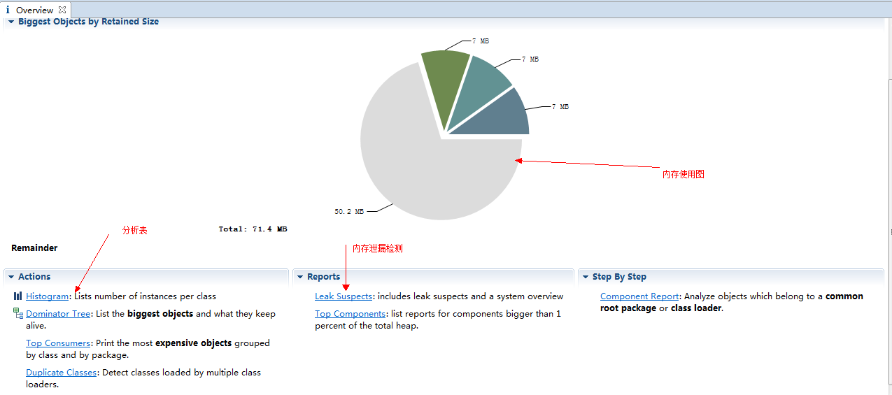

有两个比较重要的功能：

* Histogram : 对象占用内存图标
* Leak Suspects ：可能发生内存泄漏的报告

##### Histogram 

我们来使用一下Histogram功能：

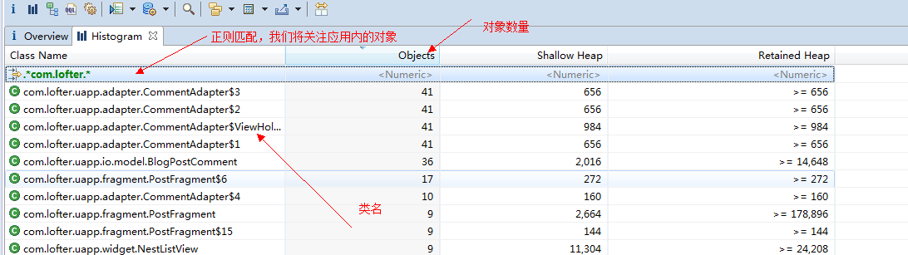

可以发现，Histogram可以非常方便的显示出内存中对象的数量。而常用的功能有：

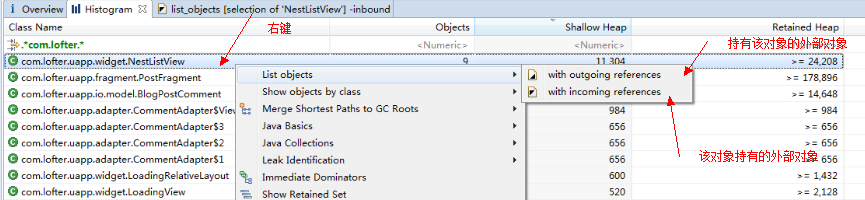

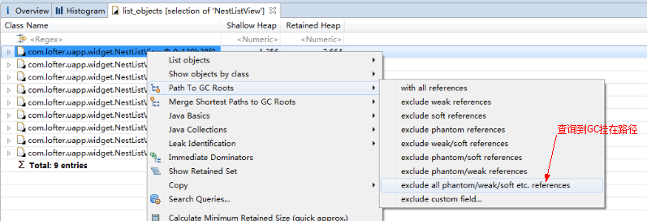

* List objects -> with incoming references：查看这个对象持有的外部对象引用
* List objects -> with outcoming references：查看这个对象被哪些外部对象引用
* Path To GC Roots -> exclude all phantim/weak/soft etc. references：查看这个对象的GC Root，不包含虚、弱引用、软引用，剩下的就是强引用。从GC上说，除了强引用外，其他的引用在JVM需要的情况下是都可以 被GC掉的，如果一个对象始终无法被GC，就是因为强引用的存在，从而导致在GC的过程中一直得不到回收，因此就内存溢出了。
* Path To GC Roots -> exclude weak/soft references：查看这个对象的GC Root，不含弱引用和软引用所有的引用.
* **Merge Shortest path to GC root ：找到从GC根节点到一个对象或一组对象的共同路径**

##### 对比hprof分析内存泄漏

如果能获取不同内存量时候的hprof文件，我们就能通过Histogram的Compare功能，分析出变化的内存，缩小检测范围。而如何构造对比列表呢？

**打开两份hprof文件**

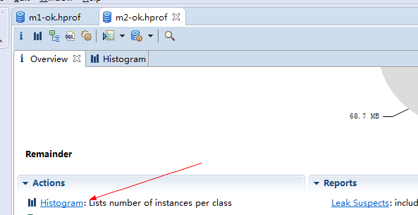

注意，都需要开启 Histogram 分析。

**添加对比**

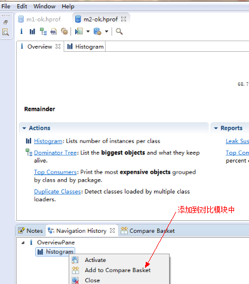

**开启对比**

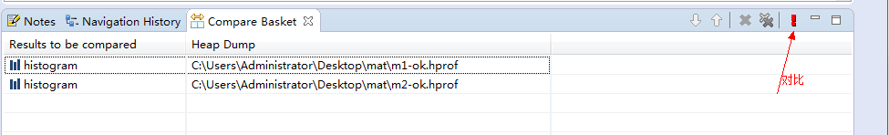

当两个hprof都添加到对比模块后，我们就可以开始进行对比差异了。对比图为：

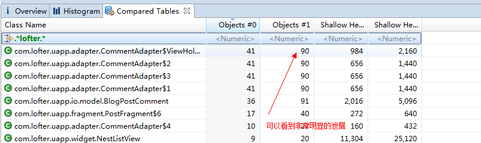

**分析**

通过对比分析，使用**Merge Shortest path to GC root**，分析得知是因为ViewPageAdapter的所在ViewGroup没有remove掉相应的View：

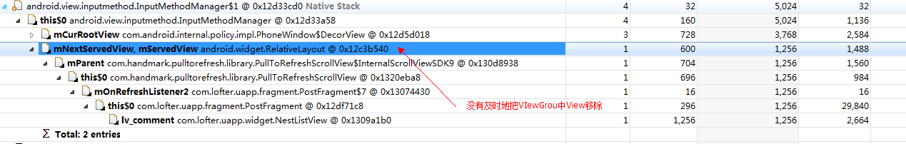

##### 分析方法

**通对比hprof能比较快速定位内存泄漏点，**如果不能通过对比，那么只能通过 **Leak Suspects**猜测内存泄漏点了。

## Java性能优化

其实Java的性能分析也非常的类似，就是工具用的不一样罢了，主要使用**JDK自带的jvisualvm.exe。**

通过跑压力测试脚本，可以预防Java代码在性能上的瓶颈。

## 总结

性能优化需要耐心，考虑各种情况。良好的代码风格是android性能的保障，在分析问题的时候，也能快速定位。借助这些工具（monitor/jvisualvm/mat）能帮我们快速的定位热点代码，然后fix it !。

## 参考

* [CPU TIME](https://en.wikipedia.org/wiki/CPU_time)
* [正确使用Android性能分析工具——TraceView](http://bxbxbai.github.io/2014/10/25/use-trace-view/)
* [Android内存泄漏分析实战](http://my.oschina.net/u/2285044/blog/471027)
* [内存分析工具 MAT 的使用](http://blog.csdn.net/aaa2832/article/details/19419679)