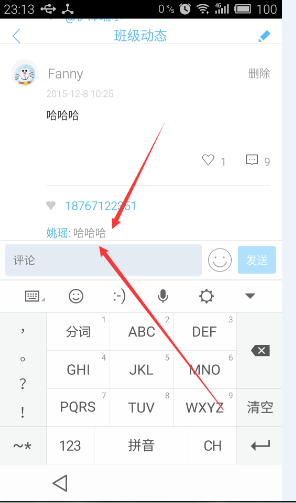

# android 社交圈定位

在使用微信朋友圈的时候，会发现点击别人回复你的消息的时候，弹出键盘后，会自动定位这条消息在输入面板上，如图：

而实现这种效果，主要依赖`ListView#smoothScrollBy(offsetY,time)`，只要获取到弹出键盘后，ListView需要offsetY的数值，就可以把实现这种效果。所以重点在于`计算offsetY的数值`。

这里，有几个先决条件：

1. 点击评论的时候，消息一定是可见的
2. 弹出键盘后，输入面板一定是可见的
3. 弹出键盘后，ListView中，对应的评论位置是不变化的，即不会因为界面进行resize，导致ListView中的内容进行偏移，而是处于静止状态。

所以，可以通过公式：

> offset =  (getLocationInWindow(消息)->Y + 消息的高度)  - (getLocationInWindow(输入面板)->Y) 

获取ListView需要滚动的offsetY即可