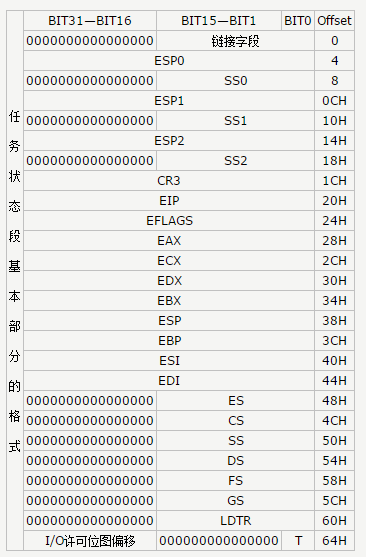
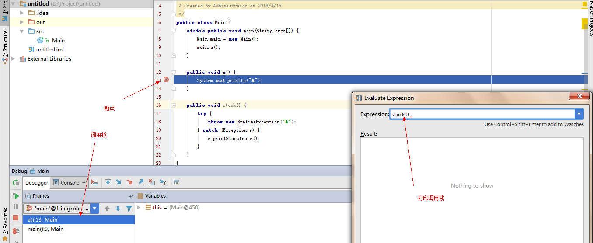

# debugger

文本将介绍调试器如何**实现断点，单步，即时执行函数**的功能。

## GDB

在Linux C编程中，一般都使用GDB来进行调试代码。通过GDB我们可以**实现断点，单步，即时执行**这些调试手段。

### INT 3 和 断点

80x86 CPU调试的核心就是通过**INT 3 (80x86 CPU)**中断来实现。当执行INT 3 的时候，在Linux中会**引发SIGTRAP信号**。从而进一步的实现具体的功能：查看变量，即时执行...。

而断点的实现就是通过INT 3来实现，实现的流程如下：

1. 寻找到代码中被下断点的内存位置
2. 记录原先位置的指令
3. **使用INT 3来替换该指令，如果长度不符合，则使用NOP来填充。**

**这么做是因为涉及到偏移量的问题，不能简单的插入INT 3指令，而是采用替换的方式。**这样子，就完成了**打断点**的功能。而当代码执行到刚刚下断点（INT 3指令）的时候，会执行如下流程：

1. INT 3指令引发中断门
2. Linux内核切换当前任务（被调试程序）到阻塞状态
3. Linux唤醒**调试器（GDB）**告知被调试程序现在处于**中断状态**。

此时，我们就可以通过GDB来查看被调试程序的变量，堆栈等信息。

### TSS

那么问题来了：**刚刚被INT 3替换的指令，如何执行？因为被调试程序的用户态EIP已经指向了INT 3下一条指令了**。

首先我们需要了解一下Linux下TSS的概念：

> 任务状态段(Task State Segment)是保存一个任务重要信息的特殊段。
> TSS在任务切换过程中起着重要作用，通过它实现任务的挂起和恢复。所谓任务切换是指，挂起当前正在执行的任务，恢复或启动另一任务的执行。在任务切换过程中，首先，处理器中各寄存器的当前值被自动保存到TR所指定的TSS中；然后，下一任务的TSS的选择子被装入TR；最后，从TR所指定的TSS中取出各寄存器的值送到处理器的各寄存器中。由此可见，通过在TSS中保存任务现场各寄存器状态的完整映象，实现任务的切换。

所以在Linux中，是通过TSS来描述一个程序运行的状态，并且进行多任务轮转的。TSS结构图：

**还原被替换的指令，然后通过修改EIP寄存器，将它指向被替换指令地址，因此被调试的程序可以执行刚刚被替换的指令。**

### JMP/CALL

**80x86 CPU的EIP寄存器不能直接修改**，而是需要通过**专门指令**来修改EIP寄存器：

1. JMP ： 直接跳转到指定目标代码
2. CALL： 进行调用制定代码目标函数

在多任务模式下，通过JMP/CALL + TSS 来完成任务的切换。如：

> jmp 0x1000:0x10000000 \#TSS地址

这样子，就实现了任务的切换。

### 即时运行

即时运行指的是使用** GDB CALL 命令**来完成运行函数的功能。

这个功能和下断点的原理基本一致，也是通过替换指令和插入INT 3来完成。完成运行后，再还原之前被替换的代码，并且修改TSS中的EIP寄存器数值。

**所以，即时运行的调用栈就是使用原先的调用栈，而非新开一个THREAD来执行即时运行代码。**

## JVM

Java的调试技术是非常成熟的，我们可以通过各种方式来调试Java代码，这也是VM的强大之处。

### 即时运行

在调试的时候，我们想知道一段代码执行的结果是什么。比如说，System.out.println(var)。这时候就需要使用即时运行的功能。

**而即时运行功能也和GDB实现类似，调用栈也是使用原先的调用栈，而非新开THREAD运行及时代码：**

	public class Main {
		static public void main(String args[]) {
			Main main = new Main();
			main.a();
		}

		public void a() {
			System.out.println("A");
		}

		public void stack() {
			try {
				throw new RuntimeException("A");
			} catch (Exception e) {
				e.printStackTrace();
			}
		}
	}

断点处运行：

执行结果为：

	java.lang.RuntimeException: A
		at Main.stack(Main.java:18)
		at Main.a(Main.java:13)
		at Main.main(Main.java:9)

**所以，及时运行的调用栈环境就是断点位置的环境。**

### 远程调试

JVM也支持远程调试，这个功能对排查线上BUG是非常方便的，而这个功能是通过SOCKET来完成。

JVM调试参数：

> -Xdebug -Xnoagent -Djava.compiler=NONE -Xrunjdwp:transport=dt_socket,server=y,address=3999,suspend=n

说明：

| 参数                | 含义                                                   |
|---------------------|--------------------------------------------------------|
|-XDebug              |启用调试。                                              |
|-Xnoagent            |禁用默认sun.tools.debug调试器。                         |
|-Djava.compiler=NONE |禁止 JIT 编译器的加载。                                 |
|-Xrunjdwp            |加载JDWP的JPDA参考执行实例。                            |
|transport            |用于在调试程序和 VM 使用的进程之间通讯。                |
|dt_socket            |套接字传输。                                            |
|dt_shmem             |共享内存传输，仅限于 Windows。                          |
|server=y/n           |VM 是否需要作为调试服务器执行。                         |
|address=3999         |调试服务器的端口号，客户端用来连接服务器的端口号。      |
|suspend=y/n          |是否在调试客户端建立连接之后启动 VM 。                  |

这样子，就开启了JVM的调试功能，然后通过远程调试器连接上，既可以进行调试了。

**因为通过Socket调试非常的方便，所以现在流行的语言基本上都支持远程调试的功能。**

## 日志

在某些时候（生产环境），我们不能通过调试器来完成调试的功能，此时我们需要借助最原始的方式：**日志**。

## 总结

一个好用的DEBUGGER能极大的增加软件开发效率。

## 参考

* [调试器工作原理（1）：基础篇](http://blog.jobbole.com/23463/)
* [调试器工作原理（2）：实现断点](http://blog.jobbole.com/23632/)
* [调试器工作原理（3）：调试信息](http://blog.jobbole.com/24916/)
* [TSS任务状态段](http://www.cnblogs.com/guanlaiy/archive/2012/10/25/2738355.html)
* [Java远程调试](http://www.blogjava.net/yongbing/articles/221179.html)