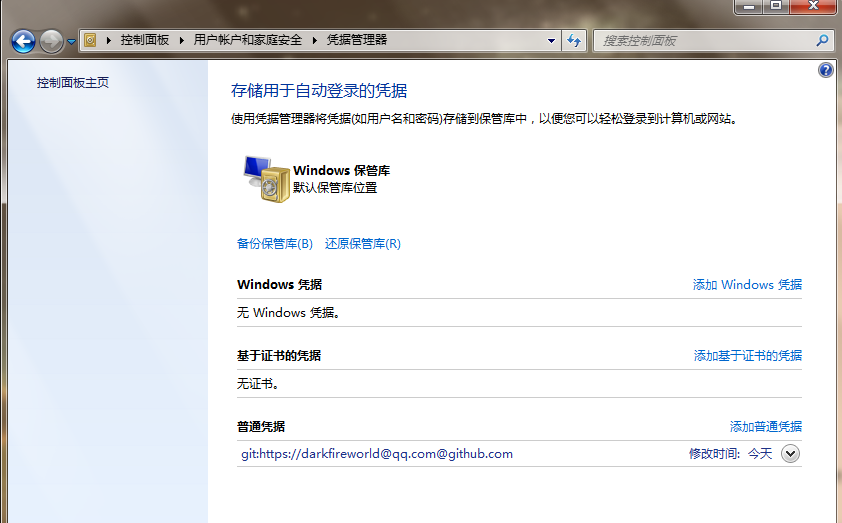

# git wincred

在windows平台上，我们通常使用`tortoisegit`来进行使用git。而 `tortoisegit` 通过windows
的凭证管理，来记住密码的。

## .gitconfig

```

[user]
	name = 暗火世界
	email = darkfireworld@qq.com
[credential]
    helper = wincred
[http]
    proxy = http://127.0.0.1:1080
[https]
    proxy = http://127.0.0.1:1080
    
```

可以发现，全局`~/.gitconfig`记录着git凭证管理的方式`wincred`。

## wincred

`wincred` 是git 针对windows平台的凭证管理，用户的密码和帐号是记录在windows注册表中。
我们可以通过`控制面板\用户帐户和家庭安全\凭据管理器`查看到记录的凭证：




