# maven 入门指南

> Maven项目对象模型(POM)，可以通过一小段描述信息来管理项目的构建，报告和文档的软件项目管理工具。

**一般来说，我们都使用maven来构建（编译，单元测试，打包，发布等）一个项目。**

## 下载和安装

### 下载 

首先，去官网下载最新的[maven](http://maven.apache.org/download.cgi)。

### 解压

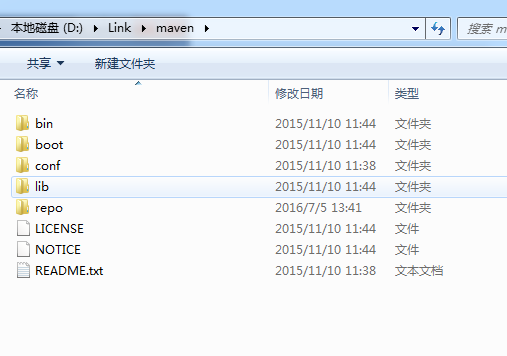

### 配置环境

```shell

set M3_HOME=%~DP0maven
set JAVA_HOME=%~DP0java

set PATH=%PATH%;%M3_HOME%\bin;%JAVA_HOME%\bin;

```

### test

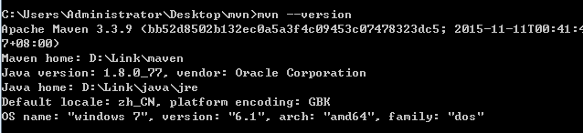


## 简单的java项目


### 项目结构

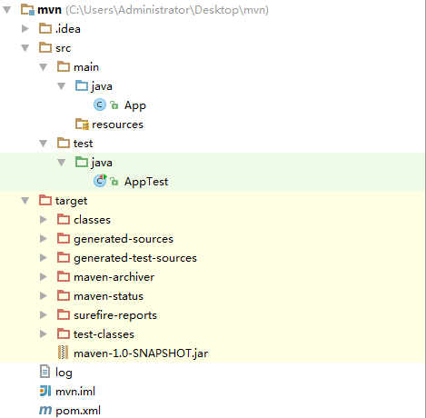


### 代码

**pom.xml：**

```xml

<?xml version="1.0" encoding="UTF-8"?>
<project xmlns="http://maven.apache.org/POM/4.0.0"
         xmlns:xsi="http://www.w3.org/2001/XMLSchema-instance"
         xsi:schemaLocation="http://maven.apache.org/POM/4.0.0 http://maven.apache.org/xsd/maven-4.0.0.xsd">
    <modelVersion>4.0.0</modelVersion>

    <!--项目的组名-->
    <groupId>org.darkfireworld</groupId>
    <!--项目的工程名-->
    <artifactId>maven</artifactId>
    <!--项目的版本信息，添加*-SNAPSHOT表示快照版本-->
    <version>1.0-SNAPSHOT</version>
    <!--打包方式-->
    <packaging>jar</packaging>
    
    <!--依赖组-->
    <dependencies>
        <!--依赖-->
        <dependency>
            <!--依赖的组名-->
            <groupId>junit</groupId>
            <!--依赖的工程名-->
            <artifactId>junit</artifactId>
            <!--依赖版本号-->
            <version>4.11</version>
        </dependency>
    </dependencies>
</project>

```


**App.java:**

```java

public class App {
    public String say() {
        return "maven";
    }
}

```

**AppTest.java**

```java

public class AppTest {

    @Test
    public void testMain() {
        Assert.assertEquals("maven", new App().say());
    }
}

```

### run

输入命令`mvn test`，我们就可以进行编译，测试了：

```log

[INFO] Scanning for projects...
[INFO]                                                                         
[INFO] ------------------------------------------------------------------------
[INFO] Building maven 1.0-SNAPSHOT
[INFO] ------------------------------------------------------------------------
[INFO] 
[INFO] --- maven-resources-plugin:2.6:resources (default-resources) @ maven ---
[WARNING] Using platform encoding (GBK actually) to copy filtered resources, i.e. build is platform dependent!
[INFO] Copying 0 resource
[INFO] 
[INFO] --- maven-compiler-plugin:3.1:compile (default-compile) @ maven ---
[INFO] Nothing to compile - all classes are up to date
[INFO] 
[INFO] --- maven-resources-plugin:2.6:testResources (default-testResources) @ maven ---
[WARNING] Using platform encoding (GBK actually) to copy filtered resources, i.e. build is platform dependent!
[INFO] skip non existing resourceDirectory C:\Users\Administrator\Desktop\mvn\src\test\resources
[INFO] 
[INFO] --- maven-compiler-plugin:3.1:testCompile (default-testCompile) @ maven ---
[INFO] Nothing to compile - all classes are up to date
[INFO] 
[INFO] --- maven-surefire-plugin:2.12.4:test (default-test) @ maven ---
[INFO] Surefire report directory: C:\Users\Administrator\Desktop\mvn\target\surefire-reports

-------------------------------------------------------
 T E S T S
-------------------------------------------------------
Running AppTest
Tests run: 1, Failures: 0, Errors: 0, Skipped: 0, Time elapsed: 0.038 sec

Results :

Tests run: 1, Failures: 0, Errors: 0, Skipped: 0

[INFO] ------------------------------------------------------------------------
[INFO] BUILD SUCCESS
[INFO] ------------------------------------------------------------------------
[INFO] Total time: 1.241 s
[INFO] Finished at: 2016-07-06T10:29:39+08:00
[INFO] Final Memory: 9M/155M
[INFO] ------------------------------------------------------------------------


```

运行`mvn package`，我们就可以获取一个jar包.

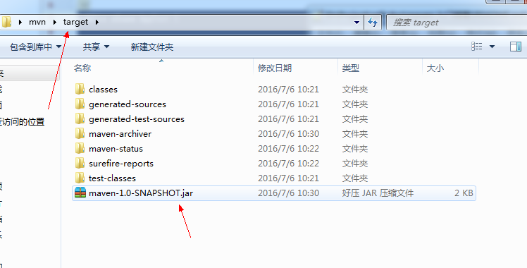


## 生命周期(clean、default、site)

Maven定义了三套生命周期：`clean、default、site`，每个生命周期都包含了一些`阶段（phase）`。
三套生命周期相互独立，但各个生命周期中的phase却是有顺序的，且后面的phase依赖于前面的phase。
执行某个phase时，其前面的phase会依顺序执行，但不会触发另外两套生命周期中的任何phase。

### clean

* clean：清除上次构建的文件

### site

* site：生成site文档

### default(重要)

* compile:编译
* test：测试
* package：打包
* install：安装到本地
* deploy：部署到服务器


## 插件

Maven的核心文件很小，主要的任务都是由插件来完成。定位到：`%本地仓库%\org\apache\maven\plugins`，可以看到一些下载好的插件：

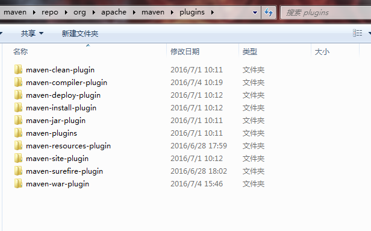

### Plugin Goals

一个插件通常可以完成多个任务，每一个任务就叫做插件的一个目标(goals)。

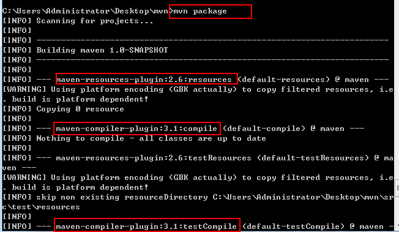


### 配置插件

Maven插件高度易扩展，可以方便的进行自定义配置。如：配置maven-compiler-plugin插件编译源代码的JDK版本为1.6：

```xml

<project>
    ...
    <build>
        <plugins>
            <!--编译器设置-->
            <plugin>
                <groupId>org.apache.maven.plugins</groupId>
                <artifactId>maven-compiler-plugin</artifactId>
                <version>3.1</version>
                <configuration>
                    <source>1.6</source>
                    <target>1.6</target>
                    <!-- 指定编码格式，否则在DOS下运行mvn compile命令时会出现莫名的错误，因为系统默认使用GBK编码 -->
                    <encoding>UTF-8</encoding>
                </configuration>
            </plugin>
        </plugins>
    </build>
<project>

```


## 插件和生命周期

使用mvn的过程，就是调用一个插件的目标（goals）或者某个阶段（phase）

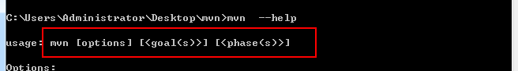


### bind过程

Maven的生命周期是抽象的，实际需要插件来完成任务。这一过程是通过将插件的目标（goal）绑定到生命周期的具体阶段（phase）来完成的。
如：将`maven-compiler-plugin`插件的`compile目标`绑定到default生命周期的`compile阶段`，完成项目的源代码编译：

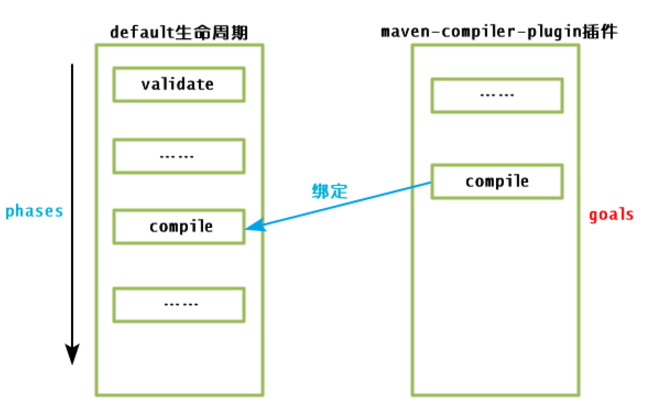

### 默认bind

在maven中，已经存在了一些预定义的插件以及相应的生命周期绑定。详细可见`%M3_HOME%\maven-core\src\main\resources\META-INF\plexus\default-bindings.xml`。


## 依赖和坐标

通过maven我们可以管理项目的构建过程。而依赖管理是项目构建最重要的一个点。现在，我们来说说
`dependency`这个属性。

通过`dependency`来描述一个依赖的`坐标`属性：

* groupId（必选）：依赖的组名
* artifactId（必选）：依赖的项目名
* version(必选)：依赖的版本号
* type（可选）：依赖的类型，默认是jar。
* scope(可选)：依赖范围

### 依赖范围(scope)

我们知道，一个项目在测试的时候需要`junit`，然而在具体发布的时候却不需要。maven通过`scope`属性来指定`依赖范围`。常见的依赖范围：

* compile：编译，测试，打包，运行都有效。如`spring系列`
* test: 编译，测试阶段有效。如`junit系列`
* provided：编译，测试有效。如`servler-api系列`。
* runtime：测试，运行有效。如`具体jdbc实现类`。

### 依赖传递

使用maven很方便的地方是：maven的依赖具有传递性。

比如说，我们引入`junit:junit:4.11`的时候，也会引入它的依赖`org.hamcrest:hamcrest-core:1.3`：


当项目中指定依赖`junit:junit:4.11`的时候，maven就回去download对应的依赖到本地仓库：

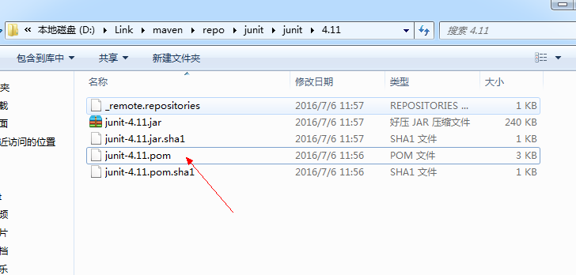

然后，读取该依赖的`POM.xml`，发现`junit:junit:4.11`依赖`org.hamcrest:hamcrest-core:1.3`：

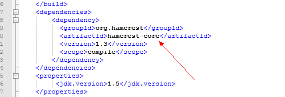

然后，maven就回去下载`org.hamcrest:hamcrest-core:1.3`，重复这个过程，直到项目的依赖全部整合完成。

当然这个过程中，会遇到**依赖冲突**这个问题，这里不进行讨论，因为这个概率比较小。

### 统一版本号

当我们引入`spring-frameworkd`的时候，每次都要填写`version`。而升级`spring-frameworkd`的时候，又要一个一个的修改`version`，非常的麻烦。

这时候，我们可以通过`<properties>`标签来实现统一依赖版本号：

```xml

<project>
    <!--定义一个属性，通过${}来引用-->
    <properties>
        <spring-version>3.2.0.RELEASE</spring-version>
    </properties>

    <dependencies>
        <dependency>
            <groupId>org.springframework</groupId>
            <artifactId>spring-orm</artifactId>
            <version>${spring-version}</version>
        </dependency>
        <dependency>
            <groupId>org.springframework</groupId>
            <artifactId>spring-context</artifactId>
            <version>${spring-version}</version>
        </dependency>
    </dependencies>
</project>

```

## 仓库和镜像


在maven中，通过仓库来管理所有的`依赖(jar,aar,war...)`。而通过`坐标`来引用这些依赖。

### 仓库类型

在maven中存在如下几种类型的仓库：

1. 本地仓库
2. 远程仓库
    3. 中央仓库
    4. 私服仓库
    5. 公共仓库

maven通过`坐标`查询依赖的时候，优先级别为：

1. 本地仓库
2. 中央仓库
3. 其他仓库

### 本地仓库

maven在解析一个坐标的时候，会优先使用`本地仓库`。

通过修改`%M3_HOME%/conf/setting.xml`，我们可以指定本地仓库地址(默认~/.m2)：

```xml

<settings>
    <localRepository>D:\Link\maven\repo\</localRepository>
</settings>

```

我们可以看看一个本地仓库的内容是啥，以`junit:junit:4.11`为例：

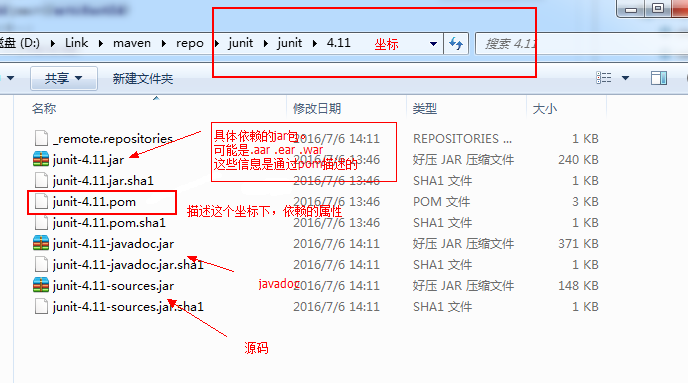

注意，如果坐标仓库中的`POM.xml#packaging`为aar（android类库），则maven会下载`groupId:artifactId:version.aar`，并非依赖其他插件实现。

### 远程仓库

远程仓库指的是所有非本地仓库。通过在pom.xml中添加如下描述，就可以添加一个远程仓库了：

```xml
<project>
    <!--仓库管理-->
    <repositories>
        <!--远程仓库-->
        <repository>
            <!--仓库ID-->
            <id>Sonatype</id>
            <!--仓库名称-->
            <name>Sonatype Repository</name>
            <!--仓库URL-->
            <url>http://repository.sonatype.org/content/groups/public/</url>
            <!--仓库布局模式-->
            <layout>default</layout>
            <!--是否使用该仓库中的release依赖-->
            <releases>
                <enabled>true</enabled>
            </releases>
            <!--是否使用该仓库中的snapshots依赖-->
            <snapshots>
                <enabled>false</enabled>
            </snapshots>
        </repository>
    </repositories>
</project>

```

注意：**其中 id 必须唯一，若不唯一，如设置为 central 将覆盖中央仓库的配置。**


#### 中央仓库

中央仓库其实就是一个**超级大的默认的远程仓库**。

其预定义在依赖**SUPER_POM**(`%M3_HOME%\maven-model-builder\src\main\resources\org\apache\maven\model\pom-4.0.0.xml`)：

```xml
<?xml version="1.0" encoding="UTF-8"?>
<!-- START SNIPPET: superpom -->
<project>
  <modelVersion>4.0.0</modelVersion>
  <!--依赖的中央仓库-->
  <repositories>
    <repository>
      <!-- ID central 特指中央仓库-->
      <id>central</id>
      <name>Central Repository</name>
      <url>https://repo.maven.apache.org/maven2</url>
      <layout>default</layout>
      <snapshots>
        <enabled>false</enabled>
      </snapshots>
    </repository>
  </repositories>
  <!--插件的中央仓库-->
  <pluginRepositories>
    <pluginRepository>
      <!-- ID central 特指中央仓库-->
      <id>central</id>
      <name>Central Repository</name>
      <url>https://repo.maven.apache.org/maven2</url>
      <layout>default</layout>
      <snapshots>
        <enabled>false</enabled>
      </snapshots>
      <releases>
        <updatePolicy>never</updatePolicy>
      </releases>
    </pluginRepository>
  </pluginRepositories>
  <!--默认构建参数-->
  <build>
    <directory>${project.basedir}/target</directory>
    <outputDirectory>${project.build.directory}/classes</outputDirectory>
    <finalName>${project.artifactId}-${project.version}</finalName>
    <testOutputDirectory>${project.build.directory}/test-classes</testOutputDirectory>
    <sourceDirectory>${project.basedir}/src/main/java</sourceDirectory>
    <scriptSourceDirectory>${project.basedir}/src/main/scripts</scriptSourceDirectory>
    <testSourceDirectory>${project.basedir}/src/test/java</testSourceDirectory>
    <resources>
      <resource>
        <directory>${project.basedir}/src/main/resources</directory>
      </resource>
    </resources>
    <testResources>
      <testResource>
        <directory>${project.basedir}/src/test/resources</directory>
      </testResource>
    </testResources>
    <pluginManagement>
      <!-- NOTE: These plugins will be removed from future versions of the super POM -->
      <!-- They are kept for the moment as they are very unlikely to conflict with lifecycle mappings (MNG-4453) -->
      <plugins>
        <plugin>
          <artifactId>maven-antrun-plugin</artifactId>
          <version>1.3</version>
        </plugin>
        <plugin>
          <artifactId>maven-assembly-plugin</artifactId>
          <version>2.2-beta-5</version>
        </plugin>
        <plugin>
          <artifactId>maven-dependency-plugin</artifactId>
          <version>2.8</version>
        </plugin>
        <plugin>
          <artifactId>maven-release-plugin</artifactId>
          <version>2.3.2</version>
        </plugin>
      </plugins>
    </pluginManagement>
  </build>
  ...
</project>
<!-- END SNIPPET: superpom -->

```

可见super pom 提供了一些默认的项目属性。而我们**项目中的pom.xml其实都继承于super pom**。


### 镜像

镜像就相当于仓库代理。通过`M3_HOME`/conf/settings.xml，我们就可以配置镜像：

```xml

<settings>
    ...
    <mirrors>
        <mirror>
            <!--镜像ID-->
            <id>jcenter</id>
            <!--镜像名称-->
            <name>jcenter</name>
            <url>https://jcenter.bintray.com/</url>
            <!--需要代理的仓库ID，如果为 * 则代理所有的仓库-->
            <mirrorOf>central</mirrorOf>
        </mirror>
    </mirrors>
    ...
</settings>

```

镜像的工作过程大致如下：

```

        | --> mirror server [mirrorOf:central] --> real repo server(eg. central)
request |  
        | --> jcenter repo
        
```

相当于，在查询远程仓库的时候流程如下：

1. 先判断要查询的远程仓库是否被`mirror`代理
2. 如果被代理，则查询`mirror`
3. 如果没有被代理，则查询real repo.

### 私服

私服，其实就是一个自己搭建的仓库。用来存放一些公司内部的依赖构件。当然了，我们也可以通过私服缓存中央仓库中的构建，加快内网访问。

一个比较经典的架构：

```

                                                        |---> central repo (eg. jcenter)
                                                        |
user [mirrorOf:*] -> sf(私有构件，中央仓库缓存构件) --->|
                                                        |---> other repo

```

常用的sf工具[sonatype](http://www.sonatype.com/download-oss-sonatype)，通过它，我们就可以快速的搭建一个sf了。


## 快照

## 多项目构建

## JavaEE项目

## 参考

* [Maven 快速入门及简单使用](http://www.cnblogs.com/luotaoyeah/p/3764533.html)
* [Maven 教程](https://ayayui.gitbooks.io/tutorialspoint-maven/content/)
* [maven中snapshot快照库和release发布库的区别和作用](http://www.mzone.cc/article/277.html)
* [Maven：mirror和repository 区别](http://my.oschina.net/sunchp/blog/100634)
* [Maven系列一pom.xml 配置详解](http://www.cnblogs.com/yangxia-test/p/4396159.html)
* [Maven系列二setting.xml 配置详解](http://www.cnblogs.com/yangxia-test/p/4409736.html)
* [如何使用Android Studio把自己的Android library分享到jCenter和Maven Central](http://www.open-open.com/lib/view/open1435109824278.html)
* [Maven和Gradle对比](http://www.huangbowen.net/blog/2016/02/23/gradle-vs-maven/?utm_source=tuicool&utm_medium=referral)
* [玩转迭代开发](https://github.com/darkfireworld/self-doc/tree/master/玩转迭代开发)


