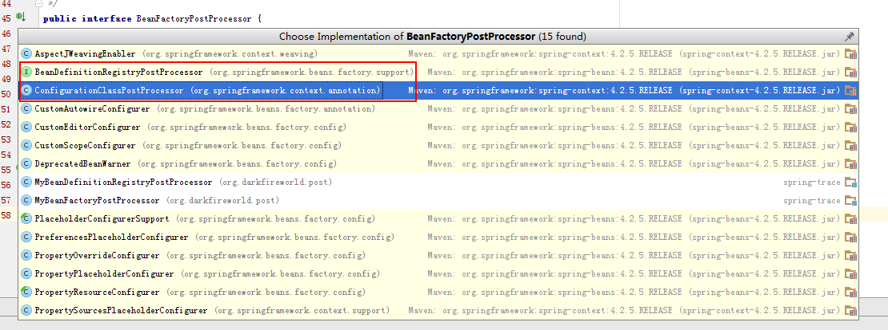
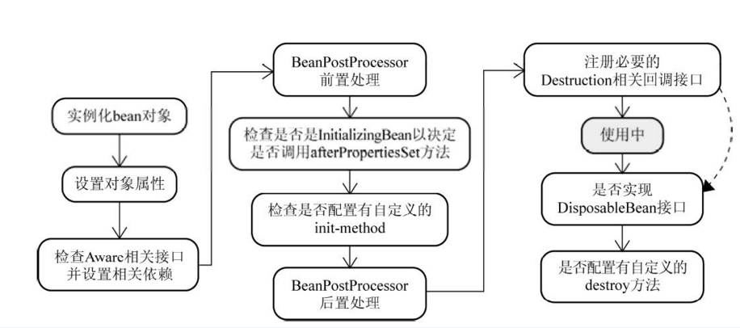

# Spring

## Ioc

Spring的Ioc功能是核心功能，其他的组件（Aop，Tx，Mvc）都依赖Ioc，从而实现。

### 后处理器

在容器中，所有的Bean都是通过**后处理器**进行管理的。而在Spring容器中，`后处理器`大致有两种类型和衍生类：

* BeanFactoryPostProcessor: 管理已加载到BeanFactory中的BeanDefinition集合。
* BeanPostProcessor: 管理Bean的生命周期。

通过这两种类型的`后处理器`，就可以比较全面的控制Ioc容器。下面来详细讲解这些`后处理器`。

#### BeanFactoryPostProcessor

通过`BeanFactoryPostProcessor`，我们可以管理已加载到BeanFactory中的BeanDefinition集合：

```java

/**
 * Allows for custom modification of an application context's bean definitions,
 * adapting the bean property values of the context's underlying bean factory.
 *
 * 通过这个后处理器，可以修改上下文中bean definitions，以及修改bean property values。
 */
public interface BeanFactoryPostProcessor {

	/**
	 * Modify the application context's internal bean factory after its standard initialization.
	 * All bean definitions will have been loaded, but no beans will have been instantiated yet.
	 * This allows for overriding or adding properties even to eager-initializing beans.
     *
	 * 修改上下文中已经初始化完成的内置bean factory。
	 * 此时，所有的bean definitions已经被加载完成, 但是此时beans 还没有被初始化完成（排除后处理器bean）。
	 * 通过这个方法，允许覆盖或者添加属性值到特定的beans定义中。
	 *
	 */
	void postProcessBeanFactory(ConfigurableListableBeanFactory beanFactory) throws BeansException;

}

```

注意：`BeanFactoryPostProcessor#postProcessBeanFactory`被调用的时候，BeanFactory中的BeanDefinition集合已经**加载完成**，所以**不能**
通过`postProcessBeanFactory`加载新的`BeanDefinition`。

代表类：



可以发现，大部分实现类都是针对**属性**进行修改。下面，来看一下`BeanDefinitionRegistryPostProcessor`这个管理`BeanDefinition`后处理器。

##### BeanDefinitionRegistryPostProcessor

通过`BeanDefinitionRegistryPostProcessor`这个后处理器，我们可以新增`BeanDefinition`到beanFactory中：

```java

/**
 * Extension to the standard {@link BeanFactoryPostProcessor} SPI, allowing for
 * the registration of further bean definitions <i>before</i> regular
 * BeanFactoryPostProcessor detection kicks in. In particular,
 * BeanDefinitionRegistryPostProcessor may register further bean definitions
 * which in turn define BeanFactoryPostProcessor instances.
 *
 * 扩展标准的BeanFactoryPostProcessor接口，允许在标准BeanFactoryPostProcessor#postProcessBeanFactory调用之前，
 * 注册新的bean definitions 到容器中。甚至，可以注册新的BeanFactoryPostProcessor类型的bean definitions到容器中。
 *
 * @author Juergen Hoeller
 * @since 3.0.1
 * @see org.springframework.context.annotation.ConfigurationClassPostProcessor
 */
public interface BeanDefinitionRegistryPostProcessor extends BeanFactoryPostProcessor {

	/**
	 * Modify the application context's internal bean definition registry after its
	 * standard initialization. All regular bean definitions will have been loaded,
	 * but no beans will have been instantiated yet. This allows for adding further
	 * bean definitions before the next post-processing phase kicks in.
	 *
	 * 允许在下一个后处理阶段(BeanFactoryPostProcessor#postProcessBeanFactory)之前，添加新
	 * 的bean definitions到容器中。bean definitions可以为 BeanFactoryPostProcessor类型。
	 * 
	 * @param registry the bean definition registry used by the application context
	 * @throws org.springframework.beans.BeansException in case of errors
	 */
	void postProcessBeanDefinitionRegistry(BeanDefinitionRegistry registry) throws BeansException;

}


```

显然，通过`BeanDefinitionRegistryPostProcessor#postProcessBeanDefinitionRegistry`方法，可以添加一些新的`BeanDefinition`到beanFactory中。

当前，Spring就是通过`public class ConfigurationClassPostProcessor implements BeanDefinitionRegistryPostProcessor`这个类，实现了**基于注解配置**的功能。

#### BeanPostProcessor

在bean的生命周期中，**BeanPostProcessor**扮演着非常重要的角色：

```java


/**
 * Factory hook that allows for custom modification of new bean instances,
 * e.g. checking for marker interfaces(@Autowired) or wrapping them with proxies(动态代理).
 *
 */
public interface BeanPostProcessor {

	/**
	 * Apply this BeanPostProcessor to the given new bean instance <i>before</i> any bean
	 * initialization callbacks (like InitializingBean's {@code afterPropertiesSet}or a custom init-method).
     * The bean will already be populated with property values.The returned bean instance may 
	 * be a wrapper around the original.
     *
	 * 在bean对象的initialization方法回调之前，apply这个后处理。
	 * 此时bean的属性已经被设置完成。
	 * 返回的对象可以是一个原始对象或者wrap对象。
	 */
	Object postProcessBeforeInitialization(Object bean, String beanName) throws BeansException;

	/**
	 * Apply this BeanPostProcessor to the given new bean instance <i>after</i> any bean
	 * initialization callbacks (like InitializingBean's {@code afterPropertiesSet}or a custom init-method)
     * The bean will already be populated with property values.
	 * The returned bean instance may be a wrapper around the original.
     *
	 * 在bean对象的initialization方法回调之后，apply这个后处理。
	 * 此时bean的属性已经被设置完成。
	 * 返回的对象可以是一个原始对象或者wrap对象。
	 *
	 * <p>In case of a FactoryBean, this callback will be invoked for both the FactoryBean
	 * instance and the objects created by the FactoryBean (as of Spring 2.0).
	 * The post-processor can decide whether to apply to either the FactoryBean or created
	 * objects or both through corresponding {@code bean instanceof FactoryBean} checks.
     *
	 * 针对通过FactoryBean#getObject()获取的bean，这个后处理也会被apply。
	 *
	 * <p>This callback will also be invoked after a short-circuiting triggered
     * by a{@link InstantiationAwareBeanPostProcessor#postProcessBeforeInstantiation} method,
	 * in contrast to all other BeanPostProcessor callbacks.
     *
	 * 当bean通过InstantiationAwareBeanPostProcessor#postProcessBeforeInstantiation方法获取
	 * 的时候，会触发这个"后处理"回调。此时，bean的生命周期被称为"短生命周期"。
	 * 
	 */
	Object postProcessAfterInitialization(Object bean, String beanName) throws BeansException;

}


```

Spring Aop其实就是通过`BeanPostProcessor#postProcessAfterInitialization`来实现的，详情见**AnnotationAwareAspectJAutoProxyCreator**。

注意：虽然`BeanPostProcessor`接口申明的方法，仅仅只能管理bean在**设置属性后**的生命周期，但是它的**子接口**拥有更大的权限。

现在，我们再来看看`BeanPostProcessor`的子接口，通过子接口，可以拥有更大的权限，来操作bean的生命周期。

##### MergedBeanDefinitionPostProcessor

在Bean的初始化过程中，通过**MergedBeanDefinitionPostProcessor**对Bean的


```java

/**
 * Post-processor callback interface for <i>merged</i> bean definitions at runtime.
 * {@link BeanPostProcessor} implementations may implement this sub-interface in
 * order(优先级) to post-process the merged bean definition that the Spring BeanFactory
 * uses to create a specific bean instance.
 *
 * @author Juergen Hoeller
 * @since 2.5
 */
public interface MergedBeanDefinitionPostProcessor extends BeanPostProcessor {

	/**
	 * Post-process the given merged bean definition for the specified bean.
	 *
	 * (针对bean definition进行后处理)
	 *
	 * @param beanDefinition the merged bean definition for the bean
	 * @param beanType the actual type of the managed bean instance
	 * @param beanName the name of the bean
	 */
	void postProcessMergedBeanDefinition(RootBeanDefinition beanDefinition, Class<?> beanType, String beanName);

}

```

通过`MergedBeanDefinitionPostProcessor`丰富了Bean配置方式：

1. 支持修改XML或者@Bean中定义的bean属性。
2. 支持**注解配置**，如：@Autowired, @PostConstruct。

注意：注解配置信息保存在**后处理器的缓存**中，而非RootBeanDefinition中。

##### InstantiationAwareBeanPostProcessor

在后处理器中，通过**InstantiationAwareBeanPostProcessor**扩展了**Bean实例化-属性设置**的生命周期管理。

```java

/**
 * Subinterface of {@link BeanPostProcessor} that adds a before-instantiation(实例化之前) callback,
 * and a callback after instantiation(实例化完成) but before explicit properties(设置属性之前) are set or
 * autowiring(@Autowired) occurs.
 *
 */
public interface InstantiationAwareBeanPostProcessor extends BeanPostProcessor {

	/**
	 * Apply this BeanPostProcessor <i>before the target bean gets instantiated</i>.
	 * The returned bean object may be a proxy to use instead of the target bean,
	 * effectively suppressing default instantiation of the target bean.
	 * <p>If a non-null object is returned by this method, the bean creation process
	 * will be short-circuited. The only further processing applied is the
	 * {@link #postProcessAfterInitialization} callback from the configured
	 * {@link BeanPostProcessor BeanPostProcessors}.
	 * 
	 * 在对象实例化之前，会尝试通过这个方法获取一个代理对象。如果返回的对象非空，则返回对象会被容器中注册
	 * 的"后处理器"执行"BeanPostProcessor#postProcessAfterInitialization"方法，然后结束bean的构造过程。
	 * 
	 */
	Object postProcessBeforeInstantiation(Class<?> beanClass, String beanName) throws BeansException;

	/**
	 * Perform operations after the bean has been instantiated, via a constructor or factory method,
	 * but before Spring property population (from explicit properties or autowiring) occurs.
	 * 
	 * 在bean被初始化之后，且在属性设置(包括@Autowired)之前，被调用。如果"return false"，则表示这个bean之后
	 * 不需要进行属性设置(包括@Autowired)。
	 */
	boolean postProcessAfterInstantiation(Object bean, String beanName) throws BeansException;

	/**
	 * Post-process the given property values before the factory applies them
	 * to the given bean. Allows for checking whether all dependencies have been
	 * satisfied, for example based on a "Required" annotation on bean property setters.
	 * <p>Also allows for replacing the property values to apply, typically through
	 * creating a new MutablePropertyValues instance based on the original PropertyValues,
	 * adding or removing specific values.
	 * 
	 * 在Factory设置属性值到bean之前，可以对属性值进行"后处理"。比如说：对Required标记的属性进行检验。
	 * 也可以，对要设置的属性进行修改和删除。
	 */
	PropertyValues postProcessPropertyValues(
			PropertyValues pvs, PropertyDescriptor[] pds, Object bean, String beanName)
			throws BeansException;

}

```

通过`InstantiationAwareBeanPostProcessor`扩展了`BeanPostProcessor`对bean生命周期的管理。

注意：**@Autowired**注入就是通过`InstantiationAwareBeanPostProcessor#postProcessPropertyValues`完成的。详情见**AutowiredAnnotationBeanPostProcessor**

##### DestructionAwareBeanPostProcessor

通过**DestructionAwareBeanPostProcessor**可以管理bean的destroy过程。比如：容器关闭的时候，注销所有的singleton对象。

```java

/**
 * Subinterface of {@link BeanPostProcessor} that adds a before-destruction callback.
 *
 * <p>The typical usage will be to invoke custom destruction callbacks on
 * specific bean types, matching corresponding initialization callbacks.
 */
public interface DestructionAwareBeanPostProcessor extends BeanPostProcessor {

	/**
	 * Apply this BeanPostProcessor to the given bean instance before
	 * its destruction. Can invoke custom destruction callbacks.
	 * <p>Like DisposableBean's {@code destroy} and a custom destroy method,
	 * this callback just applies to singleton beans in the factory (including
	 * inner beans).
	 * 
	 * 通过这个方法，可以在对象销毁之前，进行后处理。
	 */
	void postProcessBeforeDestruction(Object bean, String beanName) throws BeansException;

}

```

一个bean的销毁的步骤如下（DisposableBeanAdapter#destroy）：

1. 调用容器中所有`DestructionAwareBeanPostProcessor`后处理器进行处理。比如说：`InitDestroyAnnotationBeanPostProcessor`进行处理@PreDestroy注解。
2. 如果bean实现了`DisposableBean`接口，则调用`DisposableBean#destroy`方法。
3. 调用bean定义的**自定义**destroy方法。

注意：在容器关闭的时候，会注销所有singleton对象。

#### 关于Ordered

Spring在初始化和使用**BeanFactoryPostProcessor和BeanPostProcessor**的时候，会遇到**依赖**问题，比如说：

> **自定义BeanPostProcessor**里面存在**@Autowried**注入的属性，则此时**AutowiredAnnotationBeanPostProcessor**需要在
> 自定义BeanPostProcessor之前实例化并且**注册**到Factory中。

在Spring中，通过Ordered和PriorityOrdered来标记优先级：**PriorityOrdered > Ordered > Non-Ordered**。

通过`Ordered`接口定义优先级，就可以解决上述的问题了。

### 容器生命周期

一个容器的初始化到销毁，大致会经历如下的阶段：

**容器初始化：**

1. 构造DefaultListableBeanFactory对象
2. 添加**默认后处理器**以及默认Bean配置(SpringConf)，比如说：`ConfigurationClassPostProcessor`，`AutowiredAnnotationBeanPostProcessor`
3. 初始化容器 Environment 对象。
4. 初始化并且**调用**`BeanFactoryPostProcessor`接口对象。
5. 初始化并且**注册**`BeanPostProcessor`接口对象。
6. 初始化MessageSource（国际化支持）
7. 初始化ApplicationEventMulticaster（事件总线）
8. 注册容器中Listener（事件监听器）
9. 锁定容器Configuration对象
10. 初始化所有singleton且非lazy的bean。

**容器销毁：**

容器销毁通常有两种方式：

1. 调用`context#registerShutdownHook`方法，然后当JVM关闭的时候，通过`ShutdownHook`回调，执行容器`doClose`方法。
2. 主动调用`context#close`方法，执行容器`doClose`方法。

容器的doClose方法的流程如下：

1. 发送容器**关闭**事件。
2. 销毁容器中的singleton bean，并且执行`bean#destroy`方法。
3. 设置容器的factory=null。

这样子，就完成了容器的销毁。

### Bean生命周期

一个bean的生命周期大致如下：



通过上图，可以比较清晰的了解到bean的生命周期。现在，介绍一下bean生命周期中关键的点：

* 实例化bean对象：一般来说，bean的实例化会通过**无参构造函**数进行实例化，但是，如果一个bean
被`InstantiationAwareBeanPostProcessor#postProcessBeforeInstantiation`代理生成对象，则会进入**短生命周期**处理。

* 设置对象属性：在此阶段，容器会设置bean的属性，包括@Autowired注入。值得注意的是@Autowired就是通过`InstantiationAwareBeanPostProcessor#postProcessPropertyValues`回调设置的。
详情见：`AutowiredAnnotationBeanPostProcessor`。

* BeanPostProcessor#postProcessBeforeInitialization处理：这个阶段比较重要的处理为：Aware（ApplicationContextAware，EnvironmentAware）注入，
@PostConstruct等注解的实现。详情见：`ApplicationContextAwareProcessor`和`CommonAnnotationBeanPostProcessor`。

* invokeInitMethods: 容器会调用bean的初始化方法`InitializingBean#afterPropertiesSet`以及`自定义init方法`。

* BeanPostProcessor#postProcessAfterInitialization:这个阶段，比较重要的就是对**Spring Aop**的支持了。详情见：`AnnotationAwareAspectJAutoProxyCreator`。

* 注册Destruction回调：如果bean（scope != prototype）实现了`DisposableBean`接口或者指定了destroy方法，或者容器中存在`DestructionAwareBeanPostProcessor`类型的后处理器，
则通过**DisposableBeanAdapter**包装这个bean对象，然后注册到对应作用域的**析构链**中。注意：`singleton bean`是在**容器销毁**的时候进行析构。

* 析构Bean对象：当Bean析构的时候，会应用容器中所有`DestructionAwareBeanPostProcessor`类型的后处理器，通过调用`postProcessBeforeDestruction`方法处理bean。(如：
`CommonAnnotationBeanPostProcessor`实现了**@PreDestroy**注解处理)。然后，容器会调用bean的析构过程：`DisposableBean#destroy`方法和`自定义destroy`方法。

可以发现，spring中许多特性，如：@Autowired，@PostConstruct，@PreDestroy，Aop等，都是通过**后处理器**完成的。

#### 关于FactoryBean

在Spring中，Bean的构造也可以通过**FactoryBean**来构造，通过`FactoryBean`可以更加自由的控制bean的生成：

```java

public interface FactoryBean<T> {

	/**
	 * Return an instance (possibly shared or independent) of the object
	 * managed by this factory.
	 *
	 * 获取一个bean对象实例。
	 */
	T getObject() throws Exception;

	/**
	 * Return the type of object that this FactoryBean creates,
	 * or {@code null} if not known in advance.
	 * 
	 * 返回bean的类型信息
	 */
	Class<?> getObjectType();

	/**
	 * Is the object managed by this factory a singleton? That is,
	 * will {@link #getObject()} always return the same object
	 * (a reference that can be cached)?
	 *
	 * 返回bean是否是sington模式，如果是的话，则会被缓存。
	 */
	boolean isSingleton();

}

```

FactoryBean具有如下特性：

* 通过**getBean(&beanName)**来获取FactoryBean对象，而通过**getBean(beanName)**来获取FactoryBean构造出来的Bean对象。
* 创建FactoryBean的时候，会经历完整的bean生命周期。
* 通过`FactoryBean#getObject`获取的bean对象，会仅仅通过`BeanPostProcessor#postProcessAfterInitialization`这个后处理。

通过`FactoryBean`可以实现一些复杂Bean的生成。

#### 关于Aware

在Bean的生命周期过程中，我们会通过**Aware**来获取容器**内置变量**：

1. ServletContextAware: 设置当前Spring MVC的 ServletContext。
2. MessageSourceAware: 设置当前的MessageSource对象。
3. EnvironmentAware：设置当前Environment对象。
4. BeanFactoryAware：设置当前的BeanFactory对象。
5. BeanNameAware：设置当前bean的name。
6. ApplicationContextAware：设置当前的ApplicationContext对象。

通过这些`Aware`接口，可以非常轻松的将容器的变量注入到bean中。详情见：`CommonAnnotationBeanPostProcessor`。

### 源码剖析

现在，我们以`AnnotationConfigApplicationContext`为例子，来分析一下Spring容器初始化和销毁的过曾过程：

```java

    static public void main(String[] args) {
		//初始化
        AnnotationConfigApplicationContext context = new AnnotationConfigApplicationContext(SpringConf.class);
		//销毁
        context.close();
    }
	
```

#### 容器初始化

**AnnotationConfigApplicationContext构造过程：**

```java

AnnotationConfigApplicationContext:

	/**
	 * Create a new AnnotationConfigApplicationContext, deriving bean definitions
	 * from the given annotated classes and automatically refreshing the context.
	 *
	 * 创建一个AnnotationConfigApplicationContext对象，注册annotated classes并且自动刷新上下文
	 *
	 */
	public AnnotationConfigApplicationContext(Class<?>... annotatedClasses) {
		//调用构造函数
		this();
		//注册该注解配置的classes
		register(annotatedClasses);
		//刷新上下文
		refresh();
	}
	
AnnotationConfigApplicationContext:

	/**
	 * Create a new AnnotationConfigApplicationContext that needs to be populated
	 * through {@link #register} calls and then manually {@linkplain #refresh refreshed}.
	 */
	public AnnotationConfigApplicationContext() {
		//初始化reader
		this.reader = new AnnotatedBeanDefinitionReader(this);
		//初始化scanner
		this.scanner = new ClassPathBeanDefinitionScanner(this);
	}
	
GenericApplicationContext:
	/**
	 * Create a new GenericApplicationContext.
	 * 
	 * 创建一个通用上下文
	 */
	public GenericApplicationContext() {
		//默认的beanFactory
		this.beanFactory = new DefaultListableBeanFactory();
	}
	
AbstractApplicationContext：
	/**
	 * Create a new AbstractApplicationContext with no parent.
	 *
	 × 创建一个新的AbstractApplicationContext对象，且没有parent。
	 */
	public AbstractApplicationContext() {
		//加载资源解析器
		this.resourcePatternResolver = getResourcePatternResolver();
	}
	
DefaultResourceLoader：
	/**
	 * Create a new DefaultResourceLoader.
	 *
	 * 创建一个新的DefaultResourceLoader对象，此时ClassLoader为当前线程的ClassLoader。
	 */
	public DefaultResourceLoader() {
		//获取当前线程的ClassLoader
		this.classLoader = ClassUtils.getDefaultClassLoader();
	}
```

分析上面的代码，在初始化`AnnotationConfigApplicationContext`上下文的时候，会发生如下事件：

1. 构造默认的beanFactory=DefaultListableBeanFactory.
2. 注册给定的**注解配置类(SpringConf)**。
3. **refresh**当前上下文。

#### 容器销毁

### refresh

```java
    
AnnotationConfigApplicationContext#init:

        1. 定义一个DefaultListableBeanFactory作为beanFactory
        2. 加载默认的BeanFactoryPostProcessor处理@Autowired
        3. 注册给定的 SpringConf
        
AbstractApplicationContext#refresh:

    synchronized (this.startupShutdownMonitor) {
        // 初始化容器环境
        prepareRefresh();

        // 告诉子类，开始refresh容器，并且最后获取beanFactory
        ConfigurableListableBeanFactory beanFactory = obtainFreshBeanFactory();

        // 预处理这个beanFactory，添加一些通用的特性
        // 1. 添加 ApplicationContextAwareProcessor 用来处理 ResourceLoaderAware,ApplicationContextAware,EnvironmentAware
        // 2. 添加 environment,systemProperties,systemEnvironment 这几种类型的bean对象到singleton对象池中
        // 3. beanFactory.ignoreDependencyInterface 添加一些被忽略依赖的接口 ???
        // 4. beanFactory.registerResolvableDependency 添加一些默认依赖解析对象
        
        prepareBeanFactory(beanFactory);

        try {
            // 允许子类进行处理beanFactory
            postProcessBeanFactory(beanFactory);

            
            // 调用 BeanFactoryPostProcessor 
            // 
            // part1: BeanDefinitionRegistry 类型处理
            //     如果 beanFactory instanceof BeanDefinitionRegistry 则进行如下流程（默认）
            //     1. 调用beanFactory中所有的 BeanDefinitionRegistryPostProcessor#postProcessBeanDefinitionRegistry方法，默认为：ConfigurationClassPostProcessor
            //          1. 调用getBean实例化这个 BeanDefinitionRegistryPostProcessor，存储到集合 processedBeans 中
            //          2. 通过 BeanDefinitionRegistryPostProcessor#postProcessBeanDefinitionRegistry加载更多的Bean
            //              1. ConfigurationClassPostProcessor 设置beanFactory#beanDefinitionMap为初始扫描集合S
            //              2. 通过 ConfigurationClassPostProcessor 通过 ConfigurationClassParser 解析集合S
            //              3. ConfigurationClassParser 会解析通过注解 @Component 指向的对象，然后分析注解 @ComponentScan,@PropertySources,@ImportResource,@Bean,@Import
            //              4. 将新添加的bean设置为集合S，如果集合S.size() != 0 ，则循环步骤2(默认 ConfigurationClassParser 会迭代处理步骤三扫描出来的bean)
            //     2. 检测是否存在新的 BeanDefinitionRegistryPostProcessor 对象，如果存在则继续步骤1。
            //     3. 调用processedBeans集合中的所有BeanFactoryPostProcessor#postProcessBeanFactory 方法
            //     
            // part2: !BeanDefinitionRegistry 类型处理
            //     1. 获取所有 BeanFactoryPostProcessor 类型，并且实例化，然后调用 BeanFactoryPostProcessor#postProcessBeanFactory 方法
                
            invokeBeanFactoryPostProcessors(beanFactory);

            // 实例化 beanFactory中的 BeanPostProcessor，并且注册它们到beanFactory中
            registerBeanPostProcessors(beanFactory);

            // 初始化国际化支持
            initMessageSource();

            // 初始化Spring事件总线
            initApplicationEventMulticaster();

            // 针对特殊的上下文初始化一些特定的bean
            onRefresh();

            // 注册ApplicationListener的bean都Spring事件总线上
            registerListeners();

            // 初始化所有非lazy的singleton类型的bena到容器中
            finishBeanFactoryInitialization(beanFactory);

            // 完成refresh操作，发布相应的事件
            finishRefresh();
        }

        catch (BeansException ex) {
           ...
        }

        finally {
            // Reset common introspection caches in Spring's core, since we
            // might not ever need metadata for singleton beans anymore...
            resetCommonCaches();
        }
    }

DefaultListableBeanFactory#preInstantiateSingletons:

	// Trigger initialization of all non-lazy singleton beans...
	for (String beanName : beanNames) {
		RootBeanDefinition bd = getMergedLocalBeanDefinition(beanName);
		//非抽象类，单例模式，非延迟加载
		if (!bd.isAbstract() && bd.isSingleton() && !bd.isLazyInit()) {
        
			//判断beanName指向的bean是否为 FactoryBean 类型
            //注意：&beanName表示读取FactoryBean对象
            
			if (isFactoryBean(beanName)) {
                //初始化这个FactoryBean
				final FactoryBean<?> factory = (FactoryBean<?>) getBean(FACTORY_BEAN_PREFIX + beanName);
                
                //特殊的FactoryBean处理，这里不考虑
				boolean isEagerInit;
				if (System.getSecurityManager() != null && factory instanceof SmartFactoryBean) {
					isEagerInit = AccessController.doPrivileged(new PrivilegedAction<Boolean>() {
						@Override
						public Boolean run() {
							return ((SmartFactoryBean<?>) factory).isEagerInit();
						}
					}, getAccessControlContext());
				}
				else {
					isEagerInit = (factory instanceof SmartFactoryBean &&
							((SmartFactoryBean<?>) factory).isEagerInit());
				}
				if (isEagerInit) {
					getBean(beanName);
				}
			}
			else {
                //直接读取beanName
				getBean(beanName);
			}
		}
	}
    
AbstractBeanFactory:doGetBean(getBean->doGetBean):

    protected <T> T doGetBean(
			final String name, final Class<T> requiredType, final Object[] args, boolean typeCheckOnly)
			throws BeansException {
            
        //截取&beanName->beanName
		final String beanName = transformedBeanName(name);
		Object bean;

		// Eagerly check singleton cache for manually registered singletons.
        //尝试获取beanName指向的单例对象
		Object sharedInstance = getSingleton(beanName);
		if (sharedInstance != null && args == null) {
			if (logger.isDebugEnabled()) {
				if (isSingletonCurrentlyInCreation(beanName)) {
					logger.debug("Returning eagerly cached instance of singleton bean '" + beanName +
							"' that is not fully initialized yet - a consequence of a circular reference");
				}
				else {
					logger.debug("Returning cached instance of singleton bean '" + beanName + "'");
				}
			}
            //获取一个真正的对象，支持FactoryBean类型
			bean = getObjectForBeanInstance(sharedInstance, name, beanName, null);
		}

		else {
			//判断 Prototype 作用域 否循环引用
			if (isPrototypeCurrentlyInCreation(beanName)) {
				throw new BeanCurrentlyInCreationException(beanName);
			}

			// 如果beanName指向的对象不在当前beanFactory，并且存在父beanFactory
            // 则委托父beanFactory进行查询beanName对应的bean
			BeanFactory parentBeanFactory = getParentBeanFactory();
			if (parentBeanFactory != null && !containsBeanDefinition(beanName)) {
				// Not found -> check parent.
				String nameToLookup = originalBeanName(name);
				if (args != null) {
					// Delegation to parent with explicit args.
					return (T) parentBeanFactory.getBean(nameToLookup, args);
				}
				else {
					// No args -> delegate to standard getBean method.
					return parentBeanFactory.getBean(nameToLookup, requiredType);
				}
			}

			if (!typeCheckOnly) {
				markBeanAsCreated(beanName);
			}

			try {
				final RootBeanDefinition mbd = getMergedLocalBeanDefinition(beanName);
				checkMergedBeanDefinition(mbd, beanName, args);

				// 读取bean的依赖信息，然后优先初始化依赖
				String[] dependsOn = mbd.getDependsOn();
				if (dependsOn != null) {
					for (String dependsOnBean : dependsOn) {
						if (isDependent(beanName, dependsOnBean)) {
							throw new BeanCreationException(mbd.getResourceDescription(), beanName,
									"Circular depends-on relationship between '" + beanName + "' and '" + dependsOnBean + "'");
						}
						registerDependentBean(dependsOnBean, beanName);
						getBean(dependsOnBean);
					}
				}

				// Create bean instance.
				if (mbd.isSingleton()) {
                    //获取单例对象
					sharedInstance = getSingleton(beanName, new ObjectFactory<Object>() {
						@Override
						public Object getObject() throws BeansException {
							try {
								return createBean(beanName, mbd, args);
							}
							catch (BeansException ex) {
								// Explicitly remove instance from singleton cache: It might have been put there
								// eagerly by the creation process, to allow for circular reference resolution.
								// Also remove any beans that received a temporary reference to the bean.
								destroySingleton(beanName);
								throw ex;
							}
						}
					});
                    //处理这个单例对象，支持FactoryBean
					bean = getObjectForBeanInstance(sharedInstance, name, beanName, mbd);
				}

				else if (mbd.isPrototype()) {
					// It's a prototype -> create a new instance.
					Object prototypeInstance = null;
					try {
                        // Prototype作用域的beanName 循环引用检测
						beforePrototypeCreation(beanName);
                        //创建对象
						prototypeInstance = createBean(beanName, mbd, args);
					}
					finally {
                        // 关闭 Prototype作用域的beanName 循环引用检测
						afterPrototypeCreation(beanName);
					}
                    //处理这个单例对象，支持FactoryBean
					bean = getObjectForBeanInstance(prototypeInstance, name, beanName, mbd);
				}

				else {
                    //其他类型作用域的bean创建，这里不展开讨论
					...
				}
			}
			catch (BeansException ex) {
				cleanupAfterBeanCreationFailure(beanName);
				throw ex;
			}
		}

		// Check if required type matches the type of the actual bean instance.
		if (requiredType != null && bean != null && !requiredType.isAssignableFrom(bean.getClass())) {
			....
		}
		return (T) bean;
	}
    
    // 单例bean构造
    public Object getSingleton(String beanName, ObjectFactory<?> singletonFactory) {
		Assert.notNull(beanName, "'beanName' must not be null");
		synchronized (this.singletonObjects) {
			Object singletonObject = this.singletonObjects.get(beanName);
			if (singletonObject == null) {
				if (this.singletonsCurrentlyInDestruction) {
					throw new BeanCreationNotAllowedException(beanName,
							"Singleton bean creation not allowed while the singletons of this factory are in destruction " +
							"(Do not request a bean from a BeanFactory in a destroy method implementation!)");
				}
				if (logger.isDebugEnabled()) {
					logger.debug("Creating shared instance of singleton bean '" + beanName + "'");
				}
                //判断是否循环引用beanName指向的单例
				beforeSingletonCreation(beanName);
				boolean newSingleton = false;
				boolean recordSuppressedExceptions = (this.suppressedExceptions == null);
				if (recordSuppressedExceptions) {
					this.suppressedExceptions = new LinkedHashSet<Exception>();
				}
				try {
                    // 获取bean
					singletonObject = singletonFactory.getObject();
					newSingleton = true;
				}
				catch (IllegalStateException ex) {
					// Has the singleton object implicitly appeared in the meantime ->
					// if yes, proceed with it since the exception indicates that state.
					singletonObject = this.singletonObjects.get(beanName);
					if (singletonObject == null) {
						throw ex;
					}
				}
				catch (BeanCreationException ex) {
					if (recordSuppressedExceptions) {
						for (Exception suppressedException : this.suppressedExceptions) {
							ex.addRelatedCause(suppressedException);
						}
					}
					throw ex;
				}
				finally {
					if (recordSuppressedExceptions) {
						this.suppressedExceptions = null;
					}
                    //关闭这个beanName的循环检测singleton
					afterSingletonCreation(beanName);
				}
				if (newSingleton) {
                    //添加到singleton中
					addSingleton(beanName, singletonObject);
				}
			}
			return (singletonObject != NULL_OBJECT ? singletonObject : null);
		}
	}
    
AbstractAutowireCapableBeanFactory:createBean
    /**
	 * Central method of this class: creates a bean instance,
	 * populates the bean instance, applies post-processors, etc.
	 * @see #doCreateBean
	 */
	@Override
	protected Object createBean(String beanName, RootBeanDefinition mbd, Object[] args) throws BeanCreationException {
		if (logger.isDebugEnabled()) {
			logger.debug("Creating instance of bean '" + beanName + "'");
		}
		RootBeanDefinition mbdToUse = mbd;

		// Make sure bean class is actually resolved at this point, and
		// clone the bean definition in case of a dynamically resolved Class
		// which cannot be stored in the shared merged bean definition.
		Class<?> resolvedClass = resolveBeanClass(mbd, beanName);
        ...

		try {
			// Give BeanPostProcessors a chance to return a proxy instead of the target bean instance.
            // 给 BeanPostProcessors 一次返回代理对象的机会
			Object bean = resolveBeforeInstantiation(beanName, mbdToUse);
			if (bean != null) {
				return bean;
			}
		}
		...
        
        // 创建bean对象
		Object beanInstance = doCreateBean(beanName, mbdToUse, args);
		if (logger.isDebugEnabled()) {
			logger.debug("Finished creating instance of bean '" + beanName + "'");
		}
		return beanInstance;
	}
    
    
AbstractAutowireCapableBeanFactory#doCreateBean:

	protected Object doCreateBean(final String beanName, final RootBeanDefinition mbd, final Object[] args) {
		// Instantiate the bean.
		BeanWrapper instanceWrapper = null;
		if (mbd.isSingleton()) {
            // 如果是单例，则从当前的factoryBeanInstanceCache中，获取它
			instanceWrapper = this.factoryBeanInstanceCache.remove(beanName);
		}
		if (instanceWrapper == null) {
            //创建一个 instanceWrapper ，包括了instance，class，属性配置等。
			instanceWrapper = createBeanInstance(beanName, mbd, args);
		}
        final Object bean = (instanceWrapper != null ? instanceWrapper.getWrappedInstance() : null);
		Class<?> beanType = (instanceWrapper != null ? instanceWrapper.getWrappedClass() : null);

		// Allow post-processors to modify the merged bean definition.
		synchronized (mbd.postProcessingLock) {
			if (!mbd.postProcessed) {
				applyMergedBeanDefinitionPostProcessors(mbd, beanType, beanName);
				mbd.postProcessed = true;
			}
		}
		...
		// Initialize the bean instance.
		Object exposedObject = bean;
		try {
			//设置属性
            // 1. InstantiationAwareBeanPostProcessor#postProcessAfterInstantiation 实例化之后调用
            // 2. filterPropertyDescriptorsForDependencyCheck() 过滤待注入的属性值
            // 3. InstantiationAwareBeanPostProcessor#postProcessPropertyValues 处理属性值，可以修改 pvs，检测psv，以及@autowired
            // 4. applyPropertyValues 调用setMethod注入，注意set方法信息保存在BeanWrap中，具体代码见 
            
                   > BeanWrapperImpl#cachedIntrospectionResults
                   > CachedIntrospectionResults.forClass(getWrapClass()) 
                   > CachedIntrospectionResults#init
                   > buildGenericTypeAwarePropertyDescriptor
                   > GenericTypeAwarePropertyDescriptor#init

			populateBean(beanName, mbd, instanceWrapper);
			if (exposedObject != null) {
				//初始化设置
				//1. call beanProcessor#postProcessBeforeInitialization
				//2. call init-method -> InitializingBean#afterPropertiesSet | init-method
				//3. call beanProcessor#postProcessAfterInitialization
				exposedObject = initializeBean(beanName, exposedObject, mbd);
			}
		}
		...
        // Register bean as disposable.
		try {
            //注册析构函数，如果有必要的话
			registerDisposableBeanIfNecessary(beanName, bean, mbd);
		}
		catch (BeanDefinitionValidationException ex) {
			throw new BeanCreationException(mbd.getResourceDescription(), beanName, "Invalid destruction signature", ex);
		}
		return exposedObject;
	}
    
    
DisposableBeanAdapter:destroy
    // 如果bean符合singleton，并且存在析构函数（implements DisposableBean | @PreDestroy ..)
    // 则会使用 DisposableBeanAdapter 包裹这个bean
    // 当contextd#close()被调用的时候，就会进行析构所有的singleton
    
    @Override
	public void destroy() {
		if (!CollectionUtils.isEmpty(this.beanPostProcessors)) {
			for (DestructionAwareBeanPostProcessor processor : this.beanPostProcessors) {
				processor.postProcessBeforeDestruction(this.bean, this.beanName);
			}
		}

		if (this.invokeDisposableBean) {
			if (logger.isDebugEnabled()) {
				logger.debug("Invoking destroy() on bean with name '" + this.beanName + "'");
			}
			try {
				if (System.getSecurityManager() != null) {
					AccessController.doPrivileged(new PrivilegedExceptionAction<Object>() {
						@Override
						public Object run() throws Exception {
							((DisposableBean) bean).destroy();
							return null;
						}
					}, acc);
				}
				else {
					((DisposableBean) bean).destroy();
				}
			}
			catch (Throwable ex) {
				String msg = "Invocation of destroy method failed on bean with name '" + this.beanName + "'";
				if (logger.isDebugEnabled()) {
					logger.warn(msg, ex);
				}
				else {
					logger.warn(msg + ": " + ex);
				}
			}
		}

		if (this.destroyMethod != null) {
			invokeCustomDestroyMethod(this.destroyMethod);
		}
		else if (this.destroyMethodName != null) {
			Method methodToCall = determineDestroyMethod();
			if (methodToCall != null) {
				invokeCustomDestroyMethod(methodToCall);
			}
		}
	}
```


## Aop

AOP 实现的几种方式

http://blog.jobbole.com/28791/

AbstractAutoProxyCreator:postProcessBeforeInstantiation

    @Override
	public Object postProcessBeforeInstantiation(Class<?> beanClass, String beanName) throws BeansException {
		Object cacheKey = getCacheKey(beanClass, beanName);

		if (beanName == null || !this.targetSourcedBeans.contains(beanName)) {
			if (this.advisedBeans.containsKey(cacheKey)) {
				return null;
			}
			if (isInfrastructureClass(beanClass) || shouldSkip(beanClass, beanName)) {
				this.advisedBeans.put(cacheKey, Boolean.FALSE);
				return null;
			}
		}

		// Create proxy here if we have a custom TargetSource.
		// Suppresses unnecessary default instantiation of the target bean:
		// The TargetSource will handle target instances in a custom fashion.
		if (beanName != null) {
			TargetSource targetSource = getCustomTargetSource(beanClass, beanName);
			if (targetSource != null) {
				this.targetSourcedBeans.add(beanName);
				Object[] specificInterceptors = getAdvicesAndAdvisorsForBean(beanClass, beanName, targetSource);
				Object proxy = createProxy(beanClass, beanName, specificInterceptors, targetSource);
				this.proxyTypes.put(cacheKey, proxy.getClass());
				return proxy;
			}
		}

		return null;
	}
    
    
AbstractAutoProxyCreator:postProcessAfterInitialization

	@Override
	public Object postProcessAfterInitialization(Object bean, String beanName) throws BeansException {
		if (bean != null) {
			Object cacheKey = getCacheKey(bean.getClass(), beanName);
			if (!this.earlyProxyReferences.contains(cacheKey)) {
                // 生成代理类
				return wrapIfNecessary(bean, beanName, cacheKey);
			}
		}
		return bean;
	}

    protected Object wrapIfNecessary(Object bean, String beanName, Object cacheKey) {
		if (beanName != null && this.targetSourcedBeans.contains(beanName)) {
			return bean;
		}
		if (Boolean.FALSE.equals(this.advisedBeans.get(cacheKey))) {
			return bean;
		}
		if (isInfrastructureClass(bean.getClass()) || shouldSkip(bean.getClass(), beanName)) {
			this.advisedBeans.put(cacheKey, Boolean.FALSE);
			return bean;
		}
        // 如果存在Advice，则进行代理生成
		// Create proxy if we have advice.
		Object[] specificInterceptors = getAdvicesAndAdvisorsForBean(bean.getClass(), beanName, null);
		if (specificInterceptors != DO_NOT_PROXY) {
			this.advisedBeans.put(cacheKey, Boolean.TRUE);
            //创建代理
			Object proxy = createProxy(
					bean.getClass(), beanName, specificInterceptors, new SingletonTargetSource(bean));
			this.proxyTypes.put(cacheKey, proxy.getClass());
			return proxy;
		}

		this.advisedBeans.put(cacheKey, Boolean.FALSE);
		return bean;
	}
    
    protected Object createProxy(
			Class<?> beanClass, String beanName, Object[] specificInterceptors, TargetSource targetSource) {

		if (this.beanFactory instanceof ConfigurableListableBeanFactory) {
			AutoProxyUtils.exposeTargetClass((ConfigurableListableBeanFactory) this.beanFactory, beanName, beanClass);
		}

		ProxyFactory proxyFactory = new ProxyFactory();
		proxyFactory.copyFrom(this);

		if (!proxyFactory.isProxyTargetClass()) {
			if (shouldProxyTargetClass(beanClass, beanName)) {
				proxyFactory.setProxyTargetClass(true);
			}
			else {
				evaluateProxyInterfaces(beanClass, proxyFactory);
			}
		}
        // 创建具体的Advisor
		Advisor[] advisors = buildAdvisors(beanName, specificInterceptors);
		for (Advisor advisor : advisors) {
			proxyFactory.addAdvisor(advisor);
		}

		proxyFactory.setTargetSource(targetSource);
		customizeProxyFactory(proxyFactory);

		proxyFactory.setFrozen(this.freezeProxy);
		if (advisorsPreFiltered()) {
			proxyFactory.setPreFiltered(true);
		}
        
		return proxyFactory.getProxy(getProxyClassLoader());
	}
    
    
	public Object getProxy(ClassLoader classLoader) {
		return createAopProxy().getProxy(classLoader);
	}
    
	protected final synchronized AopProxy createAopProxy() {
		if (!this.active) {
			activate();
		}
		return getAopProxyFactory().createAopProxy(this);
	}

    @Override
	public AopProxy createAopProxy(AdvisedSupport config) throws AopConfigException {
		if (config.isOptimize() || config.isProxyTargetClass() || hasNoUserSuppliedProxyInterfaces(config)) {
			Class<?> targetClass = config.getTargetClass();
			if (targetClass == null) {
				throw new AopConfigException("TargetSource cannot determine target class: " +
						"Either an interface or a target is required for proxy creation.");
			}
			if (targetClass.isInterface() || Proxy.isProxyClass(targetClass)) {
                //jdk
				return new JdkDynamicAopProxy(config);
			}
            //cglib
			return new ObjenesisCglibAopProxy(config);
		}
		else {
            //jdk
			return new JdkDynamicAopProxy(config);
		}
	}
    
    
    
注意：同类相互调用AOP失效


@EnableLoadTimeWeaving
## Tx

事务实现机制

## Mvc

MVC处理流程

