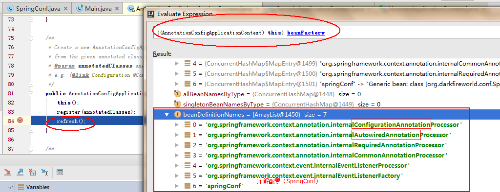
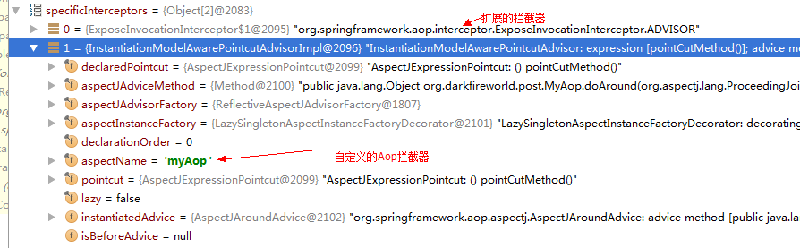

# Spring

## Ioc

Spring的Ioc功能是核心功能，其他的组件（Aop，Tx，Mvc）都依赖Ioc，从而实现。

### 后处理器

在容器中，所有的Bean都是通过**后处理器**进行管理的。而在Spring容器中，`后处理器`大致有两种类型和衍生类：

* BeanFactoryPostProcessor: 管理已加载到BeanFactory中的BeanDefinition集合。
* BeanPostProcessor: 管理Bean的生命周期。

通过这两种类型的`后处理器`，就可以比较全面的控制Ioc容器。下面来详细讲解这些`后处理器`。

#### BeanFactoryPostProcessor

通过`BeanFactoryPostProcessor`，我们可以管理已加载到BeanFactory中的BeanDefinition集合：

```java

/**
 * Allows for custom modification of an application context's bean definitions,
 * adapting the bean property values of the context's underlying bean factory.
 *
 * 通过这个后处理器，可以修改上下文中bean definitions，以及修改bean property values。
 */
public interface BeanFactoryPostProcessor {

	/**
	 * Modify the application context's internal bean factory after its standard initialization.
	 * All bean definitions will have been loaded, but no beans will have been instantiated yet.
	 * This allows for overriding or adding properties even to eager-initializing beans.
     *
	 * 修改上下文中已经初始化完成的内置bean factory。
	 * 此时，所有的bean definitions已经被加载完成, 但是此时beans 还没有被初始化完成（排除后处理器bean）。
	 * 通过这个方法，允许覆盖或者添加属性值到特定的beans定义中。
	 *
	 */
	void postProcessBeanFactory(ConfigurableListableBeanFactory beanFactory) throws BeansException;

}

```

注意：`BeanFactoryPostProcessor#postProcessBeanFactory`被调用的时候，BeanFactory中的BeanDefinition集合已经**加载完成**，所以**不能**
通过`postProcessBeanFactory`加载新的`BeanDefinition`。

代表类：


可以发现，大部分实现类都是针对**属性**进行修改。下面，来看一下`BeanDefinitionRegistryPostProcessor`这个管理`BeanDefinition`后处理器。

##### BeanDefinitionRegistryPostProcessor

通过`BeanDefinitionRegistryPostProcessor`这个后处理器，我们可以新增`BeanDefinition`到beanFactory中：

```java

/**
 * Extension to the standard {@link BeanFactoryPostProcessor} SPI, allowing for
 * the registration of further bean definitions <i>before</i> regular
 * BeanFactoryPostProcessor detection kicks in. In particular,
 * BeanDefinitionRegistryPostProcessor may register further bean definitions
 * which in turn define BeanFactoryPostProcessor instances.
 *
 * 扩展标准的BeanFactoryPostProcessor接口，允许在标准BeanFactoryPostProcessor#postProcessBeanFactory调用之前，
 * 注册新的bean definitions 到容器中。甚至，可以注册新的BeanFactoryPostProcessor类型的bean definitions到容器中。
 *
 * @author Juergen Hoeller
 * @since 3.0.1
 * @see org.springframework.context.annotation.ConfigurationClassPostProcessor
 */
public interface BeanDefinitionRegistryPostProcessor extends BeanFactoryPostProcessor {

	/**
	 * Modify the application context's internal bean definition registry after its
	 * standard initialization. All regular bean definitions will have been loaded,
	 * but no beans will have been instantiated yet. This allows for adding further
	 * bean definitions before the next post-processing phase kicks in.
	 *
	 * 允许在下一个后处理阶段(BeanFactoryPostProcessor#postProcessBeanFactory)之前，添加新
	 * 的bean definitions到容器中。bean definitions可以为 BeanFactoryPostProcessor类型。
	 * 
	 * @param registry the bean definition registry used by the application context
	 * @throws org.springframework.beans.BeansException in case of errors
	 */
	void postProcessBeanDefinitionRegistry(BeanDefinitionRegistry registry) throws BeansException;

}


```

显然，通过`BeanDefinitionRegistryPostProcessor#postProcessBeanDefinitionRegistry`方法，可以添加一些新的`BeanDefinition`到beanFactory中。

当前，Spring就是通过`public class ConfigurationClassPostProcessor implements BeanDefinitionRegistryPostProcessor`这个类，实现了**基于注解配置**的功能。

#### BeanPostProcessor

在bean的生命周期中，**BeanPostProcessor**扮演着非常重要的角色：

```java


/**
 * Factory hook that allows for custom modification of new bean instances,
 * e.g. checking for marker interfaces(@Autowired) or wrapping them with proxies(动态代理).
 *
 */
public interface BeanPostProcessor {

	/**
	 * Apply this BeanPostProcessor to the given new bean instance <i>before</i> any bean
	 * initialization callbacks (like InitializingBean's {@code afterPropertiesSet}or a custom init-method).
     * The bean will already be populated with property values.The returned bean instance may 
	 * be a wrapper around the original.
     *
	 * 在bean对象的initialization方法回调之前，apply这个后处理。
	 * 此时bean的属性已经被设置完成。
	 * 返回的对象可以是一个原始对象或者wrap对象。
	 */
	Object postProcessBeforeInitialization(Object bean, String beanName) throws BeansException;

	/**
	 * Apply this BeanPostProcessor to the given new bean instance <i>after</i> any bean
	 * initialization callbacks (like InitializingBean's {@code afterPropertiesSet}or a custom init-method)
     * The bean will already be populated with property values.
	 * The returned bean instance may be a wrapper around the original.
     *
	 * 在bean对象的initialization方法回调之后，apply这个后处理。
	 * 此时bean的属性已经被设置完成。
	 * 返回的对象可以是一个原始对象或者wrap对象。
	 *
	 * <p>In case of a FactoryBean, this callback will be invoked for both the FactoryBean
	 * instance and the objects created by the FactoryBean (as of Spring 2.0).
	 * The post-processor can decide whether to apply to either the FactoryBean or created
	 * objects or both through corresponding {@code bean instanceof FactoryBean} checks.
     *
	 * 针对通过FactoryBean#getObject()获取的bean，这个后处理也会被apply。
	 *
	 * <p>This callback will also be invoked after a short-circuiting triggered
     * by a{@link InstantiationAwareBeanPostProcessor#postProcessBeforeInstantiation} method,
	 * in contrast to all other BeanPostProcessor callbacks.
     *
	 * 当bean通过InstantiationAwareBeanPostProcessor#postProcessBeforeInstantiation方法获取
	 * 的时候，会触发这个"后处理"回调。此时，bean的生命周期被称为"短生命周期"。
	 * 
	 */
	Object postProcessAfterInitialization(Object bean, String beanName) throws BeansException;

}


```

Spring Aop其实就是通过`BeanPostProcessor#postProcessAfterInitialization`来实现的，详情见**AnnotationAwareAspectJAutoProxyCreator**。

注意：虽然`BeanPostProcessor`接口申明的方法，仅仅只能管理bean在**设置属性后**的生命周期，但是它的**子接口**拥有更大的权限。

现在，我们再来看看`BeanPostProcessor`的子接口，通过子接口，可以拥有更大的权限，来操作bean的生命周期。

##### MergedBeanDefinitionPostProcessor

在Bean的初始化过程中，通过**MergedBeanDefinitionPostProcessor**对Bean的


```java

/**
 * Post-processor callback interface for <i>merged</i> bean definitions at runtime.
 * {@link BeanPostProcessor} implementations may implement this sub-interface in
 * order(优先级) to post-process the merged bean definition that the Spring BeanFactory
 * uses to create a specific bean instance.
 *
 * @author Juergen Hoeller
 * @since 2.5
 */
public interface MergedBeanDefinitionPostProcessor extends BeanPostProcessor {

	/**
	 * Post-process the given merged bean definition for the specified bean.
	 *
	 * (针对bean definition进行后处理)
	 *
	 * @param beanDefinition the merged bean definition for the bean
	 * @param beanType the actual type of the managed bean instance
	 * @param beanName the name of the bean
	 */
	void postProcessMergedBeanDefinition(RootBeanDefinition beanDefinition, Class<?> beanType, String beanName);

}

```

通过`MergedBeanDefinitionPostProcessor`丰富了Bean配置方式：

1. 支持修改XML或者@Bean中定义的bean属性。
2. 支持**注解配置**，如：@Autowired, @PostConstruct。

注意：注解配置信息保存在**后处理器的缓存**中，而非RootBeanDefinition中。

##### InstantiationAwareBeanPostProcessor

在后处理器中，通过**InstantiationAwareBeanPostProcessor**扩展了**Bean实例化-属性设置**的生命周期管理。

```java

/**
 * Subinterface of {@link BeanPostProcessor} that adds a before-instantiation(实例化之前) callback,
 * and a callback after instantiation(实例化完成) but before explicit properties(设置属性之前) are set or
 * autowiring(@Autowired) occurs.
 *
 */
public interface InstantiationAwareBeanPostProcessor extends BeanPostProcessor {

	/**
	 * Apply this BeanPostProcessor <i>before the target bean gets instantiated</i>.
	 * The returned bean object may be a proxy to use instead of the target bean,
	 * effectively suppressing default instantiation of the target bean.
	 * <p>If a non-null object is returned by this method, the bean creation process
	 * will be short-circuited. The only further processing applied is the
	 * {@link #postProcessAfterInitialization} callback from the configured
	 * {@link BeanPostProcessor BeanPostProcessors}.
	 * 
	 * 在对象实例化之前，会尝试通过这个方法获取一个代理对象。如果返回的对象非空，则返回对象会被容器中注册
	 * 的"后处理器"执行"BeanPostProcessor#postProcessAfterInitialization"方法，然后结束bean的构造过程。
	 * 
	 */
	Object postProcessBeforeInstantiation(Class<?> beanClass, String beanName) throws BeansException;

	/**
	 * Perform operations after the bean has been instantiated, via a constructor or factory method,
	 * but before Spring property population (from explicit properties or autowiring) occurs.
	 * 
	 * 在bean被初始化之后，且在属性设置(包括@Autowired)之前，被调用。如果"return false"，则表示这个bean之后
	 * 不需要进行属性设置(包括@Autowired)。
	 */
	boolean postProcessAfterInstantiation(Object bean, String beanName) throws BeansException;

	/**
	 * Post-process the given property values before the factory applies them
	 * to the given bean. Allows for checking whether all dependencies have been
	 * satisfied, for example based on a "Required" annotation on bean property setters.
	 * <p>Also allows for replacing the property values to apply, typically through
	 * creating a new MutablePropertyValues instance based on the original PropertyValues,
	 * adding or removing specific values.
	 * 
	 * 在Factory设置属性值到bean之前，可以对属性值进行"后处理"。比如说：对Required标记的属性进行检验。
	 * 也可以，对要设置的属性进行修改和删除。
	 */
	PropertyValues postProcessPropertyValues(
			PropertyValues pvs, PropertyDescriptor[] pds, Object bean, String beanName)
			throws BeansException;

}

```

通过`InstantiationAwareBeanPostProcessor`扩展了`BeanPostProcessor`对bean生命周期的管理。

注意：**@Autowired**注入就是通过`InstantiationAwareBeanPostProcessor#postProcessPropertyValues`完成的。详情见**AutowiredAnnotationBeanPostProcessor**

##### DestructionAwareBeanPostProcessor

通过**DestructionAwareBeanPostProcessor**可以管理bean的destroy过程。比如：容器关闭的时候，注销所有的singleton对象。

```java

/**
 * Subinterface of {@link BeanPostProcessor} that adds a before-destruction callback.
 *
 * <p>The typical usage will be to invoke custom destruction callbacks on
 * specific bean types, matching corresponding initialization callbacks.
 */
public interface DestructionAwareBeanPostProcessor extends BeanPostProcessor {

	/**
	 * Apply this BeanPostProcessor to the given bean instance before
	 * its destruction. Can invoke custom destruction callbacks.
	 * <p>Like DisposableBean's {@code destroy} and a custom destroy method,
	 * this callback just applies to singleton beans in the factory (including
	 * inner beans).
	 * 
	 * 通过这个方法，可以在对象销毁之前，进行后处理。
	 */
	void postProcessBeforeDestruction(Object bean, String beanName) throws BeansException;

}

```

一个bean的销毁的步骤如下（DisposableBeanAdapter#destroy）：

1. 调用容器中所有`DestructionAwareBeanPostProcessor`后处理器进行处理。比如说：`InitDestroyAnnotationBeanPostProcessor`进行处理@PreDestroy注解。
2. 如果bean实现了`DisposableBean`接口，则调用`DisposableBean#destroy`方法。
3. 调用bean定义的**自定义**destroy方法。

注意：在容器关闭的时候，会注销所有singleton对象。

#### 关于Ordered

Spring在初始化和使用**BeanFactoryPostProcessor和BeanPostProcessor**的时候，会遇到**依赖**问题，比如说：

> **自定义BeanPostProcessor**里面存在**@Autowried**注入的属性，则此时**AutowiredAnnotationBeanPostProcessor**需要在
> 自定义BeanPostProcessor之前实例化并且**注册**到Factory中。

在Spring中，通过Ordered和PriorityOrdered来标记优先级：**PriorityOrdered > Ordered > Non-Ordered**。

通过`Ordered`接口定义优先级，就可以解决上述的问题了。

### 容器生命周期

一个容器的初始化到销毁，大致会经历如下的阶段：

**容器初始化：**

1. 构造DefaultListableBeanFactory对象
2. 添加**默认后处理器**以及默认Bean配置(SpringConf)，比如说：`ConfigurationClassPostProcessor`，`AutowiredAnnotationBeanPostProcessor`
3. 初始化容器 Environment 对象。
4. 初始化并且**调用**`BeanFactoryPostProcessor`接口对象。
5. 初始化并且**注册**`BeanPostProcessor`接口对象。
6. 初始化MessageSource（国际化支持）
7. 初始化ApplicationEventMulticaster（事件总线）
8. 注册容器中Listener（事件监听器）
9. 锁定容器Configuration对象
10. 初始化所有singleton且非lazy的bean。

**容器销毁：**

容器销毁通常有两种方式：

1. 调用`context#registerShutdownHook`方法，然后当JVM关闭的时候，通过`ShutdownHook`回调，执行容器`doClose`方法。
2. 主动调用`context#close`方法，执行容器`doClose`方法。

容器的doClose方法的流程如下：

1. 发送容器**关闭**事件。
2. 销毁容器中的singleton bean，并且执行`bean#destroy`方法。
3. 设置容器的factory=null。

这样子，就完成了容器的销毁。

### Bean生命周期

一个bean的生命周期大致如下：


通过上图，可以比较清晰的了解到bean的生命周期。现在，介绍一下bean生命周期中关键的点：

* 实例化bean对象：一般来说，bean的实例化会通过**无参构造函**数进行实例化，但是，如果一个bean
被`InstantiationAwareBeanPostProcessor#postProcessBeforeInstantiation`代理生成对象，则会进入**短生命周期**处理。

* 设置对象属性：在此阶段，容器会设置bean的属性，包括@Autowired注入。值得注意的是@Autowired就是通过`InstantiationAwareBeanPostProcessor#postProcessPropertyValues`回调设置的。
详情见：`AutowiredAnnotationBeanPostProcessor`。

* BeanPostProcessor#postProcessBeforeInitialization处理：这个阶段比较重要的处理为：Aware（ApplicationContextAware，EnvironmentAware）注入，
@PostConstruct等注解的实现。详情见：`ApplicationContextAwareProcessor`和`CommonAnnotationBeanPostProcessor`。

* invokeInitMethods: 容器会调用bean的初始化方法`InitializingBean#afterPropertiesSet`以及`自定义init方法`。

* BeanPostProcessor#postProcessAfterInitialization:这个阶段，比较重要的就是对**Spring Aop**的支持了。详情见：`AnnotationAwareAspectJAutoProxyCreator`。

* 注册Destruction回调：如果bean（scope != prototype）实现了`DisposableBean`接口或者指定了destroy方法，或者容器中存在`DestructionAwareBeanPostProcessor`类型的后处理器，
则通过**DisposableBeanAdapter**包装这个bean对象，然后注册到对应作用域的**析构链**中。注意：`singleton bean`是在**容器销毁**的时候进行析构。

* 析构Bean对象：当Bean析构的时候，会应用容器中所有`DestructionAwareBeanPostProcessor`类型的后处理器，通过调用`postProcessBeforeDestruction`方法处理bean。(如：
`CommonAnnotationBeanPostProcessor`实现了**@PreDestroy**注解处理)。然后，容器会调用bean的析构过程：`DisposableBean#destroy`方法和`自定义destroy`方法。

可以发现，spring中许多特性，如：@Autowired，@PostConstruct，@PreDestroy，Aop等，都是通过**后处理器**完成的。

#### 关于FactoryBean

在Spring中，Bean的构造也可以通过**FactoryBean**来构造，通过`FactoryBean`可以更加自由的控制bean的生成：

```java

public interface FactoryBean<T> {

	/**
	 * Return an instance (possibly shared or independent) of the object
	 * managed by this factory.
	 *
	 * 获取一个bean对象实例。
	 */
	T getObject() throws Exception;

	/**
	 * Return the type of object that this FactoryBean creates,
	 * or {@code null} if not known in advance.
	 * 
	 * 返回bean的类型信息
	 */
	Class<?> getObjectType();

	/**
	 * Is the object managed by this factory a singleton? That is,
	 * will {@link #getObject()} always return the same object
	 * (a reference that can be cached)?
	 *
	 * 返回bean是否是sington模式，如果是的话，则会被缓存。
	 */
	boolean isSingleton();

}

```

FactoryBean具有如下特性：

* 通过**getBean(&beanName)**来获取FactoryBean对象，而通过**getBean(beanName)**来获取FactoryBean构造出来的Bean对象。
* 创建FactoryBean的时候，会经历完整的bean生命周期。
* 通过`FactoryBean#getObject`获取的bean对象，会仅仅通过`BeanPostProcessor#postProcessAfterInitialization`这个后处理。

通过`FactoryBean`可以实现一些复杂Bean的生成。

#### 关于Aware

在Bean的生命周期过程中，我们会通过**Aware**来获取容器**内置变量**：

1. ServletContextAware: 设置当前Spring MVC的 ServletContext。
2. MessageSourceAware: 设置当前的MessageSource对象。
3. EnvironmentAware：设置当前Environment对象。
4. BeanFactoryAware：设置当前的BeanFactory对象。
5. BeanNameAware：设置当前bean的name。
6. ApplicationContextAware：设置当前的ApplicationContext对象。

通过这些`Aware`接口，可以非常轻松的将容器的变量注入到bean中。详情见：`CommonAnnotationBeanPostProcessor`。

### 源码剖析

现在，我们以`AnnotationConfigApplicationContext`为例子，来分析一下Spring容器初始化和销毁的过曾过程：

```java

    static public void main(String[] args) {
		//初始化
        AnnotationConfigApplicationContext context = new AnnotationConfigApplicationContext(SpringConf.class);
		//销毁
        context.close();
    }
	
```

#### 容器初始化

**AnnotationConfigApplicationContext构造过程：**

```java

AnnotationConfigApplicationContext:

	/**
	 * Create a new AnnotationConfigApplicationContext, deriving bean definitions
	 * from the given annotated classes and automatically refreshing the context.
	 *
	 * 创建一个AnnotationConfigApplicationContext对象，注册annotated classes并且自动刷新上下文
	 *
	 */
	public AnnotationConfigApplicationContext(Class<?>... annotatedClasses) {
		//调用构造函数
		this();
		//注册该注解配置的classes
		register(annotatedClasses);
		//刷新上下文
		refresh();
	}
 
```

分析上面的代码，在初始化`AnnotationConfigApplicationContext`上下文的时候，发生如下重要过程：

1. 绑定当前线程的ClassLoader，见`DefaultResourceLoader`。
2. 绑定默认资源解析器，见`AbstractApplicationContext`。
3. 设置内置beanFactory=DefaultListableBeanFactory，见`GenericApplicationContext`。
4. 加载默认注解类型的后处理器，如@Autowired，@Configuration，@PostConstruct，@Bean...，见`AnnotationConfigApplicationContext#init`->`AnnotatedBeanDefinitionReader#init`->`AnnotationConfigUtils.registerAnnotationConfigProcessors`.
5. 注册给定的**注解配置类(SpringConf)**。
6. **refresh**当前上下文。

此时，beanFactory中注册的bean definitions 为：



可以发现，在调用**refresh**函数之前，beanFactory中已经包含了**注解类型的后处理器**以及**默认的注解配置（SpringConf）**。

**refresh过程：**

```java

AbstractApplicationContext：

    @Override
	public void refresh() throws BeansException, IllegalStateException {
		synchronized (this.startupShutdownMonitor) {
			// Prepare this context for refreshing.
            // 准备上下文环境
			prepareRefresh();

			// Tell the subclass to refresh the internal bean factory.
            // 告诉子类需要进行refresh操作，并且获取它内置的bean factory
			ConfigurableListableBeanFactory beanFactory = obtainFreshBeanFactory();

			// Prepare the bean factory for use in this context.
            // 针对当前的上下文，配置相应的特性。比如：添加ApplicationContextAwareProcessor这个后处理器。
			prepareBeanFactory(beanFactory);

			try {
				// Allows post-processing of the bean factory in context subclasses.
                // 允许子类对beanFactory进行后处理
				postProcessBeanFactory(beanFactory);

				// Invoke factory processors registered as beans in the context.
                // 实例化并且调用bean factory中的 BeanFactoryPostProcessor定义。
				invokeBeanFactoryPostProcessors(beanFactory);

				// Register bean processors that intercept bean creation.
                // 实例化并且注册 bean factory 中的 BeanPostProcessor 定义
				registerBeanPostProcessors(beanFactory);

				// Initialize message source for this context.
                // 初始化MessageSource
				initMessageSource();

				// Initialize event multicaster for this context.
                // 初始化事件总线
				initApplicationEventMulticaster();

				// Initialize other special beans in specific context subclasses.
                // 允许子类初始化特殊的bean对象
				onRefresh();

				// Check for listener beans and register them.
                // 注册监听器
				registerListeners();

				// Instantiate all remaining (non-lazy-init) singletons.
                // 初始化剩余的 (non-lazy-init) singletons的bean定义
				finishBeanFactoryInitialization(beanFactory);

				// Last step: publish corresponding event.
                // 结束refresh过程
				finishRefresh();
			}

			catch (BeansException ex) {
				...
			}

			finally {
				// Reset common introspection caches in Spring's core, since we
				// might not ever need metadata for singleton beans anymore...
				resetCommonCaches();
			}
		}
	}
    
```

可以发现`AbstractApplicationContext#refresh`控制着容器的初始化过程，重要的子过程为：

1. obtainFreshBeanFactory:告诉子类需要进行refresh操作，并且获取它内置的bean factory
2. prepareBeanFactory:针对当前的上下文，配置相应的特性。比如：添加ApplicationContextAwareProcessor这个后处理器。
3. invokeBeanFactoryPostProcessors:实例化并且调用bean factory中的 BeanFactoryPostProcessor定义。
4. registerBeanPostProcessors:实例化并且注册 bean factory 中的 BeanPostProcessor 定义
5. finishBeanFactoryInitialization:初始化剩余的 (non-lazy-init) singletons的bean定义

基本上，Spring的特性都包含在上述几个步骤中提现。

**obtainFreshBeanFactory:**

```java

AbstractApplicationContext:
	/**
	 * Tell the subclass to refresh the internal bean factory.
	 *
     * 告诉子类将要refresh当前的内置bean factory，并且返回它的bean factory
	 */
	protected ConfigurableListableBeanFactory obtainFreshBeanFactory() {
        // 比如：GenericApplicationContext这个不可刷新的上下文，
        // 则仅仅进行对比当前beanFactory是否已经被refresh过，如果是，则抛出异常。
		refreshBeanFactory();
        // 获取子类内置的beanFactory
		ConfigurableListableBeanFactory beanFactory = getBeanFactory();
		if (logger.isDebugEnabled()) {
			logger.debug("Bean factory for " + getDisplayName() + ": " + beanFactory);
		}
		return beanFactory;
	}
    
```

**prepareBeanFactory:**

```java

AbstractApplicationContext:

    /**
	 * Configure the factory's standard context characteristics,
	 * such as the context's ClassLoader and post-processors.
	 * @param beanFactory the BeanFactory to configure
     *
     * 配置标准上下文的特性，比如说ClassLoader，后处理器等。
	 */
	protected void prepareBeanFactory(ConfigurableListableBeanFactory beanFactory) {
		// Tell the internal bean factory to use the context's class loader etc.
        // 告诉beanFactory使用当前上下文的classloader，以及Environment信息
		beanFactory.setBeanClassLoader(getClassLoader());
		beanFactory.setBeanExpressionResolver(new StandardBeanExpressionResolver(beanFactory.getBeanClassLoader()));
		beanFactory.addPropertyEditorRegistrar(new ResourceEditorRegistrar(this, getEnvironment()));

		// Configure the bean factory with context callbacks.
        // 配置Aware后处理器
        // 这样子，之后所有的bean都支持Aware子接口的注入。
		beanFactory.addBeanPostProcessor(new ApplicationContextAwareProcessor(this));
		beanFactory.ignoreDependencyInterface(ResourceLoaderAware.class);
		beanFactory.ignoreDependencyInterface(ApplicationEventPublisherAware.class);
		beanFactory.ignoreDependencyInterface(MessageSourceAware.class);
		beanFactory.ignoreDependencyInterface(ApplicationContextAware.class);
		beanFactory.ignoreDependencyInterface(EnvironmentAware.class);

		// BeanFactory interface not registered as resolvable type in a plain factory.
		// MessageSource registered (and found for autowiring) as a bean.
		beanFactory.registerResolvableDependency(BeanFactory.class, beanFactory);
		beanFactory.registerResolvableDependency(ResourceLoader.class, this);
		beanFactory.registerResolvableDependency(ApplicationEventPublisher.class, this);
		beanFactory.registerResolvableDependency(ApplicationContext.class, this);

		// Detect a LoadTimeWeaver and prepare for weaving, if found.
		if (beanFactory.containsBean(LOAD_TIME_WEAVER_BEAN_NAME)) {
			beanFactory.addBeanPostProcessor(new LoadTimeWeaverAwareProcessor(beanFactory));
			// Set a temporary ClassLoader for type matching.
			beanFactory.setTempClassLoader(new ContextTypeMatchClassLoader(beanFactory.getBeanClassLoader()));
		}

		// Register default environment beans.
        // 注册默认的environment
		if (!beanFactory.containsLocalBean(ENVIRONMENT_BEAN_NAME)) {
			beanFactory.registerSingleton(ENVIRONMENT_BEAN_NAME, getEnvironment());
		}
		if (!beanFactory.containsLocalBean(SYSTEM_PROPERTIES_BEAN_NAME)) {
			beanFactory.registerSingleton(SYSTEM_PROPERTIES_BEAN_NAME, getEnvironment().getSystemProperties());
		}
		if (!beanFactory.containsLocalBean(SYSTEM_ENVIRONMENT_BEAN_NAME)) {
			beanFactory.registerSingleton(SYSTEM_ENVIRONMENT_BEAN_NAME, getEnvironment().getSystemEnvironment());
		}
	}
```

通过`prepareBeanFactory`添加了一些当前上下文的特性：ApplicationContextAwareProcessor，environment等。

**invokeBeanFactoryPostProcessors:**

invokeBeanFactoryPostProcessors方法是通过`PostProcessorRegistrationDelegate#invokeBeanFactoryPostProcessors`方法实现具体流程的：

```java

PostProcessorRegistrationDelegate:

    public static void invokeBeanFactoryPostProcessors(
			ConfigurableListableBeanFactory beanFactory, List<BeanFactoryPostProcessor> beanFactoryPostProcessors) {

		// Invoke BeanDefinitionRegistryPostProcessors first, if any.
        // 调用 BeanDefinitionRegistryPostProcessors 接口子类记录集合
		Set<String> processedBeans = new HashSet<String>();

		if (beanFactory instanceof BeanDefinitionRegistry) {
			BeanDefinitionRegistry registry = (BeanDefinitionRegistry) beanFactory;
			List<BeanFactoryPostProcessor> regularPostProcessors = new LinkedList<BeanFactoryPostProcessor>();
			List<BeanDefinitionRegistryPostProcessor> registryPostProcessors =
					new LinkedList<BeanDefinitionRegistryPostProcessor>();
            
            // 调用外部指定的 beanFactoryPostProcessors 集合
			for (BeanFactoryPostProcessor postProcessor : beanFactoryPostProcessors) {
				if (postProcessor instanceof BeanDefinitionRegistryPostProcessor) {
                    // 如果是 BeanDefinitionRegistryPostProcessor 接口类
                    // 则调用 postProcessBeanDefinitionRegistry 方法
					BeanDefinitionRegistryPostProcessor registryPostProcessor =
							(BeanDefinitionRegistryPostProcessor) postProcessor;
					registryPostProcessor.postProcessBeanDefinitionRegistry(registry);
                    // 添加到 registry类型后处理器集合中
					registryPostProcessors.add(registryPostProcessor);
				}
				else {
                    // 添加到regular 类型后处理器集合中
					regularPostProcessors.add(postProcessor);
				}
			}

			// Do not initialize FactoryBeans here: We need to leave all regular beans
			// uninitialized to let the bean factory post-processors apply to them!
			// Separate between BeanDefinitionRegistryPostProcessors that implement
			// PriorityOrdered, Ordered, and the rest.
            //
            // 不要初始化FactoryBean：我们需要推迟常规bean的初始化，让它们可以被后处理器进行处理。
            // 这里需要区分 BeanDefinitionRegistryPostProcessors 的实现优先级接口： PriorityOrdered,Ordered
			String[] postProcessorNames =
					beanFactory.getBeanNamesForType(BeanDefinitionRegistryPostProcessor.class, true, false);

			// First, invoke the BeanDefinitionRegistryPostProcessors that implement PriorityOrdered.
            // 首先，调用实现PriorityOrdered接口的BeanDefinitionRegistryPostProcessors
			List<BeanDefinitionRegistryPostProcessor> priorityOrderedPostProcessors = new ArrayList<BeanDefinitionRegistryPostProcessor>();
			for (String ppName : postProcessorNames) {
				if (beanFactory.isTypeMatch(ppName, PriorityOrdered.class)) {
					priorityOrderedPostProcessors.add(beanFactory.getBean(ppName, BeanDefinitionRegistryPostProcessor.class));
					processedBeans.add(ppName);
				}
			}
            //排序
			sortPostProcessors(beanFactory, priorityOrderedPostProcessors);
            // 添加到 registry类型后处理器集合中
			registryPostProcessors.addAll(priorityOrderedPostProcessors);
            // 调用BeanDefinitionRegistryPostProcessor#postProcessBeanDefinitionRegistry 方法
			invokeBeanDefinitionRegistryPostProcessors(priorityOrderedPostProcessors, registry);

			// Next, invoke the BeanDefinitionRegistryPostProcessors that implement Ordered.
            // 下一步，调用实现Ordered接口的BeanDefinitionRegistryPostProcessors
			postProcessorNames = beanFactory.getBeanNamesForType(BeanDefinitionRegistryPostProcessor.class, true, false);
			List<BeanDefinitionRegistryPostProcessor> orderedPostProcessors = new ArrayList<BeanDefinitionRegistryPostProcessor>();
			for (String ppName : postProcessorNames) {
				if (!processedBeans.contains(ppName) && beanFactory.isTypeMatch(ppName, Ordered.class)) {
					orderedPostProcessors.add(beanFactory.getBean(ppName, BeanDefinitionRegistryPostProcessor.class));
					processedBeans.add(ppName);
				}
			}
            //排序
			sortPostProcessors(beanFactory, orderedPostProcessors);
            // 添加到 registry类型后处理器集合中
			registryPostProcessors.addAll(orderedPostProcessors);
             // 调用BeanDefinitionRegistryPostProcessor#postProcessBeanDefinitionRegistry 方法
			invokeBeanDefinitionRegistryPostProcessors(orderedPostProcessors, registry);

			// Finally, invoke all other BeanDefinitionRegistryPostProcessors until no further ones appear.
            // 最后，调用所有其它类型的BeanDefinitionRegistryPostProcessors，直到没有新的BeanDefinitionRegistryPostProcessors生成。
			boolean reiterate = true;
			while (reiterate) {
				reiterate = false;
				postProcessorNames = beanFactory.getBeanNamesForType(BeanDefinitionRegistryPostProcessor.class, true, false);
				for (String ppName : postProcessorNames) {
					if (!processedBeans.contains(ppName)) {
						BeanDefinitionRegistryPostProcessor pp = beanFactory.getBean(ppName, BeanDefinitionRegistryPostProcessor.class);
						registryPostProcessors.add(pp);
						processedBeans.add(ppName);
						pp.postProcessBeanDefinitionRegistry(registry);
						reiterate = true;
					}
				}
			}

			// Now, invoke the postProcessBeanFactory callback of all processors handled so far.
            // 现在，调用postProcessBeanFactory这个回调
			invokeBeanFactoryPostProcessors(registryPostProcessors, beanFactory);
			invokeBeanFactoryPostProcessors(regularPostProcessors, beanFactory);
		}

		else {
			// Invoke factory processors registered with the context instance.
            // 调用工厂后处理器
			invokeBeanFactoryPostProcessors(beanFactoryPostProcessors, beanFactory);
		}

		// Do not initialize FactoryBeans here: We need to leave all regular beans
		// uninitialized to let the bean factory post-processors apply to them!
        // 不要初始化FactoryBean：我们需要推迟常规bean的初始化，让它们可以被后处理器进行处理。
		String[] postProcessorNames =
				beanFactory.getBeanNamesForType(BeanFactoryPostProcessor.class, true, false);

		// Separate between BeanFactoryPostProcessors that implement PriorityOrdered,
		// Ordered, and the rest.
        // 通过PriorityOrdered，Ordered区分BeanFactoryPostProcessors的优先级
		List<BeanFactoryPostProcessor> priorityOrderedPostProcessors = new ArrayList<BeanFactoryPostProcessor>();
		List<String> orderedPostProcessorNames = new ArrayList<String>();
		List<String> nonOrderedPostProcessorNames = new ArrayList<String>();
		for (String ppName : postProcessorNames) {
			if (processedBeans.contains(ppName)) {
				// skip - already processed in first phase above
                // 跳过这个后处理，因为这个后处理之前已经被调用过
			}
            // 根据后处理器实现的接口的优先级，进行分类
			else if (beanFactory.isTypeMatch(ppName, PriorityOrdered.class)) {
				priorityOrderedPostProcessors.add(beanFactory.getBean(ppName, BeanFactoryPostProcessor.class));
			}
			else if (beanFactory.isTypeMatch(ppName, Ordered.class)) {
				orderedPostProcessorNames.add(ppName);
			}
			else {
				nonOrderedPostProcessorNames.add(ppName);
			}
		}

		// First, invoke the BeanFactoryPostProcessors that implement PriorityOrdered.
        // 首先，调用所有实现PriorityOrdered接口的BeanFactoryPostProcessors
		sortPostProcessors(beanFactory, priorityOrderedPostProcessors);
		invokeBeanFactoryPostProcessors(priorityOrderedPostProcessors, beanFactory);

		// Next, invoke the BeanFactoryPostProcessors that implement Ordered.
        // 接下来，调用实现Ordered接口的BeanFactoryPostProcessors
		List<BeanFactoryPostProcessor> orderedPostProcessors = new ArrayList<BeanFactoryPostProcessor>();
		for (String postProcessorName : orderedPostProcessorNames) {
			orderedPostProcessors.add(beanFactory.getBean(postProcessorName, BeanFactoryPostProcessor.class));
		}
		sortPostProcessors(beanFactory, orderedPostProcessors);
		invokeBeanFactoryPostProcessors(orderedPostProcessors, beanFactory);

		// Finally, invoke all other BeanFactoryPostProcessors.
        // 最后，调用所有其他类型的BeanFactoryPostProcessors
		List<BeanFactoryPostProcessor> nonOrderedPostProcessors = new ArrayList<BeanFactoryPostProcessor>();
		for (String postProcessorName : nonOrderedPostProcessorNames) {
			nonOrderedPostProcessors.add(beanFactory.getBean(postProcessorName, BeanFactoryPostProcessor.class));
		}
		invokeBeanFactoryPostProcessors(nonOrderedPostProcessors, beanFactory);

		// Clear cached merged bean definitions since the post-processors might have
		// modified the original metadata, e.g. replacing placeholders in values...
		beanFactory.clearMetadataCache();
	}
```

调用`invokeBeanFactoryPostProcessors`方法的基本流程如下：

1. 调用BeanDefinitionRegistryPostProcessors，注册新的`BeanDefinition`到容器中，比如说：`ConfigurationClassPostProcessor`。
2. 调用BeanFactoryPostProcessor，修改在容器中的`BeanDefinition`属性配置信息。

其实，这个阶段比较重要的是`ConfigurationClassPostProcessor`这个支持**注解配置**的工厂后处理器，它实现了如下特性：

1. @Bean
2. @ComponentScan
3. @Import

通过`@ConfigurationClassPostProcessor`这个后处理器，在容器初始化阶段，动态的添加`BeanDefinition`到容器中，
实现了通过**配置类(SpringConf)**完成Spring的配置功能。

注意：

1. Invoke都会通过`PriorityOrdered`，`Ordered` ，`Non-Ordered`方式进行排序，避免工厂后处理器依赖的问题。
2. **只能**通过`BeanDefinitionRegistryPostProcessor`这个工厂后处理器添加新的`BeanDefinition`到容器中。

**registerBeanPostProcessors:**

registerBeanPostProcessors是通过`PostProcessorRegistrationDelegate.registerBeanPostProcessors(beanFactory, this)`方法实现：

```java

PostProcessorRegistrationDelegate:

    public static void registerBeanPostProcessors(
			ConfigurableListableBeanFactory beanFactory, AbstractApplicationContext applicationContext) {
            
        // 获取容器中，所有的BeanPostProcessor类型的bean 定义
		String[] postProcessorNames = beanFactory.getBeanNamesForType(BeanPostProcessor.class, true, false);

		// Register BeanPostProcessorChecker that logs an info message when
		// a bean is created during BeanPostProcessor instantiation, i.e. when
		// a bean is not eligible for getting processed by all BeanPostProcessors.
        //
        // 注册一个BeanPostProcessorChecker对象，用来记录BeanPostProcessor的初始化日志
		int beanProcessorTargetCount = beanFactory.getBeanPostProcessorCount() + 1 + postProcessorNames.length;
		beanFactory.addBeanPostProcessor(new BeanPostProcessorChecker(beanFactory, beanProcessorTargetCount));

		// Separate between BeanPostProcessors that implement PriorityOrdered,
		// Ordered, and the rest.
        // 通过PriorityOrdered，Ordered，Non-Ordered排序BeanPostProcessors
		List<BeanPostProcessor> priorityOrderedPostProcessors = new ArrayList<BeanPostProcessor>();
		List<BeanPostProcessor> internalPostProcessors = new ArrayList<BeanPostProcessor>();
		List<String> orderedPostProcessorNames = new ArrayList<String>();
		List<String> nonOrderedPostProcessorNames = new ArrayList<String>();
		for (String ppName : postProcessorNames) {
			if (beanFactory.isTypeMatch(ppName, PriorityOrdered.class)) {
				BeanPostProcessor pp = beanFactory.getBean(ppName, BeanPostProcessor.class);
				priorityOrderedPostProcessors.add(pp);
				if (pp instanceof MergedBeanDefinitionPostProcessor) {
					internalPostProcessors.add(pp);
				}
			}
			else if (beanFactory.isTypeMatch(ppName, Ordered.class)) {
				orderedPostProcessorNames.add(ppName);
			}
			else {
				nonOrderedPostProcessorNames.add(ppName);
			}
		}

		// First, register the BeanPostProcessors that implement PriorityOrdered.
        // 首先，注册实现PriorityOrdered接口的BeanPostProcessors对象
		sortPostProcessors(beanFactory, priorityOrderedPostProcessors);
		registerBeanPostProcessors(beanFactory, priorityOrderedPostProcessors);

		// Next, register the BeanPostProcessors that implement Ordered.
        // 接着，注册实现Ordered接口的BeanPostProcessors
		List<BeanPostProcessor> orderedPostProcessors = new ArrayList<BeanPostProcessor>();
		for (String ppName : orderedPostProcessorNames) {
			BeanPostProcessor pp = beanFactory.getBean(ppName, BeanPostProcessor.class);
			orderedPostProcessors.add(pp);
			if (pp instanceof MergedBeanDefinitionPostProcessor) {
				internalPostProcessors.add(pp);
			}
		}
		sortPostProcessors(beanFactory, orderedPostProcessors);
		registerBeanPostProcessors(beanFactory, orderedPostProcessors);

		// Now, register all regular BeanPostProcessors.
        // 现在，注册所有常规 BeanPostProcessors 
		List<BeanPostProcessor> nonOrderedPostProcessors = new ArrayList<BeanPostProcessor>();
		for (String ppName : nonOrderedPostProcessorNames) {
			BeanPostProcessor pp = beanFactory.getBean(ppName, BeanPostProcessor.class);
			nonOrderedPostProcessors.add(pp);
			if (pp instanceof MergedBeanDefinitionPostProcessor) {
				internalPostProcessors.add(pp);
			}
		}
		registerBeanPostProcessors(beanFactory, nonOrderedPostProcessors);

		// Finally, re-register all internal BeanPostProcessors.
		sortPostProcessors(beanFactory, internalPostProcessors);
		registerBeanPostProcessors(beanFactory, internalPostProcessors);
        
        // 添加一个ApplicationListenerDetector后处理器
		beanFactory.addBeanPostProcessor(new ApplicationListenerDetector(applicationContext));
	}
    
```

通过`registerBeanPostProcessors`方法，将容器中的`BeanPostProcessor`定义，按照**优先级**进行初始化，然后注册到容器的**后处理器链**中。

**finishBeanFactoryInitialization:**

在`finishBeanFactoryInitialization`方法中，比较重要的就是关于 **non-lazy singleton** 的bean预初始化了：

```java

AbstractApplicationContext：

    /**
	 * Finish the initialization of this context's bean factory,
	 * initializing all remaining singleton beans.
     *
     * 结束上下文初始化，并且初始化剩下的sington beans
	 */
	protected void finishBeanFactoryInitialization(ConfigurableListableBeanFactory beanFactory) {
		// Initialize conversion service for this context.
		if (beanFactory.containsBean(CONVERSION_SERVICE_BEAN_NAME) &&
				beanFactory.isTypeMatch(CONVERSION_SERVICE_BEAN_NAME, ConversionService.class)) {
			beanFactory.setConversionService(
					beanFactory.getBean(CONVERSION_SERVICE_BEAN_NAME, ConversionService.class));
		}

		// Initialize LoadTimeWeaverAware beans early to allow for registering their transformers early.
		String[] weaverAwareNames = beanFactory.getBeanNamesForType(LoadTimeWeaverAware.class, false, false);
		for (String weaverAwareName : weaverAwareNames) {
			getBean(weaverAwareName);
		}

		// Stop using the temporary ClassLoader for type matching.
        // 关闭beanFactory临时classloader
		beanFactory.setTempClassLoader(null);

		// Allow for caching all bean definition metadata, not expecting further changes.
        // 允许缓存所有的bean元信息，这些信息不允许再被修改
		beanFactory.freezeConfiguration();

		// Instantiate all remaining (non-lazy-init) singletons.
        // 实例化所有剩下的 (non-lazy-init) singleton beans.
		beanFactory.preInstantiateSingletons();
	}
    
DefaultListableBeanFactory:

    @Override
	public void preInstantiateSingletons() throws BeansException {
		if (this.logger.isDebugEnabled()) {
			this.logger.debug("Pre-instantiating singletons in " + this);
		}

		// Iterate over a copy to allow for init methods which in turn register new bean definitions.
		// While this may not be part of the regular factory bootstrap, it does otherwise work fine.
		List<String> beanNames = new ArrayList<String>(this.beanDefinitionNames);

		// Trigger initialization of all non-lazy singleton beans...
        // 触发所有 non-lazy singleton beans 的初始化
		for (String beanName : beanNames) {
			RootBeanDefinition bd = getMergedLocalBeanDefinition(beanName);
			if (!bd.isAbstract() && bd.isSingleton() && !bd.isLazyInit()) {
                // singleton && non-lazt-init
				if (isFactoryBean(beanName)) {
                    // 如果beanName指向的bean为FactoryBean类型
                    // 则通过getBean(FACTORY_BEAN_PREFIX+beanName)，来仅仅初始化BeanFactory对象，而非FactoryBean#getObject()对象。
					final FactoryBean<?> factory = (FactoryBean<?>) getBean(FACTORY_BEAN_PREFIX + beanName);
					...
				}
				else {
                    // 获取bean实例
					getBean(beanName);
				}
			}
		}
        ...
	}
    
```

通过`finishBeanFactoryInitialization`方法，容器完成了对**剩余的non-lazt-init singleton**类型bean初始化工作。

#### getBean

在Spring容器中，所有的bean都是通过**getBean->doGetBean**来获取的。下面来看看`doGetBean`这个核心函数。

**doGetBean:**

现在，来看一下`doGetBean`的代码：

```java

AbstractBeanFactory:

    /**
	 * Return an instance, which may be shared or independent, of the specified bean.
	 */
	@SuppressWarnings("unchecked")
	protected <T> T doGetBean(
			final String name, final Class<T> requiredType, final Object[] args, boolean typeCheckOnly)
			throws BeansException {
            
        //截取&beanName->beanName
		final String beanName = transformedBeanName(name);
		Object bean;

		// Eagerly check singleton cache for manually registered singletons.
        //尝试获取beanName指向的单例对象
		Object sharedInstance = getSingleton(beanName);
		if (sharedInstance != null && args == null) {
			if (logger.isDebugEnabled()) {
				if (isSingletonCurrentlyInCreation(beanName)) {
					logger.debug("Returning eagerly cached instance of singleton bean '" + beanName +
							"' that is not fully initialized yet - a consequence of a circular reference");
				}
				else {
					logger.debug("Returning cached instance of singleton bean '" + beanName + "'");
				}
			}
            //获取一个真正的对象，支持FactoryBean类型
			bean = getObjectForBeanInstance(sharedInstance, name, beanName, null);
		}

		else {
			//对Prototype进行循环检测判断
			if (isPrototypeCurrentlyInCreation(beanName)) {
				throw new BeanCurrentlyInCreationException(beanName);
			}

			// 如果beanName指向的对象不在当前beanFactory，并且存在父beanFactory
            // 则委托父beanFactory进行查询beanName对应的bean
			BeanFactory parentBeanFactory = getParentBeanFactory();
			if (parentBeanFactory != null && !containsBeanDefinition(beanName)) {
				// Not found -> check parent.
				String nameToLookup = originalBeanName(name);
				if (args != null) {
					// Delegation to parent with explicit args.
					return (T) parentBeanFactory.getBean(nameToLookup, args);
				}
				else {
					// No args -> delegate to standard getBean method.
					return parentBeanFactory.getBean(nameToLookup, requiredType);
				}
			}

			if (!typeCheckOnly) {
				markBeanAsCreated(beanName);
			}

			try {
				final RootBeanDefinition mbd = getMergedLocalBeanDefinition(beanName);
				checkMergedBeanDefinition(mbd, beanName, args);

				// 读取bean的依赖信息，然后优先初始化依赖bean
				String[] dependsOn = mbd.getDependsOn();
				if (dependsOn != null) {
					for (String dependsOnBean : dependsOn) {
						if (isDependent(beanName, dependsOnBean)) {
							throw new BeanCreationException(mbd.getResourceDescription(), beanName,
									"Circular depends-on relationship between '" + beanName + "' and '" + dependsOnBean + "'");
						}
						registerDependentBean(dependsOnBean, beanName);
						getBean(dependsOnBean);
					}
				}

				// Create bean instance.
				if (mbd.isSingleton()) {
                    //获取单例对象
					sharedInstance = getSingleton(beanName, new ObjectFactory<Object>() {
						@Override
						public Object getObject() throws BeansException {
							try {
								return createBean(beanName, mbd, args);
							}
							catch (BeansException ex) {
								// Explicitly remove instance from singleton cache: It might have been put there
								// eagerly by the creation process, to allow for circular reference resolution.
								// Also remove any beans that received a temporary reference to the bean.
								destroySingleton(beanName);
								throw ex;
							}
						}
					});
                    //处理这个单例对象，支持FactoryBean
					bean = getObjectForBeanInstance(sharedInstance, name, beanName, mbd);
				}

				else if (mbd.isPrototype()) {
					// It's a prototype -> create a new instance.
					Object prototypeInstance = null;
					try {
                        // Prototype作用域的beanName 循环引用检测
						beforePrototypeCreation(beanName);
                        //创建具体bean对象
						prototypeInstance = createBean(beanName, mbd, args);
					}
					finally {
                        // 关闭 Prototype作用域的beanName 循环引用检测
						afterPrototypeCreation(beanName);
					}
                    //处理这个单例对象，支持FactoryBean
					bean = getObjectForBeanInstance(prototypeInstance, name, beanName, mbd);
				}

				else {
                    //其他类型作用域的bean创建，这里不展开讨论
					...
				}
			}
			catch (BeansException ex) {
				cleanupAfterBeanCreationFailure(beanName);
				throw ex;
			}
		}

		// Check if required type matches the type of the actual bean instance.
		if (requiredType != null && bean != null && !requiredType.isAssignableFrom(bean.getClass())) {
			....
		}
		return (T) bean;
	}
    
```

这里，来补充说明一下**通过Type获取bean**的流程：

1. 通过Type解析出对应的beanName。
2. 然后调用`doGetBean`获取bean实例。

这样子，就完成了通过Type获取Bean的功能了。

现在来介绍一下`doGetBean`主要流程：

1. 截取&beanName->beanName.
2. 尝试从singleton cache中获取执行beanName的对象，如果存在，则通过`getObjectForBeanInstance`获取具体的bean实例，否则继续。
3. 获取bean的依赖项，然后初始化这些依赖项。
4. 根据bean的**作用域**，分别采用不同方式创建bean对象。
    1. 如果作用域为**singleton**，则通过`getSingleton`函数，来获取bean对象。
    2. 如果作用域为**prototype**，则在进行**prototype 循环检测**后，通过`createBean`方法创建对象。
5. 最后，通过`getObjectForBeanInstance`方法，获取具体的bean对象。

这里介绍一下`getSingleton`方法的大致流程：

1. 读取singleton cache，如果存在，则返回，否则继续。
2. 进行singleton 循环检测。
3. 通过`createBean`获取bean对象
4. 添加到singleton cache中
5. 返回bean对象。

所以，相比较`prototype`的流程，`singleton`的流程仅仅增加了singleton cache处理。


**createBean:**

```java

AbstractAutowireCapableBeanFactory:

    /**
	 * Central method of this class: creates a bean instance,
	 * populates the bean instance, applies post-processors, etc.
	 * @see #doCreateBean
     * 
     * 核心方法：创建一个bean对象，装填属性，并且进行后处理。
	 */
	@Override
	protected Object createBean(String beanName, RootBeanDefinition mbd, Object[] args) throws BeanCreationException {
		if (logger.isDebugEnabled()) {
			logger.debug("Creating instance of bean '" + beanName + "'");
		}
		RootBeanDefinition mbdToUse = mbd;

		// Make sure bean class is actually resolved at this point, and
		// clone the bean definition in case of a dynamically resolved Class
		// which cannot be stored in the shared merged bean definition.
		Class<?> resolvedClass = resolveBeanClass(mbd, beanName);
		....

		try {
			// Give BeanPostProcessors a chance to return a proxy instead of the target bean instance.
            // 给后处理器(InstantiationAwareBeanPostProcessor#postProcessBeforeInstantiation)一次返回代理对象的机会。
            // 这就是传说中的"短生命周期"。但是，一般获取到的bean都是null。
			Object bean = resolveBeforeInstantiation(beanName, mbdToUse);
			if (bean != null) {
				return bean;
			}
		}
		catch (Throwable ex) {
			throw new BeanCreationException(mbdToUse.getResourceDescription(), beanName,
					"BeanPostProcessor before instantiation of bean failed", ex);
		}
        // 创建bean的常规路线
		Object beanInstance = doCreateBean(beanName, mbdToUse, args);
		if (logger.isDebugEnabled()) {
			logger.debug("Finished creating instance of bean '" + beanName + "'");
		}
		return beanInstance;
	}
    
```

注意：`resolveBeforeInstantiation`方法一般都是返回null的，所以创建bean的**核心过程**还是在`doCreateBean`这个方法中。


**doCreateBean:**

```java

AbstractAutowireCapableBeanFactory:

    /**
	 * Actually create the specified bean. Pre-creation processing has already happened
	 * at this point, e.g. checking {@code postProcessBeforeInstantiation} callbacks.
	 * <p>Differentiates between default bean instantiation, use of a
	 * factory method, and autowiring a constructor.
     *
     * 实际创建指定bean对象。
	 */
	protected Object doCreateBean(final String beanName, final RootBeanDefinition mbd, final Object[] args) {
		// Instantiate the bean.
        // 实例化bean对象，该BeanWrapper对象包括了：对象实例，配置属性，Class等信息。
		BeanWrapper instanceWrapper = null;
		...
		final Object bean = (instanceWrapper != null ? instanceWrapper.getWrappedInstance() : null);
		Class<?> beanType = (instanceWrapper != null ? instanceWrapper.getWrappedClass() : null);

		// Allow post-processors to modify the merged bean definition.
        // 允许后处理器进行修改bean definition，比如说：@Autowired等信息
		synchronized (mbd.postProcessingLock) {
			if (!mbd.postProcessed) {
				applyMergedBeanDefinitionPostProcessors(mbd, beanType, beanName);
				mbd.postProcessed = true;
			}
		}

        ...
		// Initialize the bean instance.
		Object exposedObject = bean;
		try {
            //设置属性
			populateBean(beanName, mbd, instanceWrapper);
			if (exposedObject != null) {
                // 进行初始化
				exposedObject = initializeBean(beanName, exposedObject, mbd);
			}
		}
		catch (Throwable ex) {
			...
		}

		....
		// Register bean as disposable.
        // 注册这个bean到相应作用域的析构链中
		try {
			registerDisposableBeanIfNecessary(beanName, bean, mbd);
		}
		catch (BeanDefinitionValidationException ex) {
			throw new BeanCreationException(mbd.getResourceDescription(), beanName, "Invalid destruction signature", ex);
		}

		return exposedObject;
	}

```

在`doCreateBean`过程中，主要发生的步骤为：

1. 实例化bean对象，然后通过BeanWrapper包装它。
2. 设置bean的属性信息
3. 初始化bean对象
4. 注册这个bean到相应作用域的析构链中。

**createBeanInstance:**

```java

AbstractAutowireCapableBeanFactory:

    /**
	 * Create a new instance for the specified bean, using an appropriate instantiation strategy:
	 * factory method, constructor autowiring, or simple instantiation.
	 * @param beanName the name of the bean
     *
     * 创建一个实力对象。
	 */
	protected BeanWrapper createBeanInstance(String beanName, RootBeanDefinition mbd, Object[] args) {
		// Make sure bean class is actually resolved at this point.
        // 解析实际的class对象
		Class<?> beanClass = resolveBeanClass(mbd, beanName);
        
        ...

		// No special handling: simply use no-arg constructor.
        // 没有指定处理方式，那么采用无参数构造函数进行初始化
        // 一般来说，都是通过这个方法，获取对象实例的。
		return instantiateBean(beanName, mbd);
	}

```

对于bean的实例化，其实是比较简单的。一般来说，都是通过**无参数构造函数**进行实例化bean对象。

**populateBean:**

```java

AbstractAutowireCapableBeanFactory:

    /**
	 * Populate the bean instance in the given BeanWrapper with the property values
	 * from the bean definition.
	 *
     * 设置bean实例的属性
	 */
	protected void populateBean(String beanName, RootBeanDefinition mbd, BeanWrapper bw) {
		PropertyValues pvs = mbd.getPropertyValues();

		if (bw == null) {
			if (!pvs.isEmpty()) {
				throw new BeanCreationException(
						mbd.getResourceDescription(), beanName, "Cannot apply property values to null instance");
			}
			else {
				// Skip property population phase for null instance.
				return;
			}
		}

		// Give any InstantiationAwareBeanPostProcessors the opportunity to modify the
		// state of the bean before properties are set. This can be used, for example,
		// to support styles of field injection.
        // 这个标记主要是用来标记是否继续进行属性设置
		boolean continueWithPropertyPopulation = true;

		if (!mbd.isSynthetic() && hasInstantiationAwareBeanPostProcessors()) {
			for (BeanPostProcessor bp : getBeanPostProcessors()) {
				if (bp instanceof InstantiationAwareBeanPostProcessor) {
					InstantiationAwareBeanPostProcessor ibp = (InstantiationAwareBeanPostProcessor) bp;
                    // 返回false，则表示不能继续进行设置属性的流程了。不过，一般都是返回true。
					if (!ibp.postProcessAfterInstantiation(bw.getWrappedInstance(), beanName)) {
						continueWithPropertyPopulation = false;
						break;
					}
				}
			}
		}
        // 如果标记不能继续，则跳出
		if (!continueWithPropertyPopulation) {
			return;
		}

		....

		if (hasInstAwareBpps || needsDepCheck) {
			PropertyDescriptor[] filteredPds = filterPropertyDescriptorsForDependencyCheck(bw, mbd.allowCaching);
			if (hasInstAwareBpps) {
				for (BeanPostProcessor bp : getBeanPostProcessors()) {
					if (bp instanceof InstantiationAwareBeanPostProcessor) {
						InstantiationAwareBeanPostProcessor ibp = (InstantiationAwareBeanPostProcessor) bp;
                        // 通过这个后处理，完成了对@Autowired注解的实现
						pvs = ibp.postProcessPropertyValues(pvs, filteredPds, bw.getWrappedInstance(), beanName);
						if (pvs == null) {
							return;
						}
					}
				}
			}
			if (needsDepCheck) {
				checkDependencies(beanName, mbd, filteredPds, pvs);
			}
		}
        // 使用setMethod设置属性
		applyPropertyValues(beanName, mbd, bw, pvs);
	}

```

在`populateBean`方法中，主要的流程如下：

1. 通过`InstantiationAwareBeanPostProcessor#postProcessAfterInstantiation`方法，检测当前的bean是否需要设置属性。
2. 通过`InstantiationAwareBeanPostProcessor#postProcessPropertyValues`方法，对pvs进行修改或者添加。
3. 通过`applyPropertyValues`方法，调用**setMethod**方法，设置定义的属性值。

注意，**@Autowired注解**的处理就是通过`InstantiationAwareBeanPostProcessor#postProcessPropertyValues`实现，具体见：`AutowiredAnnotationBeanPostProcessor`。

**initializeBean:**

```java

AbstractAutowireCapableBeanFactory:

    /**
	 * Initialize the given bean instance, applying factory callbacks
	 * as well as init methods and bean post processors.
	 * <p>Called from {@link #createBean} for traditionally defined beans,
	 * and from {@link #initializeBean} for existing bean instances.
	 *
     * 初始化给定的bean实例
	 */
	protected Object initializeBean(final String beanName, final Object bean, RootBeanDefinition mbd) {
		if (System.getSecurityManager() != null) {
			AccessController.doPrivileged(new PrivilegedAction<Object>() {
				@Override
				public Object run() {
					invokeAwareMethods(beanName, bean);
					return null;
				}
			}, getAccessControlContext());
		}
		else {
            // 注入Aware子接口
			invokeAwareMethods(beanName, bean);
		}

		Object wrappedBean = bean;
		if (mbd == null || !mbd.isSynthetic()) {
            // 调用后处理->postProcessBeforeInitialization
			wrappedBean = applyBeanPostProcessorsBeforeInitialization(wrappedBean, beanName);
		}

		try {
            // 调用初始化方法
			invokeInitMethods(beanName, wrappedBean, mbd);
		}
		catch (Throwable ex) {
            ...
		}

		if (mbd == null || !mbd.isSynthetic()) {
            // 调用后处理->postProcessAfterInitialization
			wrappedBean = applyBeanPostProcessorsAfterInitialization(wrappedBean, beanName);
		}
		return wrappedBean;
	}
    
```

通过`initializeBean`方法，实现了bean的初始化过程，主要流程为：

1. invokeAwareMethods: 注入一些默认Aware接口，比如说：`BeanNameAware`,`BeanClassLoaderAware`,`BeanFactoryAware`。
2. applyBeanPostProcessorsBeforeInitialization: 使用后处理`postProcessBeforeInitialization`方法。
3. invokeInitMethods: 调用`InitializingBean#afterPropertiesSet`以及自定义的init方法。
4. applyBeanPostProcessorsAfterInitialization:使用后处理`postProcessAfterInitialization`方法。

在上述过程中，通过后处理`postProcessBeforeInitialization`实现了：

1. Aware子接口的注入，详细见：`ApplicationContextAwareProcessor`。
2. @PostConstruct注解的处理，详细见：`CommonAnnotationBeanPostProcessor`。

而通过后处理`postProcessAfterInitialization`实现了：

1. **pring Aop**，详细见：`AnnotationAwareAspectJAutoProxyCreator`。

到此，bean实例的构造已经算是结束了。接下来，结束一下**析构链**的注册流程。

**registerDisposableBeanIfNecessary:**

接下来说一下bean注册到析构链的过程：

```java

AbstractBeanFactory:

	/**
	 * Add the given bean to the list of disposable beans in this factory,
	 * registering its DisposableBean interface and/or the given destroy method
	 * to be called on factory shutdown (if applicable). Only applies to singletons.
	 *
     * 添加可析构的bean到factory的disposable beans列表中。
	 */
	protected void registerDisposableBeanIfNecessary(String beanName, Object bean, RootBeanDefinition mbd) {
		AccessControlContext acc = (System.getSecurityManager() != null ? getAccessControlContext() : null);
		if (!mbd.isPrototype() && requiresDestruction(bean, mbd)) {
        
            // 如果bean(scope!=prototype)是DisposableBean子类，或者具有destroy方法，或者容器中
            // 存在DestructionAwareBeanPostProcessor类型的后处理器，则需要添加到相应作用域的析构链中
            
			if (mbd.isSingleton()) {
                //单例类型
				// Register a DisposableBean implementation that performs all destruction
				// work for the given bean: DestructionAwareBeanPostProcessors,
				// DisposableBean interface, custom destroy method.
                // 使用DisposableBeanAdapter包裹bean对象，然后注册到disposableBeans中
				registerDisposableBean(beanName,
						new DisposableBeanAdapter(bean, beanName, mbd, getBeanPostProcessors(), acc));
			}
			else {
				// A bean with a custom scope...
				....
			}
		}
	}

```

通过`registerDisposableBeanIfNecessary`方法，我们将刚刚获取到的bean，使用`DisposableBeanAdapter`包裹它，然后注册到了对应作用域的**析构链**中。

注意：**作用域为prototype的不存在析构链。**

到此为止， `doGetBean` 的实现过程就大致分析完成了。

#### 容器销毁

现在，我们来简单的介绍一下**容器销毁**的过程。容器销毁的触发条件有两个：

1. 调用`context#registerShutdownHook`方法，然后当JVM关闭的时候，通过`ShutdownHook`回调，执行容器`doClose`方法。
2. 主动调用`context#close`方法，执行容器`doClose`方法。

而具体实现，是通过`doClose`方法实现的：

```java

AbstractApplicationContext:

    /**
	 * Actually performs context closing: publishes a ContextClosedEvent and
	 * destroys the singletons in the bean factory of this application context.
	 * <p>Called by both {@code close()} and a JVM shutdown hook, if any.
     *
     * 实际执行上下文关闭：发送容器关闭事件，并且销毁singletons。
	 */
	protected void doClose() {
		if (this.active.get() && this.closed.compareAndSet(false, true)) {
			if (logger.isInfoEnabled()) {
				logger.info("Closing " + this);
			}

			LiveBeansView.unregisterApplicationContext(this);

			try {
				// Publish shutdown event.
                // 发布容器关闭事件
				publishEvent(new ContextClosedEvent(this));
			}
			catch (Throwable ex) {
				...
			}

			...

			// Destroy all cached singletons in the context's BeanFactory.
            // 销毁singleton cache
			destroyBeans();

			// Close the state of this context itself.
            // 关闭容器
			closeBeanFactory();

			// Let subclasses do some final clean-up if they wish...
            // 子类清理特定资源机会。
			onClose();

			this.active.set(false);
		}
	}
    
```

在上述过程中，主要实现的流程如下：

1. 发布容器关闭事件(ContextClosedEvent)
2. 销毁容器中被缓存的singleton bean对象
3. 关闭beanFactory
4. 子类清理特定资源机会

其中，最关键的还是**销毁**容器中的**singleton cache**对象了。

**destroySingletons:**

对于`destroyBeans`方法的调用，会进入`DefaultSingletonBeanRegistry#destroySingletons`方法中，进行销毁singleton cache：

```java

DefaultSingletonBeanRegistry:

    public void destroySingletons() {
		if (logger.isDebugEnabled()) {
			logger.debug("Destroying singletons in " + this);
		}
		synchronized (this.singletonObjects) {
			this.singletonsCurrentlyInDestruction = true;
		}
        
        // 注册到singleton析构链上的bean对象
		String[] disposableBeanNames;
		synchronized (this.disposableBeans) {
			disposableBeanNames = StringUtils.toStringArray(this.disposableBeans.keySet());
		}
		for (int i = disposableBeanNames.length - 1; i >= 0; i--) {
            // 析构之前注册的singleton对象，注意，执行的流程是逆序。
			destroySingleton(disposableBeanNames[i]);
		}
        
        //清空cache信息
		this.containedBeanMap.clear();
		this.dependentBeanMap.clear();
		this.dependenciesForBeanMap.clear();

		synchronized (this.singletonObjects) {
			this.singletonObjects.clear();
			this.singletonFactories.clear();
			this.earlySingletonObjects.clear();
			this.registeredSingletons.clear();
			this.singletonsCurrentlyInDestruction = false;
		}
	}
```

通过`DefaultSingletonBeanRegistry#destroySingletons`方法，将先前注册到**析构链 disposableBeans**中的singleton对象依次进行**析构**操作。

**DisposableBeanAdapter#destroy**

在bean完成实例化之后，会将singleton类型的bean注册到析构链 disposableBeans中。而注册的对象是采用**DisposableBeanAdapter**进行包装的。
所以，在析构bean对象的时候，其实是调用`DisposableBeanAdapter#destroy`方法进行析构：

```java

DisposableBeanAdapter:

    /* Invoked by a BeanFactory on destruction of a singleton.
	 * @throws Exception in case of shutdown errors.
	 * Exceptions will get logged but not rethrown to allow
	 * other beans to release their resources too.
	 */
    @Override
	public void destroy() {
		if (!CollectionUtils.isEmpty(this.beanPostProcessors)) {
            // 调用DestructionAwareBeanPostProcessor类型的后处理器的postProcessBeforeDestruction方法
            // 在这个过程中，实现了 @PreDestroy 注解，见CommonAnnotationBeanPostProcessor
			for (DestructionAwareBeanPostProcessor processor : this.beanPostProcessors) {
				processor.postProcessBeforeDestruction(this.bean, this.beanName);
			}
		}
        // 如果bean实现了DisposableBean接口，则调用它
		if (this.invokeDisposableBean) {
			if (logger.isDebugEnabled()) {
				logger.debug("Invoking destroy() on bean with name '" + this.beanName + "'");
			}
			try {
				if (System.getSecurityManager() != null) {
					AccessController.doPrivileged(new PrivilegedExceptionAction<Object>() {
						@Override
						public Object run() throws Exception {
							((DisposableBean) bean).destroy();
							return null;
						}
					}, acc);
				}
				else {
                    // 调用DisposableBean#destroy方法
					((DisposableBean) bean).destroy();
				}
			}
			catch (Throwable ex) {
				...
			}
		}
        //调用自定义destroy方法
		if (this.destroyMethod != null) {
			invokeCustomDestroyMethod(this.destroyMethod);
		}
		else if (this.destroyMethodName != null) {
			Method methodToCall = determineDestroyMethod();
			if (methodToCall != null) {
				invokeCustomDestroyMethod(methodToCall);
			}
		}
	}
    
```

通过`DisposableBeanAdapter`代理了singleton bean 析构过程，主要流程为：

1. 调用`DestructionAwareBeanPostProcessor#postProcessBeforeDestruction`方法。
2. 调用`DisposableBean#destroy`方法
3. 调用自定义destroy方法。

注意：**@PreDestroy注解**的处理就是通过`DestructionAwareBeanPostProcessor#postProcessBeforeDestruction`完成的，详细见：`CommonAnnotationBeanPostProcessor`。

到此，Spring容器的销毁过程就大致介绍完毕了。

### 小结

Spring最核心的功能就是**Ioc**功能。而Ioc可以通过**后处理器**来进行自定义额外的功能，比如说：@Autowired，@PostConstruct，Spring Aop等。

## Aop

在软件业，AOP为Aspect Oriented Programming的缩写，意为：**面向切面编程**，通过**预编译方式**和**运行期动态代理**实现程序功能的统一维护的一种技术。

### Aop机制

Aop的实现主要是通过修改**Class字节码**的方式实现。大致实现的方式有：

<table>
    <tr>
        <th>类型</th>
        <th>机制</th>
        <th>优点</th>
        <th>缺点</th>
    </tr>
    
    <!--静态Aop-->
    <tr>
        <td>静态Aop</td>
        <td>通过在<strong>编译期</strong>，直接修改字节码的方式完成Aop</td>
        <td>性能较好</td>
        <td>需要第三方编译器支持</td>
    </tr>
    
    <!--javaagent-->
    <tr>
        <td>javaagent</td>
        <td>利用Java 5提供新特性`Instrumentation`，开发者可以对加载的字节码进行转换。</td>
        <td>性能比较好，通用性强</td>
        <td>需要使用特殊命令启动Java</td>
    </tr>
    
    <!--ClassLoader-->
    <tr>
        <td>ClassLoader</td>
        <td>使用自定义的Cl加载Class文件的时候，修改字节码。</td>
        <td>性能比较好，通用性强</td>
        <td>需要自定义ClassLoader</td>
    </tr>
    
    <!--接口代理-->
    <tr>
        <td>接口代理</td>
        <td>使用JVM提供的动态代理的方式，为接口生成代理类</td>
        <td>实现比较简单</td>
        <td>仅仅支持<strong>接口</strong>代理</td>
    </tr>
    
    <!--子类代理-->
    <tr>
        <td>子类代理</td>
        <td>通过生成子类的方式，对目标进行代理</td>
        <td>实现比较简单，能对非接口类进行代理</td>
        <td><strong>同类相互调用Aop失效</strong></td>
    </tr>
</table>

### Aop术语

在Aop中存在一些标准术语：

* **JoinPoint**：拦截点，比如说某个业务方法。
* **PointCut**：描述Joinpoint的表达式，表示需要拦截哪些方法。
* **Advice**：需要切入的逻辑代码。比如说：调用统计等。

Aop处理器通过Pointcut表达式，搜索需要被切入的Jointpoint，然后织入Advice。

### Aop类库

在Java中存在各种类型的Aop类库：`AspectJ`，`cglib`，`javassist`，`spring aop`...。

看到这么多Aop实现，相信大家都会有点懵逼。这里来梳理一下它们的关系。

#### AspectJ

**AspectJ**是一套Java Aop的解决方案，它的前身是AspectWerkz（2005年停止更新），主要组成为：

1. aspectjweaver.jar: AspectJ关于Aop术语模型，如：Pointcut，Advice等。
2. aspectjrt.jar：AspectJ运行时支持类。
3. ajc：AspectJ的编译器。

AspectJ是通过ajc编译.class文件，**静态**织入advice的方式实现Aop功能的。

#### cglib

cglib(Code Generation Library)是一个开源项目，它可以在运行期扩展Java类与实现Java接口。

**原理**：通过**动态生成字节码**的方式，创建一个目标类的子类，然后注册到JVM中。

这样子，cglib就可以动态代理目标对象了。

注意：`cglib`和`javassist`比较类似，但是cglib基本停止开发了。

#### Spring Aop

最初的Spring仅仅就是一个Ioc容器，后来，因为需要支持企业级开发。引入了Aop的功能：

1. aopalliance.jar：Aop 术语声明包。
2. cglib.jar：Aop具体实现类库。

通过`aopalliance`和`cglib`实现了最初**xml配置**类型的Spring Aop功能。

而在后来，为了减轻xml配置的繁琐性，引入了**声明式**Spring Aop：

1. aspectjweaver.jar: AspectJ的Aop术语声明包。
2. cglib.jar：Aop具体实现。

相比较，完整的AspectJ解决方案，声明式Spring Aop更加简单。

### AspectJ In Spring

为了使用注解是AspectJ的功能，我们需要先开启AspectJ功能模块：

* 注解方式：`@EnableAspectJAutoProxy`
* XML方式：`<aop:aspectj-autoproxy />`

这时候，Spring容器中就会添加一个后处理器：`AnnotationAwareAspectJAutoProxyCreator`。

我们来看一下比较简单的例子：

```java

@Component
//标记为Spring Aop类
@Aspect
public class MyAop {
    Logger logger = LoggerFactory.getLogger(this.getClass());

    //指定 org.darkfireworld.bean..* 下面所有的类
    @Pointcut("execution(* org.darkfireworld.bean..*.*(..))")
    void pointCut() {
    }

    //声明环绕通知
    @Around("pointCut()")
    public Object around(ProceedingJoinPoint pjp) throws Throwable {
        logger.error("invoke " + pjp.getSignature().toString() + " before");
        Object o = pjp.proceed();
        logger.error("invoke " + pjp.getSignature().toString() + " after");
        return o;
    }
}


@Component
public class ManImpl implements Man {
    Logger logger = LoggerFactory.getLogger(this.getClass());

    public void say() {
        logger.error("Say Crazy");
        test();
    }

    public void test() {
        logger.error("test Aop");
    }

}

```

这里最关心的就是切点表达式了，这里来介绍一下**@Pointcut表达式**：

> execution( modifier-pattern? ret-type-pattern declaring-type-pattern? name-pattern(param-pattern) throws-pattern?)

<ul>
    <li> modifier-pattern: 指定方法的修饰符，支持通配符，该部分可以省略</li>
    <li>ret-type-pattern: 指定返回值类型，支持通配符，可以使用"*"来通配所有的返回值类型</li>
    <li>declaring-type-pattern: 指定方法所属的类，支持通配符，该部分可以省略。<strong>注意，最后面需要添加"."字符。</strong></li>
    <li>name-pattern: 指定匹配的方法名，支持通配符，可以使用"*"来通配所有的方法名</li>
    <li>param-pattern: 指定方法的形参列表，支持两个通配符，"*"和".."，其中"*"代表一个任意类型的参数，而".."代表0个或多个任意类型的参数。</li>
    <li>throw-pattern: 指定方法声明抛出的异常，支持通配符，该部分可以省略</li>
</ul>

执行日志：

```

o.d.post.MyAop - invoke void org.darkfireworld.bean.impl.ManImpl.say() before
o.d.b.i.ManImpl - Say Crazy
o.d.b.i.ManImpl - test Aop
o.d.post.MyAop - invoke void org.darkfireworld.bean.impl.ManImpl.say() after

```

可以发现，在调用`ManImpl#say`的时候，Aop已经正常工作了。

观察上面的日志，可以发现，如果是**同类相互调用(say->test)，Aop将会失效**，这个就是使用Spring Aop动态代理的缺点之一。

### 源码剖析

#### 注册后处理

在Spring4.x中，一般都是通过`AnnotationAwareAspectJAutoProxyCreator`这个后处理器来实现Spring Aop的支持了。

通过`@EnableAspectJAutoProxy`注解，容器会加载这个后处理器。

```java

EnableAspectJAutoProxy:

    @Target(ElementType.TYPE)
    @Retention(RetentionPolicy.RUNTIME)
    @Documented
    @Import(AspectJAutoProxyRegistrar.class)
    public @interface EnableAspectJAutoProxy {

        /**
         * Indicate whether subclass-based (CGLIB) proxies are to be created as opposed
         * to standard Java interface-based proxies. The default is {@code false}.
         */
        boolean proxyTargetClass() default false;

    }

AspectJAutoProxyRegistrar:

    class AspectJAutoProxyRegistrar implements ImportBeanDefinitionRegistrar {

        /**
         * Register, escalate, and configure the AspectJ auto proxy creator based on the value
         * of the @{@link EnableAspectJAutoProxy#proxyTargetClass()} attribute on the importing
         * {@code @Configuration} class.
         */
        @Override
        public void registerBeanDefinitions(
                AnnotationMetadata importingClassMetadata, BeanDefinitionRegistry registry) {
                
            // 注册 AnnotationAwareAspectJAutoProxyCreator 后处理器到容器中
            AopConfigUtils.registerAspectJAnnotationAutoProxyCreatorIfNecessary(registry);
            
            // 判断开启Aop代理的类型（强制cglib还是自适应）
            AnnotationAttributes enableAJAutoProxy =
                    AnnotationConfigUtils.attributesFor(importingClassMetadata, EnableAspectJAutoProxy.class);
            if (enableAJAutoProxy.getBoolean("proxyTargetClass")) {
                AopConfigUtils.forceAutoProxyCreatorToUseClassProxying(registry);
            }
        }

    }
```

调用流程如下：

1. 容器调用`ConfigurationClassPostProcessor#postProcessBeanDefinitionRegistry`后处理器，添加新的BeanDefinition到容器中。
2. `ConfigurationClassPostProcessor`使用**ConfigurationClassParser**这个帮助类，分析配置类信息。
3. `ConfigurationClassParser`调用**processImports**方法处理@Import注解信息。
4. 分析@EnableAspectJAutoProxy这个注解，然后调用`AspectJAutoProxyRegistrar#registerBeanDefinitions`方法，最后注册Aop后处理器到容器中。

到此，就完成了Aop后处理器`AnnotationAwareAspectJAutoProxyCreator`的注册流程了。


#### 代理对象

通过注册`AnnotationAwareAspectJAutoProxyCreator`后处理器，就可以介入到bean生命周期中，从而实现Aop代理：

```java

AbstractAutoProxyCreator:

	/**
	 * Create a proxy with the configured interceptors if the bean is
	 * identified as one to proxy by the subclass.
	 *
     * 针对被标识的bean进行代理。
	 */
	@Override
	public Object postProcessAfterInitialization(Object bean, String beanName) throws BeansException {
		if (bean != null) {
			Object cacheKey = getCacheKey(bean.getClass(), beanName);
			if (!this.earlyProxyReferences.contains(cacheKey)) {
                // 尝试进行代理bean
				return wrapIfNecessary(bean, beanName, cacheKey);
			}
		}
		return bean;
	}
    
AbstractAutoProxyCreator:

    /**
	 * Wrap the given bean if necessary, i.e. if it is eligible for being proxied.
	 *
     * 尝试代理给定的bean
	 */
	protected Object wrapIfNecessary(Object bean, String beanName, Object cacheKey) {
		...

		// Create proxy if we have advice.
        // 判断给定的bean是否具有切入代码
		Object[] specificInterceptors = getAdvicesAndAdvisorsForBean(bean.getClass(), beanName, null);
		if (specificInterceptors != DO_NOT_PROXY) {
			this.advisedBeans.put(cacheKey, Boolean.TRUE);
            // 创建代理对象
			Object proxy = createProxy(
					bean.getClass(), beanName, specificInterceptors, new SingletonTargetSource(bean));
			this.proxyTypes.put(cacheKey, proxy.getClass());
			return proxy;
		}

		this.advisedBeans.put(cacheKey, Boolean.FALSE);
		return bean;
	}
```

通过后处理`postProcessAfterInitialization`，实现了对aop的实现，具体过程：

1. 通过`getAdvicesAndAdvisorsForBean`方法，获取给定bean的**Advice**代码片段。
2. 如果存在`Advice`，则通过`createProxy`创建代理对象。

我们先看`getAdvicesAndAdvisorsForBean`实现：

```java

AbstractAdvisorAutoProxyCreator:

	/**
	 * Return whether the given bean is to be proxied, what additional
	 * advices (e.g. AOP Alliance interceptors) and advisors to apply.
	 *
	 * 返回给定bean的advices。
	 */
	@Override
	protected Object[] getAdvicesAndAdvisorsForBean(Class<?> beanClass, String beanName, TargetSource targetSource) {
		List<Advisor> advisors = findEligibleAdvisors(beanClass, beanName);
		if (advisors.isEmpty()) {
			return DO_NOT_PROXY;
		}
		return advisors.toArray();
	}

AbstractAdvisorAutoProxyCreator:

	/**
	 * Find all eligible Advisors for auto-proxying this class.
	 *
	 * 找到所有给定beanClass的Advisor
	 */
	protected List<Advisor> findEligibleAdvisors(Class<?> beanClass, String beanName) {
		// 寻找到所有的Advisor集合
		List<Advisor> candidateAdvisors = findCandidateAdvisors();
		// 寻找能匹配当前beanClass的Advisor集合。
		List<Advisor> eligibleAdvisors = findAdvisorsThatCanApply(candidateAdvisors, beanClass, beanName);
		// 扩展给定Advisor集合，这里仅仅添加一个AspectJ指示器。
		extendAdvisors(eligibleAdvisors);
		if (!eligibleAdvisors.isEmpty()) {
			// 根据优先级排序Advisor集合
			eligibleAdvisors = sortAdvisors(eligibleAdvisors);
		}
		//返回Advisor集合
		return eligibleAdvisors;
	}
	
AnnotationAwareAspectJAutoProxyCreator:

	@Override
	protected List<Advisor> findCandidateAdvisors() {
		// Add all the Spring advisors found according to superclass rules.
		// 添加所有实现Spring Advisor方法的bean
		List<Advisor> advisors = super.findCandidateAdvisors();
		// Build Advisors for all AspectJ aspects in the bean factory.
		// 构造AspectJ类型的Advice，这里我们主要关注这个方法
		advisors.addAll(this.aspectJAdvisorsBuilder.buildAspectJAdvisors());
		return advisors;
	}
	
BeanFactoryAspectJAdvisorsBuilder:

	/**
	 * Look for AspectJ-annotated aspect beans in the current bean factory,
	 * and return to a list of Spring AOP Advisors representing them.
	 * <p>Creates a Spring Advisor for each AspectJ advice method.
	 *
	 * 查询所有AspectJ注解类型的bean。并且返回Spring Aop Advisors集合。
	 */
	public List<Advisor> buildAspectJAdvisors() {
		List<String> aspectNames = null;

		synchronized (this) {
			aspectNames = this.aspectBeanNames;
			// 判断是否已经缓存过@Aspect的beanName
			if (aspectNames == null) {
				List<Advisor> advisors = new LinkedList<Advisor>();
				aspectNames = new LinkedList<String>();
				// 遍历容器中所有的bean定义
				String[] beanNames =
						BeanFactoryUtils.beanNamesForTypeIncludingAncestors(this.beanFactory, Object.class, true, false);
				for (String beanName : beanNames) {
					if (!isEligibleBean(beanName)) {
						continue;
					}
					// We must be careful not to instantiate beans eagerly as in this
					// case they would be cached by the Spring container but would not
					// have been weaved
					// 我们必须小心的处理这些bean，尽量避免初始化他们
					Class<?> beanType = this.beanFactory.getType(beanName);
					if (beanType == null) {
						continue;
					}
					// 判断当前beanType是否被@Aspect注解
					if (this.advisorFactory.isAspect(beanType)) {
						// 添加到aspectNames集合中
						aspectNames.add(beanName);
						AspectMetadata amd = new AspectMetadata(beanType, beanName);
						// 判断amd类型信息
						if (amd.getAjType().getPerClause().getKind() == PerClauseKind.SINGLETON) {
							// 构造AspectJ织入类的元信息
							MetadataAwareAspectInstanceFactory factory =
									new BeanFactoryAspectInstanceFactory(this.beanFactory, beanName);
							// 获取具体的Advisor列表
							// 注意，返回的Advisor也会包裹AspectJ织入对象的beanName，
							// 只有在执行Advisor的时候，才会通过context#getBean获取它
							List<Advisor> classAdvisors = this.advisorFactory.getAdvisors(factory);
							if (this.beanFactory.isSingleton(beanName)) {
								this.advisorsCache.put(beanName, classAdvisors);
							}
							else {
								this.aspectFactoryCache.put(beanName, factory);
							}
							advisors.addAll(classAdvisors);
						}
						else {
							...
						}
					}
				}
				// 添加到缓存中
				this.aspectBeanNames = aspectNames;
				return advisors;
			}
		}

		if (aspectNames.isEmpty()) {
			return Collections.emptyList();
		}
		// 通过 advisorsCache 和 advisorFactory 构造Advisor集合
		List<Advisor> advisors = new LinkedList<Advisor>();
		for (String aspectName : aspectNames) {
			List<Advisor> cachedAdvisors = this.advisorsCache.get(aspectName);
			if (cachedAdvisors != null) {
				advisors.addAll(cachedAdvisors);
			}
			else {
				MetadataAwareAspectInstanceFactory factory = this.aspectFactoryCache.get(aspectName);
				advisors.addAll(this.advisorFactory.getAdvisors(factory));
			}
		}
		return advisors;
	}

ReflectiveAspectJAdvisorFactory:
	/**
	 * Build Spring AOP Advisors for all annotated At-AspectJ methods
	 * on the specified aspect instance.
	 *
	 * 通过AspectJ的注解构造符合Spring AOP Advisor集合。
	 */
	@Override
	public List<Advisor> getAdvisors(MetadataAwareAspectInstanceFactory aspectInstanceFactory) {
		Class<?> aspectClass = aspectInstanceFactory.getAspectMetadata().getAspectClass();
		String aspectName = aspectInstanceFactory.getAspectMetadata().getAspectName();
		validate(aspectClass);

		// We need to wrap the MetadataAwareAspectInstanceFactory with a decorator
		// so that it will only instantiate once.
		// 通过MetadataAwareAspectInstanceFactory包裹AspectJ织入对象信息，使得这个AspectJ织入对象仅仅初始化一次
		// 注意，AspectJ织入对象只有在相应的Advisor执行的时候，才会通过context#getBean() 获取对象。
		MetadataAwareAspectInstanceFactory lazySingletonAspectInstanceFactory =
				new LazySingletonAspectInstanceFactoryDecorator(aspectInstanceFactory);

		// 通过方法，属性等元素，构造Advisor集合
		List<Advisor> advisors = new LinkedList<Advisor>();
		for (Method method : getAdvisorMethods(aspectClass)) {
			Advisor advisor = getAdvisor(method, lazySingletonAspectInstanceFactory, advisors.size(), aspectName);
			if (advisor != null) {
				advisors.add(advisor);
			}
		}

		// If it's a per target aspect, emit the dummy instantiating aspect.
		if (!advisors.isEmpty() && lazySingletonAspectInstanceFactory.getAspectMetadata().isLazilyInstantiated()) {
			Advisor instantiationAdvisor = new SyntheticInstantiationAdvisor(lazySingletonAspectInstanceFactory);
			advisors.add(0, instantiationAdvisor);
		}

		// Find introduction fields.
		for (Field field : aspectClass.getDeclaredFields()) {
			Advisor advisor = getDeclareParentsAdvisor(field);
			if (advisor != null) {
				advisors.add(advisor);
			}
		}

		return advisors;
	}
```

上述的过程就是`getAdvicesAndAdvisorsForBean`的大致流程：

1. 获取bean factory中所有的Advisor集合，包括了：**Advisor和@Aspect**类型。
2. 获取Advisor集合中能**匹配**beanClass的Advisor。
3. **排序**Advisor集合

注意：**AspectJ织入对象只有在执行相应的Advisor的时候，才会通过context#getBean() 获取它。**

来看一下最后获取到的Advisor信息：



可以发现，自定义的`MyAop`已经被识别到了。

现在，我们在看看`createProxy`的过程：

```java

AbstractAutoProxyCreator:

	/**
	 * Create an AOP proxy for the given bean.
     * 
	 * 创建给定bean的Aop代理
	 */
	protected Object createProxy(
			Class<?> beanClass, String beanName, Object[] specificInterceptors, TargetSource targetSource) {

		...
		//创建一个代理工厂
		ProxyFactory proxyFactory = new ProxyFactory();
		...
		
		// 通过拦截器构造Advisor集合
		Advisor[] advisors = buildAdvisors(beanName, specificInterceptors);
		// 加入到代理工厂中
		for (Advisor advisor : advisors) {
			proxyFactory.addAdvisor(advisor);
		}
		// 设置代理目标
		proxyFactory.setTargetSource(targetSource);
		...
		// 通过代理工厂，获取具体bean的代理对象
		return proxyFactory.getProxy(getProxyClassLoader());
	}
	
ProxyFactory:

	/**
	 * Create a new proxy according to the settings in this factory.
	 * <p>Can be called repeatedly. Effect will vary if we've added
	 * or removed interfaces. Can add and remove interceptors.
	 * <p>Uses the given class loader (if necessary for proxy creation).
	 *
	 * 创建一个被代理的对象
	 */
	public Object getProxy(ClassLoader classLoader) {
		//1. 获取jdk或者cglib的代理支持
		//2. 构造具体的代理对象
		return createAopProxy().getProxy(classLoader);
	}
```

上述，就是`createProxy`的大致流程了。

### 小结

通过**AspectJ In Spring Aop**这种Aop方式已经可以应付大部分的场景了。当然，Spring Aop还有其他分支:

1. @EnableLoadTimeWeaving
2. Spring Advisor

这两种方式，其实和`AspectJ In Spring Aop`类似，都是通过后处理器完成的。

## Tx

### 注解式事务

### 多数据源事务

### 分布式事务

## Jms

## Mvc

MVC处理流程

## 参考

* [Spring Bean的生命周期](http://www.cnblogs.com/zrtqsk/p/3735273.html)
* [AOP的实现机制](http://www.iteye.com/topic/1116696)
* [Spring AOP 实现原理与 CGLIB 应用](http://blog.jobbole.com/28791/)
