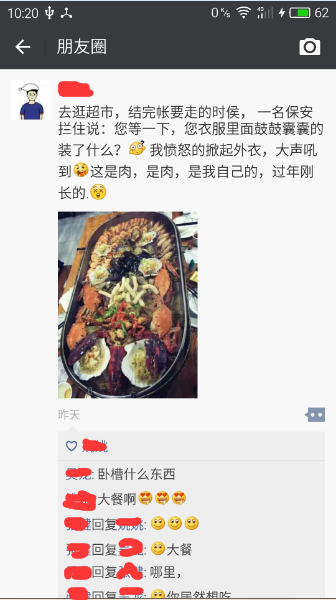
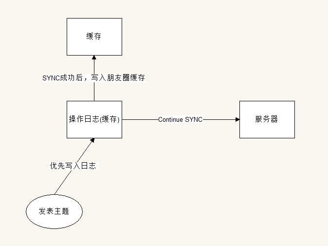
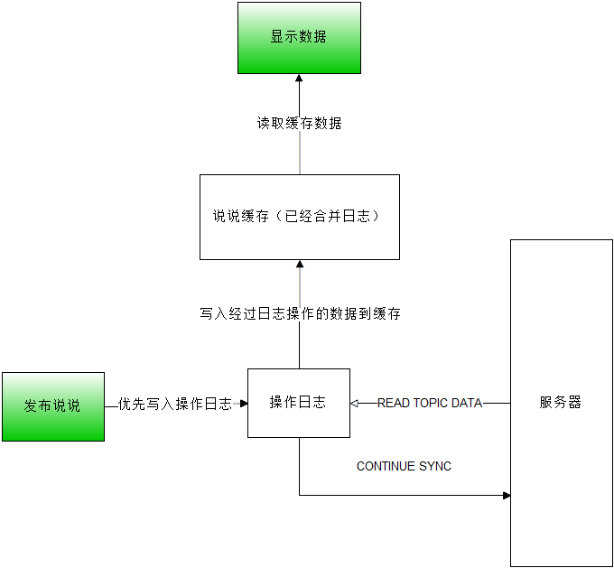
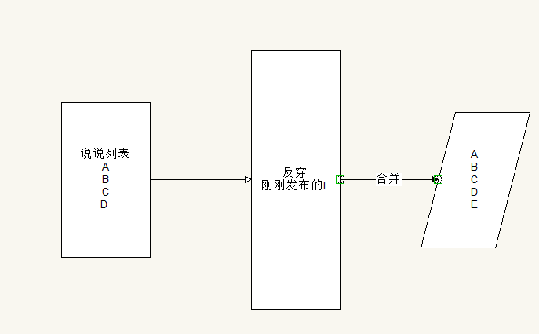

# 朋友圈设计

在社交软件中，朋友圈（社交圈）的功能逐渐出现在各个项目经理的案板上，本文将从技术的角度介绍，如何实现一个类似微信的朋友圈功能。

## 朋友圈的功能点

首先看看，朋友圈要实现的基本功能点，有请截图：

可以发现主要包含：

1. 主题内容，具有各种类型的内容，如文本，图片，小视频，软文...

2. 点赞信息，按照时间排序的用户信息

3. 评论信息，按照时间排序的文本评论，或许以后会衍生出图片评论。

4. 离线同步，不知道大家有没有发现，无论是发布主题，发布点赞，发布评论，都支持离线同步的功能。在**断网**的情况下，依旧可以进行发布说说。这个功能极大的优化了用户体验。

5. 离线缓存，在断网的情况下，依旧能查看过去的说说内容。

6. 增量更新，在使用朋友圈的过程中，对比同类型的APP，微信朋友圈的流量消耗是非常小的。

7. 及时通知，包括了好友发表的说说显示小红点，他人回复的评论和点赞消息，都能及时的通知用户。

可以发现，这些4-7这些都是在之前QQ空间中没有发现的优点，加强了用户体验，以及适应移动环境下，低流量，网络不稳定的特点。

## 兼容性设计

可以发现，微信朋友圈在不断的升级过程中，不断引入了新的**主题类型**，而这主要是依赖良好的兼容性设计。具体可以参考[App兼容性设计](http://my.oschina.net/u/1999248/blog/591568)这篇文章。个人猜测就是使用TYPE字段进行向下兼容。

## 离线同步

离线同步的功能可谓是为移动环境量身定做的功能，极大的加强了用户体验。但是想要比较完美的实现这个功能，也是非常考验软件开发人员的。离线同步，基本实现的原理图：

其基本方法就是**日志先行原则**：把所有的操作，先写入本地数据库中，然后后台不断的进行同步到服务器。日志先行原则在分布式系统设计中，会经常被用到，它是分布式事务补偿（RETRY）的一种通用方法。

## 离线缓存

通过离线缓存，可以做到在断网的情况下，依旧可以查看朋友圈，并且，可以采用**增量更新**的方式，在**刷朋友圈的时候**进行低流量的同步服务器的说说到本地。

### 增量更新

增量更新通俗的讲就是把旧的数据和新的变化数据合并，形成最新的数据。

**增量更新实现的两种方式：**

1. **采用日志版本号**：则每次提交都会生成一个版本号，更新的时候，客户端拿着Old Version去服务器对比，服务器将Newest Version返回给客户端。然后进行for 循环升级即可。这种方式，比较适合需要追踪每次变化的业务场景，如SVN，GIT。

2. **采用最后修改时间**：对增量更新的目标，添加最后修改时间的属性（MT），客户端在更新的时候，拿着本地的MT和服务器的MT对比，然后判断目标是否需要更新即可。这种方式，就比较适合不需要追踪变化过程的场景，如朋友圈。但是需要注意，这个颗粒度需要选择合适。

**增量更新的颗粒度：**

颗粒度值得是增量更新的目标单位，比如说，一个文件，一个数据库，一条说说。**选择合适的颗粒度**是非常重要的。**颗粒度太大会导致增量更新没有意义，太小会导致增量更新需要考虑的因素过多。** 而在朋友圈中，选择颗粒度就是一条说说了。

## 要点设计

结合离线同步，离线缓存，以及增量更新中的各个要点，我们设计出如下的基本流程结构：
    

### 发布

在发布阶段，需要先把发布的内容（说说，点赞，评论）写入操作日志中，然后Notify SYNC 线程进行同步。

**发布遇到的问题和解决方法：**

1. 发布-Request异常：只需要等待网络恢复正常，再次发布即可。

2. 发布-Resonse异常：此时服务器已经写入了发布的具体内容，而APP端不知道，根据BASE思想，采用最终一致的方法，我们**采用UUID作为内容的ID**，只需要网络恢复正常的时候RETRY，服务器发现该ID的内容已经存在，则直接返回OK即可。
    
### 读取数据

而读取数据阶段，我们需要考虑合并日志和班级圈缓存，形成最终的数据。因为我们设计中，缓存数据就是合并了日志操作的缓存，所以只用直接读取就可以了。

**刷朋友圈**

在刷朋友圈的时候有两种情况：

1. 获取最新的说说数据

2. 获取某一条说说后面的固定条数的说说

此时，我们可以利用好离线缓存数据，**提取离线缓存的ID+CT（创建时间）+MT（最后修改时间）进行查询**，服务器进行查询后，如果发现服务器的MT时间大于APP的缓存，则返回增量更新的内容，且大致有三种状态：

1. CREATE：APP端没有缓存中，本条数据，需要将本条说说完整的返回给APP，然后持久化
2. UPDATE：本条说说具有更新，只需要返回点赞+评论列表+MT即可，因为主题部门基本上是不会变化的。然后更新MT时间。
3. DELETE：本条说说已经被删除，APP端需要删除本条说说的缓存。

同步的时候，建议采用**指示缓存数据信息数量=需要展示的数据数量+5** ，避免因为DELETE，从而导致服务器返回的数据（CREATE）中包含了APP端已经缓存的数据。

**反穿**

从服务器过来的数据，需要**反穿**过操作日志，才能形成正确的显示数据。**反穿图解:**

反穿的基本要求就是需要**保证同步过来的数据和操作日志保持合并后，能保持最终一致。**

## 推送

对于一些他人评论的消息，或者点赞信息，需要及时的推送给用户，所以我们还需要设计推送协议，将一些及时消息推送给用户。

## 总结

在移动环境中，网络异常和省流量是非常重要的，一个好的社交圈设计，需要考虑到这两点。而微信朋友圈无异于创造了先河。