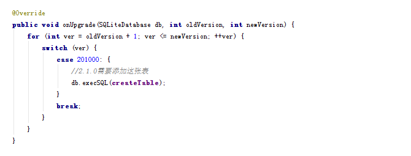
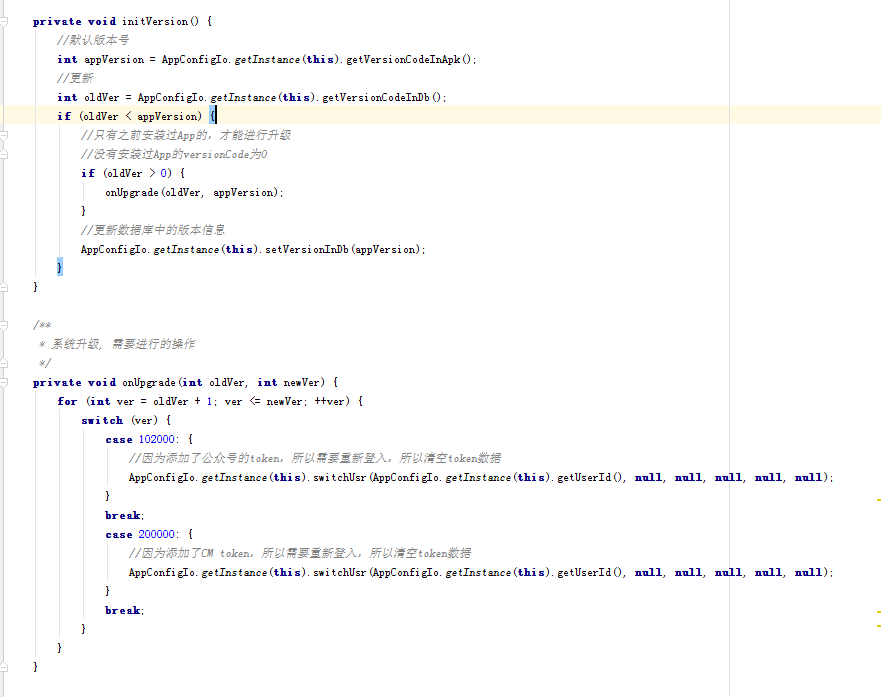

# 玩转迭代开发

现在互联网开发都处于快速迭代开发的状态。这里我们来讨论一下迭代开发中的**生命周期，代码管理，兼容性设计**等话题。

## 生命周期

通常，一个产品都具有两个环境：

1. **测试环境**：用于开发，测试搭建的环境
2. **线上环境**：正式面向用户的环境

而每个版本的生命周期通常会经历如下几个阶段：

```

  需求  ->  采集需求
    |
    |
    |
  分析  ->  原型设计
    |
    |
    |                                            maven(构建)
  开发  -> 编码，编译，单元测试，功能测试... ->  git(代码管理)
    |                                            pmd(静态代码分析)
    |                                            ...
    |(不定时发布)
    |
    |                                           jenkis(持续集成工具)
  测试  -> 功能测试，集成测试，压力测试... ->   kubernetes(docker 集群管理)
    |                                           jmeter(压力测试)
    |                                           ...
    |(测试通过)
    |
    |        
预发布阶段-> 部署到线上环境，仅部分人员可以使用最新的功能。（新老版本同时在线）
    |        
    |
    |
    |
正式发布阶段->通知所有用户进行更新升级。（新老版本同时在线，老版本逐渐废弃）

文档：用例文档，原型文档，API文档，数据库设计文档，测试报告，部署文档，UI设计文档，源码。

```

所以针对APP，可能会出现同一个时间，**线上存在多个不同版本的APP**。所以我们需要注意：

1. **开发**：需要保持活跃版本APP的API兼容性。
2. **测试**：需要测试那些比较活跃的老版本APP，而不是仅仅测试最新发布的APP。

## 代码管理

在开发过程中，会遇到代码管理问题，比如说：一个线上的BUG，如何进行修改和发布。这需要一个合理的代码管理。

### 代码版本

通常，我们会采用**x.y.z**的格式来定义版本号，而**考虑到机器和人的区别**，出现了两种方式的版本号定义：

* **versionName**：也就是x.y.z，便于人类识别的版本号
* **versionCode**：通过x.y.z计算出来的数值，便于计算机识别的版本号

versionName的公式为：

> versionName = x.y.z , 且 x.y.z 都为数字

* x -> 主版本号，无上限
* y -> 小功能版本号，上限 99(可以根据实际情况调整)
* z -> 修订版本号（修复BUG），上限 99(可以根据实际情况调整)

versionCode计算公式为：

> versionCode = x \* 10000 + y \* 100 + z 的格式命名

通常采用versionCode作为系统内部的版本对比数值

### 代码版本结构

代码版本结构（采用git管理）：

```
/tag 标签
    /tag-v1.0.0         v1.0.0版本
    /tag-v1.0.1         v1.0.1版本, 修复了v1.0.0版本的某些BUG
/branch 分支
    /master             最后一次发布的代码版本，发布完成后需要打tag
    /dev-v2.0.0         v2.0.0 版本开发分支
    /dev-v2.0.0-{todo}  v2.0.0 todo功能开发分支，开发完成后，merge到dev-v2.0.0中
    /fix-v1.0.2         v1.0.2 版本修复分支
    /test-{todo}        实验性质的分支，不同步到repo上

```
注意：对于Android APP的发布后，打tag的时候需要**上传apk和mapping文件**，方便之后定位线上bug

## 兼容性设计

### 基本概念

这里写一些通用的概念：

* **APP版本废弃**: 活跃用户不在这个被废弃的APP版本，并且服务器限制该版本APP使用。

### 服务器

在保持兼容的过程中，服务器的兼容性还是比较好处理的，因为服务器的升级完全处于我们自己的控制中，
不会出现服务器处于不同的版本状态。所以，只要处理好**数据库，HTTP接口，推送协议，**基本能保证
迭代无副作用。

#### 数据库

在业务的开发过程中，不可避免的就是添加新的字段和删除原来旧的字段，对于新的字段添加，基本上可
以保证旧的业务正常的运行，而**删除字段，则可能导致旧的业务不能正常的运行，所以需要慎重选择。
**当然我们也不是不能删除字段，一般的做法是先保留旧的字段，然后等待**APP版本废弃**，之后就可
以进行删除该字段了。

#### HTTP接口

##### URL 兼容性

对于HTTP接口，在迭代过程中，会出现如下几种情况：

* 添加API
* 删除API
* 修改API
	* 添加字段
	* 删除字段

这几种情况，为了保证已经上线的APP能正常的运行，所以我们需要对API做兼容性工作。API格式为：

> http://host/module/service[...N]

当对一个API进行更新的时候，并且无法做到兼容的时候(删除字段等)，我们新建一个

> http://host/module/service2

这种格式的API，并且使用**注解标记原先API为废弃状态**(禁止新开发版本使用该API，并且版本迭代
到后面几个版本后，可以剔除该API)。这种API设计方式有如下的优点：

1. API更新的表示非常的简洁，只用添加版本号到最后即可
2. 废弃的API和新的API都在同一个代码文件中，维护比较方便

然而，这种方式有一个缺点：对同一个API修改的次数过多，会导致形成过多的 API 版本（1，2，3，4，5）
不是非常的好看，我们可以通过设置一个**版本滑动窗口**来解决。

**版本滑动窗口**：当API版本迭代到10的时候，自动又从0开始，当然了0版本号的api需要早早的被废弃掉。

当然，还有其他解决URL兼容性的方法，比如说：**采用http://host/v1/module/service 的方式**，但是这个方式存在一个比较致命的地方：每次修改API，都需要FORK出新的代码版本，而往往我们还需要维护旧版本代码，导致维护难度（修改同一个API的时候，需要打开该API的多个代码版本进行维护）。

当然了，如果是删除字段的API，我们也可以仅仅**标记这个API中的某个字段被废弃，新版本APP不在使用这个API的这个删除字段**，然后等待使用该字段的**APP版本废弃**就可以真实的删除这个字段了。这个方法的优点就是不需要新创建一个API，缺点就是删除字段的时候比较麻烦。

##### API扩展性

不仅仅是API的URL需要保持兼容性，**针对返回的数据，我们也需要做到一定程度的扩展性**。

**例子一 ： 朋友圈主题不同类型**

在最早的时候，朋友圈还是只能处于发发图片和文字的状态，后来加入了一些额外的元素，
如**音乐，视频，图文等内容**。然而在加入了新的主题类型后，旧的用户不一定会马上升级，
所以要保持朋友圈的兼容性。有大致两个做法：

1. 添加**host/module/server2**这种类型的API，使得它支持新扩展的**音乐，视频，图文**。
2. 返回数据结构中添加**TYPE属性**，APP仅仅处理能识别TYPE的数据，过滤掉不能识别TYPE的数据(音频，图文等)。

方案1虽然说也能处理这些情况，但是总体来说没有方案2来的更加优雅。

##### TOKEN 认证

对于HTTP接口设计中身份验证，通常采用TOKEN的方式。因为TOKEN比较方便存储，以及显示的使用。

##### 返回JSON

HTTP 返回的数据格式，通常采用JSON格式：**{code:-1|0|1,msg:String,data:any}。**

* **code**: 状态码，负数为系统统一错误代码，0为成功，正数为业务错误代码。
* **msg**:执行结果提示，String类型
* **data**:需要返回的数据，可能为空，也可以为任何数据类型JSONObject,JSONArray,Int,Double,String.

##### HTTPS

为了通信的安全，我们还需要采用HTTPS连接方式，避免中间人攻击等常见的网络攻击手段。

#### 推送协议

开发移动APP的时候，不可避免的就是使用长连接推送一些及时消息，比如说**新闻，广告，强制下线通知**等。而推送协议的格式基本上为：

**{ module: 模块类型, function:操作类型, [data]:{msg:"hello world"}}。**

当APP端接收到推送的时候。采用如下的步骤处理推送：

1. 判断业务模块module是否能处理
2. 判断function是否能进行处理
3. 读取data数据
4. 根据 module,function 使用data作为参数，调用具体的处理函数。

处理过程中，注意使用

	try{
		...logic
	}catch(Exception e){

	}

避免处理过程中，导致APP奔溃。

当出现**推送协议完全不兼容（删除字段等）**的情况的时候，我们需要针对推送协议做兼容处理，通常我们可以采用**function[..N]**的方式来兼容。在**兼容期阶段**，我们可以采用：

1. **检测连接APP的版本**，选择正确的推送格式function 还是 function2 格式
2. **同时发送function 和 function2 协议**，新版本APP删除function支持，仅仅处理function2。而旧版本APP仅仅只能处理function协议，忽略了function2的协议处理。
3. **预先埋点**，在几个版本之前就嵌入function2的逻辑，当function逻辑的版本APP都废弃后，就可以统一采用function2 协议推送。

上述两种方法各有优缺点：方案1比较智能，但是开发量比较大。而方案二比较方便，但是比较损耗流量。而方案3需要时间来过度。

针对删除字段的情况，我们也可以和URL兼容一样，**标记这个字段被废弃，新版本APP不再使用这个删除的字段**，维持一段时间继续推送这个字段，当使用该字段的**APP版本废弃**后，就可以删除这个字段不进行推送了。这个方法的优点就是能比较完美的兼容之前的协议，但是缺点就是删除字段的时候比较麻烦。

### 移动端

移动端升级，主要涉及到**本地数据（数据库，磁盘文件），APP全局升级补丁，协议兼容性（HTTP，推送），
以及APP版本检测，**而JAVA代码和资源文件，当然就不需要进行处理了。

#### 数据库

数据库升级还是比较方便的，这里我们**采用APP版本代码（versionCode）作为SQLite的版本号**，
SQLite已经为我们提供好了onUpgrade接口，在升级的时候，SQLite会给出旧的版本号，和最新的版本号，
此时我们只要做：



就可以保证对数据库的正确升级了。

#### App全局升级补丁

除了数据库升级，对于磁盘文件，升级后的引导页面等需要处理的杂项，可以在APP全局升级补丁中进行
处理。比如说，某个版本，可以删除某些磁盘文件，那么，就可以在全局补丁中编写代码。具体的做法为：

1. 每次打开APP初始化application的时候onCreate()，**读取记录在本地数据库的APP版本号和APK中的versionCode进行对比**
2. 如果不一致，那么，就有可能是升级后，重新打开APP的情况，那么，我们就可以进行升级补丁操作
3. 升级完成后， 把最新的APK中的versionCode写入本地数据库，避免下一次打开APP的时候，重复升级

升级代码大致如下：



可以发现，使用versionCode作为升级代码点，能比较清晰的区分出不同版本做了什么事情。而且对于从比较老的版本直接升级过来，也是OK的。

#### APP版本检测

APP版本检测和是升级是比较核心的功能模块。主要实现的功能有：

1. **定时检测 APP 是否需要升级，并且进行提示。**
2. **判断用户是否可以继续使用该APP，即当前APP需要强制升级。**

所以，APP检测的时候，**给定服务器最新的版本信息数据即可**，格式基本是这个样子：


含义：

* versionName：最新版本名称 x.y.z 
* versionCode：  最新版本代码
* deadVersionCode：如果APP#versionCode <= Server#deadVersionCode，需要进行强制升级，不能再使用其他功能。

当检测到新的APP版本后，还需要在界面上进行ALERT，通知用户进行升级。强制升级的话，需要禁用所有
的功能（避免APP奔溃）。然后进行ALERT用户。

APP版本检测功能，应该算是APP快速迭代的保证。可以让服务端来控制APP是否可以继续使用和升级。

## 总结

当然了，还有一些其他方面的迭代开发话题，之后再补充上去。

## 参考

* [API 设计](http://www.ituring.com.cn/article/208878)
* [互联网产品的灰度发布](http://www.blogjava.net/xiaomage234/archive/2012/07/04/382199.html)
* [理解OAuth 2.0](http://www.ruanyifeng.com/blog/2014/05/oauth_2_0.html)