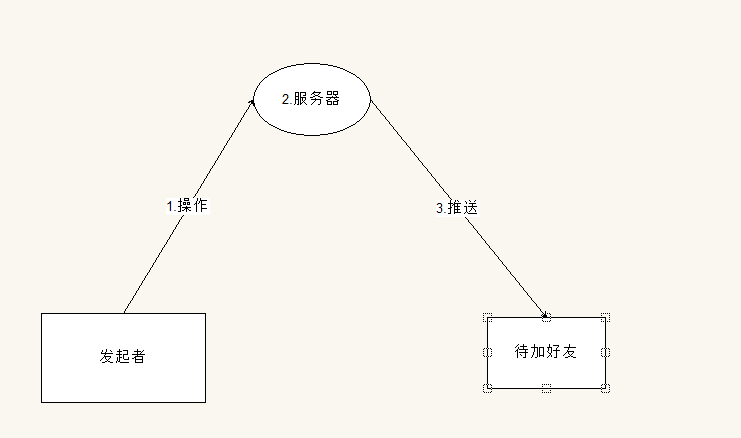

# 通讯录设计

本文将介绍一下，通讯录同步的基本机制，方便大家在遇到相同问题的时候，能快速的爬坑。

通讯录同步主要是为了维持Server和App端的通讯录一致性而提出的目标，其中涉及到几个方面：

1. 能及时的获取**可见用户关系**

2. 当通讯录发生变化（被拉入群组）的时候，能及时的维持App端通讯录一致性。

## 可见用户关系

**可见用户关系**指的是当前用户在业务过程中所能看见所有的用户信息，参考微信比如说：好友，保存+列表中的群聊（组员+群）。如果APP端存在这些用户信息，那么就可以避免从服务器获取这些用户信息，优化体验和性能。

## 同步过程中遇到的问题和解决方法

在通讯录同步过程中，可能会发生各种问题，如：

1. 同步的时候，网络或者服务器异常，从而造成同步失败。

2. 修改通讯录关系（创建群组，添加好友...）的时候，发生异网络异常，服务器异常等问题，及时推送出现问题。

### 同步通讯录异常

如果同步通讯录发生异常，那么会导致本次同步失败。原因基本上是网络异常，或者服务器异常。那么只需要在**某个时间点**再次同步即可。基本上，在实际开发过程中，选择的策略是：

1. 24小时一次：这样子可以在最极端的情况下，能正常的通讯录同步到App端

2. 断网重连且未同步时间超过24小时：因为大部分同步失败的原因在于断网，而App移动端的断网重连是非常频繁的，所以这个时间点也是非常具有可用价值。

通过这两种策略，**基本上可以保证通讯录在未来某一个时刻能保持和服务器一直。**

### 修改用户关系异常

在IM使用过程中，一定会存在用户关系的修改。比如说，添加好友，拉某些人进入群组。为了让这种关系及时的通知用户，那么需要采用PUSH的方式。

在一次添加好友的过程中，会遇到各种问题，见图解：

这里按照操作顺序描述会发生的问题，以及解决办法：

1. 发起操作-Request：如果Request因为网络问题失败，则没有任何问题，只要再次发起即可

2. 发起操作-Response：如果是因为Response出现问题，那么操作者会认为自己还没有操作成功，**实际上服务器已经受理了本次加好友的业务**，这会导致操作者，在网络正常的情况下，再次发起这个操作。所以，需要在处理是的时候，添加一个业务ID（本次为 SELF_ID + FRIEND_ID 构成，群组可以为UUID），如果RETRY本次操作，那么服务器直接返回成功，接力上次操作即可。

3. 服务器异常：在分布式环境下，出现该问题也是有可能，在本次添加好友的过程中，因为服务器的问题，会导致如下几点
    1. 无法受理添加好友业务：只需要重新发起
    2. 已经写入数据库：解决方法和2类似，但是无法进行PUSH操作

4. PUSH出问题:如果是因为推送出了问题，那么可能会发生如下的情况：
    1. 24小时过后，通讯录同步策略同步成功
    2. 操作者直接进行聊天：此时App本地数据库是不存在操作者的用户信息的，从而导致头像，昵称无法显示，此时，需要发起一次网络请求，将对方的用户信息同步到App端。

## 总结

在处理通讯录同步的过程中，要仔细分析业务场景中出现的各种问题，将问题暴露出来，从而选择合适的方法解决。

可能因为各种异常，导致通讯录同步不是这么及时，但是，我们需要保证通讯录最终一致（Base思想）。